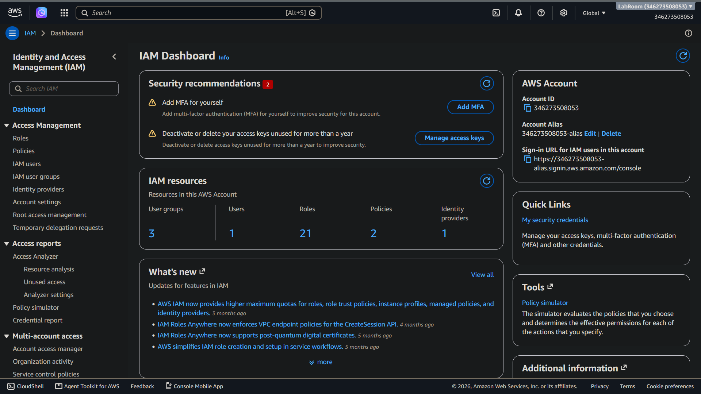
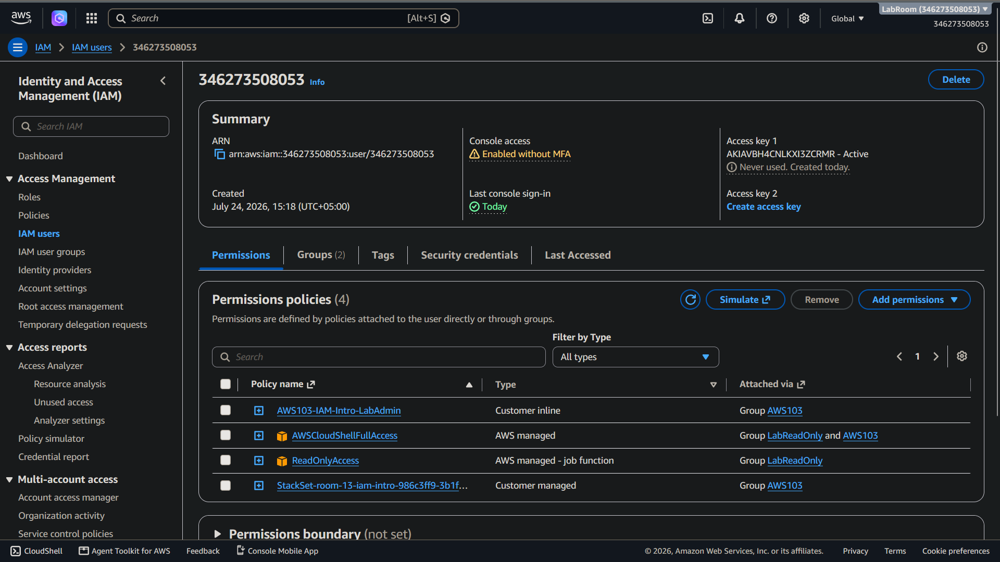
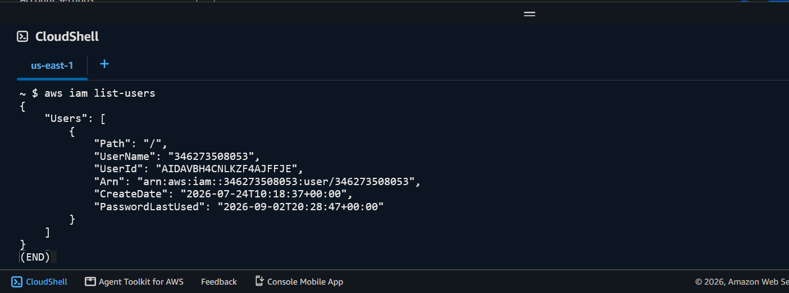
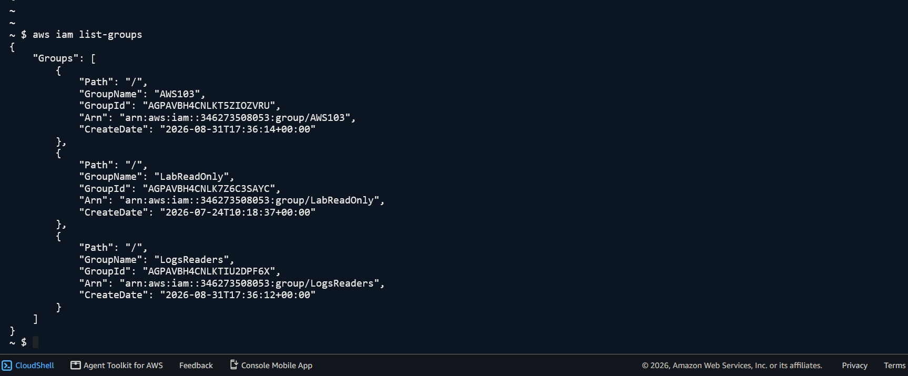
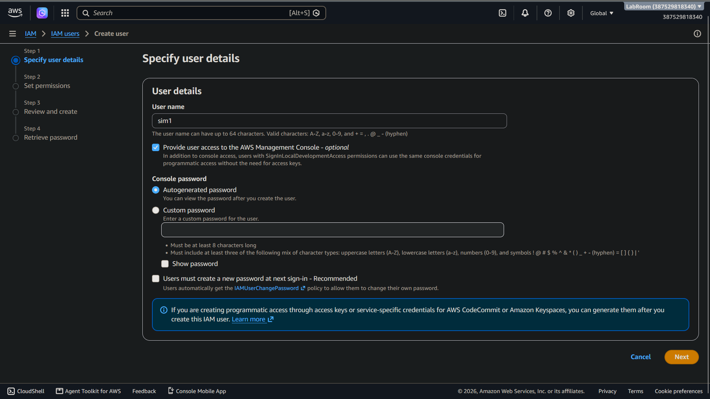
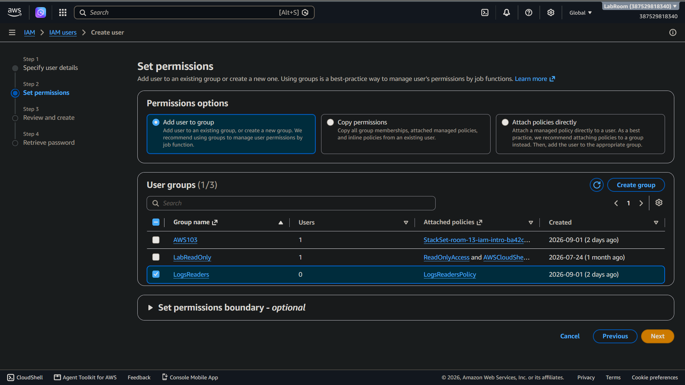
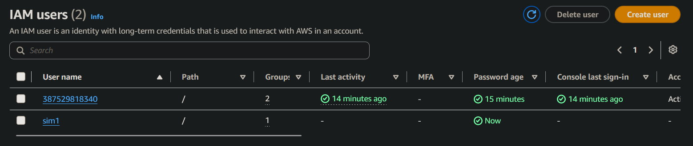
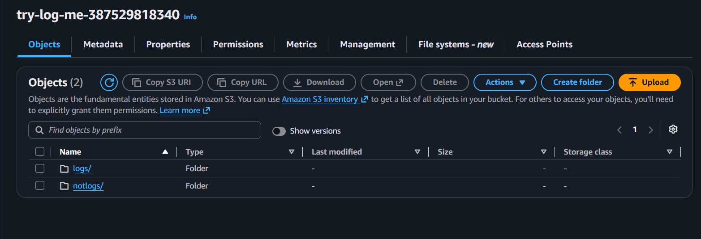
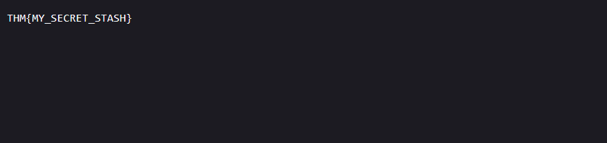
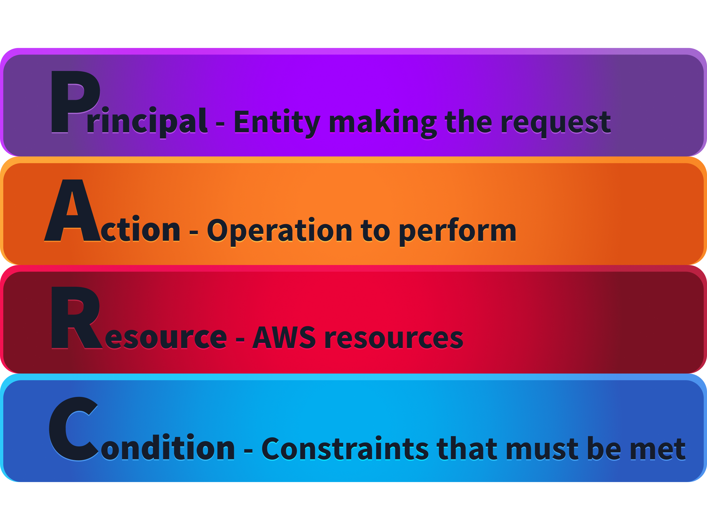

> /AWS Defence/AWS_IAM

# AWS IAM: Identity, Access Management and Least Privilege

## Context

Identity and Access Management (IAM) is the foundation of AWS security. Every action performed within an AWS environment is tied to an identity and evaluated against assigned permissions.

This lab focuses on understanding AWS IAM identities, policies, credential types, and the principle of least privilege, which are essential concepts for securing cloud environments and controlling access to resources.

## Workflow

### Understanding AWS IAM Identities

AWS IAM manages identities that authenticate and authorise access to cloud resources. These identities determine who or what can perform actions within an AWS environment.

The primary IAM identity types are users, groups, roles, and the root user.

The root user is created when an AWS account is first created and has unrestricted access to all resources. Due to its high level of privilege, it should only be used for account-level tasks and protected with strong authentication controls such as MFA.

`IAM users` represent individual people or applications requiring permanent credentials. `Groups` allow administrators to manage permissions for multiple users collectively, while `roles` provide temporary credentials and are commonly used by AWS services such as EC2 and Lambda.


### Exploring IAM Identities

The `IAM dashboard` provides visibility into users, groups, roles, and policies within an AWS account.

During the lab, IAM identities were reviewed through both the AWS Console and AWS CLI. Using CLI commands provides a faster way to enumerate account identities and verify the current security context during cloud assessments.

**IAM Web Interface**


**User Summary**


**Available Users (Cloudshell)**


**Available Groups (Cloudshell)**


### Creating IAM Users

As part of understanding IAM in practice, a new IAM user was created with console access and assigned to a specific group. This demonstrates how AWS permissions are managed by attaching policies to groups instead of assigning permissions individually to every user.

The created user inherits the permissions assigned to the group, allowing administrators to manage access centrally. This approach becomes increasingly important in larger environments where manually managing permissions for every user would become difficult and error-prone.

**User Creation**


**User Permissions & Group Assignment**


**User List**


### Accessing AWS Resources Through Assigned Permissions

After creating the user, the new credentials were used to access the AWS Console and test the assigned permissions.

The user was able to interact with permitted AWS services while remaining restricted from resources outside the assigned policy scope. This demonstrates how IAM policies act as a security boundary between users and cloud resources.

During the exercise, an S3 bucket was reviewed to understand how IAM permissions control access to cloud storage. The bucket contained a text file with a hidden TryHackMe `flag`, demonstrating a common cloud security scenario where sensitive information can be exposed if access controls are configured incorrectly.

**S3 Bucket Objects**


**Flag in text file inside bucket object**


This highlights why S3 permissions must be carefully managed. Overly broad permissions can allow unauthorised users to access sensitive data, while properly scoped policies ensure users can only interact with resources required for their tasks.

### Understanding IAM Policies

IAM policies define the permissions assigned to identities or resources. They use a JSON-based structure to specify whether an action is allowed or denied, which resources are affected, and under what conditions the policy applies.

A policy evaluation follows a strict logic. Explicit denies always override allows, while actions without an explicit allow permission are rejected through the default deny behaviour.

AWS evaluates requests using the `PARC` model:

> Principal, Action, Resource, Condition

This context helps determine who is making the request, what action they are attempting, which resource is affected, and whether additional conditions apply.

Image by TryHackMe


### Policy Structure and Evaluation

An IAM policy is built around statements containing elements such as `Effect`, `Action`, `Resource`, and optional conditions.

For example, a policy allowing a user to access objects within a specific S3 bucket grants only the required permissions rather than unrestricted access across AWS services.

Similarly, explicit deny statements can be used as security guardrails. A deny rule preventing users from terminating EC2 instances, except for a specific administrator account, ensures that destructive actions remain restricted.

**A simple IAM policy structure:**
```
{
  "Version": "2012-10-17",
  "Statement": [
    {
      "Effect": "Deny",
      "Action": "ec2:TerminateInstances",
      "Resource": "*",
      "Condition": {
        "ArnNotLike": {
          "aws:PrincipalArn": "arn:aws:iam::111122223333:user/try-terminate-me"
        }
      }
    },
    {
      "Effect": "Allow",
      "Action": "ec2:TerminateInstances",
      "Resource": "*",
      "Condition": {
        "ArnLike": {
          "aws:PrincipalArn": "arn:aws:iam::111122223333:user/try-terminate-me"
        }
      }
    }
  ]
}
```
---

### Credential Management

AWS provides multiple credential types depending on how access is required.

`Console passwords` are used for interactive access through the AWS Management Console, while `access keys` provide programmatic access through AWS CLI or applications. `Temporary credentials` generated through AWS STS provide short-lived access and reduce the risk associated with long-term credentials.

For AWS services, roles are preferred because they allow temporary access without storing credentials directly on systems.


### Applying Least Privilege

The principle of least privilege ensures that identities receive only the permissions required to perform their intended tasks.

Instead of assigning broad permissions such as administrative access, permissions should be limited to specific actions and resources. For example, an application requiring access to a single S3 bucket should not receive access to every AWS service.

Applying least privilege reduces the potential impact of compromised credentials and limits accidental or unauthorised actions.


## Findings

AWS IAM controls access through a combination of identities and policies. Proper security depends on understanding how permissions are assigned, evaluated, and restricted.

The lab demonstrated that effective AWS security requires avoiding excessive privileges, limiting credential exposure, using roles where possible, and regularly reviewing permissions.

## Tools & Resources

**AWS IAM** manages identities, authentication methods, and permissions within AWS environments.

**AWS CLI** provides command-line access for querying IAM resources and validating cloud configurations.

**AWS STS** provides temporary credentials and identity verification for AWS sessions.

## Key Learnings

`IAM is the core security layer of AWS environments`. Understanding identities, policies, credentials, and permission evaluation is essential for preventing excessive access and building secure cloud architectures. Least privilege remains one of the most important principles when designing and reviewing AWS permissions.

---

> QXV0aG9yOiBodHRwczovL2dpdGh1Yi5jb20vaGFzaC01NDU=