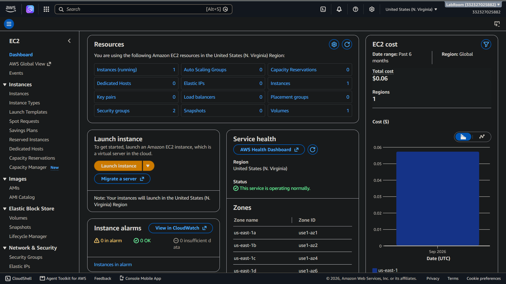
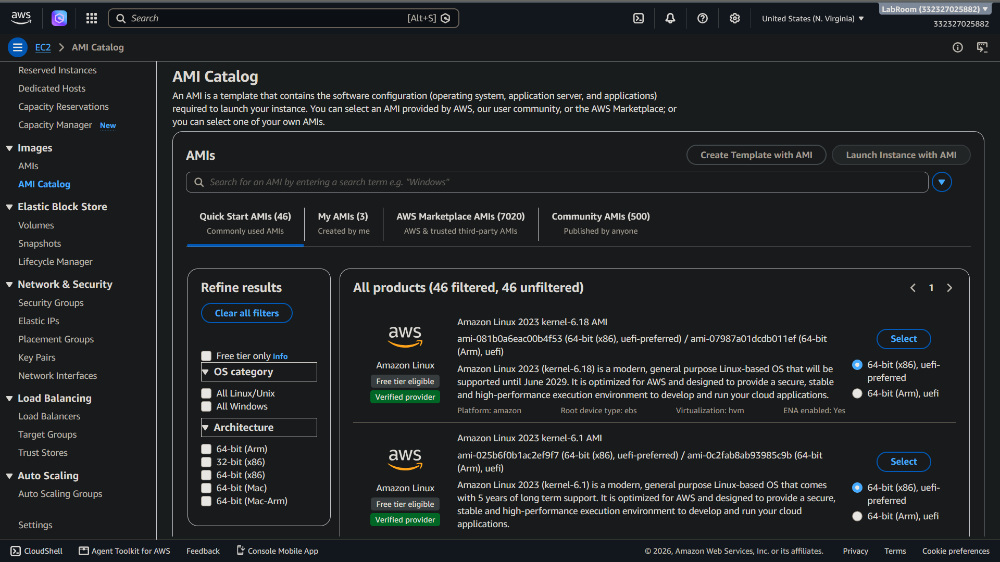
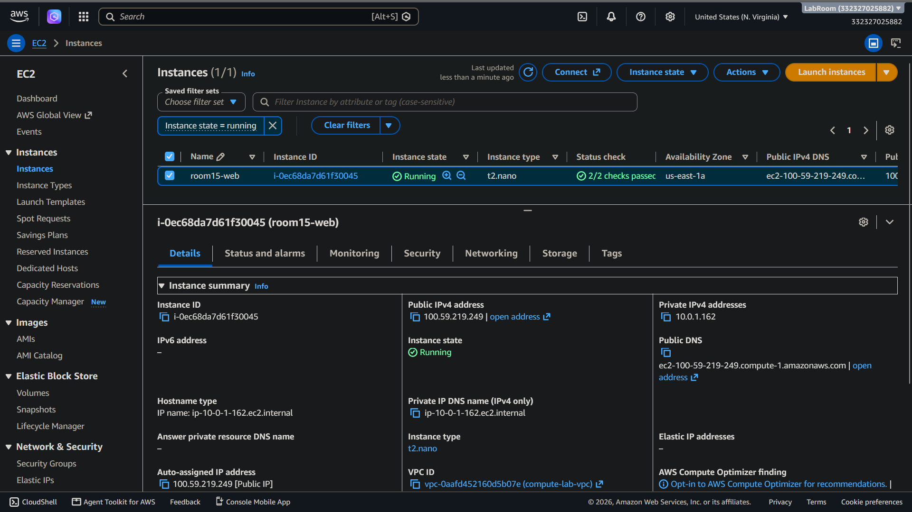
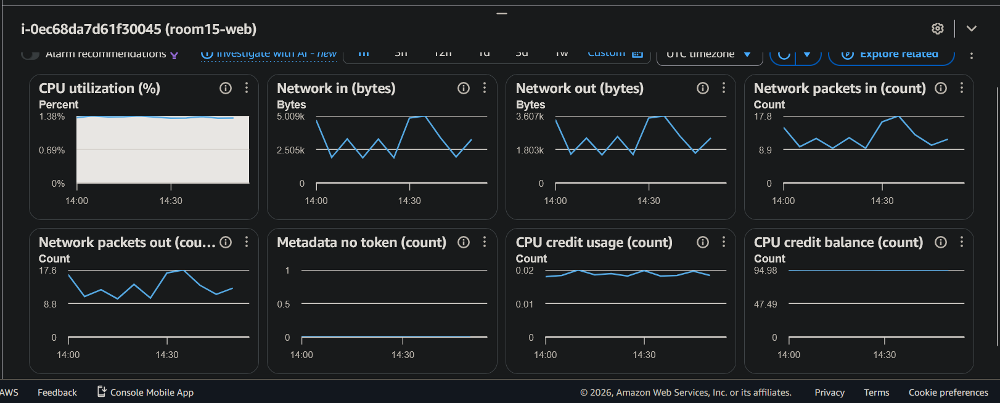
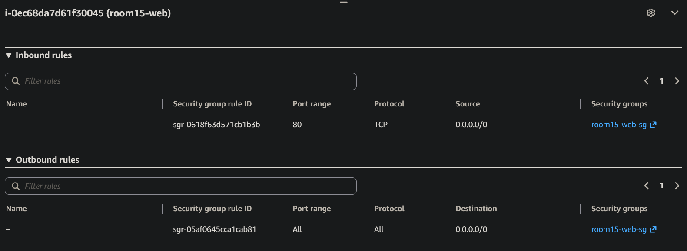
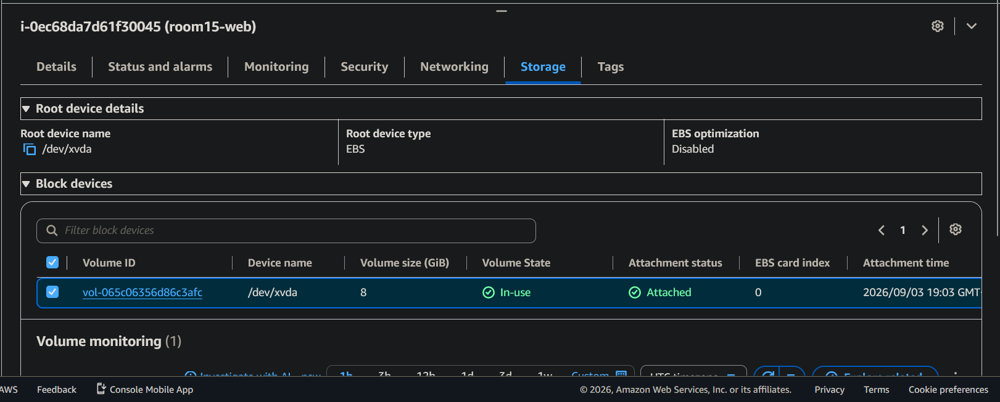
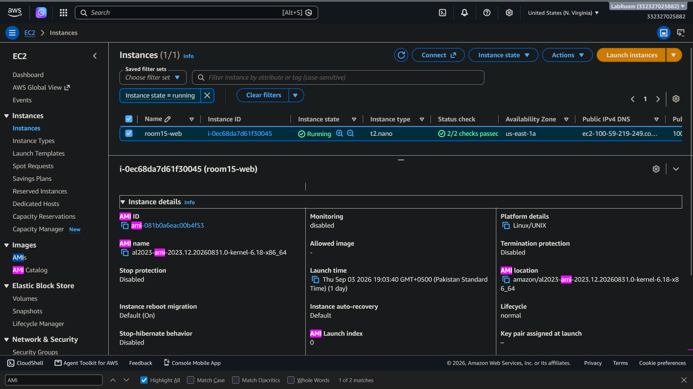
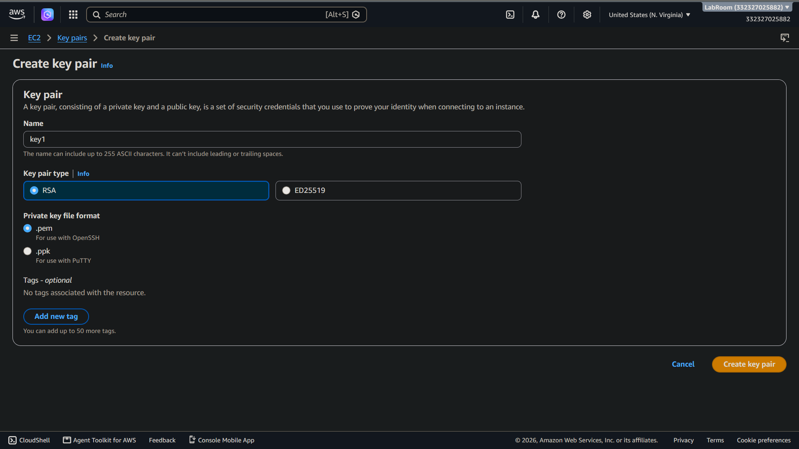
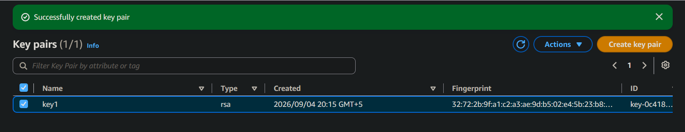
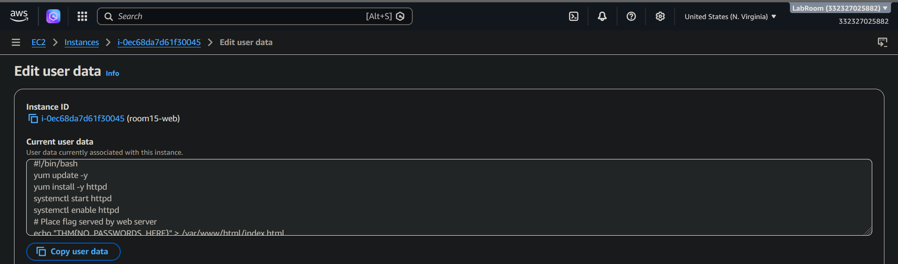

> /AWS Defence/Fundamentals/Cloud Computing

# Cloud Computing Introduction

## Context

Cloud computing introduces a different approach to infrastructure management compared to traditional on-premises environments. Instead of maintaining individual physical servers, cloud platforms allow resources to be created, configured, replaced, and scaled through automation.

AWS follows this approach by providing services such as Amazon EC2, which allows users to deploy virtual machines on demand. This lab explores the fundamentals of EC2 deployments, including instance creation, AMIs, key pairs, user data, and the AWS management workflow.

## Workflow

### Exploring the EC2 Dashboard

The Amazon EC2 dashboard acts as the central management interface for cloud compute resources. It provides visibility into running instances, storage volumes, security groups, key pairs, and networking components.

Before creating resources, understanding the EC2 dashboard helps identify where different compute-related configurations are managed.

**EC2 Dashboard**

### Creating an EC2 Instance

Amazon EC2 provides virtual servers that can be deployed based on workload requirements. Unlike traditional infrastructure, where provisioning a server can require significant time and manual configuration, EC2 instances can be launched within minutes using predefined settings.

The instance creation process begins by selecting an Amazon Machine Image (AMI), which defines the operating system and initial software configuration. AWS provides multiple images, including Amazon Linux, Ubuntu, and other operating systems.

**AMI Catalogue**

The instance type determines the available compute resources, including CPU, memory, and network performance. Choosing an appropriate instance type ensures that workloads receive sufficient resources without unnecessary cost.

During deployment, additional settings such as networking, storage, and security controls are configured before launching the instance.

**Present EC2 instance in the lab**

**Instance Monitoring** 
Here, the overview of the instance vitals, CPU, Netowrk bandwidth and cost viewed in a graph.

**Security group for current instance**

**Storage volume**

### Using Amazon Machine Images (AMIs)

Amazon Machine Images act as templates for EC2 instances. An AMI contains the operating system, installed software, and configuration required to create consistent deployments.

The AMI catalogue allows users to select existing images provided by AWS or the community. In production environments, organisations commonly create custom AMIs containing approved configurations, security hardening, and required applications.

This supports the cloud-native "cattle" model, where instances are treated as replaceable resources rather than individually maintained servers.

**Our lab AMI**

### Securing Access with Key Pairs

EC2 instances use key pairs to provide secure authentication.

A key pair contains a public key stored within AWS and a private key provided to the user. The private key is used to authenticate access to the instance and should be protected carefully.

Unlike traditional password-based authentication, key pairs provide a stronger authentication mechanism by requiring possession of the private key.

**Key-pair creation**

The public key stays on the instance whereas private is downloaded and must be kept secret. 

### Automating Configuration with User Data

EC2 user data allows scripts to execute automatically when an instance starts for the first time.

This feature is commonly used to automate initial configuration tasks such as installing software, deploying applications, updating packages, or applying system settings.

By defining configuration steps during deployment, administrators can create consistent environments without manually configuring each instance.

**A sample user data script executed on instance startup**

### Understanding the Cloud "Cattle" Model

Traditional infrastructure often follows the "pets" model, where servers are treated as unique systems that require individual maintenance.

Cloud environments encourage the "cattle" model, where instances are designed to be identical, disposable, and easily replaced.

Using AMIs, automation, and infrastructure-as-code allows organisations to rebuild environments quickly while reducing configuration drift and improving recovery capabilities.

### Security Considerations

Cloud infrastructure should be designed with automation and resilience in mind.

Important practices include storing application data outside individual instances, logging activity through dedicated monitoring services, and avoiding manual configuration changes that create inconsistencies.

Replacing compromised instances with clean deployments can also reduce attacker persistence when combined with proper detection and monitoring.

## Findings

AWS EC2 provides a flexible approach to deploying and managing compute resources. By combining AMIs, key pairs, and user data, organisations can create secure and repeatable deployments.

The cloud model shifts infrastructure management away from maintaining individual servers and towards automated, scalable, and replaceable resources.

## Tools & Resources

**Amazon EC2** provides scalable virtual computing resources for deploying cloud-based servers.

**Amazon Machine Images (AMIs)** provide reusable templates for creating consistent EC2 instances.

**AWS EC2 Dashboard** provides management and visibility of compute resources.

**EC2 Key Pairs** provide secure authentication for accessing instances.

**EC2 User Data** automates initial instance configuration through startup scripts.

## Key Learnings

Cloud computing requires a shift from manually managed infrastructure to automated and repeatable deployments. Understanding EC2 instances, AMIs, key pairs, and user data provides the foundation for securely managing AWS compute environments.

---

> QXV0aG9yOiBodHRwczovL2dpdGh1Yi5jb20vaGFzaC01NDU=