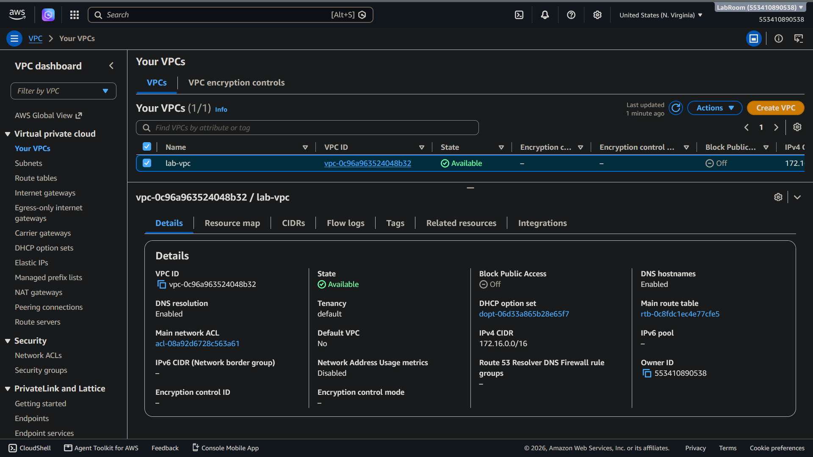
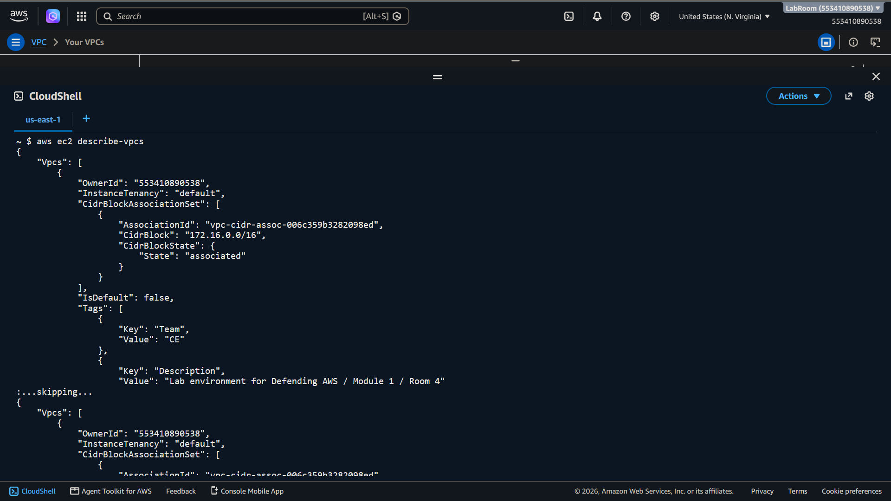
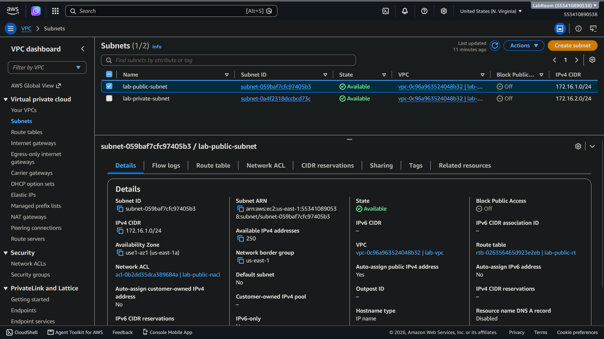
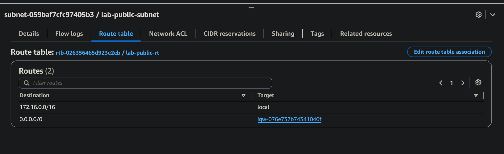
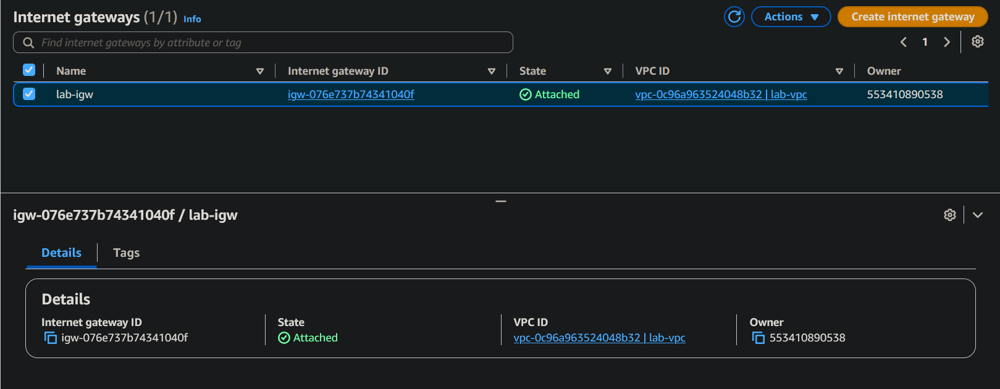
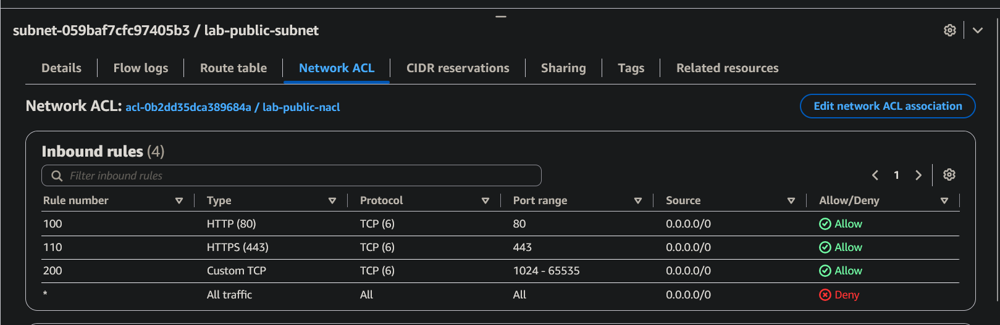
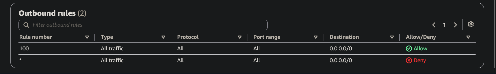
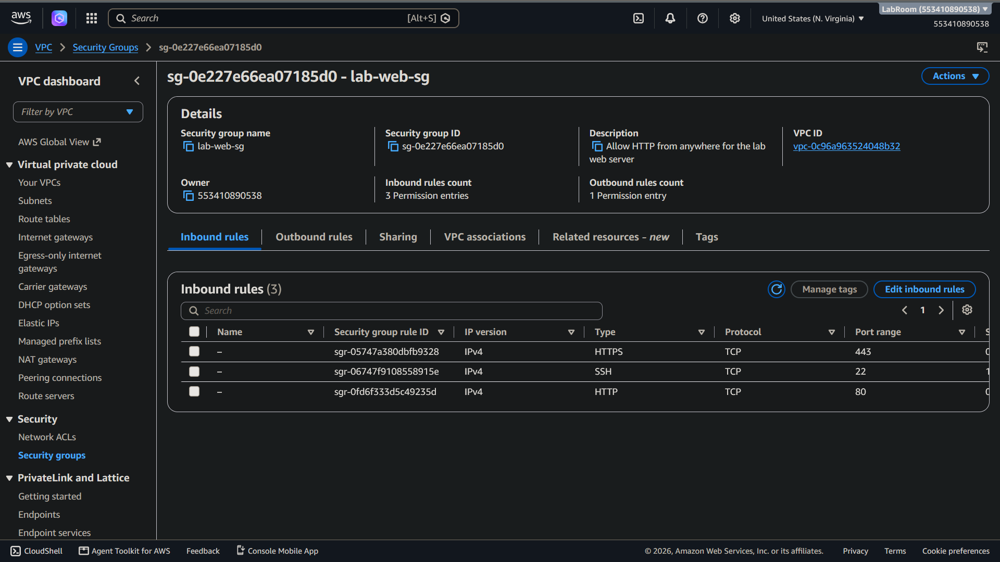
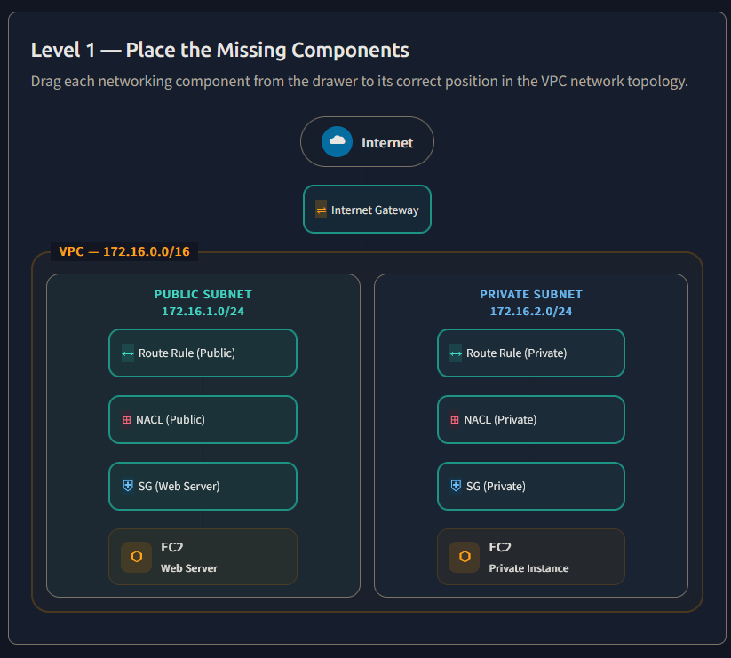
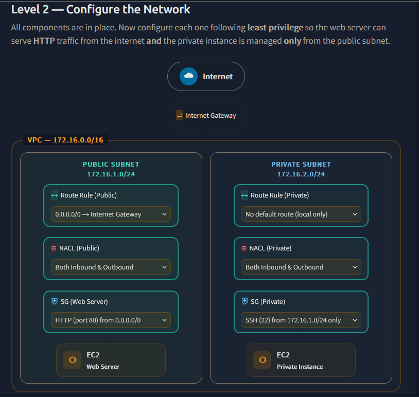

> /AWS Defence/Cloud Networking Intro

# Cloud Networking Intro: AWS Network Architecture and Traffic Control

## Context

Networking is one of the core components of any cloud environment. AWS abstracts much of the underlying infrastructure, but understanding how virtual networks, routing, and access controls work is essential for designing secure cloud architectures.

This lab explores the fundamental AWS networking components, including Virtual Private Clouds (VPCs), subnets, route tables, gateways, Security Groups, and Network Access Control Lists (NACLs). It also demonstrates how traffic flows between different resources inside an AWS network.

## Workflow

### Understanding Virtual Private Clouds

A Virtual Private Cloud (VPC) is a logically isolated network environment within AWS where resources can be deployed securely.

A VPC allows administrators to define IP address ranges, segment networks using subnets, and control how traffic enters and leaves the environment.

Each VPC exists within a single AWS region and is assigned a CIDR block that determines its available IP range. This CIDR range can then be divided into smaller subnet ranges based on application requirements.

For example, a VPC using `10.0.0.0/16` can be segmented into multiple smaller networks for public-facing applications, internal services, and isolated workloads.

**VPCs Web Interface**

**VPCs through CLI**

### Subnets, Routing, and Gateways

Subnets provide network segmentation within a VPC by dividing the available IP address range into smaller sections. They are commonly separated into public and private subnets depending on their internet accessibility.

Public subnets contain routes to an Internet Gateway, allowing resources with public IP addresses to communicate directly with the internet. Private subnets do not have direct inbound internet access and are commonly used for internal applications and backend services.

Traffic movement inside a VPC is controlled through route tables. A route table contains rules that determine where network traffic should be forwarded. Local routes allow communication within the VPC, while routes such as `0.0.0.0/0` direct traffic towards external gateways.

**A view of subnets in current lab**

AWS uses different gateway types depending on the required connectivity. An Internet Gateway enables communication between public resources and the internet, while a NAT Gateway allows private resources to initiate outbound internet connections without exposing them publicly.

**An internet gateway (IGW)**

### Security Groups and Network Access Control Lists

AWS provides two network-level security controls: `Security Groups and Network Access Control Lists`.

Security Groups operate as stateful firewalls attached to Elastic Network Interfaces (ENIs). They control access at the instance level and only support allow rules. Because they are stateful, return traffic is automatically permitted once a connection is established.

Network Access Control Lists operate at the subnet level and act as stateless firewalls. Unlike Security Groups, NACLs support both allow and deny rules, and inbound and outbound traffic must be explicitly defined.

The difference between the two controls is important when designing layered cloud security. Security Groups provide granular resource-level protection, while NACLs act as broader subnet-level safeguards.

**NACL (requires inboud & outbound configuration)**

**SG (Outbound configuration)**  
Inbound configuration is explicitly allowed, otherwise denied.

### Analysing Network Traffic Flow

Understanding packet flow through an AWS environment is essential when investigating connectivity issues or reviewing security controls.

When traffic reaches a public-facing EC2 instance, the request first enters through the Internet Gateway. The VPC router then checks the associated route table and forwards the request towards the destination subnet.

Before reaching the instance, traffic is evaluated by the subnet-level NACL and then the instance-level Security Group attached to the Elastic Network Interface.

If the Security Group allows the request, traffic reaches the application running on the instance. The response follows the reverse path, where the Security Group maintains connection state while the NACL evaluates outbound rules.

**A basic topology of VPC & internet communication**

Traffic flow: 
> Internet → IGW → Route Table → NACL (stateless) → Security Group (stateful) → EC2. 

`Each layer adds defense in depth. `

**A simple rule configuration for segmentation and communication**

What's happening:
- Public subnet routes to IGW for internet access
- Private subnet stays local-only (least privilege)
- NACLs need both directions — they’re stateless
- SGs are stateful — only inbound rules needed
- Web server allows only HTTP; private EC2 allows SSH from public subnet only 

### Network Security Considerations

Secure AWS networking relies on proper segmentation and restrictive access controls.

Using broad rules such as allowing all traffic from `0.0.0.0/0` increases exposure and should only be used when specifically required. Ports and protocols should be limited to only what an application needs.

VPC Flow Logs can also provide visibility into network traffic metadata, helping security teams analyse communication patterns and investigate suspicious activity.

## Findings

The lab demonstrated how AWS networking components work together to provide isolation, connectivity, and security control.

A secure cloud network depends on correctly designing VPC structures, separating workloads through subnets, controlling routes, and applying layered access restrictions through Security Groups and NACLs.

Understanding traffic flow between AWS resources is critical for both cloud administration and security investigations.

## Tools & Resources

**AWS VPC** provides isolated cloud networking environments with control over IP ranges, subnets, routing, and connectivity.

**AWS CloudShell** provides browser-based access to AWS CLI for querying and analysing network resources.

**AWS CLI** enables command-line interaction with VPC components such as subnets, route tables, Security Groups, and NACLs.

## Key Learnings

AWS networking is built around the concept of controlled connectivity. VPCs provide isolation, subnets provide segmentation, route tables define traffic paths, and Security Groups and NACLs enforce access restrictions. Understanding these components is essential for securing and troubleshooting cloud environments.

---

> QXV0aG9yOiBodHRwczovL2dpdGh1Yi5jb20vaGFzaC01NDU=