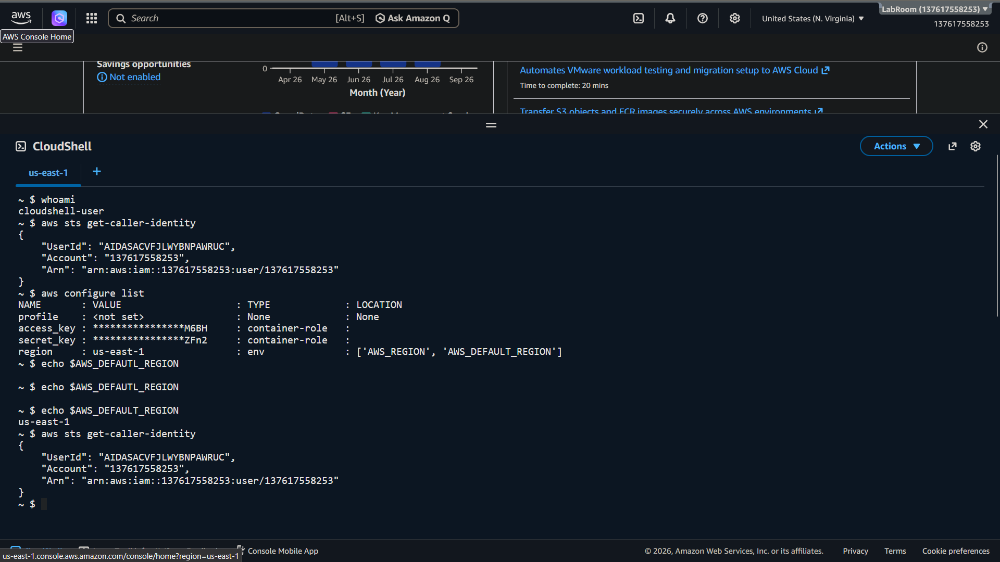
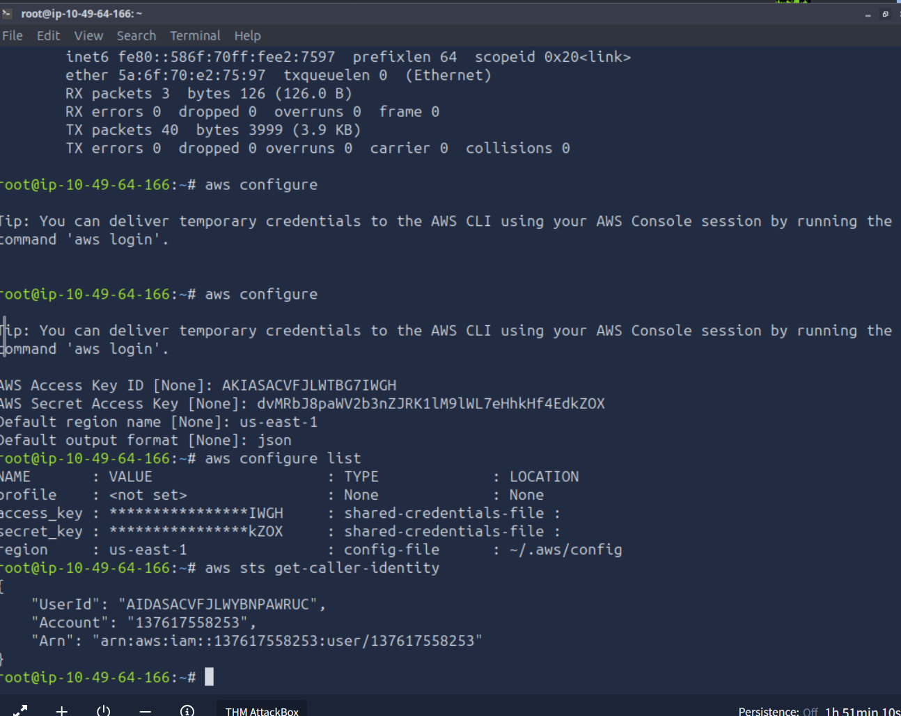

> /AWS Defence/AWS Intro

# AWS Intro: Cloud Environment and CLI Fundamentals

## Context

AWS is one of the leading cloud computing platforms, providing services for infrastructure, storage, networking, identity management, and security operations.

This lab introduces the AWS environment used within TryHackMe, focusing on navigating the AWS Console, using CloudShell, configuring AWS CLI, and understanding basic AWS command execution.

## Workflow

### Navigating the AWS Console

The AWS Management Console provides a web-based interface for managing cloud resources. The main areas used during daily operations include service navigation, region selection, account management, and CloudShell access.

AWS services are organised by categories, but the search function provides a faster way to access specific services. Since many AWS resources are region-dependent, selecting the correct region is an important operational habit.

For TryHackMe AWS environments, resources are generally deployed in the `us-east-1` region unless stated otherwise.

### Using AWS CloudShell

AWS CloudShell provides a browser-based terminal environment directly within the AWS Console. It comes preconfigured with AWS CLI and automatically uses the current AWS session credentials.

This allows security analysts and cloud administrators to quickly perform identity checks, investigate resources, and troubleshoot configurations without setting up a local environment.

The first verification step after accessing CloudShell is confirming the active identity and account context using AWS Security Token Service (STS).

CloudShell also helps verify the active AWS region and CLI configuration before performing any operations. This is especially important because incorrect regions or identities can lead to unexpected results when querying cloud resources.

### Configuring AWS CLI

AWS CLI allows users to interact with AWS services through a terminal instead of the web interface. It is commonly used for automation, administration, and security assessments.

The CLI configuration stores authentication details and default preferences, such as the selected region and output format. After configuration, the identity can be verified to confirm that the CLI session is connected to the expected AWS account.

### Understanding AWS CLI Structure

AWS CLI commands follow a consistent structure:

> aws \<service> \<operation> \[parameters]

The service defines the AWS component being accessed, such as EC2 or IAM, while the operation specifies the action being performed.

For example, security analysts may use AWS CLI commands to enumerate available regions, review identity permissions, or inspect cloud resources during investigations.

**As shown in sts service here,**

### Managing AWS Profiles and Credentials

When working with multiple AWS accounts or environments, profiles provide a way to separate credentials and configurations.

AWS CLI stores profile information in configuration files such as `~/.aws/credentials` and `~/.aws/config`. Profiles allow users to switch between different AWS contexts without repeatedly replacing credentials.

Environment variables can also be used, but profile-based configurations provide better control when managing multiple accounts or roles.

## Findings

The AWS environment relies heavily on correct `identity and region` context. Many issues encountered during cloud administration or security investigations are caused by using the wrong account, profile, or AWS region.

AWS CLI provides a faster and more flexible method of interacting with cloud resources compared to manual console navigation, making command-line familiarity an essential skill for cloud security roles.

## Tools & Resources

**AWS Management Console** provides a web interface for managing AWS services and cloud resources.

**AWS CloudShell** provides a browser-based terminal with preconfigured AWS CLI access for quick cloud operations.

**AWS CLI** enables command-line interaction with AWS services for administration, automation, and security analysis.

**AWS STS** provides identity verification by displaying information about the active AWS session.

## Key Learnings

AWS security operations require a strong understanding of identity, region selection, and command-line interaction. CloudShell and AWS CLI provide efficient methods for validating access, investigating resources, and managing cloud environments.

---

> QXV0aG9yOiBodHRwczovL2dpdGh1Yi5jb20vaGFzaC01NDU=