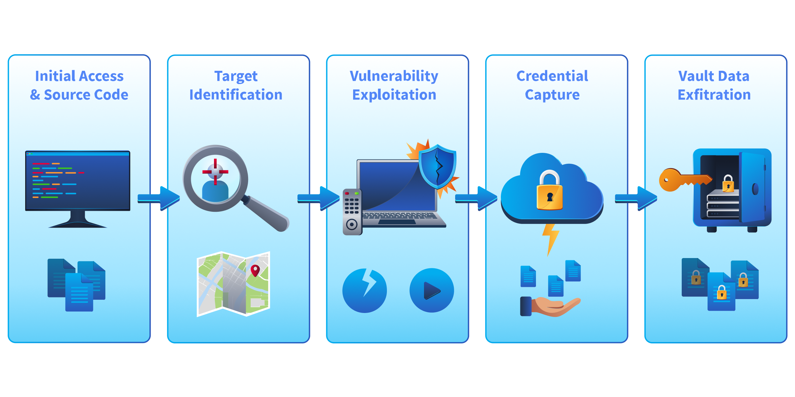
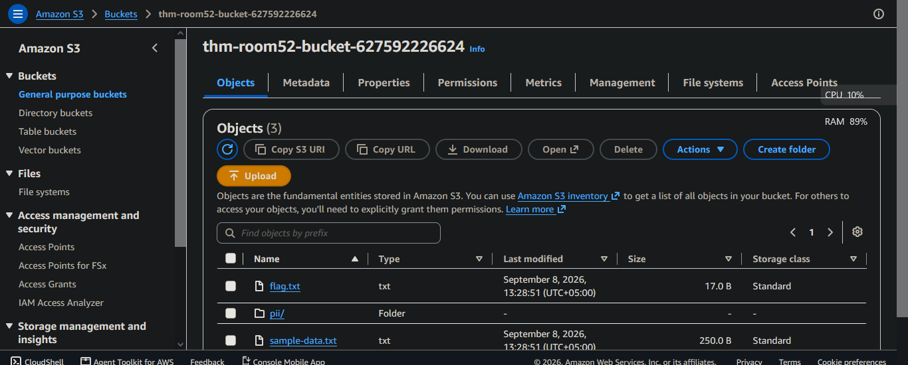
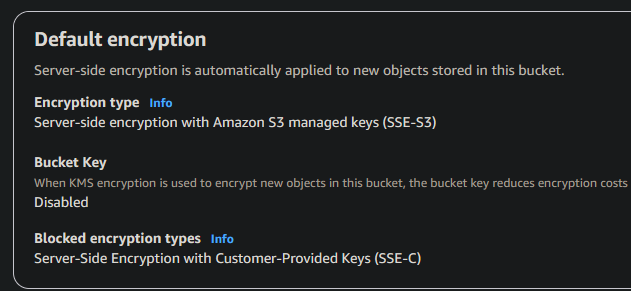
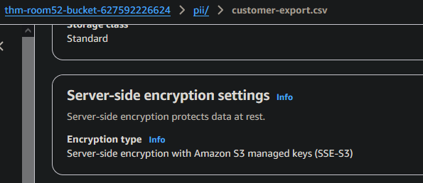
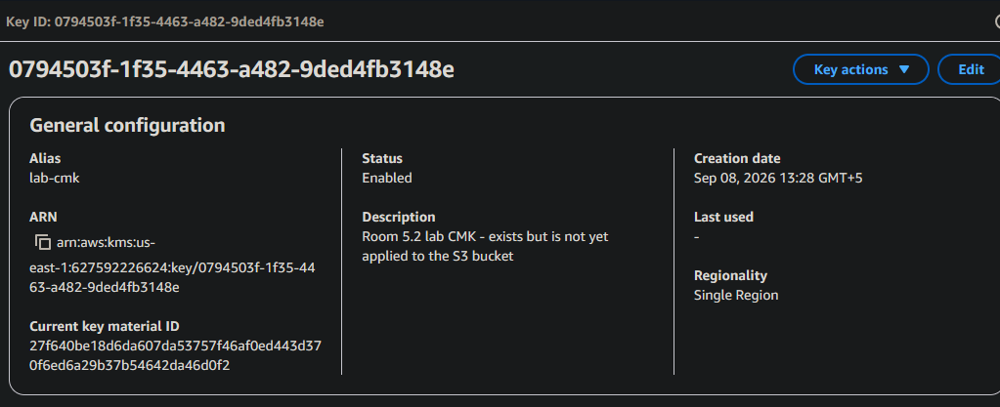
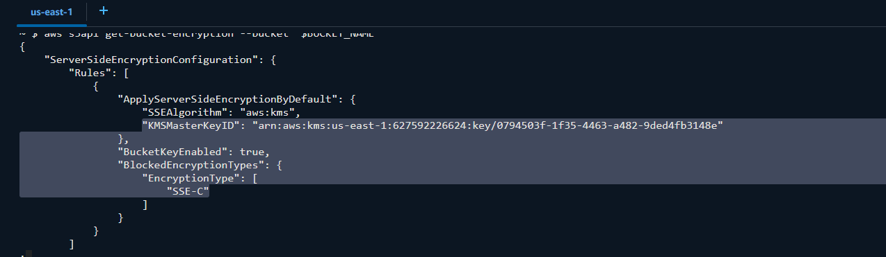
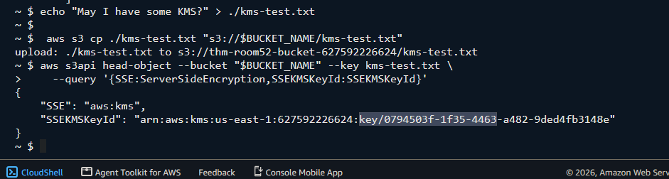
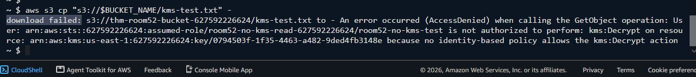

> /AWSDefence/PlaintextBucketEncryption

# Bucket Encryption & Security

Cloud storage security is not only about controlling who can access data. It is also about what happens after those controls fail.

A compromised credential, excessive permission, or leaked access key can allow attackers to reach stored objects. Encryption at rest provides an additional security layer by protecting data even when storage access is obtained.

AWS automatically encrypts new S3 objects using SSE-S3 by default. This protects data at rest, but the encryption keys are managed entirely by AWS and do not create a separate authorization boundary.

For sensitive workloads, organizations often use SSE-KMS. By moving encryption key management into AWS Key Management Service, access to stored data requires both S3 permissions and permission to use the KMS key.

In this investigation, we will examine an S3 bucket relying on default encryption, identify the limitations of SSE-S3, migrate the bucket to SSE-KMS, and verify how a separate encryption layer changes access control.

---

# LastPass 2022

Encryption is often considered the final protection layer for sensitive data. However, encryption only provides additional security when the keys are protected separately from the systems accessing the data.

The 2022 LastPass breach demonstrated how stolen cloud credentials can become dangerous when sensitive storage access depends only on the same permissions.

LastPass stored customer vault backups and related metadata in cloud infrastructure. After attackers compromised internal systems and obtained privileged credentials, they were able to access stored backup data.

The incident highlighted an important cloud security principle:

> A user who can access storage should not automatically have the ability to decrypt everything stored inside it.



A separate key management layer can reduce the impact of compromised credentials by requiring additional authorization before encrypted data can be accessed.

---

# The S3 Encryption Layers

S3 supports multiple encryption methods. The three common approaches are:

* **SSE-S3**: AWS manages the encryption keys. This is the default option for S3 objects.
* **SSE-KMS**: Encryption keys are managed through AWS KMS, allowing separate permissions, auditing, and key usage control.
* **SSE-C**: The customer provides and manages the encryption keys externally.

SSE-S3 provides encryption at rest, but access control remains tied to S3 permissions.

SSE-KMS introduces another security boundary:

- S3 permission allows access to the object.

- KMS permission allows the object to be decrypted.

Both are required.

Let's investigate the bucket configuration and identify which encryption method is currently being used.

---

# Finding The Plain Bucket

First, identify the bucket created for this lab. Also save the bucket name.

```bash
aws s3api list-buckets --query "Buckets[?contains(Name, 'thm')].Name" --output text

export BUCKET_NAME=<bucket-name>
```



Before making any changes, inspect the current encryption configuration.

```bash
aws s3api get-bucket-encryption --bucket "$BUCKET_NAME"
```



The bucket does not have an explicit SSE-KMS configuration. It relies on SSE-S3 encryption.

This does not mean the bucket is unencrypted. AWS automatically protects new S3 objects using `AES256` encryption.

However, there is no separate key authorization layer.


## Checking Object Encryption

Bucket-level settings show the default encryption configuration. To confirm how existing objects are encrypted, inspect an object directly.

```bash
aws s3api head-object \
--bucket "$BUCKET_NAME" \
--key sample-data.txt \
--query '{SSE:ServerSideEncryption,SSEKMSKeyId:SSEKMSKeyId}'
```



The object reports:

* Encryption type: SSE-S3 (AES256)
* KMS key: None

This confirms that the object uses SSE-S3. The current security model looks like this:

```text
S3 permission → Object access → Automatic decryption
```

If an attacker obtains valid S3 read permissions, there is no additional key authorization check.

---

## The Encryption Security Gap

The investigation revealed:

* The bucket uses SSE-S3 encryption.
* Objects are encrypted at rest.
* Encryption keys are managed by AWS.
* No customer-controlled KMS key protects object access.

SSE-S3 is suitable for many workloads, but sensitive environments often require stronger separation between storage permissions and encryption permissions.

The next step is adding that missing security boundary.

---

# The KMS Key Configuration

The lab already provides a customer-managed KMS key.

```bash
aws kms list-aliases \
--query "Aliases[?AliasName=='alias/lab-cmk'].TargetKeyId" \
--output text
```
**KMS Key**



Save the key information:

```bash
export KEY_ID=<key-id>

export KEY_ARN=$(aws kms describe-key \
--key-id "$KEY_ID" \
--query "KeyMetadata.Arn" \
--output text)
```


## Enabling SSE-KMS Protection

Configure the bucket to use the customer-managed key.

```bash
aws s3api put-bucket-encryption \
--bucket "$BUCKET_NAME" \
--server-side-encryption-configuration '{
  "Rules": [
    {
      "ApplyServerSideEncryptionByDefault": {
        "SSEAlgorithm": "aws:kms",
        "KMSMasterKeyID": "'$KEY_ARN'"
      },
      "BucketKeyEnabled": true
    }
  ]
}'
```

Verify the new encryption configuration:

```bash
aws s3api get-bucket-encryption --bucket "$BUCKET_NAME"
```

**KMS key is being used**



The bucket now uses SSE-KMS for future uploads. One important detail is that, changing the default encryption setting does not automatically re-encrypt existing objects. Existing objects keep their original encryption method until they are rewritten.


## Confirming The New Encryption Boundary

Upload a new object:

```bash
echo "KMS test" > kms-test.txt

aws s3 cp kms-test.txt s3://$BUCKET_NAME/kms-test.txt
```

Check its encryption settings:

```bash
aws s3api head-object \
--bucket "$BUCKET_NAME" \
--key kms-test.txt \
--query '{SSE:ServerSideEncryption,SSEKMSKeyId:SSEKMSKeyId}'
```




The object now uses `"Encryption: aws:kms"` and `"KMS Key: Customer-managed key"`.

The access model has changed.

Previously it was:
```
S3 permission = access + automatic decryption
```
Now:
```
S3 permission + KMS permission = access
```

# Testing The Additional Protection Layer

The lab includes a role with S3 read permissions but without KMS decrypt permissions. This simulates a compromised identity that can access the bucket but should not be able to decrypt protected objects.

Assume the restricted role:

```bash
export ROLE_ARN=$(aws cloudformation list-exports \
--query "Exports[?Name=='room52-NoKMSReadRoleArn'].Value" \
--output text)

read AWS_ACCESS_KEY_ID AWS_SECRET_ACCESS_KEY AWS_SESSION_TOKEN <<< "$(aws sts assume-role \
--role-arn "$ROLE_ARN" \
--role-session-name room52-no-kms-test \
--query 'Credentials.[AccessKeyId,SecretAccessKey,SessionToken]' \
--output text)"

export AWS_ACCESS_KEY_ID AWS_SECRET_ACCESS_KEY AWS_SESSION_TOKEN
```

Attempt to read the KMS-encrypted object:

```bash
aws s3 cp "s3://$BUCKET_NAME/kms-test.txt" -
```




The request fails because the identity has S3 permissions but lacks permission to use the KMS key. The additional encryption boundary is working.

---

# Preventing Encryption Blind Spots

S3 encryption is only one part of cloud data protection. A secure S3 deployment should include:

* SSE-KMS for sensitive data requiring stronger control.
* Separate IAM and KMS permissions.
* Regular review of key policies.
* CloudTrail monitoring for KMS key usage.
* Least-privilege access to storage and encryption keys.

Encryption protects data. Key management controls who can unlock it.

The strongest cloud storage designs do not rely on a single security layer. They build multiple barriers so that one compromised permission does not become unrestricted access to sensitive data.

---

> QXV0aG9yOiBodHRwczovL2dpdGh1Yi5jb20vaGFzaC01NDU=