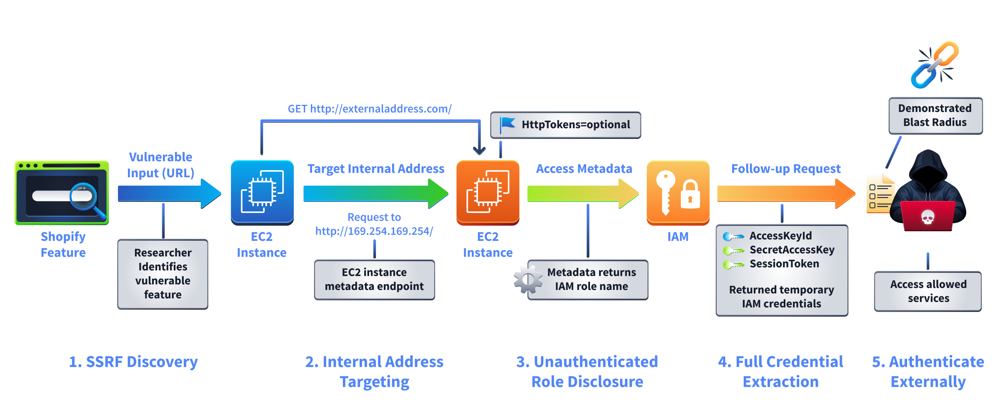
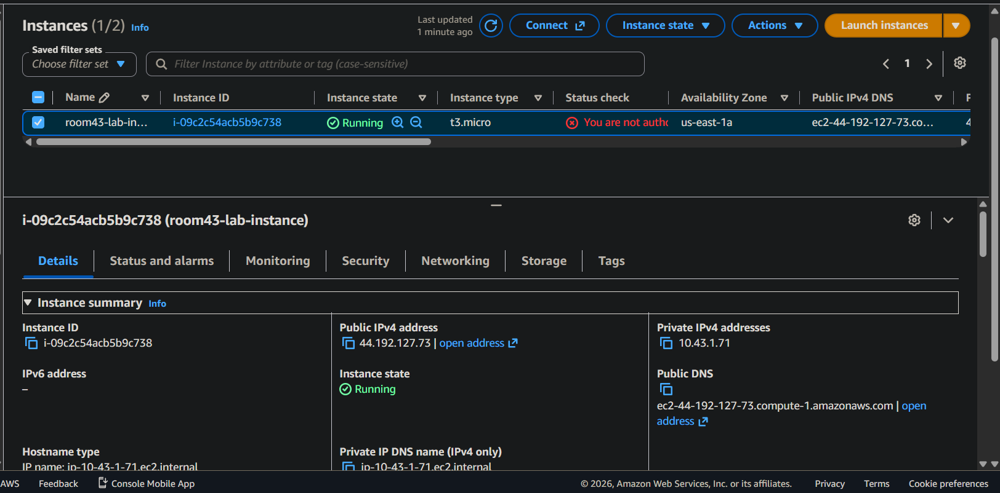
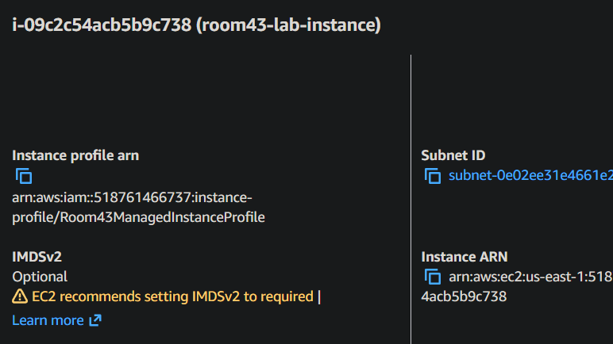
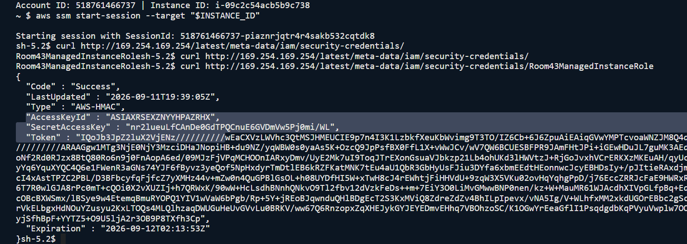
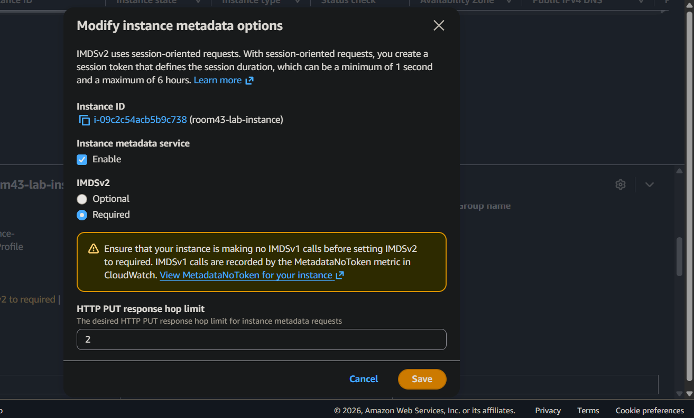
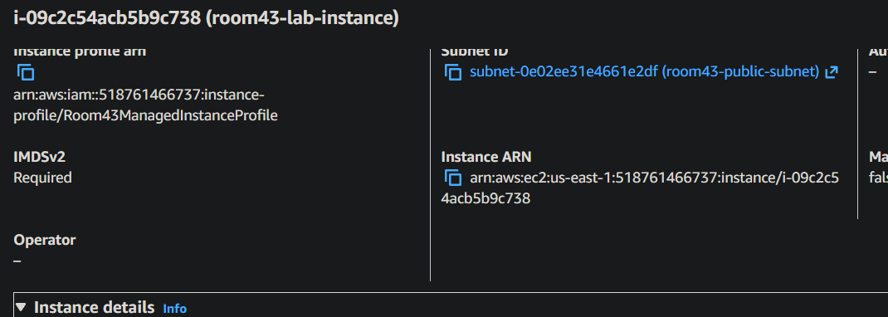
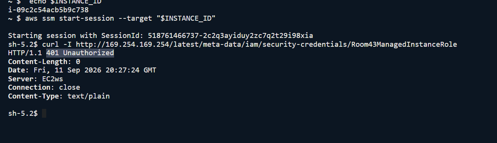
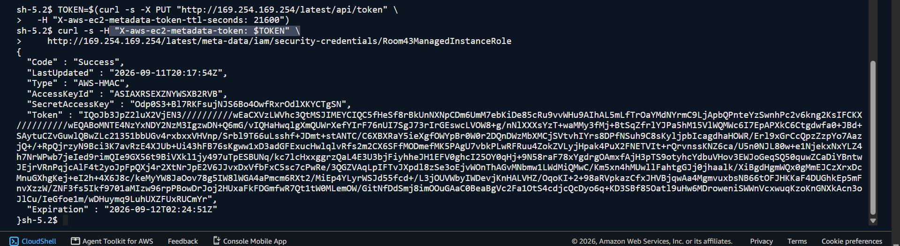

> /AWSDefence/HandlingLeakyMetadataServices

# Handling Leaky Metadata Service (IMDSv1)

An EC2 instance can have everything configured correctly on the surface.

Security groups are restrictive. IAM roles are carefully assigned. Applications are running normally. Yet one small setting can quietly turn the instance metadata service into a credential vending machine.

The EC2 Instance Metadata Service (IMDS) exists to make AWS environments convenient. Applications running on an instance can query a local endpoint and retrieve useful information such as instance details, region information, and temporary IAM credentials attached to the machine.

The problem begins when that convenience is left unrestricted.

When IMDSv1 is enabled, any process capable of sending an HTTP request to the metadata endpoint can attempt to retrieve those credentials. This includes vulnerable applications, malicious code running on the instance, or requests forwarded through a server-side request forgery (SSRF) vulnerability.

A single vulnerable URL-fetching feature can become a direct path from the internet to AWS credentials. The attacker does not need to steal a key file. The instance can hand the keys over itself.

`IMDSv2` changes this design by introducing a token-based request flow. Before retrieving metadata, the client must first request a session token using an HTTP PUT request. Without that token, credential retrieval fails.

That small change breaks one of the most common SSRF-to-cloud-credential attack paths.

In this investigation, we will examine an EC2 instance where IMDSv1 is still active, demonstrate the credential exposure path, enforce IMDSv2, and verify that the old unauthenticated method no longer works.

# Shopify SSRF 2019

In 2019, a security researcher discovered an SSRF vulnerability in Shopify through their HackerOne bug bounty program.

Shopify used backend systems that fetched external URLs on behalf of users. If an attacker could control those requests, they could potentially force the server to access internal resources.

The target was the EC2 Instance Metadata Service:

> 169.254.169.254

Normally, this endpoint is only accessible from inside an EC2 instance. However, SSRF can turn a server-side request into a bridge toward internal services.

The attack chain looked like



The researcher used the SSRF vulnerability to make Shopify's backend query the EC2 metadata service. Since IMDSv1 was enabled, the endpoint returned IAM role information and temporary AWS credentials without requiring a metadata token.

Those credentials could then be used against AWS APIs depending on the permissions attached to the role. Shopify fixed the SSRF vulnerability and moved affected systems toward IMDSv2.

The key failure was not SSRF alone. A single application flaw became an AWS credential compromise because the metadata service lacked an additional security boundary.

A vulnerable application is dangerous. A vulnerable application with cloud credentials is far worse.

# Investigating The Leaking IMDSv1

For this investigation, we are acting as a security analyst reviewing an EC2 instance that may expose IAM credentials through the metadata service.

The goal is to determine:

* Is IMDSv1 enabled?
* Can credentials be retrieved without authentication?
* Can the exposure be removed by enforcing IMDSv2?

First, we identify the AWS account and target instance.

```bash
ACCOUNT_ID=$(aws sts get-caller-identity --query Account --output text)

INSTANCE_ID=$(aws ec2 describe-instances \
    --filters "Name=tag:Purpose,Values=room-43-lab" "Name=instance-state-name,Values=running" \
    --query "Reservations[0].Instances[0].InstanceId" \
    --output text)

echo "Account ID: $ACCOUNT_ID | Instance ID: $INSTANCE_ID"
```

The instance ID will be used for all following checks.


Before attempting credential retrieval, we first check the instance metadata configuration. AWS exposes metadata settings directly through the EC2 API, allowing security teams to audit whether IMDSv1 or IMDSv2 is enabled.

```bash
aws ec2 describe-instances \
  --instance-ids "$INSTANCE_ID" \
  --query "Reservations[0].Instances[0].MetadataOptions" \
  --output json
```
**Active Instances**




The important field is: `IMDSv2 Optional`

If the value is:

* `optional` → IMDSv1 is allowed.
* `required` → only IMDSv2 requests are accepted.

The instance reports otherwise.

This confirms that IMDSv1 is active. The metadata endpoint is currently willing to answer requests without a session token.

## Following The Credential Path

Now we verify whether the metadata endpoint can actually provide IAM credentials.

We connect to the instance through Systems Manager.

```bash
aws ssm start-session --target "$INSTANCE_ID"
```

From inside the instance, we query the metadata endpoint:

```bash
curl http://169.254.169.254/latest/meta-data/iam/security-credentials/
```

The response reveals the attached IAM role name. We then request credentials for that role:

```bash
curl http://169.254.169.254/latest/meta-data/iam/security-credentials/ROLE_NAME
```

**Secrets Exposed**



The endpoint returns temporary IAM credentials. This is the exact scenario attackers attempt to achieve through SSRF vulnerabilities. The application does not need to contain hardcoded AWS keys. The instance already has them.

---

## Building A Safer Metadata Boundary

The fix for this issue is not complicated. The dangerous part is that the insecure configuration often survives because everything appears to work.

Applications do not notice the difference between IMDSv1 and IMDSv2 during normal operation. The credentials still exist. The metadata endpoint still responds. Nothing crashes.

The security difference only appears when something goes wrong.

With IMDSv1 enabled, an SSRF vulnerability can become an `IAM credential theft vulnerability`. A web application flaw that should only expose internal HTTP requests suddenly becomes a bridge into the AWS control plane.

**Enabling IMDSv2**



IMDSv2 breaks this chain by adding a simple requirement: the workload must first prove that it is intentionally requesting metadata.

Before retrieving credentials, the instance must request a temporary metadata token:

```bash
PUT /latest/api/token
```
**Plain curl command fails** avoiding leaking IMDSv1


That token must then be included in future metadata requests.



An attacker controlling a server-side request usually only has the ability to make a simple HTTP request. They cannot perform the required token exchange, making the metadata service far less useful as a credential source.

---

## Launching Instances With IMDSv2 From The Start

Updating existing instances closes the immediate gap, but future deployments can recreate the same problem if the insecure configuration remains part of the build process.

Security controls that depend on someone remembering a checklist eventually become security incidents. The better approach is to enforce IMDSv2 during provisioning.

When launching new EC2 instances, require metadata tokens at creation time:

```bash
aws ec2 run-instances \
    --image-id ami-example \
    --instance-type t2.micro \
    --metadata-options HttpTokens=required
```

This ensures every newly created instance starts with the safer metadata configuration.

For larger environments, this control should be moved into infrastructure-as-code templates. Whether using CloudFormation, Terraform, or another deployment system, metadata requirements should be treated as part of the baseline configuration rather than an optional hardening step.

---

# The Fix Behind The Failure

The issue was never the metadata service itself.

IMDS exists because applications running on EC2 need a secure way to obtain temporary credentials without storing long-lived access keys. The problem was allowing the older unauthenticated access method to remain available.

The final security model should look like this:

* Applications retrieve temporary credentials through `IMDSv2`.
* IAM roles follow least-privilege principles.
* Applications validate and restrict user-controlled URLs.
* Network controls prevent unnecessary access to internal services.
* New instances inherit secure metadata settings automatically.

A metadata service should provide convenience, not become a credential vending machine for anyone who can make an HTTP request.

---

> QXV0aG9yOiBodHRwczovL2dpdGh1Yi5jb20vaGFzaC01NDU=
