> /AWSDefence/Handling S3 Public Access Vulnerability

# Handling S3 Public Access Vulnerability

Cloud storage is designed to be simple. Upload files, grant access, and let applications use them.

That simplicity is also what makes S3 exposure dangerous.

A bucket opened for a temporary project, migration, or integration can quietly become a public data leak if access controls are not reviewed afterward. The attacker does not need advanced exploitation techniques. They only need to find the bucket.

AWS has added multiple protections over the years, especially Block Public Access, but those controls are only effective when they are enabled and correctly configured.

In this investigation, we will examine an intentionally exposed S3 bucket, identify the controls that allowed public access, understand how an attacker would discover the exposure, and restore the bucket to a secure state.

# When Storage Became A Data Leak

Public S3 buckets have caused some of the most embarrassing cloud security incidents because the attack usually requires very little effort.

A common pattern appears again and again:

A bucket is intentionally made public for a project. Block Public Access is disabled. A broad bucket policy or ACL grants access to everyone. Nobody notices.

Attackers then discover the exposed bucket using automated cloud scanning tools and download whatever data is available.

Companies such as `Verizon, Dow Jones, and Pegasus Airlines` have all experienced incidents involving publicly accessible storage. The root cause was not an advanced attack technique. It was forgotten exposure.

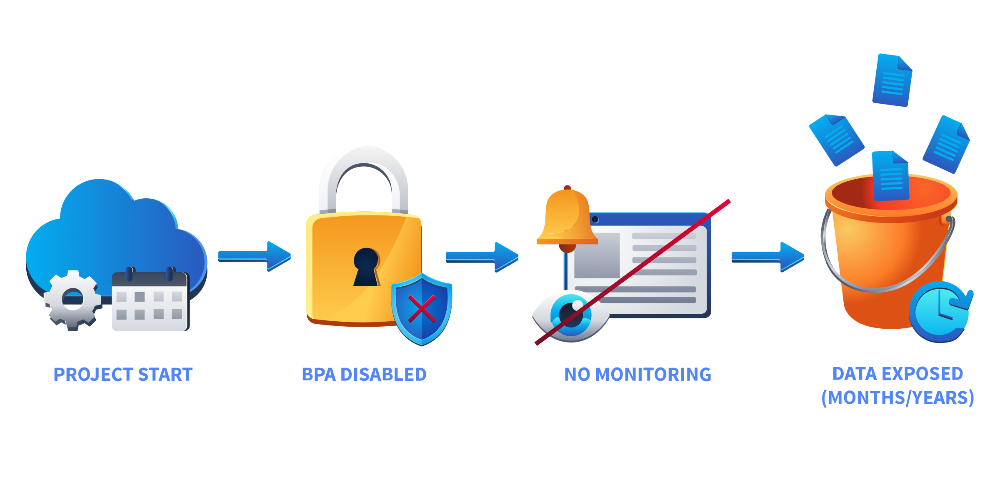

The security lesson is simple, a bucket that is public today might still be public six months later when nobody remembers why it was opened.

---

# The S3 Security Layers

S3 access is controlled through multiple layers.

The main controls are:

- **Access Control Lists (ACLs)**: Older object and bucket permissions that can grant access to users or groups.
- **Bucket Policies**: JSON-based rules defining who can perform actions such as reading objects.
- **Block Public Access**: A safety layer that prevents public ACLs and policies from exposing data.

Block Public Access acts as the final barrier. Even if a bucket policy accidentally allows everyone, this setting can stop the exposure.

Let's investigate whether this bucket has any of those protections enabled.

# Finding The Leaky Bucket

First, identify the bucket created for this lab.

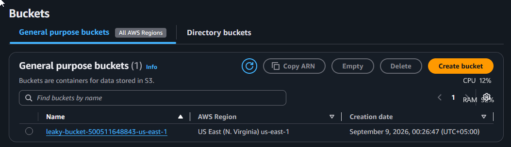

The bucket name is stored for later checks.

```bash
export BUCKET_NAME=$(aws s3api list-buckets --query "Buckets[?contains(Name, 'leaky')].Name" --output text)
```

Before looking at the policy, check whether the bucket uses ACL-based permissions.

```bash
aws s3api get-bucket-ownership-controls --bucket $BUCKET_NAME
```

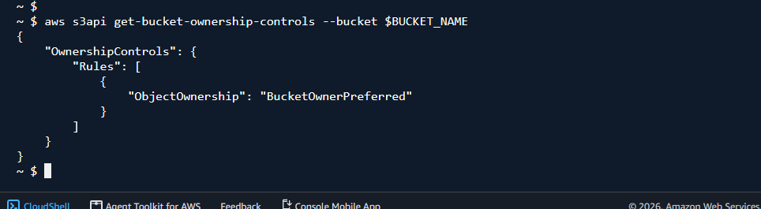

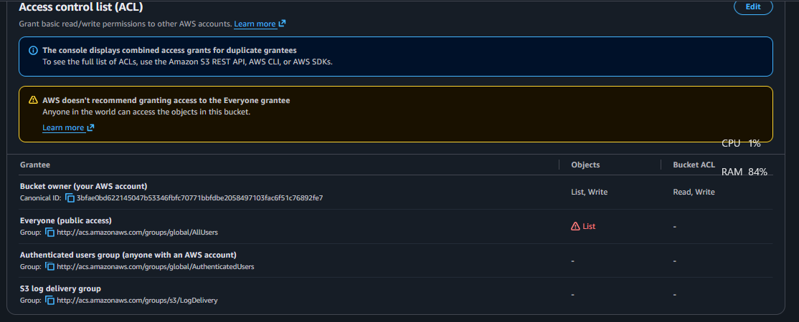

`BucketOwnerPreferred` means ACLs are still active. Modern S3 deployments normally use BucketOwnerEnforced, which disables ACLs completely and reduces the chance of accidental exposure.

Next, check the bucket-level Block Public Access configuration.

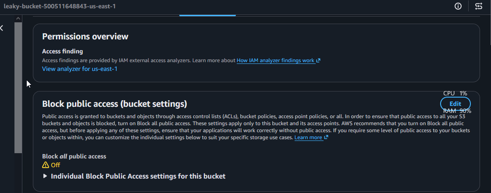

The bucket currently has no protection against public ACLs or policies. Account-level settings can also override bucket settings, so check those as well.

```bash
ACCOUNT_ID=$(aws sts get-caller-identity --query Account --output text)

aws s3control get-public-access-block --account-id $ACCOUNT_ID
```
Output:
```json
{
    "PublicAccessBlockConfiguration": {
        "BlockPublicAcls": false,
        "IgnorePublicAcls": false,
        "BlockPublicPolicy": false,
        "RestrictPublicBuckets": false
    }
}
```
The account-level protection is disabled too.

The final piece is the bucket policy.

```bash
aws s3api get-bucket-policy --bucket $BUCKET_NAME --query Policy --output text
```

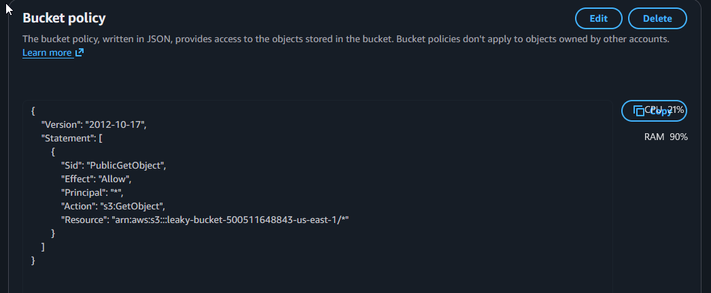

The policy allows:

* Principal: Everyone (`*`)
* Action: `s3:GetObject`

This means anyone who knows the bucket location can read objects.

## Confirming Public Access

An attacker would not need AWS credentials to access this bucket.

They could simply list objects anonymously:

```bash
aws s3 ls s3://$BUCKET_NAME/ --no-sign-request
```
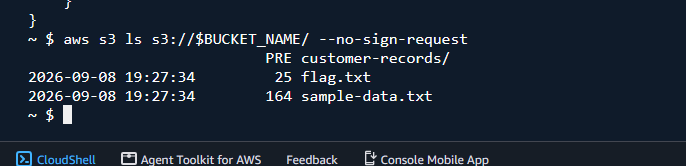

The bucket contents are exposed. It is publicly accessible.

# The Security Crime Scene

The exposure was caused by multiple controls failing together:

* Block Public Access was disabled.
* The bucket policy allowed every principal to read objects.
* ACL permissions included public access through the AllUsers group.

Any one of these mistakes can create risk. Combined together, they turn private storage into an open download location.

The fix is to remove unnecessary public access and restore restrictive defaults.


## Blocking Public Access

The first step is enabling S3's public access protection.

```bash
aws s3api put-public-access-block \
--bucket $BUCKET_NAME \
--public-access-block-configuration \
"BlockPublicAcls=true,IgnorePublicAcls=true,BlockPublicPolicy=true,RestrictPublicBuckets=true"
```
**AWS web portal:**
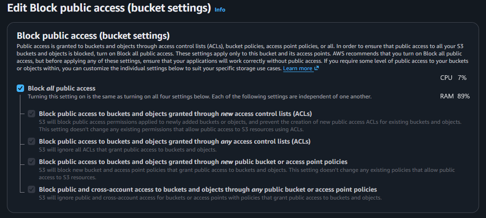
All four controls should be enabled.
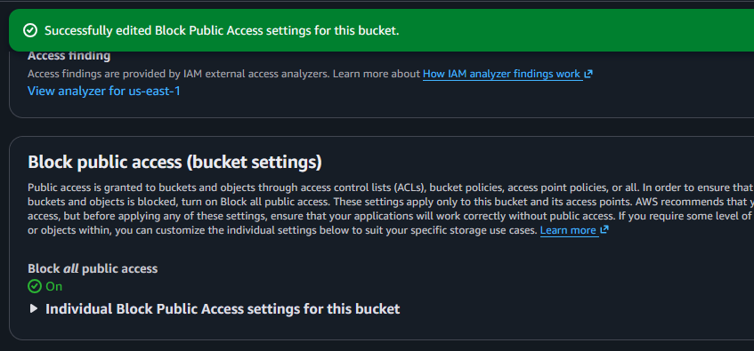


## Removing The Public Bucket Policy

The wildcard principal is no longer required.

Remove the bucket policy:
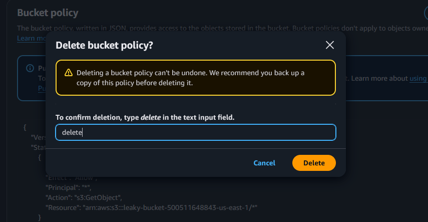
A missing policy confirms the public rule has been removed.

## Resetting The Bucket ACL

Finally, remove any legacy ACL permissions.

```bash
aws s3api put-bucket-acl --bucket $BUCKET_NAME --acl private
```

**Removing Public List Permission**
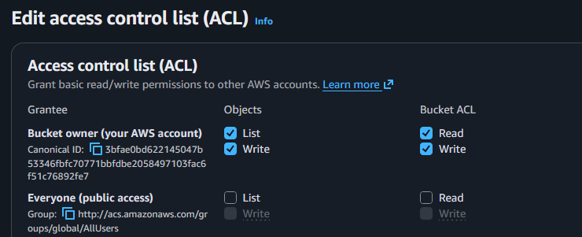

The bucket now relies on private access controls.


Attempting anonymous access should now fail:

```bash
curl -s "https://$BUCKET_NAME.s3.amazonaws.com/flag.txt"
```
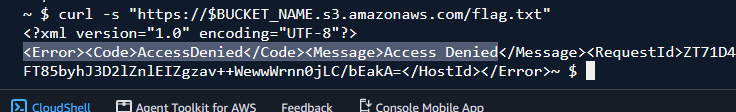

The object is no longer available publicly. The bucket remains usable by authorized AWS identities.

# Preventing The Next Leaky Bucket

S3 exposure usually happens because access decisions outlive their original purpose. A secure S3 deployment should start with:

* Block Public Access enabled at the account level.
* BucketOwnerEnforced ownership controls.
* Least-privilege bucket policies.
* Monitoring through AWS Config, CloudTrail, or security tooling.
* Regular reviews of buckets created for temporary projects.

Cloud storage is not dangerous because it is public. It is dangerous when something becomes public accidentally and stays that way.

---

> QXV0aG9yOiBodHRwczovL2dpdGh1Yi5jb20vaGFzaC01NDU=

```
```
