> /AWSDefence/IAM-Credential-Hygiene

# IAM Credential Hygiene: Managing Forgotten Access Keys

A common cloud security failure does not always begin with a sophisticated attack. Sometimes, it begins with a credential that was simply forgotten.

An engineer creates an AWS access key to run a deployment script. The deployment succeeds, the project goes live, and the key remains active long after it is needed.

No rotation. No review. No removal.

A forgotten access key becomes a permanent entry point into the cloud environment. If that key is exposed, an attacker can use it to authenticate as the original user and operate with the permissions assigned to that identity.

This article explores an AWS environment where a developer account contains stale access keys and weak credential hygiene practices. The objective is to audit IAM credentials, identify risky access keys, remove obsolete credentials, enforce MFA, and understand why temporary credentials are preferred over long-lived access keys.

We'll explore:

- IAM credential reports
- Identifying stale access keys
- Access key rotation and removal
- MFA enforcement
- Temporary credentials with AWS STS
- Credential hygiene best practices

---

# The Risk of Forgotten Access Keys

AWS access keys provide programmatic access to AWS services through the AWS CLI, SDKs, and applications.

Unlike temporary credentials, access keys do not automatically expire. If they remain active indefinitely, they create a persistent authentication path into the environment.

A compromised access key can allow an attacker to perform any action permitted by the associated IAM identity.

A secure AWS environment therefore requires regular credential auditing, key rotation, monitoring, and removal of unused credentials.

---

# Uber Data Breach (2016)

The dangers of poor credential hygiene were demonstrated during the Uber data breach.

Uber used AWS as part of its cloud infrastructure, including storage of sensitive information in S3 buckets. Their engineering teams also used GitHub repositories and AWS access keys for programmatic access.

The breach occurred through a chain of credential failures.

Attackers first gained access to a developer's GitHub account through credential stuffing. Since MFA was not enforced, the attackers were able to access private repositories.

Inside those repositories, they discovered hardcoded AWS access keys.

Using those credentials, attackers authenticated to AWS and accessed S3 resources containing sensitive data.

The incident highlighted several security failures:

- Long-lived access keys without rotation
- Hardcoded credentials inside source code
- Lack of MFA protection
- Excessive permissions assigned to credentials
- Missing monitoring for suspicious API activity

A single exposed credential became a path into the cloud environment.

---

# Generating an IAM Credential Report

The first step in credential auditing is understanding the current state of IAM credentials.

Let's begin by storing the AWS account ID and application bucket name for easier command reuse.

```bash
ACCOUNT_ID=$(aws sts get-caller-identity --query Account --output text)

echo "Account ID: ${ACCOUNT_ID}"

BUCKET_NAME="thm-app-data-${ACCOUNT_ID}"

echo "Bucket:${BUCKET_NAME}"
```


Next, let's generate an IAM credential report.

```bash
aws iam generate-credential-report
```

Or we can use Web UI
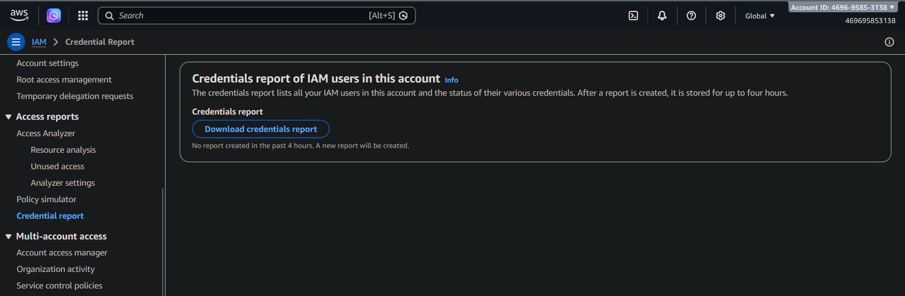

AWS generates a report containing information about IAM users, MFA status, and access key activity.

After the report is generated, we can retrieve and decode it.

```bash
aws iam get-credential-report \
    --query 'Content' \
    --output text | base64 --decode > credential-report.csv

cat credential-report.csv
```

If using th web UI for report generation, it is automatically downloaded in `.csv` format. Inside the report we have some findings.

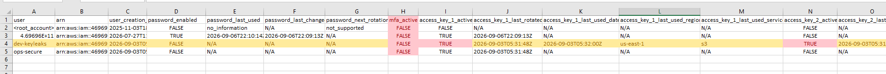
[Download Report](./credential_report.csv)

For this lab, we'll focus on `dev-keyleaks` user. Since we can see a lot of flaws in the report for this user, let me enlist them,

* MFA is disabled.
* Two access keys are active.
* One access key has never been used.

---

# Investigating Access Keys

The next step is to examine the access keys assigned to the affected user.

Let's list all keys belonging to `dev-keyleaks`.

```bash
aws iam list-access-keys \
    --user-name dev-keyleaks
```

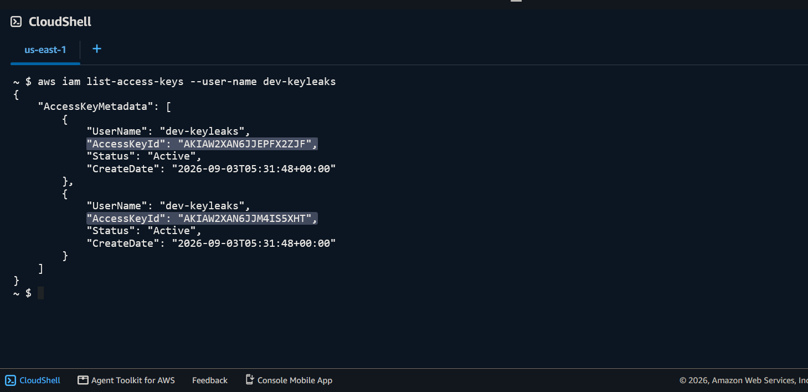

The account contains two active access keys.

To investigate each key individually, let's store their IDs.

```bash
KEY1_ID=$(aws iam list-access-keys \
       --user-name dev-keyleaks \
       --query "AccessKeyMetadata[0].AccessKeyId" \
       --output text)

KEY2_ID=$(aws iam list-access-keys \
       --user-name dev-keyleaks \
       --query "AccessKeyMetadata[1].AccessKeyId" \
       --output text)
```

Now, let's check when each key was last used.

```bash
aws iam get-access-key-last-used \
    --access-key-id $KEY1_ID

aws iam get-access-key-last-used \
    --access-key-id $KEY2_ID
```

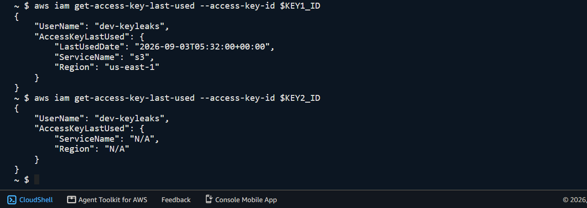

The results reveal that one key has recent usage, while the second key has never been used.

This creates a security concern because an active credential exists without any legitimate usage history.

---

# Reviewing User Permissions

Finding an exposed key is only part of the investigation. The next step is understanding what the compromised identity can access.

First, let's check policies directly attached to the user.

```bash
aws iam list-attached-user-policies \
    --user-name dev-keyleaks
```

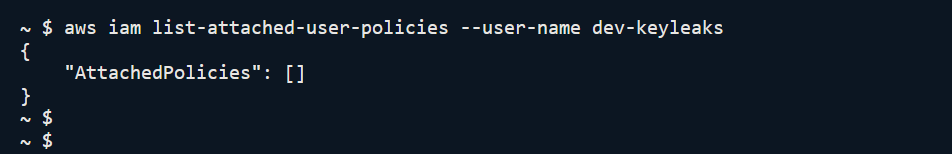

No policies are directly attached.

Next, let's check group membership.

```bash
aws iam list-groups-for-user \
    --user-name dev-keyleaks
```

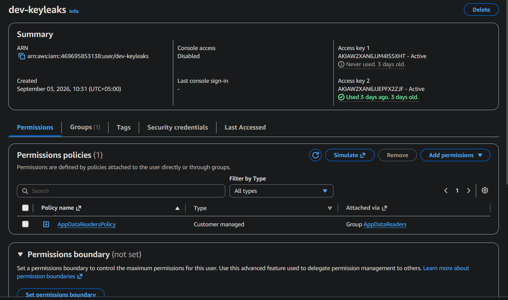

The user belongs to the `AppDataReaders` group.

Let's review the permissions inherited from this group.

```bash
aws iam list-attached-group-policies \
    --group-name AppDataReaders
```
Im using web UI for quick view and better visuals.
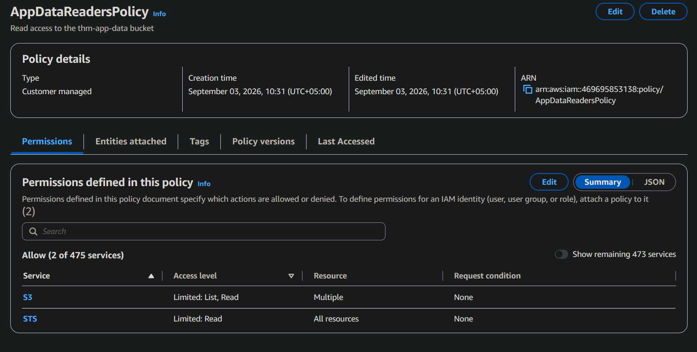

**The policy permissions**
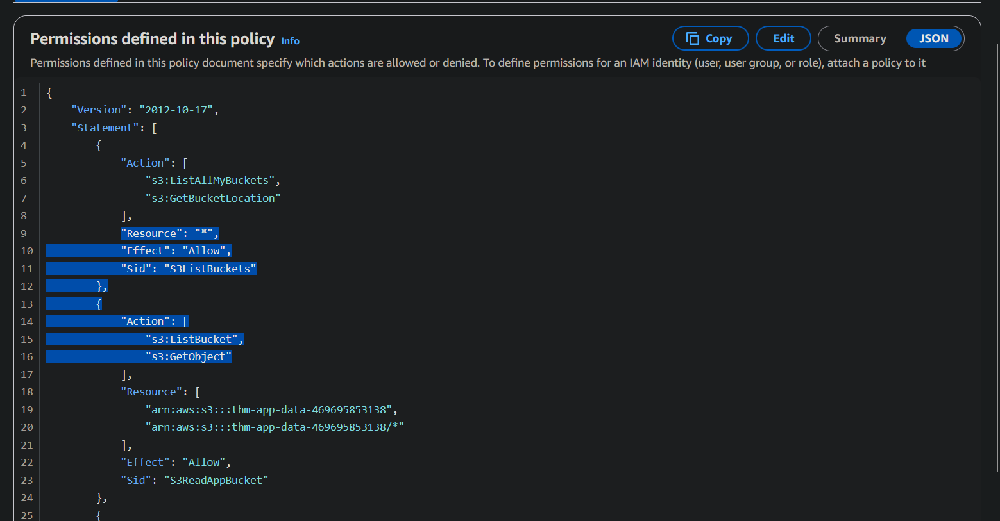

The group policy allows S3 read access.

The permissions are limited to:

```json
{
    "Action": [
        "s3:ListBucket",
        "s3:GetObject"
    ],
    "Resource": [
        "specific application bucket"
    ]
}
```

The blast radius is limited because the user does not have administrative permissions.

However, an attacker with the leaked key could still silently read the contents of the application bucket.

---

# Findings Summary

The audit reveals several credential hygiene issues:

`dev-keyleaks` has:

* No MFA enabled
* Two active access keys
* One unused access key that was never required
* Permissions allowing access to application data

When reviewing access keys, several indicators should be considered:

**Age:** Keys older than 90 days should be reviewed and rotated.

**Usage gap:** Keys unused for extended periods should be disabled or removed.

**Monitoring:** CloudTrail and automated checks should detect unusual API activity.

The next step is remediation.

The process will follow these steps:

1. Deactivate the stale key.
2. Wait and monitor usage. (Wait for 24 to 72 hours, but this step is ignored in this sandbox env.)
3. Delete the obsolete key.
4. Rotate the active key.
5. Enable MFA.
6. Verify the changes.

---

# Deactivating the Stale Access Key

The unused access key is first disabled.

```bash
aws iam update-access-key \
    --user-name dev-keyleaks \
    --access-key-id $KEY2_ID \
    --status Inactive
```

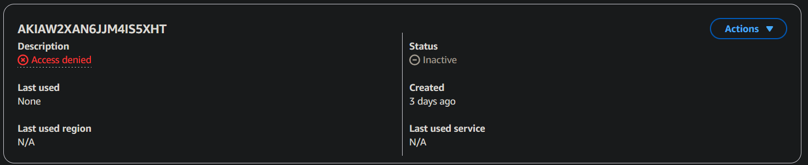

Disabling the key first provides a recovery window. If an application unexpectedly depends on the key, it can be reactivated before deletion.

---

# Waiting and Confirming

In a production environment, the inactive period allows administrators to monitor for failures.

A recommended approach is to:

* Communicate the change before execution.
* Allow a 24 to 72 hour observation period.
* Monitor CloudTrail for API calls using the key.

If no usage occurs, the key can safely be removed.

---

# Deleting the Stale Access Key

Once confirmed unnecessary, the key can be permanently deleted.

```bash
aws iam delete-access-key \
    --user-name dev-keyleaks \
    --access-key-id $KEY2_ID
```

Deleting a key is irreversible. Any application still depending on it will immediately lose access.

---

# Rotating the Active Access Key

The remaining key should also be rotated to ensure credential freshness.

Let's create a replacement key.

```bash
aws iam create-access-key \
    --user-name dev-keyleaks
```

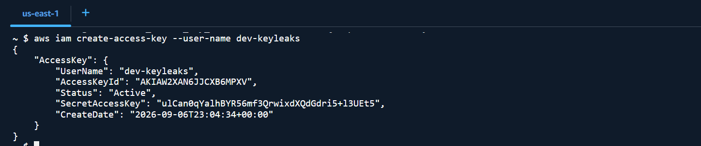
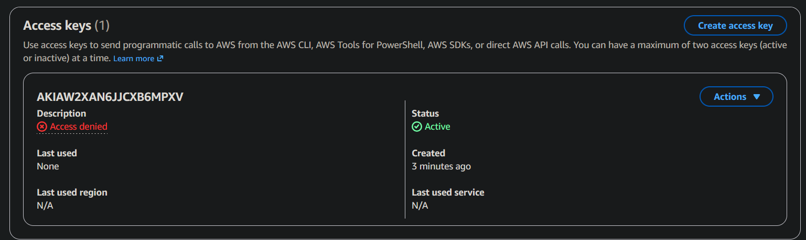

> Note: These keys are IAM secrets and MUST NOT be exposed to public or internet facing services/pages. This is completely a sandboxed environment and keys are exposed for educational purpose only. This sandbox no longer exists.

The secret access key must be stored securely because AWS does not allow retrieving it again after creation.

Let's configure the new credentials for testing.

```bash
aws configure set aws_access_key_id xxxxxxxxxxxxxxxxxxxxxxxxxx  --profile dev-keyleaks

aws configure set aws_secret_access_key xxxxxxxxxxxxxxxxxxxxxxxxxx --profile dev-keyleaks

aws configure set region us-east-1 --profile dev-keyleaks
```

Before removing the old key, always verify the replacement works.
Make sure the new credentials successfully authenticate and access the required resources. Only then you should remove the old keys.


---

# MFA Protection

Enabling Multi-Factor Authentication (MFA) adds another layer of protection by requiring users to provide a second authentication factor during sensitive authentication flows.

For IAM users, MFA should be enforced for accounts with elevated privileges or access to sensitive resources.

In a production environment, MFA protection should be combined with IAM policies that require MFA authentication for sensitive actions. This ensures that even if credentials are compromised, an attacker cannot perform critical operations without the additional verification factor.

The MFA can be set usinsg passkeys, biometrics, authenticator apps or Hardware TOTP tokens. Thr practical part for this is ignored in this simulation. Feel free to watch Youtube tutorials on how to set it.
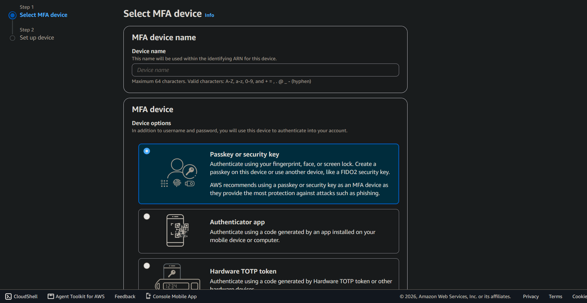

Key MFA security practices include:

- Enforcing MFA for privileged IAM users.
- Requiring MFA before performing sensitive operations.
- Regularly reviewing MFA device assignments.
- Removing MFA devices from decommissioned accounts.

MFA does not replace proper credential management. It should work alongside least-privilege permissions, credential rotation, monitoring, and temporary credentials to reduce the overall attack surface.

The remediation is complete.

---

# Using Temporary Credentials

Long-lived access keys should generally be avoided.

The preferred approach in AWS is using temporary credentials issued through AWS Security Token Service (STS).

The process works by:

1. Creating an IAM role with required permissions.
2. Allowing users or services to assume the role.
3. Issuing temporary credentials that automatically expire.

Temporary credentials provide several security advantages:

* They expire automatically.
* They cannot be reused after expiration.
* They include session information that improves CloudTrail visibility.

---

# Access Key Security Guidelines

If long-lived access keys are unavoidable, additional safeguards should be implemented.

Recommended controls include:

* Enforce MFA for sensitive operations.
* Rotate keys regularly.
* Disable unused keys.
* Limit users to one active key except during rotation windows.
* Monitor key usage through AWS Config, CloudTrail, or automated scripts.

Recommended thresholds:

| Control              | Recommendation |
| -------------------- | -------------- |
| Maximum key age      | 90 days        |
| Unused key threshold | 30 days        |
| Active keys per user | 1              |

---

# Credential Decision Flow

When selecting an authentication method in AWS, prefer the following order:

1. IAM roles for workloads such as EC2, Lambda, and ECS.
2. STS AssumeRole for temporary access and cross-account scenarios.
3. IAM Identity Center for human users.
4. Long-lived access keys only when no better option exists and strong credential hygiene is maintained.

---

# Final Thoughts

A forgotten access key may appear harmless, but it represents a permanent authentication path into an AWS environment.

The issue identified in this environment was not only the existence of unused credentials. It was the absence of a proper lifecycle for those credentials.

By auditing access keys, removing stale credentials, rotating active keys, enabling MFA, and preferring temporary credentials, the authentication model becomes significantly more resilient.

Cloud security depends not only on controlling what users can do, but also on ensuring that only the right credentials exist in the first place.

---

> QXV0aG9yOiBodHRwczovL2dpdGh1Yi5jb20vaGFzaC01NDU=

