> /AWSDefence/IAM-Over-Privileged-Role-Policy-Vulnerability

# AWS Over-Privileged Role & Policy Vulnerability

A cloud security issue does not always begin with an attacker. Sometimes, it begins with a permission that was simply never reviewed.

An application requires access to an S3 bucket to read configuration files, load static assets, and store application logs. An engineer creates an IAM role for the EC2 instance running the application and grants broad permissions to ensure everything works without interruptions.

The application runs successfully.

Nobody complains.

The permissions remain unchanged.

Over time, a role created for a simple purpose becomes an identity with excessive control over the AWS environment.

This article explores an AWS environment where an EC2 application is using an over-privileged IAM role. The objective is to identify the security weakness, understand how instance roles and metadata services can expose credentials, reduce unnecessary permissions, and implement a secure IAM architecture following cloud security best practices.

We'll explore:

- EC2 instance profiles and IAM roles
- How IMDS exposes temporary role credentials
- Identifying over-permissive IAM policies
- Least-privilege service role design
- Restricting permissions to required resources
- Hardening EC2 metadata access using IMDSv2

---

# The Danger of Over-Privileged IAM Roles

AWS Identity and Access Management (IAM) controls which identities can access AWS resources and what actions they are authorised to perform.

For applications running on EC2, AWS recommends using IAM roles instead of storing long-lived access keys. The EC2 instance receives temporary credentials through the instance metadata service, allowing applications to securely authenticate with AWS services.

However, using roles does not automatically make an environment secure.

The permissions assigned to the role still determine the level of access available to the application.

A role with:

```json
{
    "Action": "s3:*",
    "Resource": "*"
}
```

has unrestricted access to every S3 bucket in the AWS account.

If an attacker compromises the application or obtains the role credentials, they inherit the same level of access.

The purpose of an IAM role is not to provide maximum access.

It is to provide exactly the access required by the workload and nothing more.

---

# Capital One Breach (2019)

The risks of over-privileged EC2 roles were demonstrated during the Capital One breach in 2019.

Capital One was operating applications on AWS, including infrastructure involving EC2 instances and web application components.

One of the security failures involved an EC2 instance role that had broader permissions than required. Combined with an SSRF vulnerability and insecure metadata configuration, this allowed an attacker to obtain temporary AWS credentials associated with the instance role.


The breach followed multiple stages.

The attacker first exploited a Server-Side Request Forgery (SSRF) vulnerability in a web application component. This allowed requests to be made against internal AWS services from the EC2 environment.

The attacker then accessed the EC2 Instance Metadata Service (IMDS). Because IMDSv1 was enabled, the metadata endpoint did not require authentication before returning role information and temporary credentials.

With the obtained role credentials, the attacker performed permission discovery and identified accessible AWS resources.

The over-privileged role allowed access to S3 resources containing sensitive information. The attacker was then able to retrieve data from storage locations that the application itself did not require access to.

The incident demonstrated an important security principle:

A vulnerable application combined with excessive IAM permissions can transform a limited application compromise into an account-wide security incident.

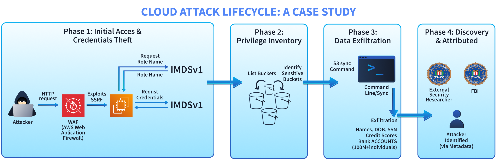


The incident was caused by multiple security weaknesses working together.

The EC2 instance role had excessive permissions. Instead of allowing access only to the application's required S3 resources, the role provided broader access than necessary.

IMDSv1 was enabled. This allowed unauthenticated requests to retrieve metadata and temporary credentials from the instance.

There were insufficient restrictions around where role credentials could be used. Additional controls such as VPC endpoint restrictions and tighter IAM policies could have reduced the impact.

The main lesson is clear:

A compromised application does not necessarily need administrator credentials. An over-powered role attached to that application can provide enough access to cause significant damage.

---

# Investigating the EC2 Instance Role

The lab environment here contains an EC2 instance running a simple web application.

Let's investigate the instance configuration and determine whether the attached IAM role follows least-privilege principles.

First, store the AWS account ID as an environment variable.

```bash

ACCOUNT_ID = $(aws sts get-caller-identity --query Account --output text)

echo "Account ID: ${ACCOUNT_ID}"

```

---

The first step is identifying the running EC2 instance.

Let's list all running instances:

```bash
aws ec2 describe-instances \
    --filters "Name=instance-state-name,Values=running" \
    --query "Reservations[*].Instances[*].{ID:InstanceId,Name:Tags[?Key=='Name'],State:State.Name}" \
    --output table
```
Or alternativley, you can use web UI. Throughout the article, we'll go with GUI and CLI as for our ease.

**Instance of Study**
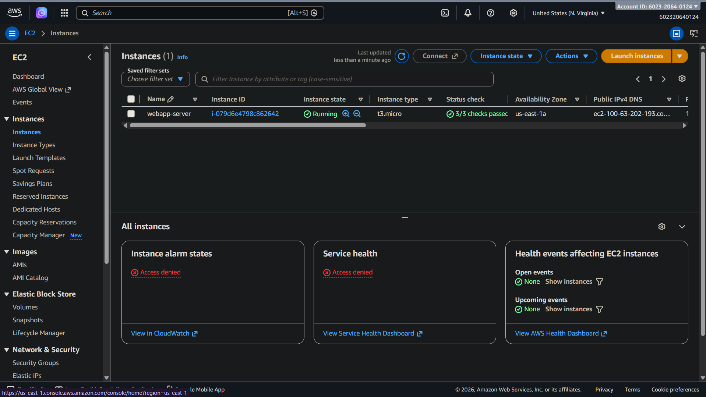

The instance running the web application has been identified.
Now, let's investigate the IAM role attached to this instance.

---

# Checking the Instance Role

EC2 does not directly attach IAM roles.

Instead, it uses an instance profile, which contains the IAM role assigned to the instance.

Let's retrieve the instance profile information.

```bash

INSTANCE_ID=$(aws ec2 describe-instances \
    --filters "Name=tag:Name,Values=webapp-server" "Name=instance-state-name,Values=running" \
    --query "Reservations[0].Instances[0].InstanceId" \
    --output text)

PROFILE_ARN=$(aws ec2 describe-instances \
    --instance-ids $INSTANCE_ID \
    --query "Reservations[0].Instances[0].IamInstanceProfile.Arn" \
    --output text)

PROFILE_NAME=$(echo $PROFILE_ARN | awk -F'/' '{print $NF}')

ROLE_NAME=$(aws iam get-instance-profile \
    --instance-profile-name $PROFILE_NAME \
    --query "InstanceProfile.Roles[0].RoleName" \
    --output text)

echo "Role Name: $ROLE_NAME"

echo "Instance Profile: $PROFILE_NAME"

```

The output identifies the IAM role attached to the EC2 instance.

Now, let's review the permissions assigned to this role.

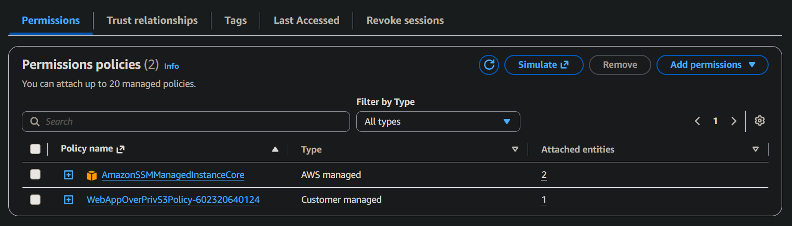

The policy contains apermission requiring further investigation.

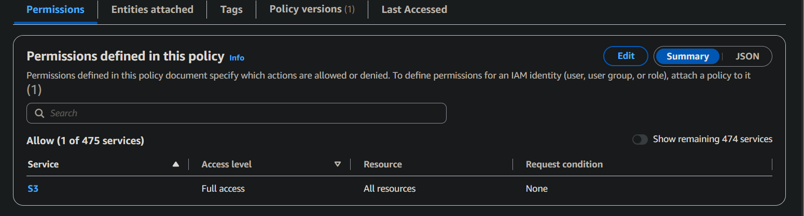

The policy contains give full access across all S3 services. So the policy contains,

```json
{
    "Version": "2012-10-17",
    "Statement": [
        {
            "Action": [
                "s3:*"
            ],
            "Resource": "*",
            "Effect": "Allow",
            "Sid": "OverPrivilegedS3Access"
        }
    ]
}

```

`S3:*` is the critical finding here. The instance role can perform every S3 action against every bucket in the AWS account.

The application only requires access to its own application bucket, but the assigned role allows access to unrelated resources. This violates the principle of least privilege.


# Checking Inline Policies

IAM roles can receive permissions through both managed policies and inline policies.

Managed policies can be `reused` across multiple identities, while inline policies are `directly embedded` into a single user, group, or role.

Although inline policies can be useful for specific scenarios, they can make large environments harder to audit because permissions are hidden directly inside individual identities.

Let's check whether this role contains any inline policies.

```bash
aws iam list-role-policies \
    --role-name $ROLE_NAME \
    --output table
```

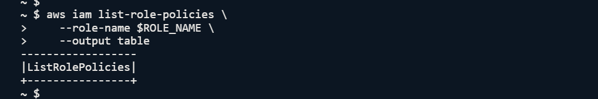

No inline policies are attached.

The managed policy remains the source of the excessive permissions.

---

# Testing the Over-Privileged Role

Finding a risky policy is important, but verifying the actual impact demonstrates the security risk. Let's connect to the EC2 instance using AWS Systems Manager Session Manager.

```bash
aws ssm start-session --target $INSTANCE_ID
```
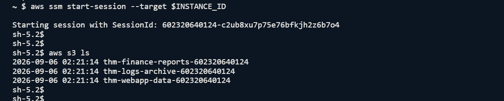

The application should only require access to its own S3 bucket whereas the output shows multiple buckets access.

The application should only interact with:

> thm-webapp-data-${ACCOUNT_ID}


However, because the role has unrestricted S3 permissions, it can also access unrelated buckets.

Let's test access to the finance bucket.

```bash
ACCOUNT_ID=$(curl -s http://169.254.169.254/latest/meta-data/identity-credentials/ec2/info | grep AccountId | cut -d'"' -f4)

aws s3 ls s3://thm-finance-reports-$ACCOUNT_ID/
```
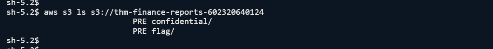

The role successfully accesses both locations. It can even retrieve objects that the application does not require. This confirms the security impact. The EC2 instance role has access beyond the application's actual requirements.

---

# Understanding IMDS Credential Exposure

EC2 instances use the Instance Metadata Service (IMDS) to provide information about the running instance.

This includes:

- Instance information
- Network details
- IAM role information
- Temporary security credentials

Applications running on EC2 can request these credentials automatically. When using IMDSv2, requests require a session token before credentials can be retrieved. However, IMDSv1 does not require this additional protection.

If an attacker exploits an SSRF vulnerability inside an application running on EC2, they may be able to query the metadata endpoint and obtain temporary role credentials.

Let's check whether this instance allows IMDSv1. Still inside the EC2 session, let's query the metadata service.

```
curl -s http://169.254.169.254/latest/meta-data/iam/security-credentials/
```
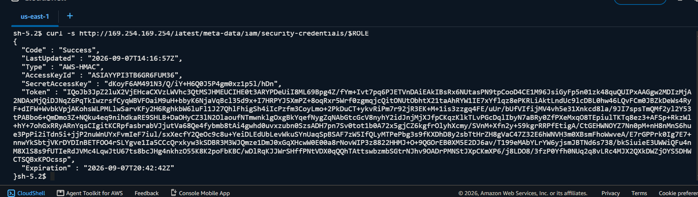

The response contains temporary AWS credentials:


```bash
{
  "Code" : "Success",
  "AccessKeyId" : "ASIAxxxxxxxx",
  "SecretAccessKey" : "xxxxxxxx",
  "Token" : "xxxxxxxx",
  "Expiration" : "2026-03-24T22:31:29Z"
}
```

These credentials are temporary, but they are valid AWS credentials.

If an attacker can retrieve them through an application vulnerability, they can use them from outside the instance until they expire.

---

# Reviewing IMDS Configuration

Let's check the metadata configuration from CloudShell.


```bash
    aws ec2 describe-instances \
    --instance-ids $INSTANCE_ID \
    --query "Reservations[0].Instances[0].MetadataOptions" \
    --output json
```
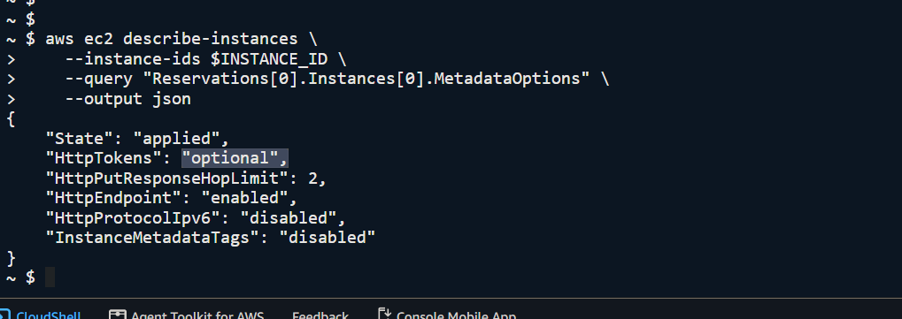

The important value is:

```json
"HttpTokens": "optional"
```

This means IMDSv1 is enabled.

Because IMDSv1 does not require authentication tokens, a successful SSRF attack could retrieve role credentials without additional protection.

---

# Findings Summary

The investigation identified two major security issues. First, the EC2 instance role has excessive S3 permissions. The application only requires access to a specific S3 bucket, but the role grants:

```json
s3:*
Resource: *
```

Second, the EC2 instance allows IMDSv1. This creates a pathway where an application vulnerability could expose temporary IAM role credentials. The combined risk is significant: A vulnerable application + an over-privileged IAM role + insecure metadata configuration can result in unauthorised access to sensitive AWS resources.

Now that the security weaknesses have been identified, the next step is remediation.

## Remediation Strategy

The objective of remediation is not simply to remove access.

The application still requires permissions to function. The goal is to redesign the IAM model so that the EC2 instance receives only the permissions required for its workload.

The secure approach is:

1. Identify the application's actual requirements.
2. Remove unnecessary permissions.
3. Create a scoped IAM policy.
4. Attach the policy to the instance role.
5. Harden the EC2 metadata service.
6. Verify that required functionality remains available.

The web application requires the following permissions:

- Read configuration files from the config directory.
- Read static assets from the assets directory.
- Write application logs to the logs directory.

The role does not require access to:

- Other S3 buckets.
- Administrative S3 actions.
- Resource deletion.
- Account-wide discovery.

The replacement policy should therefore only allow the required S3 actions against the application bucket.

---

# Creating a Scoped IAM Policy

Let's create a policy that follows the principle of least privilege.

```json

{
  "Version": "2012-10-17",
  "Statement": [
    {
      "Sid": "ReadApplicationAssets",
      "Effect": "Allow",
      "Action": [
        "s3:GetObject"
      ],
      "Resource": [
        "arn:aws:s3:::thm-webapp-data-${ACCOUNT_ID}/config/*",
        "arn:aws:s3:::thm-webapp-data-${ACCOUNT_ID}/assets/*"
      ]
    },
    {
      "Sid": "WriteApplicationLogs",
      "Effect": "Allow",
      "Action": [
        "s3:PutObject"
      ],
      "Resource": [
        "arn:aws:s3:::thm-webapp-data-${ACCOUNT_ID}/logs/*"
      ]
    },
    {
      "Sid": "ListApplicationBucket",
      "Effect": "Allow",
      "Action": [
        "s3:ListBucket"
      ],
      "Resource": [
        "arn:aws:s3:::thm-webapp-data-${ACCOUNT_ID}"
      ]
    }
  ]
}

```

You can use policy editor inside AWS Policy tab.

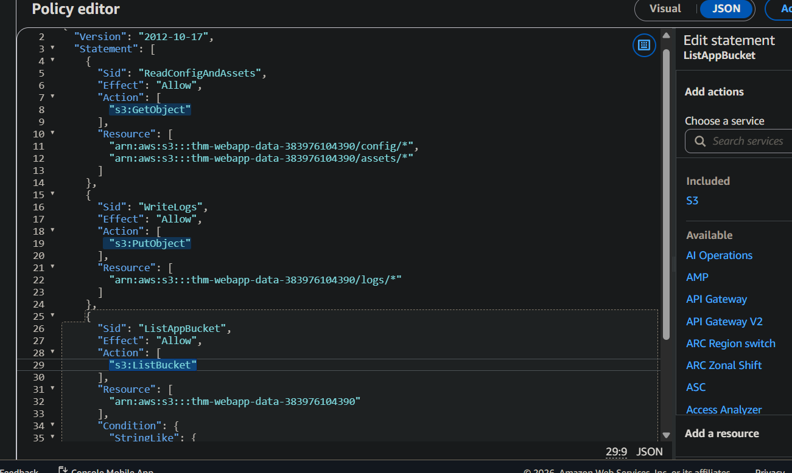
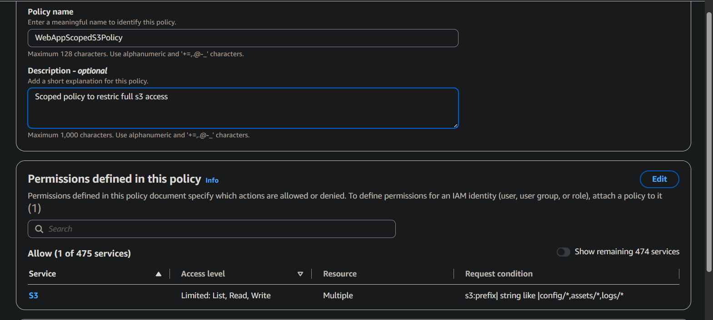

Now, let's create the managed policy. The new policy now contains only the permissions required by the application. The next step is removing the excessive policy from the EC2 role.

First, identify the existing policy then detach the over-privileged policy.

Select the policy to detach and remove it.
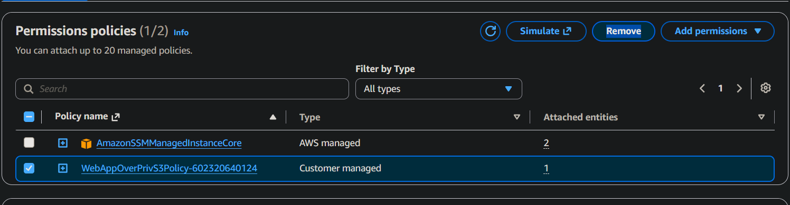

The role no longer has unrestricted S3 access.

Now, time to attach the nice one.
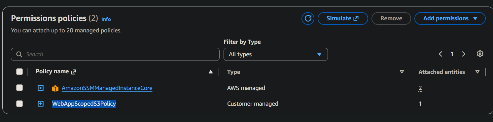

The EC2 instance role now follows a least-privilege model.

---

# Verifying the New Permissions

A secure change should always be validated.

Let's test access to a bucket that the application should not access.

```bash
aws s3 ls s3://thm-finance-reports-$ACCOUNT_ID/
```

The request should fail:

> An error occurred (AccessDenied)


The application still works, but unnecessary permissions have been removed.

## Hardening EC2 Metadata Service

Reducing IAM permissions limits the impact of credential exposure. However, the EC2 metadata service must also be hardened. IMDS provides applications with information about the running instance, including temporary IAM role credentials. IMDSv2 improves security by requiring a session token before metadata access is allowed.

Let's enforce IMDSv2.

```bash
aws ec2 modify-instance-metadata-options \
    --instance-id $INSTANCE_ID \
    --http-tokens required \
    --http-endpoint enabled \
    --http-put-response-hop-limit 1
```

The configuration changes to `HttpTokens: required`. This disables unauthenticated IMDSv1 requests.

The response hop limit is also reduced:

```json

--http-put-response-hop-limit 1

```

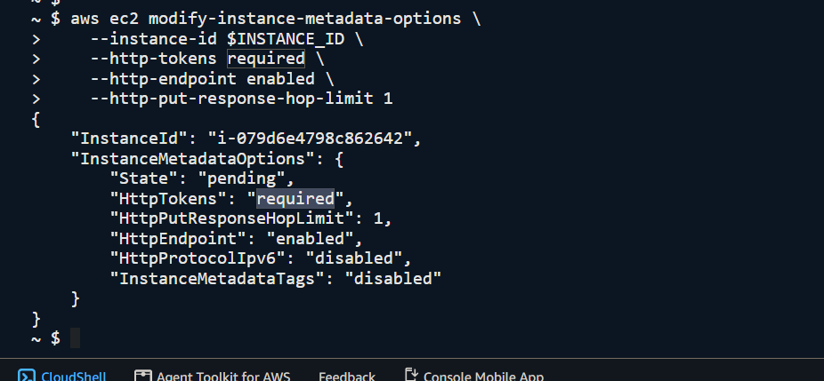

This prevents unnecessary forwarding of metadata requests through additional network layers such as containers or proxy services.

---

# Understanding The Security Improvement

Before remediation, the attack path looked like this:

```
Application Vulnerability
          |
          |
       IMDSv1
          |
          |
 Temporary Role Credentials
          |
          |
 Over-Privileged S3 Access
          |
          |
 Sensitive Data Exposure
```

After remediation the access control is protected as:

```
Application Vulnerability
          |
          |
       IMDSv2
          |
          |
 Token-Protected Credentials
          |
          |
 Scoped IAM Permissions
          |
          |
 Limited Application Access
```

The attacks in future may still occur, but the possible impact is significantly reduced.

---

# Secure IAM Role Design Principles

The remediation fixed the immediate issue, but the same principles should be applied whenever designing AWS workloads.

### Use IAM Roles Instead of Access Keys

Applications running on AWS should use IAM roles rather than storing permanent credentials.

IAM roles provide:

- Temporary credentials.
- Automatic credential rotation.
- Better auditing through CloudTrail.
- Reduced credential leakage risk.

Long-lived access keys should only be used when no alternative exists.

---

### Apply Least Privilege From Day One

Permissions should be designed around application requirements. A secure application role should answer "What does this workload actually need?" & not "What permissions make deployment easier?". A role that requires access to one bucket should not receive access to every bucket.

---

### Restrict Resource Scope

Actions should be limited to required resources.

A secure policy:

```json
{
    "Action": [
        "s3:GetObject"
    ],
    "Resource": [
        "specific application bucket"
    ]
}
```

is significantly safer than:

```json
{
    "Action": "*",
    "Resource": "*"
}
```

The difference is the security boundary between an isolated application and the entire AWS account.

# Final Thoughts

The original issue was not that the application needed AWS access. The issue was that the access model was designed around convenience instead of security. The EC2 instance role provided unrestricted S3 permissions even though the application only required access to a small section of one bucket. This created unnecessary risk.

The remediation replaced the insecure design with a structured IAM model:

- The over-privileged policy was removed.
- A scoped policy was created based on application requirements.
- The EC2 role was restricted to specific S3 resources.
- IMDSv2 was enforced to reduce credential exposure risk.

The broader lesson is simple. IAM roles should provide exactly the permissions a workload requires, not the permissions that make deployment easier. A compromised application should not automatically become a compromised AWS account.

Good cloud security is achieved by designing restrictive access models from the beginning, continuously reviewing permissions, and reducing the possible impact of security failures.

---

> QXV0aG9yOiBodHRwczovL2dpdGh1Yi5jb20vaGFzaC01NDU=