> /AWSDefence/IAM-Security-Hardening

# IAM Security Hardening: Remediating Over-Privileged Access

A common cloud security failure does not always begin with an attacker. Sometimes, it begins with a shortcut.

A developer joins a team and requires AWS access. An administrator, under time pressure, grants unrestricted permissions to avoid blocking progress.

*"We'll scope it later."*

The problem is that "later" often never arrives.

This article explores an AWS environment where a developer has been granted excessive permissions through an insecure IAM configuration. The objective is to identify the underlying misconfiguration, remove unnecessary privileges, redesign the access model using security best practices, and implement a more secure IAM deployment strategy.

We'll explore:

- IAM policy evaluation
- Identifying over-permissive IAM policies
- Least-privilege access design
- Group-based permission management
- IAM Policy Simulator validation
- Permission boundaries as security guardrails

---

# The Danger of Excessive IAM Permissions

AWS Identity and Access Management (IAM) controls who can access AWS resources and what actions they can perform.

A secure IAM implementation follows the principle of `Least Privilege`.

Users should receive only the permissions required to perform their responsibilities.

However, granting:

```json
Action: *
Resource: *
```
creates an identity with unrestricted access across the AWS account. If those credentials are compromised, the attacker inherits the same level of control.

---

# Code Spaces (AWS Breach 2014)

The consequences of excessive permissions were demonstrated during the Code Spaces incident.

Code Spaces was a code hosting and project management service built on AWS. In 2014, attackers gained access to the company's AWS management environment.

The initial attack involved a Distributed Denial-of-Service (DDoS) attack, but the destructive impact came from compromised AWS access.

The attacker gained access to an identity with broad administrative permissions.

Using that access, they were able to:

- Delete S3 buckets containing customer data
- Remove EBS snapshots
- Delete AMIs
- Terminate EC2 instances
- Destroy recovery capabilities

The core failure was not only the compromised credentials. It was the lack of IAM security controls around those credentials.

There were insufficient least-privilege restrictions, permission boundaries, MFA protections, and IAM monitoring controls.

A compromised identity with unrestricted permissions became an account-wide disaster.

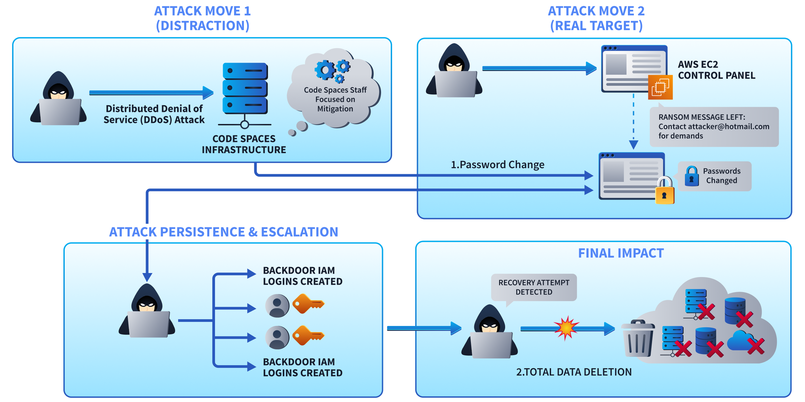

---

# Understanding IAM Policy Evaluation

Before auditing permissions, it is important to understand how AWS evaluates IAM policies.

AWS follows this evaluation order:

| Priority | Decision |
|---|---|
| 1 | Explicit Deny |
| 2 | Explicit Allow |
| 3 | Implicit Deny |

An explicit deny always overrides an allow. If no policy grants access, AWS applies an implicit deny.

---

# Identifying IAM Users

The first step in an IAM audit is understanding the existing identities. Let's see how to detect and fix these misconfigurations in an AWS IAM environment.

The AWS account ID is stored in a variable for easier command reuse.

```bash
ACCOUNT_ID=$(aws sts get-caller-identity --query Account --output text)

echo $ACCOUNT_ID
```

Next, let's list all IAM users:

```bash
aws iam list-users \
    --query "Users[*].[UserName,CreateDate]" \
    --output table
```

**Users**
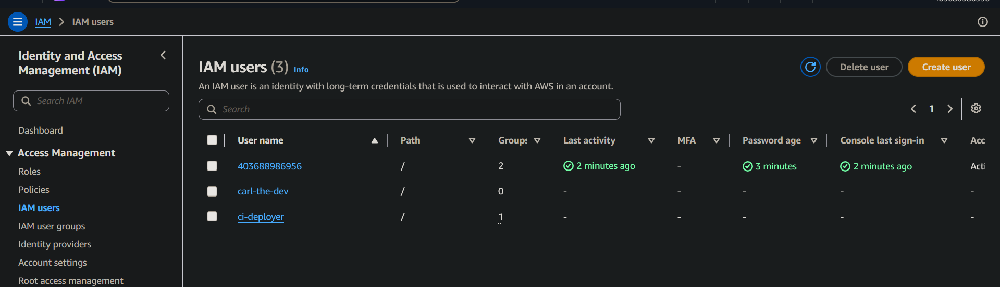

The user `carl-the-dev` stands out as the account requiring further investigation.

The first permission check is reviewing policies directly attached to Carl.

```bash
aws iam list-attached-user-policies \
    --user-name carl-the-dev
```

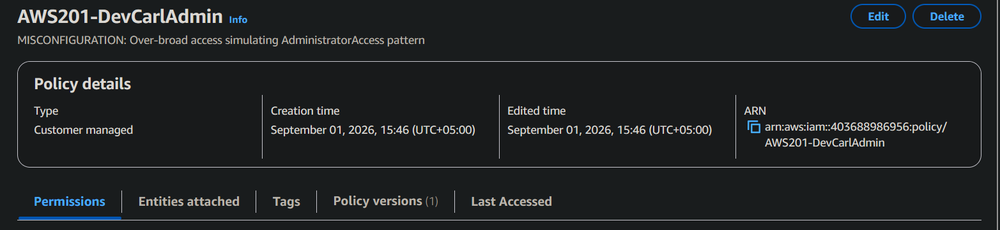

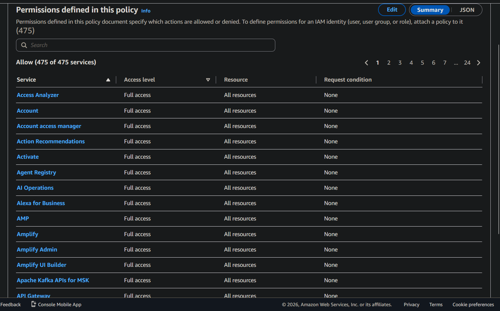

AWS CloudShell can be used to retrieve attached policies for further review.

```bash
aws iam get-policy-version \
    --policy-arn arn:aws:iam::${ACCOUNT_ID}:policy/AWS201-DevCarlAdmin \
    --version-id v1
```

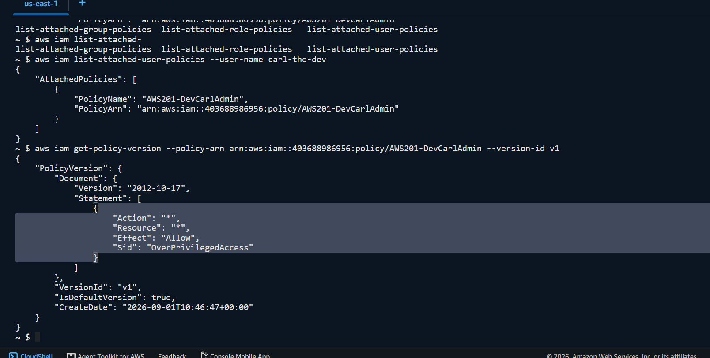

The policy contains:

```json
{
    "Action": "*",
    "Resource": "*",
    "Effect": "Allow"
}
```

This is the critical finding. The policy allows all actions and resources across all AWS services. The developer account effectively has administrator-level access.

---

# Checking Inline Policies

IAM permissions can also exist through inline policies. Unlike managed policies, inline policies are embedded directly into a single IAM identity. They maintain a strict one-to-one relationship with that identity and cannot be reused across other users, groups, or roles. This makes them useful for highly specific permissions, but they can also make permission management more difficult as an environment grows.

Let's check whether Carl has any inline policies attached.

```bash
aws iam list-user-policies \
    --user-name carl-the-dev
```

No inline policies are attached.

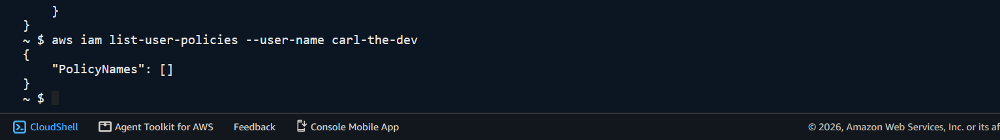


---

# Checking Group Membership

A secure IAM model normally assigns permissions through groups instead of individual users.

Let's check Carl's group membership:

```bash
aws iam list-groups-for-user \
    --user-name carl-the-dev
```

Result:
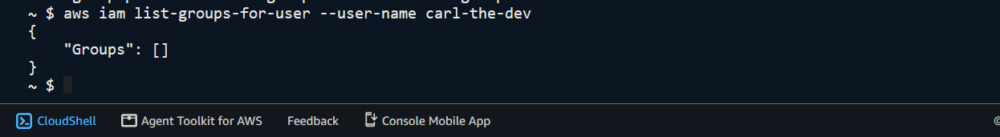

Carl has direct permissions attached to his user account. This makes permission management difficult because every user must be reviewed individually.

---

# Security Impact Assessment

With the current configuration, a compromised Carl account could:

| Capability | Impact |
|---|---|
| Delete S3 buckets | Data loss |
| Terminate EC2 instances | Service outage |
| Modify security groups | Network exposure |
| Delete CloudTrail logs | Reduced visibility |
| Access Secrets Manager | Credential exposure |
| Delete backups | Recovery failure |

The account has the same fundamental weakness seen in the Code Spaces incident:

`A single identity has excessive control over critical resources.`

---

# Remediation Strategy

With the excessive permissions identified, the next step is to bring Carl's access back in line with his actual responsibilities.

Carl is a developer and does not require unrestricted administrative access. His role requires the ability to read and list objects from the application S3 bucket, describe EC2 instances, and read CloudWatch Logs for debugging. Everything beyond those requirements represents unnecessary privilege.

The remediation process involves removing the administrator policy, replacing it with scoped permissions, assigning those permissions through a group, and validating the resulting access.

---

# Removing Excessive Permissions

The first step is to remove the administrator policy directly attached to Carl's account.

```bash
aws iam detach-user-policy \
    --user-name carl-the-dev \
    --policy-arn arn:aws:iam::${ACCOUNT_ID}:policy/AWS201-DevCarlAdmin
```
Using web UI
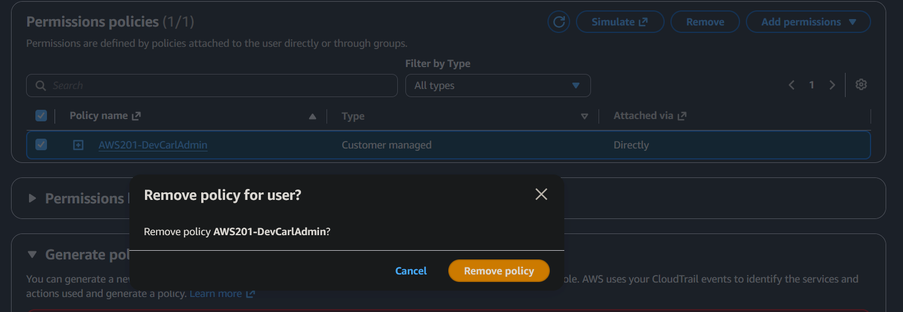

At this point, Carl has no permissions assigned to his account. Since there is no policy providing an explicit allow, AWS's policy evaluation results in an `Implicit Deny`.

This is preferable to leaving excessive permissions in place while designing the replacement access model.

---

# Implementing Group-Based Access

Rather than attaching the replacement policy directly to Carl, let's create a `Developers` group.

This separates the user's identity from the permissions associated with their job function and makes the model easier to manage as the environment grows.

```bash
aws iam create-group \
    --group-name Developers
```

Alternatively, AWS Web UI can be used for easier configuration.

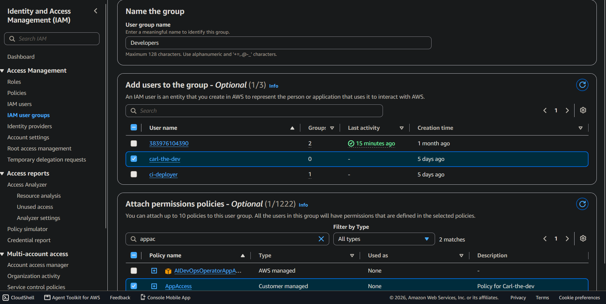

The scoped `AppAccess` policy is then attached to the group.

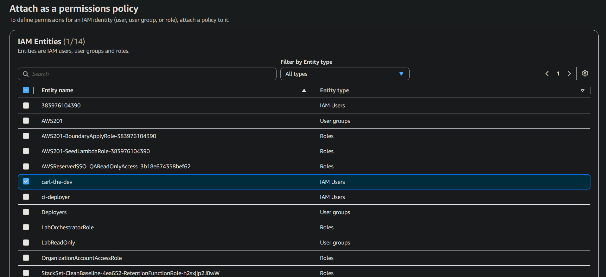

Next, let's add Carl to the group.

The change can be verified by checking Carl's group membership.

```bash
aws iam list-groups-for-user \
    --user-name carl-the-dev
```

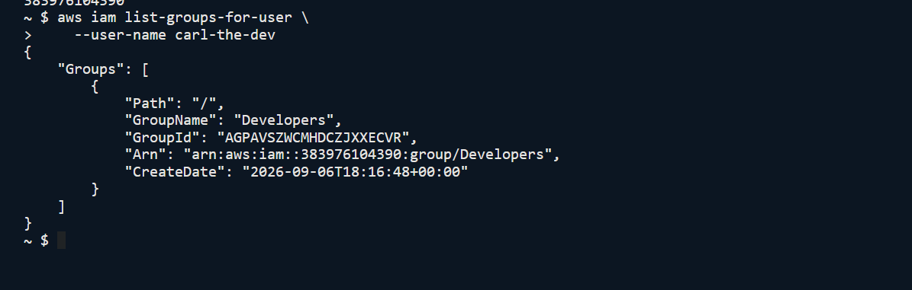

Carl now inherits his permissions through the `Developers` group rather than having them individually attached to his user account.

This approach makes future access management considerably simpler. A new developer can be given the same access by adding them to the group, while removing a developer from the group removes the associated permissions without requiring individual policy management.

---

# Validating Permissions with IAM Policy Simulator

Removing excessive access is only half of the remediation. The replacement policy must also be tested to ensure required operations continue working while unnecessary operations remain blocked.

AWS IAM Policy Simulator provides a way to evaluate specific actions against a policy before relying on the resulting configuration.

Let's simulate the required S3 operations against the application bucket.

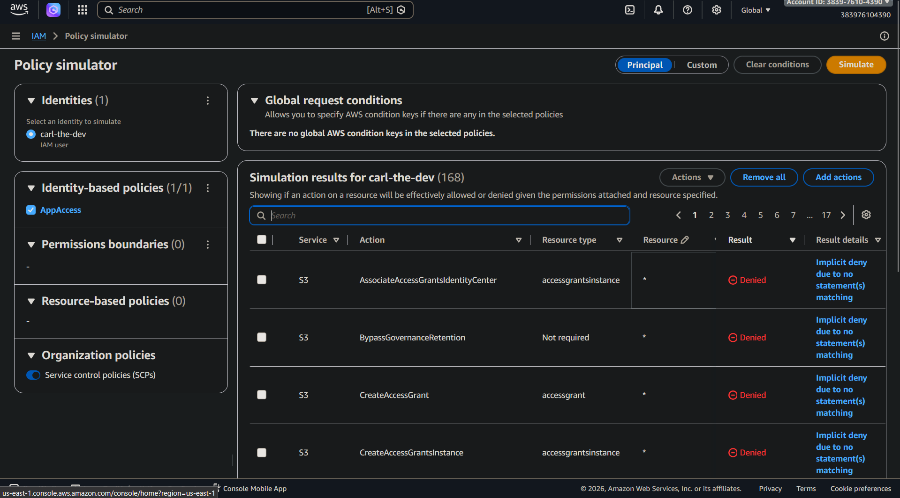

```bash
aws iam simulate-custom-policy \
    --policy-input-list "$POLICY_DOC" \
    --action-names "s3:ListBucket" "s3:GetObject" \
    --resource-arns "arn:aws:s3:::thm-app-data-${ACCOUNT_ID}" \
    --query "EvaluationResults[*].[EvalActionName,EvalDecision]" \
    --output table
```

The simulator confirms that both required actions are allowed:

| Action | Decision |
|---|---|
| `s3:ListBucket` | Allowed |
| `s3:GetObject` | Allowed |

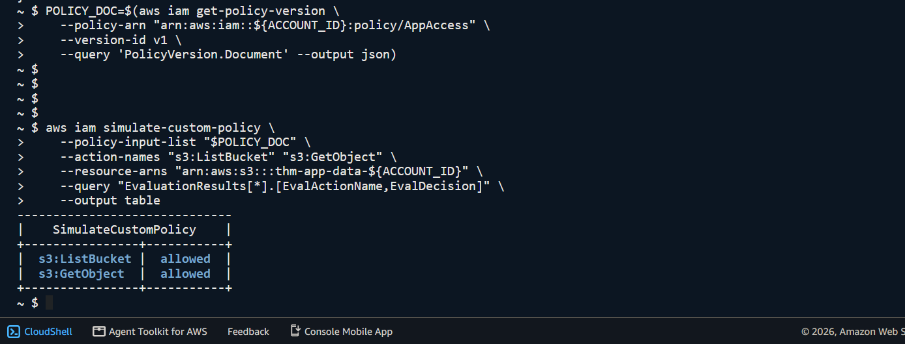

Now, let's test an action that Carl should not have, `s3:DeleteBucket`.


Result:

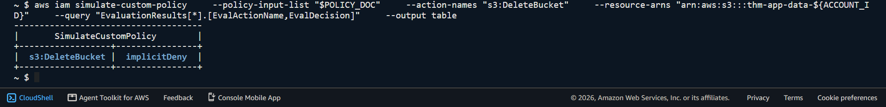

This is the expected behaviour of a least-privilege policy. Carl can perform the S3 operations required for his role, while destructive actions outside that role remain unavailable.

---

# Building a Secure IAM Deployment Model

The remediation addresses the immediate issue, but a secure IAM design should also make similar mistakes less likely in the future.

Three principles form the foundation of the model implemented here: group-based permissions, least privilege, and permission boundaries.

## Group-Based Permission Model

Permissions should be assigned to groups according to job function rather than being attached individually to users.

A developer belongs to the `Developers` group and inherits the permissions associated with that role.

```
Developers Group
        |
        |
   Carl User
```

This model becomes particularly valuable as an organisation grows. When another developer joins the team, their access can be provisioned by adding them to the appropriate group. If their role changes or their access needs to be revoked, the group membership can be changed without manually modifying multiple policies attached to individual users.

---

## Least-Privilege Policies

Group-based access alone does not make an IAM configuration secure. The policy attached to the group must also be appropriately scoped.

The principle of least privilege requires permissions to be specific about both the actions an identity can perform and the resources on which those actions can be performed.

For example, a policy that allows:

```json
{
    "Action": [
        "s3:GetObject",
        "s3:PutObject",
        "s3:ListBucket"
    ],
    "Resource": [
        "specific application bucket"
    ]
}
```

is fundamentally different from granting:

```json
{
    "Action": "*",
    "Resource": "*"
}
```

The first defines a narrow set of capabilities around a specific application resource. The second removes the security boundary between the user and the AWS account.

Least privilege is therefore not simply about reducing permissions. It is about ensuring every permission has a clear purpose and scope.

---

# Permission Boundaries

Least privilege significantly reduces risk, but an additional safeguard is useful for identities whose permissions may be modified by administrators or automation.

A permission boundary defines the maximum permissions an IAM identity can have. It acts as a guardrail, limiting the permissions that can ultimately become effective even when another policy attempts to grant broader access.

Let's create a permission boundary for Carl.

```bash
aws iam create-policy \
    --policy-name CarlBoundary
```

Alternatively, this can be configured using the AWS Web UI.

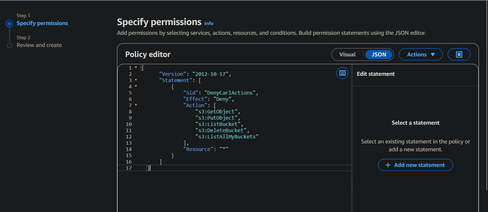

Now, apply the boundary to Carl's IAM user.

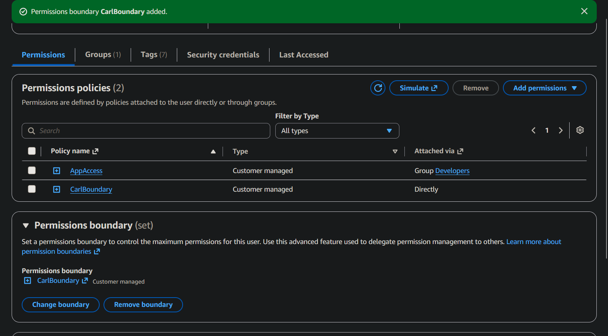

The configuration can then be verified.

The permissions boundary provides another layer of protection around the identity. Even if a more permissive policy is later attached, the boundary prevents the identity from exceeding its defined permission ceiling.

---

# Final Thoughts

The original problem was not simply that Carl had "too many permissions". The underlying issue was that administrative access had been used as a shortcut for a developer's access requirements.

The remediation replaced that shortcut with a structured IAM model. Carl's permissions are now inherited through a dedicated developer group, the policy is scoped around the resources and actions his role actually requires, and a permission boundary provides an additional guardrail around the identity.

The broader lesson is straightforward: IAM permissions should be designed around what an identity needs to accomplish, not around what would be convenient to grant.

A developer who needs to read application data should not automatically have the ability to delete the infrastructure hosting it.

---

> QXV0aG9yOiBodHRwczovL2dpdGh1Yi5jb20vaGFzaC01NDU=