> /AWSDefence/NACL Vulnerability Eradication

# NACL Vulnerability: When NACLs Trusts Everyone

Security groups are configured on every instance. Ports are restricted. Backend access is limited. The web server only exposes what it needs.

Everything looks secure.

Except nobody checked the subnet boundary.

Behind every instance firewall sits another layer of defense: the Network Access Control List (NACL). It operates at the subnet level, controlling traffic before it ever reaches an instance.

But in many AWS environments, NACLs are forgotten. The default configuration remains untouched, silently allowing everything in and everything out.

The result?

A security group mistake becomes a subnet-wide problem.

A compromised workload can move laterally across the network, while unnecessary outbound communication remains unrestricted. The network perimeter becomes nothing more than an empty gate with a security guard who never arrived.

AWS creates a default NACL for every VPC. It is designed to provide immediate connectivity, allowing all inbound and outbound traffic by default. While this makes initial deployments easier, it offers no meaningful protection in a production environment where subnet-level filtering is required.

Unlike security groups, NACLs are `stateless`. They do not remember previously allowed connections, meaning return traffic must be explicitly permitted. If a client connects to a server, the response traffic must also match an outbound rule. This is why ephemeral ports are commonly included when designing NACL rules.

NACLs also process rules in numerical order, and the first matching rule determines the outcome. A broad allow rule placed at priority 100 will always take precedence over a deny rule placed later at priority 200. The deny rule exists, but it will never see the traffic.

In this investigation, we will examine an AWS two-tier architecture where security groups appear correctly configured, but both subnets are still relying on the default allow-all NACL. We will uncover the missing security layer, replace it with properly scoped subnet controls, and verify that the network boundary is finally enforcing the protection it was designed to provide.


---

# ScarletEel 2023

In February 2023, the Sysdig Threat Research Team discovered a cloud attack campaign they named SCARLETEEL.

The target environment was running workloads on AWS using a self-managed Kubernetes cluster. The infrastructure contained valuable engineering data, including proprietary source code and information stored inside Amazon S3.

The attack did not depend on a single failure.

Instead, attackers chained several weaknesses together.

The first step was compromising a publicly accessible application running inside a Kubernetes pod. After gaining access, attackers deployed XMRig cryptocurrency mining software. The miner acted as a distraction while the real objective happened quietly in the background.

From the compromised container, attackers accessed the EC2 Instance Metadata Service (IMDSv1). Because metadata access was not properly restricted, the container was able to retrieve credentials belonging to the underlying EC2 instance role.

Those credentials transformed a container compromise into an AWS account compromise.

Attackers used the stolen credentials to enumerate cloud resources, discovering EC2 instances, Lambda functions, and S3 buckets.

The intrusion expanded further when attackers discovered Terraform state files containing plaintext IAM credentials for another AWS account. Those credentials allowed them to move across account boundaries.

Finally, attackers accessed sensitive data and disabled CloudTrail logging in an attempt to hide their activity.

The attack chain looked like this:


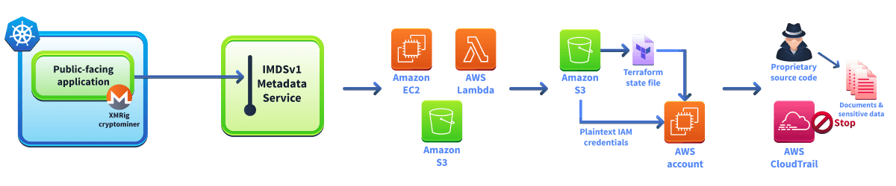

Several security failures enabled the attack:

- Default NACLs provided no subnet-level filtering.
- IMDSv1 allowed workloads to retrieve instance credentials.
- Sensitive credentials were stored inside Terraform state files.
- Outbound traffic controls were missing.

A properly designed subnet boundary would not have stopped the entire attack alone. Security is rarely one magical shield. But it could have reduced the attacker's freedom of movement.

Every blocked path is another door an attacker has to break.

---

# Let's Inspect The Forgotten Boundary

The environment contains a simple two-tier architecture:

```text

Internet

    |
    |

Web Server
(Public Subnet)

    |
    |


Backend Application
(Private Subnet)

```

The web server is expected to communicate with the backend application. 

The backend should not communicate directly with the internet.

Security groups are already configured.

Our question is different:

Does the subnet itself provide another layer of defense?

Before making changes, we connect to the AWS environment and identify the resources.

First, we store the VPC ID and web server instance ID.

```bash
VPC_ID=$(aws ec2 describe-vpcs \
  --filters "Name=tag:Name,Values=room33-vpc" \
  --query "Vpcs[0].VpcId" --output text)

INSTANCE_ID=$(aws ec2 describe-instances \
  --filters "Name=tag:Name,Values=room33-web-server" "Name=instance-state-name,Values=running" \
  --query "Reservations[0].Instances[0].InstanceId" --output text)

echo "VPC: $VPC_ID | Web Server: $INSTANCE_ID"
```

These variables will be reused throughout the investigation.

The environment contains:
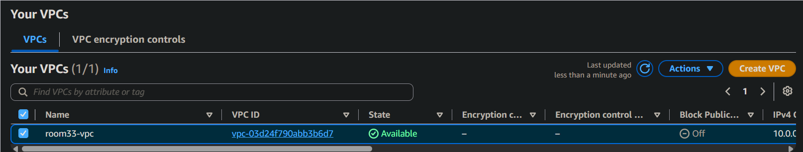
```
VPC: vpc-07ed7cbdafcea302b
Web Server: i-0c3e7a28a0a9348c
```

## Mapping The Network Layout

Before inspecting security controls, we need to understand the subnet structure.

```bash
aws ec2 describe-subnets \
    --filters "Name=vpc-id,Values=$VPC_ID" \
    --query "Subnets[*].{Name:Tags[?Key=='Name']|[0].Value,CIDR:CidrBlock,SubnetId:SubnetId}" \
    --output table
```

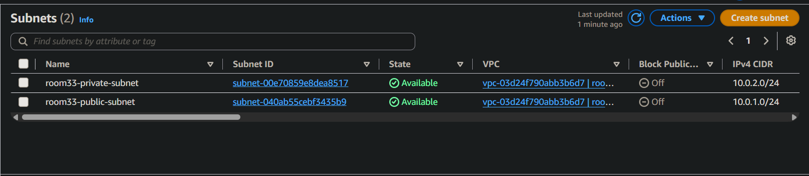

The output reveals two subnets. The architecture looks correct.

A public subnet exists for the web server.

A private subnet exists for the backend.

Now we check whether the subnet security layer actually exists.


## Finding The Forgotten Firewall

The subnet layout looks correct. The names suggest proper separation:

- `room33-public-subnet` for internet-facing services.
- `room33-private-subnet` for internal workloads.

But subnet names do not enforce security.

AWS does not know that a subnet called "private" should be private. It only follows the controls attached to it. The next step is checking the Network Access Control Lists.

```bash
aws ec2 describe-network-acls \
  --filters "Name=vpc-id,Values=$VPC_ID" \
  --query "NetworkAcls[*].{ID:NetworkAclId,IsDefault:IsDefault,Subnets:length(Associations),InboundRules:Entries[?Egress].{Rule:RuleNumber,Action:RuleAction,CIDR:CidrBlock},OutboundRules:Entries[?Egress].{Rule:RuleNumber,Action:RuleAction,CIDR:CidrBlock}}" \
  --output json
```

**Network ACL**
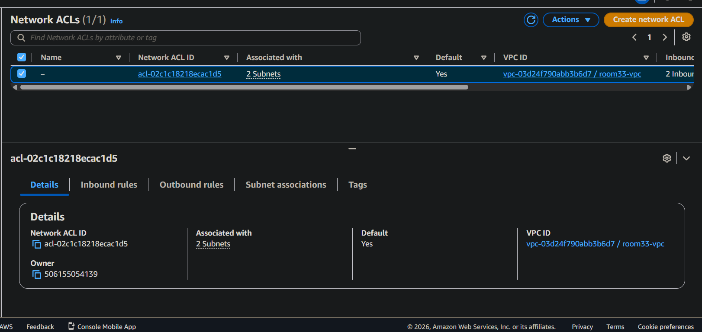


**ACL Inbound Rules**
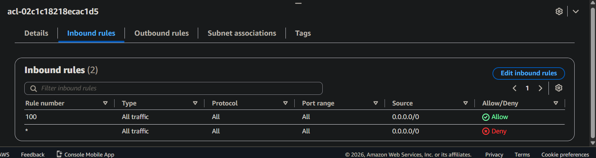


The output reveals the problem.

```json
{
    "IsDefault": true,
    "Subnets": [
        "room33-public-subnet",
        "room33-private-subnet"
    ],
    "InboundRules": [
        {
            "Rule": 100,
            "Action": "allow",
            "CIDR": "0.0.0.0/0"
        }
    ]
}
```

The entire VPC is using the default NACL.

The default NACL is doing exactly what AWS designed it to do: 
`Nothing`.

> Rule 100 allows all traffic from anywhere.

The implicit deny rule exists, but it is unreachable. Because NACLs process rules in order, the allow-all rule catches every packet before the deny rule gets a chance. The subnet boundary is effectively an open gate.

## Comparing The Instance Firewall

At first glance, the environment appears secure because security groups are correctly configured.

Let's verify them.

```bash
aws ec2 describe-security-groups \
    --filters "Name=vpc-id,Values=$VPC_ID" \
    --query "SecurityGroups[*].{Name:GroupName,Ingress:IpPermissions[*].{Port:FromPort,Source:IpRanges[0].CidrIp}}" \
    --output json
```

**Backend SG:**
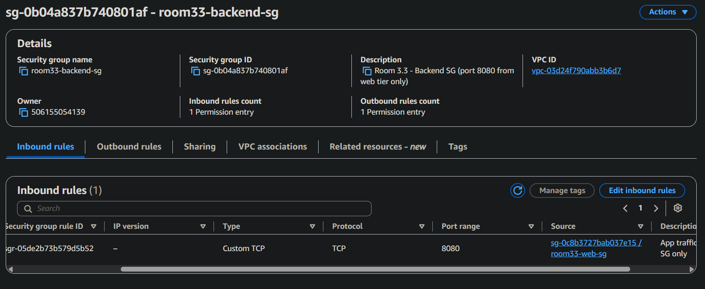


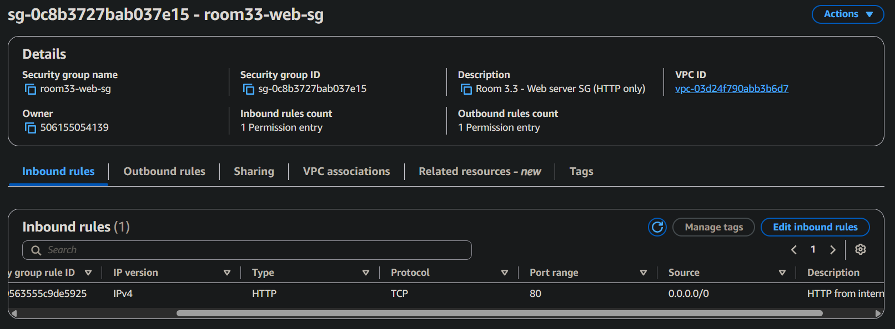

The security groups are doing their job. The backend only accepts traffic from the web server. The web server only exposes required services. But there is an important difference:

Security groups protect individual instances. NACLs protect entire subnets.

If a security group rule is accidentally changed from:

```
Allow TCP 8080 from Web Server SG
```

to:

```
Allow TCP 8080 from 0.0.0.0/0
```

the subnet has no second layer to stop it. Defense-in-depth has collapsed into a single checkpoint.

## The Difference Between A Security Group And A NACL

Think of the security group as the lock on a specific apartment door.

The NACL is the security checkpoint at the building entrance.

A strong door is useful.

But if the building entrance allows everyone inside, the overall security posture becomes weaker.

The important differences:

| Security Group                       | NACL                                      |
| ------------------------------------ | ----------------------------------------- |
| Instance level                       | Subnet level                              |
| Stateful                             | Stateless                                 |
| Allows only                          | Allows and denies                         |
| Return traffic automatically allowed | Return traffic must be explicitly allowed |
| Evaluates all rules together         | First matching rule wins                  |

Both layers work together. Security groups decide, "Can this specific instance receive this traffic?" NACLs decide, "Should this traffic even enter this subnet?"

Right now, the answer from the subnet layer is: "Everything may enter."

---

## The Damage Report

The investigation uncovered a missing security layer. The public subnet and private subnet were both attached to the default AWS NACL.

This created several problems:

* The subnet boundary provided no filtering.
* Any security group mistake would immediately expose resources.
* Lateral movement inside the VPC had no subnet-level restrictions.
* Outbound communication from compromised workloads was unrestricted.

The issue was not that security groups were wrong. The issue was that they were the only thing standing between an attacker and the network. A good security architecture assumes that one control will eventually fail.

The question is, "What stops the attacker after that?"

In this environment, nothing.

# Building The Missing Wall

The remediation plan is straightforward:

1. Create a dedicated NACL for the public subnet.
2. Allow only required web traffic.
3. Create a dedicated NACL for the private subnet.
4. Allow backend communication only from trusted sources.
5. Replace the default NACL associations.
6. Verify the new subnet boundaries.

The goal is not blocking everything.

The goal is creating intentional traffic paths.

---

## Creating A Public Subnet Boundary

The web server needs to remain accessible from the internet.

The public NACL must allow:

* HTTP traffic.
* HTTPS traffic.
* Ephemeral return traffic.
* Backend communication from the web tier.


Following tasks can be done either through CLI or AWS GUI. We'll use combination of both. You may pick whatever method you like.

First, create a dedicated NACL.

```bash
PUBLIC_NACL_ID=$(aws ec2 create-network-acl \
  --vpc-id $VPC_ID \
  --tag-specifications 'ResourceType=network-acl,Tags=[{Key=Name,Value=room33-public-nacl}]' \
  --query "NetworkAcl.NetworkAclId" --output text)

echo "Public NACL: $PUBLIC_NACL_ID"
```

The new NACL creates a clean security boundary separate from the default configuration.

## Allowing Web Traffic In

HTTP and HTTPS are the only internet-facing services required.

```bash
aws ec2 create-network-acl-entry \
    --network-acl-id $PUBLIC_NACL_ID \
    --rule-number 100 \
    --protocol tcp \
    --port-range From=80,To=80 \
    --cidr-block 0.0.0.0/0 \
    --rule-action allow \
    --ingress
```

```bash
aws ec2 create-network-acl-entry \
    --network-acl-id $PUBLIC_NACL_ID \
    --rule-number 110 \
    --protocol tcp \
    --port-range From=443,To=443 \
    --cidr-block 0.0.0.0/0 \
    --rule-action allow \
    --ingress
```

Because NACLs are stateless, response traffic must also be allowed.

Ephemeral ports are used by clients when receiving return traffic from servers.

```bash
aws ec2 create-network-acl-entry \
    --network-acl-id $PUBLIC_NACL_ID \
    --rule-number 200 \
    --protocol tcp \
    --port-range From=1024,To=65535 \
    --cidr-block 0.0.0.0/0 \
    --rule-action allow \
    --ingress
```

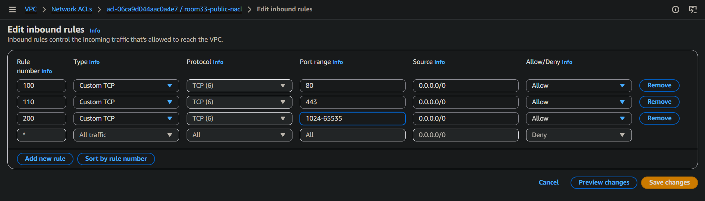
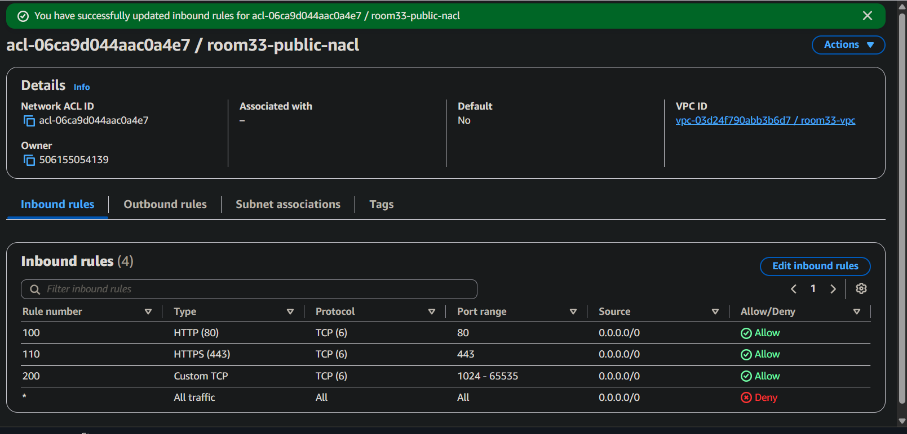


## Allowing Public Subnet Responses

Inbound traffic is only half the conversation. Because NACLs are stateless, the subnet does not automatically understand that outbound traffic is a response to an allowed inbound connection.

Return traffic must be explicitly permitted.

The web server needs to send:

- HTTP responses back to users.
- HTTPS responses back to users.
- Requests to the backend application.

First, allow outbound web traffic.

```bash
aws ec2 create-network-acl-entry \
  --network-acl-id $PUBLIC_NACL_ID \
  --rule-number 100 \
  --protocol tcp \
  --port-range From=80,To=80 \
  --cidr-block 0.0.0.0/0 \
  --rule-action allow \
  --egress

aws ec2 create-network-acl-entry \
  --network-acl-id $PUBLIC_NACL_ID \
  --rule-number 110 \
  --protocol tcp \
  --port-range From=443,To=443 \
  --cidr-block 0.0.0.0/0 \
  --rule-action allow \
  --egress
```

The web server also needs to communicate with the backend application. That traffic should never leave the VPC.

It should only travel from the public subnet to the private subnet on the application port.

```bash
aws ec2 create-network-acl-entry \
  --network-acl-id $PUBLIC_NACL_ID \
  --rule-number 120 \
  --protocol tcp \
  --port-range From=8080,To=8080 \
  --cidr-block 10.0.2.0/24 \
  --rule-action allow \
  --egress
```

Finally, allow outbound ephemeral traffic.

```bash
aws ec2 create-network-acl-entry \
  --network-acl-id $PUBLIC_NACL_ID \
  --rule-number 200 \
  --protocol tcp \
  --port-range From=1024,To=65535 \
  --cidr-block 0.0.0.0/0 \
  --rule-action allow \
  --egress
```

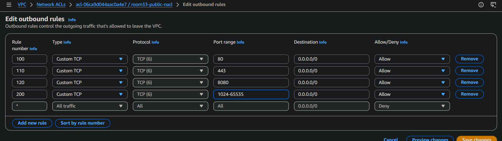

The public subnet now has a defined purpose. It can serve the internet. It can communicate with the backend. It cannot silently become a path for unrelated traffic.

## Moving The Public Subnet Away From The Default NACL

Creating the NACL does not activate it.

The subnet is still attached to the default NACL. We replace that association.

First, identify the public subnet.

```bash
PUB_SUBNET_ID=$(aws ec2 describe-subnets \
    --filters "Name=tag:Name,Values=room33-public-subnet" "Name=vpc-id,Values=$VPC_ID" \
    --query "Subnets[0].SubnetId" \
    --output text)
```

Now find the current NACL association.

```bash
PUB_ASSOC_ID=$(aws ec2 describe-network-acls \
    --filters "Name=vpc-id,Values=$VPC_ID" "Name=default,Values=true" \
    --query "NetworkAcls[0].Associations[?SubnetId=='$PUB_SUBNET_ID'].NetworkAclAssociationId" \
    --output text)
```

Replace it with the new public NACL.

```bash
aws ec2 replace-network-acl-association \
    --association-id $PUB_ASSOC_ID \
    --network-acl-id $PUBLIC_NACL_ID
```

The public subnet now has its own security boundary.

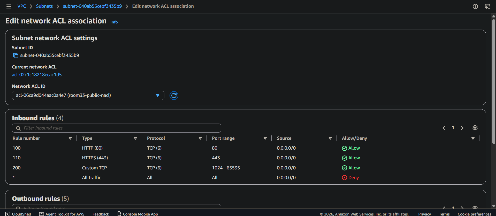

The default NACL is no longer responsible for protecting internet-facing resources.

---

## Creating A Private Subnet Boundary

The private subnet has a different job. The backend application should never accept direct internet traffic. It should only communicate with the web server and trusted internal services.

Create a dedicated private NACL.

```bash
PRIVATE_NACL_ID=$(aws ec2 create-network-acl \
  --vpc-id $VPC_ID \
  --tag-specifications 'ResourceType=network-acl,Tags=[{Key=Name,Value=room33-private-nacl}]' \
  --query "NetworkAcl.NetworkAclId" \
  --output text)

echo "Private NACL: $PRIVATE_NACL_ID"
```

## Locking Down Backend Access

The backend only needs one inbound application path:

```
Web Server
    |
    |
TCP 8080
    |
    ↓
Backend Application
```

Allow only the public subnet.

```bash
aws ec2 create-network-acl-entry \
    --network-acl-id $PRIVATE_NACL_ID \
    --rule-number 100 \
    --protocol tcp \
    --port-range From=8080,To=8080 \
    --cidr-block 10.0.1.0/24 \
    --rule-action allow \
    --ingress
```

The backend also needs return traffic.

Because the NACL is stateless, responses leaving the backend must be explicitly allowed.

```bash
aws ec2 create-network-acl-entry \
    --network-acl-id $PRIVATE_NACL_ID \
    --rule-number 200 \
    --protocol tcp \
    --port-range From=1024,To=65535 \
    --cidr-block 10.0.0.0/16 \
    --rule-action allow \
    --ingress
```

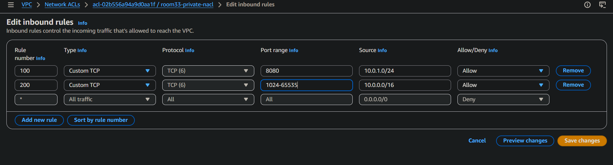

There should be no:

```
0.0.0.0/0
```

The internet has no direct entrance into the backend subnet.

## Controlling Private Subnet Outbound Traffic

Outbound rules are equally important.

A compromised backend server should not have unlimited freedom to communicate externally.

Allow responses back to the web subnet.

```bash
aws ec2 create-network-acl-entry \
  --network-acl-id $PRIVATE_NACL_ID \
  --rule-number 100 \
  --protocol tcp \
  --port-range From=1024,To=65535 \
  --cidr-block 10.0.1.0/24 \
  --rule-action allow \
  --egress
```

Allow required internal HTTPS communication.

```bash
aws ec2 create-network-acl-entry \
  --network-acl-id $PRIVATE_NACL_ID \
  --rule-number 110 \
  --protocol tcp \
  --port-range From=443,To=443 \
  --cidr-block 10.0.0.0/16 \
  --rule-action allow \
  --egress
```

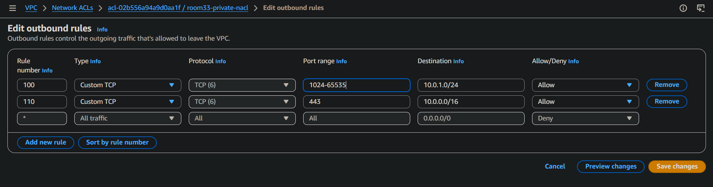

The private subnet now has a clear identity:

Internal workloads only.

No accidental internet exposure.

No unrestricted communication paths.

---

## Replacing The Private Subnet Association

Like the public subnet, the private subnet is still using the default NACL until the association changes.

Find the subnet.

```bash
PRIV_SUBNET_ID=$(aws ec2 describe-subnets \
    --filters "Name=tag:Name,Values=room33-private-subnet" "Name=vpc-id,Values=$VPC_ID" \
    --query "Subnets[0].SubnetId" \
    --output text)
```

Find its current association.

```bash
PRIV_ASSOC_ID=$(aws ec2 describe-network-acls \
    --filters "Name=vpc-id,Values=$VPC_ID" "Name=default,Values=true" \
    --query "NetworkAcls[0].Associations[?SubnetId=='$PRIV_SUBNET_ID'].NetworkAclAssociationId" \
    --output text)
```

Replace it.

```bash
aws ec2 replace-network-acl-association \
    --association-id $PRIV_ASSOC_ID \
    --network-acl-id $PRIVATE_NACL_ID
```

**Private NACL association to private subnet**
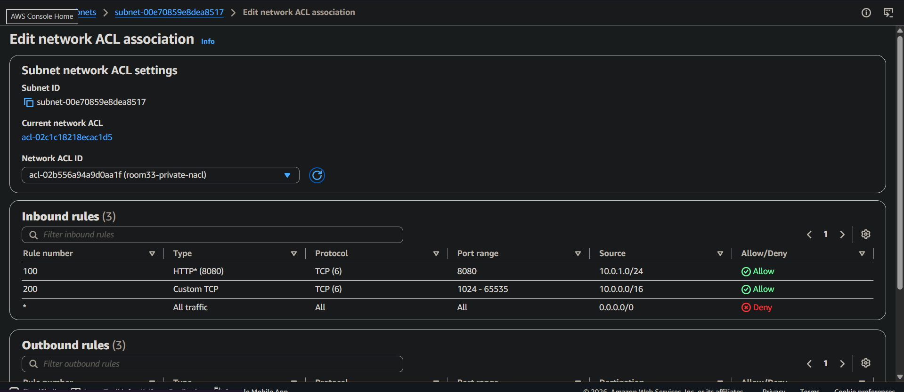

The backend subnet now has a real perimeter. The default NACL is no longer part of the traffic path.


# Verifying The New Network Boundary

A security control is only useful if it actually changes the environment.

The new NACLs have been created and associated with their subnets, but we need to verify that AWS is using them. First, confirm the web server is still reachable. The public subnet should continue serving HTTP traffic because that is its intended purpose.

Retrieve the public IP address:

```bash
WEB_IP=$(aws ec2 describe-instances \
  --filters "Name=tag:Name,Values=room33-web-server" "Name=instance-state-name,Values=running" \
  --query "Reservations[0].Instances[0].PublicIpAddress" \
  --output text)
```

Test the web service:

```bash
curl -s --connect-timeout 5 http://$WEB_IP | head -3
```

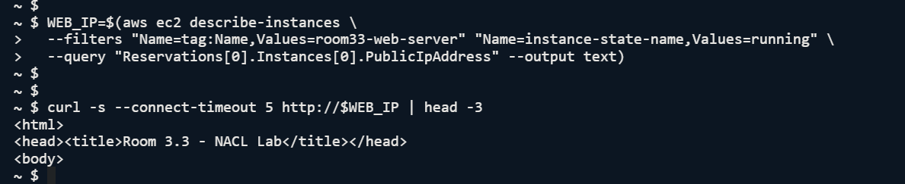


The response confirms the public subnet still functions:

```html
<html>
<head><title>Room 3.3 - NACL Lab</title></head>
<body>
```

The goal was never to block everything. The goal was controlled communication.

The web server remains available to users while unnecessary paths have been removed.

## Checking The Subnet Assignments

Now verify that both subnets are using custom NACLs.

```bash
aws ec2 describe-network-acls \
    --filters "Name=vpc-id,Values=$VPC_ID" \
    --query "NetworkAcls[*].{Name:Tags[?Key=='Name']|[0].Value,IsDefault:IsDefault,Subnets:length(Associations)}" \
    --output table
```

**Default NACL is not being used by any subnet**

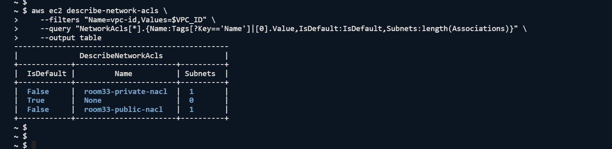

The default NACL still exists. AWS keeps it because every VPC must have one. But it no longer protects any subnet.

The important change is:

```
Before:

Public Subnet  ─┐
                |
                ↓
          Default NACL
                ↑
                |
Private Subnet ─┘


After:

Public Subnet
      |
      ↓
Public NACL


Private Subnet
      |
      ↓
Private NACL
```

Each subnet now has a security boundary designed for its role. The subnet boundary is no longer relying on AWS's default open configuration.

---

# Building The Firewall Before The Fire Starts

NACL problems are usually not caused by a lack of technical ability. More often, they happen because network controls are treated as something to configure later instead of being part of the initial architecture.

A secure VPC design begins with a simple question: what actually needs internet access?

Only internet-facing services should exist in public subnets. Web servers, load balancers, and controlled entry points may require direct connectivity to the internet. Application servers, databases, and internal services usually do not need to be exposed and should remain inside private subnets.

The next question is: what communication paths should exist between subnets?

Every connection should have a clear purpose. A web server communicating with a backend API on a specific application port is intentional. Unrestricted communication between every subnet is not.

Network rules should be built around required traffic flows, not around allowing everything and hoping another control catches the mistake.

In this architecture:

```
Web Server
    |
    |
TCP 8080
    |
    ↓
Backend Application
```

The NACL rules should reflect this design.

Not:

```
Everything
    |
    ↓
Everything
```

**What outbound traffic should private workloads have?**

A private instance that requires internet access should use a NAT Gateway. It should not receive a direct route through an Internet Gateway. Outbound restrictions are especially important because compromised systems often attempt to:

* Contact command-and-control infrastructure.
* Upload stolen data.
* Download additional tools.

A restricted outbound boundary limits what happens after compromise.

## The Final Security Model

A properly designed AWS network uses multiple layers:

```
Internet

   |
   ↓

Public NACL
   |
   ↓

Security Group

   |
   ↓

Web Server

   |
   ↓

Private NACL

   |
   ↓

Security Group

   |
   ↓

Backend Application
```

Each layer has a purpose. Security groups provide fine-grained instance protection. NACLs provide subnet-level boundaries.

Neither replaces the other.

A security group mistake should not become a subnet-wide disaster. A compromised instance should not have unlimited freedom to communicate.Defense-in-depth works because every layer assumes another layer might eventually fail.

The default NACL is convenient. But convenience is not security.

A subnet is not protected because AWS created it. A subnet is protected because someone deliberately designed the boundary.

---

> QXV0aG9yOiBodHRwczovL2dpdGh1Yi5jb20vaGFzaC01NDU=

