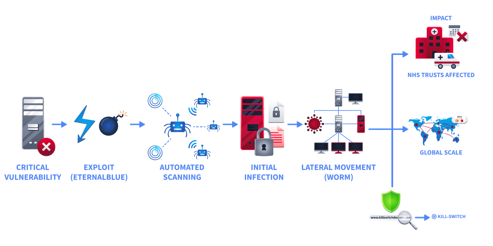
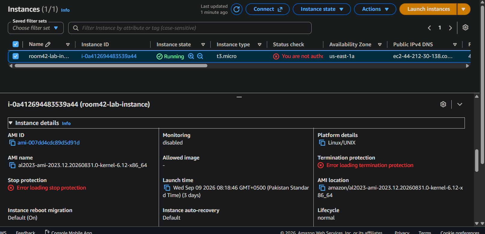
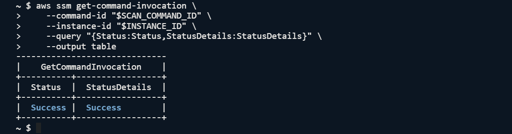
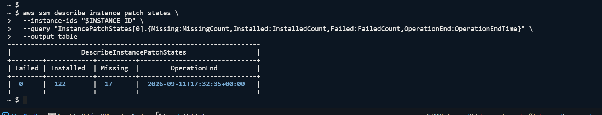
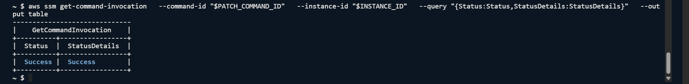
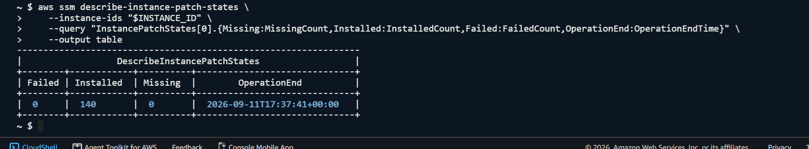
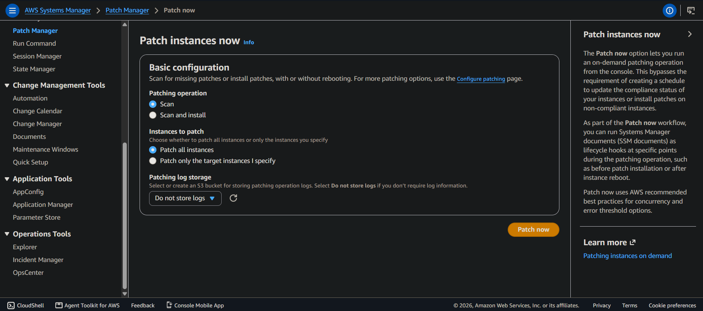

> /AWSDefence/Patching Instance

# Patching Insecure Instance

An engineer launches an EC2 instance from an AMI that was created two years ago. The application works. Users are happy. Nothing appears broken.

So the instance quietly becomes part of the infrastructure furniture.

Months pass. New vulnerabilities are discovered. Operating system packages age. Security advisories pile up. But nobody has a maintenance process, nobody checks patch compliance, and nobody remembers that this machine was born from an outdated image.

This is how patch debt forms.

The problem is rarely that organizations lack patching tools. AWS provides Systems Manager Patch Manager, Run Command, and automated image pipelines specifically to make patching repeatable and measurable.

The difficult part is creating a process that prevents vulnerable systems from becoming permanent residents inside the environment.

An unpatched instance is not just an outdated server. It is a potential entry point waiting for someone to discover the forgotten door.

In this investigation, we will examine an EC2 instance running inside AWS, determine its current patch state, measure the security debt it has accumulated, and remediate it using Systems Manager.

However, patching one instance only fixes today's problem.

A mature cloud security strategy also ensures that tomorrow's instances are not launched with yesterday's vulnerabilities. That requires defined patch baselines and hardened golden AMIs.

# NHS 2017

In 2017, the world watched what happens when patch management fails at scale.

The UK's National Health Service (NHS) operated one of the largest technology environments in the world, supporting hospitals, clinics, and healthcare services across the country.

Many systems still relied on SMBv1, an outdated file-sharing protocol. In March 2017, Microsoft released `MS17-010`, a critical security update addressing a remote code execution vulnerability in `SMBv1`.

The patch was publicly available. The vulnerability was documented. The fix existed.

The problem was not discovery. The problem was deployment.

Attackers later weaponized the vulnerability through EternalBlue, an exploit originally developed by the NSA and leaked by the Shadow Brokers group. WannaCry incorporated the exploit into ransomware that could automatically spread between vulnerable systems without requiring user interaction.

On 12 May 2017, `WannaCry` began scanning networks for systems exposing SMB over TCP port 445. Any machine missing the security update became a potential entry point.

After exploitation, the malware encrypted files, displayed ransom demands, and continued searching for additional vulnerable hosts. Because many internal networks lacked sufficient segmentation, the infection moved rapidly from one system to another.

The NHS impact was severe. Around 80 NHS trusts were affected, approximately `19,000 appointments` were canceled, and some hospitals were forced to revert to manual processes while systems were recovered.

The outbreak eventually affected more than 200,000 systems across 150 countries.

The incident was not caused by an unknown vulnerability. It was caused by known security updates not being applied.



Several failures combined to turn one vulnerability into a global incident.

There was no reliable patch process ensuring critical updates reached systems within a defined timeframe. The SMBv1 protocol remained enabled despite being outdated and unnecessary in many environments. Flat networks allowed infected systems to communicate freely with other vulnerable machines, increasing the damage.

Most importantly, organizations lacked accurate visibility into their infrastructure. Systems that nobody actively managed became systems nobody knew were vulnerable.

A forgotten server is not harmless. It is simply a vulnerability waiting for a date.

# Investigating The Forgotten Instance

For this investigation, we are reviewing an EC2 instance that may have accumulated patch debt. The environment contains a running EC2 instance managed through AWS Systems Manager. Our goal is to answer a simple question:

Is this instance actually maintained, or has it been quietly collecting vulnerabilities?

First, we identify the AWS account and the target instance. These values will be reused throughout the investigation.

```bash
ACCOUNT_ID=$(aws sts get-caller-identity --query Account --output text)

INSTANCE_ID=$(aws ec2 describe-instances \
    --filters "Name=tag:Purpose,Values=room-42-lab" "Name=instance-state-name,Values=running" \
    --query "Reservations[0].Instances[0].InstanceId" \
    --output text)

echo "Account ID: $ACCOUNT_ID | Instance ID: $INSTANCE_ID"
```



Before checking patches, we need to confirm that Systems Manager can actually communicate with the instance.

Patch Manager depends on the SSM agent being installed and online. If the instance is invisible to Systems Manager, automated patching cannot reach it.

## Checking The Instance Connection

```bash
aws ssm describe-instance-information \
  --filters "Key=InstanceIds,Values=$INSTANCE_ID" \
  --query "InstanceInformationList[0].{Ping:PingStatus,Platform:PlatformName,Agent:AgentVersion}" \
  --output table
```


The instance is successfully registered with Systems Manager. The management channel works.

Now we need to find out what condition the operating system is actually in.

## Measuring The Patch Debt

Patch Manager does not know the current patch state until it performs a scan. The first scan creates a baseline of installed patches, missing updates, and failed installations.

We trigger a patch assessment using AWS-RunPatchBaseline in Scan mode.

```bash
SCAN_COMMAND_ID=$(aws ssm send-command \
    --instance-ids "$INSTANCE_ID" \
    --document-name AWS-RunPatchBaseline \
    --parameters Operation=Scan \
    --comment "Room 4.2 identification scan" \
    --query "Command.CommandId" \
    --output text)

echo $SCAN_COMMAND_ID
```

The command returns an identifier that allows us to monitor execution.

After waiting for the scan to complete, we check the result.

```bash
aws ssm get-command-invocation \
    --command-id "$SCAN_COMMAND_ID" \
    --instance-id "$INSTANCE_ID" \
    --query "{Status:Status,StatusDetails:StatusDetails}" \
    --output table
```



The scan completed successfully.

Now comes the important part: finding out how much patch debt exists.

```bash
aws ssm describe-instance-patch-states \
  --instance-ids "$INSTANCE_ID" \
  --query "InstancePatchStates[0].{Missing:MissingCount,Installed:InstalledCount,Failed:FailedCount,OperationEnd:OperationEndTime}" \
  --output table
```

**Patch status of the instance**


The instance is healthy from an availability perspective.

Security-wise, it is behind.

17 missing patches means the system has known updates waiting to be applied.

The machine is not broken. That is exactly why patch debt survives. A vulnerable system can look completely normal until someone tests the wrong door.

The investigation phase is complete & we have confirmed three important facts:

- The instance is managed through Systems Manager.
- The patch scanning process works correctly.
- The operating system contains missing security updates.

Now the question changes from, `"Is this instance vulnerable?"` to `"How do we remove the vulnerability and prevent it from returning?"`

# Closing The Patch Gap

A one-time patch operation improves the current state, but it does not create a maintenance process. If another EC2 instance is launched from the same outdated AMI tomorrow, it will start life with the same vulnerabilities.

The solution requires two layers:

- A repeatable patching process for running instances.
- A hardened image pipeline for future deployments.

For this remediation, we will use AWS Systems Manager Run Command with AWS-RunPatchBaseline. This managed document allows Systems Manager to execute patch installation operations against registered instances.

The workflow is simple:

1. Trigger the patch installation.
2. Monitor execution.
3. Confirm that missing patches have been removed.

## Applying The Missing Updates

First, we make sure the instance ID is available, then start the patch installation process.

```bash
INSTANCE_ID=$(aws ec2 describe-instances \
  --filters "Name=tag:Purpose,Values=room-42-lab" "Name=instance-state-name,Values=running" \
  --query "Reservations[0].Instances[0].InstanceId" \
  --output text)

PATCH_COMMAND_ID=$(aws ssm send-command \
    --instance-ids "$INSTANCE_ID" \
    --document-name AWS-RunPatchBaseline \
    --parameters Operation=Install \
    --comment "Room 4.2 remediation patch install" \
    --query "Command.CommandId" \
    --output text)

echo $PATCH_COMMAND_ID
```

The command ID acts as our tracking reference.

Patching is not instant. Depending on the number of updates and system condition, installation may take several minutes.

We monitor the execution status.


```bash
aws ssm get-command-invocation \
  --command-id "$PATCH_COMMAND_ID" \
  --instance-id "$INSTANCE_ID" \
  --query "{Status:Status,StatusDetails:StatusDetails}" \
  --output table
```


The patch operation completed successfully.

However, a successful command does not automatically mean the system is compliant. The final verification must come from the patch state itself.


We run the patch state check again.

```bash
aws ssm describe-instance-patch-states \
    --instance-ids "$INSTANCE_ID" \
    --query "InstancePatchStates[0].{Missing:MissingCount,Installed:InstalledCount,Failed:FailedCount,OperationEnd:OperationEndTime}" \
    --output table
```


The missing patch count has dropped from 17 to 0. The instance is now updated. But there is still a security lesson hiding here.

A patched server today does not guarantee a secure server tomorrow.

Without automation, patch debt simply begins growing again.

On the other hand, you can perform these actions from AWS web interface if you have appropriate authority over the system.




# Building A Future-Proof Patch Strategy

Manual remediation is reactive. A mature cloud environment treats patching as part of the deployment lifecycle. Before creating a patching strategy, security teams should define:

What operating systems exist in the environment?

Different platforms require different patch rules. A Linux fleet, Windows fleet, or mixed environment may need separate baselines.

Which updates should be applied?

Not every organization wants every update immediately. Security patches, bug fixes, and feature updates may follow different approval rules.

How quickly should updates be deployed?

Critical vulnerabilities may require immediate deployment, while lower-risk updates may wait for testing windows.

How should new instances enter production?

Launching directly from old AMIs recreates the same vulnerability problem. Future deployments should begin from hardened images.

For this environment, the security requirements are:

- Operating system: Amazon Linux 2023
- Patch types: Security and Bugfix updates
- Severity levels: Critical, Important, and Medium
- Approval delay: Immediate deployment
- Deployment model: Golden AMI based

# The Real Fix: Stop Launching Vulnerable Machines

Patching the running instance solved the immediate problem. But the stronger defense is changing the source. A golden AMI acts as a trusted starting point for future deployments.

Instead of:

Old AMI → New Instance → Vulnerable System → Emergency Patch

the process becomes:

Hardened AMI → New Instance → Updated System → Continuous Maintenance

The image becomes part of the security boundary.

Before creating a golden image strategy, the important questions are:

- Is the base image regularly rebuilt?
- Are security updates applied before production release?
- Are unnecessary services removed?
- Is compliance verified automatically before deployment?

A secure cloud environment does not depend on engineers remembering to patch machines. It builds systems where forgetting becomes difficult.

The instance is patched, the workflow completed, and the remediation has been verified.


The biggest risk is not always a missing patch. It is a system that nobody is responsible for maintaining.

---

> QXV0aG9yOiBodHRwczovL2dpdGh1Yi5jb20vaGFzaC01NDU=