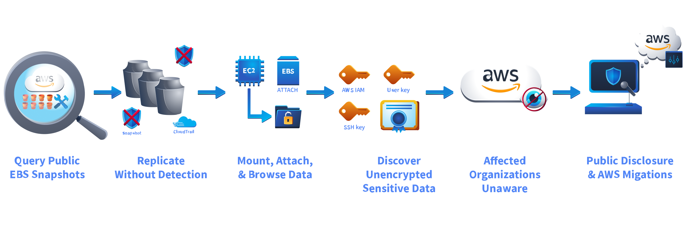
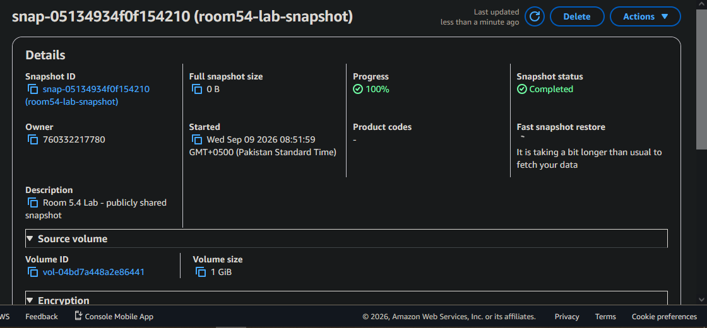
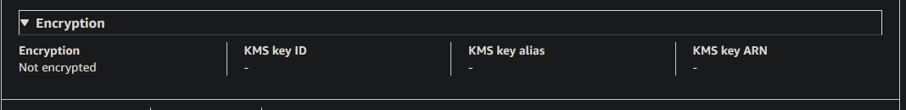
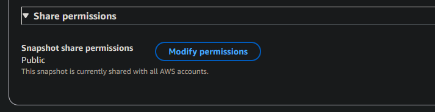
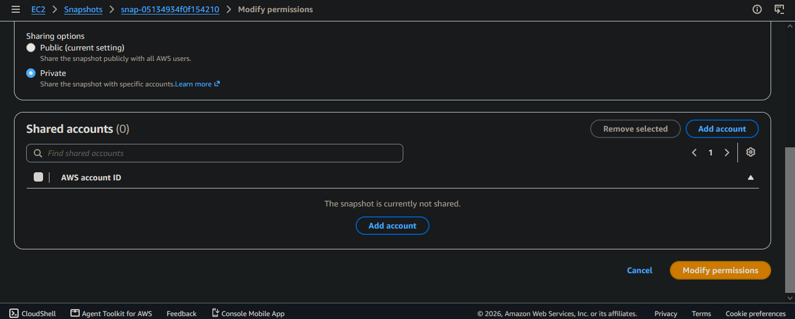
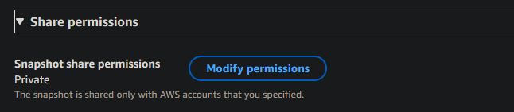
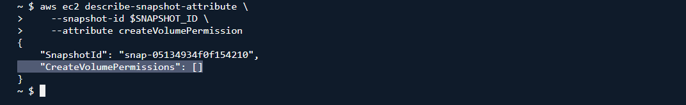
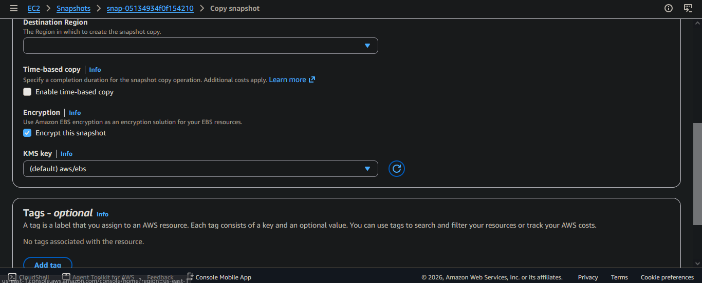

> /AWSDefence/RemovingEBSSnapshotVulnerability

# Removing EBS Snapshot Vulnerability

Cloud backups are often treated as safer copies of production data. That assumption can become dangerous.

An EBS snapshot contains a copy of an entire storage volume. If the snapshot is accidentally shared publicly, anyone with an AWS account can discover it, copy it, and inspect the data.

The attacker does not need access to the original EC2 instance. They only need permission to create a volume from the exposed snapshot.

In this investigation, we will identify a publicly shared EBS snapshot, understand how snapshot exposure happens, remove the insecure permission, and create an encrypted replacement.

---

# DEF CON 27 (2019)

In 2019, security researchers from Bishop Fox investigated publicly accessible AWS EBS snapshots before DEF CON 27. They built an automated scanner that searched AWS public snapshot listings. The scan discovered more than 100,000 publicly exposed snapshots.

The dangerous part was that copying a public snapshot did not require access to the original AWS account.



Researchers copied exposed snapshots, attached them to EC2 instances, and inspected the recovered data.

They discovered sensitive information including:

- AWS access keys.
- SSH private keys.
- TLS certificates.
- Proprietary source code.

The organizations that owned those snapshots often had no indication that their data had been copied. A backup is still production data. Protecting the original system means nothing if the backup is exposed.

---

# EBS Snapshot Sharing

EBS snapshots have a sharing permission called `createVolumePermission`. This permission controls who can create a volume from the snapshot.

A snapshot can be shared with:

- Specific AWS accounts.
- Everyone (`Group=all`).

The second option creates a public snapshot. Public snapshots are especially dangerous when combined with:

- Unencrypted snapshots.
- Long-lived access keys stored inside volumes.
- Sensitive application data.
- No monitoring of snapshot exposure.

Modern AWS controls reduce some risks, but incorrectly shared snapshots can still create serious exposure.

Let's investigate the snapshot.

---

## Finding The Shared Snapshot

First, let's save the enivronment information.

```bash
export ACCOUNT_ID=$(aws sts get-caller-identity --query Account --output text)

export AWS_REGION=${AWS_REGION:-$(aws configure get region)}

export SNAPSHOT_ID=$(aws ec2 describe-snapshots \
    --owner-ids self \
    --filters "Name=tag:Purpose,Values=room-54-lab" \
    --query "Snapshots[0].SnapshotId" \
    --output text)
```

Review the available snapshots:

```bash
aws ec2 describe-snapshots --owner-ids self
```
**Snapshot**


**unencrypted**


**public**


The snapshot is `unencrypted, sensitive and publicly shared` to any AWS account. What can be worse than that.


`Group=all` means any AWS user can create a volume from this snapshot. The snapshot is publicly accessible.


## The Security Crime Scene

The exposure happened because multiple protections failed:

* The snapshot was publicly shared.
* The snapshot was not encrypted.
* Sensitive data could be copied outside the owner's AWS account.
* Public snapshot copying does not generate useful visibility for the owner.

The impact depends on what exists inside the snapshot. A leaked snapshot could contain, Database files, application secrets, SSH keys, credentials, internal configuration files.

The first step is removing public access.

## Removing Public Access

Remove the public sharing permission:

```bash
aws ec2 modify-snapshot-attribute \
    --snapshot-id $SNAPSHOT_ID \
    --attribute createVolumePermission \
    --operation-type remove \
    --group-names all
```


Verify the snapshot permissions:


let's also verify from CLI.

```bash
aws ec2 describe-snapshot-attribute \
    --snapshot-id $SNAPSHOT_ID \
    --attribute createVolumePermission
```


The snapshot is now private. If sharing is required, do not expose it globally.

Share only with a specific AWS account; that you can do as follows:

```bash
aws ec2 modify-snapshot-attribute \
    --snapshot-id [SNAPSHOT_ID] \
    --attribute createVolumePermission \
    --operation-type add \
    --user-ids [TARGET_ACCOUNT_ID]
```

Account-specific sharing keeps the blast radius limited.


## Creating An Encrypted Snapshot

The original snapshot is not encrypted. A safer approach is creating an encrypted copy.

First, identify the KMS key:

```bash
export KEY_ID=$(aws kms list-aliases \
    --query "Aliases[?AliasName=='alias/lab-ebs-key'].TargetKeyId" \
    --output text)

export KEY_ARN=$(aws kms describe-key \
    --key-id "$KEY_ID" \
    --query "KeyMetadata.Arn" \
    --output text)
```


Create an encrypted copy:


```bash
ENCRYPTED_SNAP=$(aws ec2 copy-snapshot \
    --source-region "$AWS_REGION" \
    --source-snapshot-id $SNAPSHOT_ID \
    --region "$AWS_REGION" \
    --encrypted \
    --kms-key-id alias/lab-ebs-key \
    --description "Encrypted copy - Room 5.4 Lab" \
    --query SnapshotId \
    --output text)
```



Verify encryption:

```bash
aws ec2 describe-snapshots \
    --snapshot-ids $ENCRYPTED_SNAP \
    --query "Snapshots[0].{Encrypted:Encrypted,State:State}"
```

The replacement snapshot now uses encryption at rest.


## Why Encryption Changes The Attack Path

Encryption does not replace access control. A public snapshot is still a problem. However, encrypted snapshots add another security boundary. With customer-managed KMS keys, the attacker needs snapshot access, KMS permissions and key usage can be audited through AWS logging.

This prevents a simple snapshot-sharing mistake from becoming immediate plaintext data exposure.

The secure model is `Private snapshot + encryption + controlled sharing`.


# Preventing The Next Snapshot Leak

EBS snapshots should be treated like production databases. A secure snapshot strategy includes:

* Encrypt snapshots by default.
* Never use `Group=all` sharing.
* Share only with required AWS accounts.
* Use customer-managed KMS keys for sensitive workloads.
* Regularly audit snapshot permissions.
* Remove unused snapshots and old backups.
* Rotate secrets if an exposed snapshot is discovered.

Backups are designed to preserve data. Without proper controls, they can preserve a breach too.

---

> QXV0aG9yOiBodHRwczovL2dpdGh1Yi5jb20vaGFzaC01NDU=
