> /AWSDefence/S3 Bucket Logging Blind Spots

# Handling S3 Bucket Logging Blindspots

Cloud storage security is not only about preventing unauthorized access. It is also about knowing when authorized access becomes suspicious. A private S3 bucket can still become a security problem if nobody is watching what happens inside it. An attacker using valid credentials can download sensitive data without triggering any warning if S3 activity logging is not configured. S3 server access logs and CloudTrail data events provide visibility into object-level activity. Without them, security teams may have no record of who accessed files, what was downloaded, or when the activity happened.

In this investigation, we will examine an S3 bucket with no monitoring configured, identify the missing visibility controls, and enable logging to detect suspicious access.

---

# Chegg 2018

In April 2018, Chegg experienced a data breach where an attacker accessed customer information stored in AWS. Chegg stored sensitive user data in S3 buckets. The attacker obtained access through compromised AWS credentials and downloaded millions of customer records.

The biggest problem was not only the stolen credentials. It was visibility.

S3 data events were not enabled, meaning object-level actions such as `GetObject` were not recorded in CloudTrail. The attacker could enumerate and download data without generating useful security alerts.

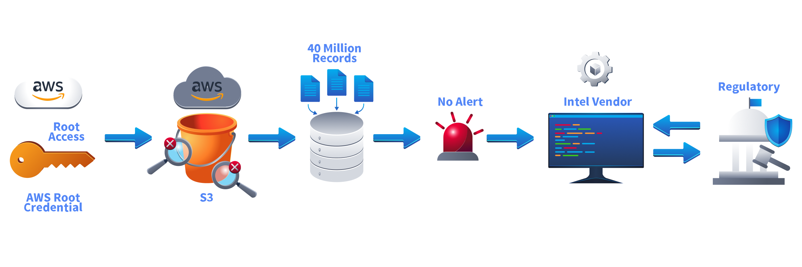

The breach remained undiscovered for months until external threat intelligence identified leaked customer information.

`A locked bucket protects data. Logging tells you when that protection has failed.`

---

# S3 Visibility Controls

AWS provides multiple ways to monitor S3 activity.

The two main options are:

- **S3 Server Access Logs**: Records HTTP requests made to a bucket, including source IP and user-agent information.

- **CloudTrail S3 Data Events**: Records API-level object actions such as `GetObject`, `PutObject`, and `DeleteObject`, including the IAM identity performing the action.

CloudTrail management events are enabled by default in many setups, but S3 object-level events are not. This creates a common blind spot. A security team may see someone changing bucket permissions, but not someone downloading thousands of files.

Let's investigate the bucket.

---

# Finding The Blind Bucket

First, store the environment details.

```bash
export ACCOUNT_ID=$(aws sts get-caller-identity --query Account --output text)

export BUCKET_NAME="thm-blind-bucket-${ACCOUNT_ID}"

export TRAIL_NAME=$(aws cloudtrail describe-trails \
    --query "trailList[?Name=='room53-management-trail'].Name" \
    --output text)

export LOG_GROUP=$(aws logs describe-log-groups \
    --query "logGroups[?contains(logGroupName, '/aws/cloudtrail/room53/')].logGroupName" \
    --output text)
```


The target bucket contains sensitive-looking data:

```bash
aws s3 ls s3://$BUCKET_NAME/
```

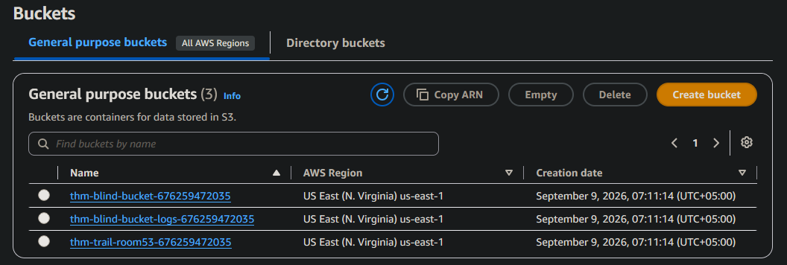

**Access this flag to see if activity is logged**
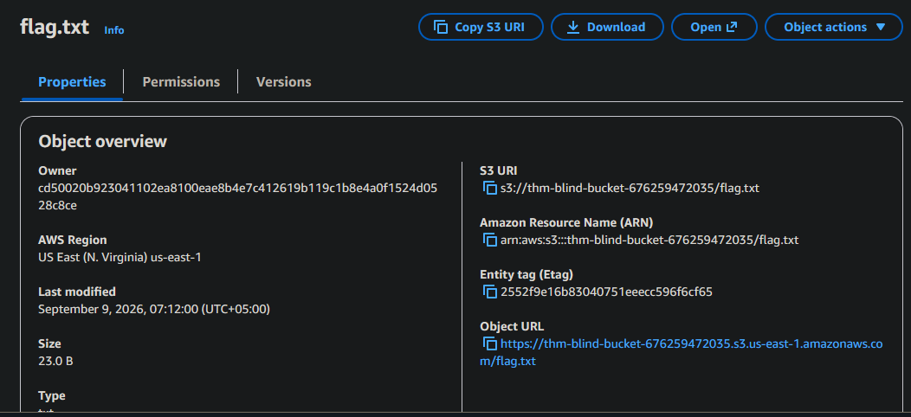

Before checking activity logs, verify whether S3 server access logging is enabled.

```bash
aws s3api get-bucket-logging --bucket $BUCKET_NAME
```


**No Output**
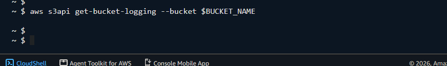

No configuration means requests to objects are not being recorded through S3 access logs.


## Checking CloudTrail Visibility

The next step is checking whether CloudTrail captures S3 object activity.

We have one management trail already present.

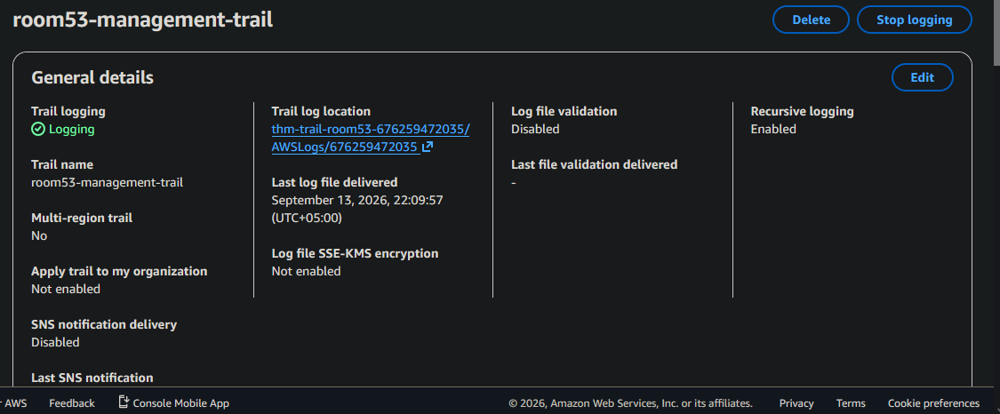

```bash
aws cloudtrail get-event-selectors --trail-name $TRAIL_NAME
```
Output:
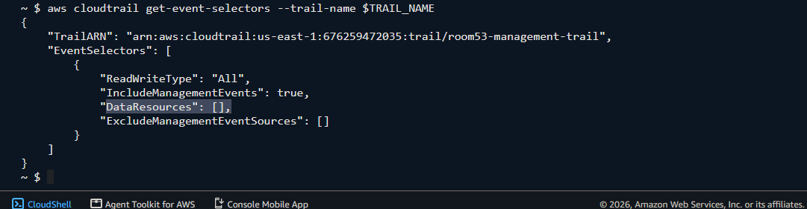


The important field is:

```json
"DataResources": []
```
An empty DataResources list means S3 object-level events are not being captured. Management events can show actions like changing bucket settings, but they do not record normal object access.

For example:

* `GetBucketPolicy` → recorded
* `PutBucketEncryption` → recorded
* `GetObject` → not recorded without data events

This means an attacker downloading files could leave no CloudTrail evidence. Just like when we opened the flag.txt from bucket.


## Searching For Missing Activity

CloudTrail logs are connected to CloudWatch Logs, allowing security teams to search for suspicious actions. A query looking for object activity:

```bash
START_TIME=$(( $(date +%s) - 900 ))

END_TIME=$(date +%s)

QUERY_STRING='fields @timestamp, eventName, userIdentity.arn, requestParameters.key
| filter eventSource = "s3.amazonaws.com"
and requestParameters.bucketName = "'"$BUCKET_NAME"'"
and eventName in ["GetObject", "PutObject", "DeleteObject"]
| sort @timestamp desc
| limit 20'
```

```bash
aws logs get-query-results --query-id "$QUERY_ID"

```

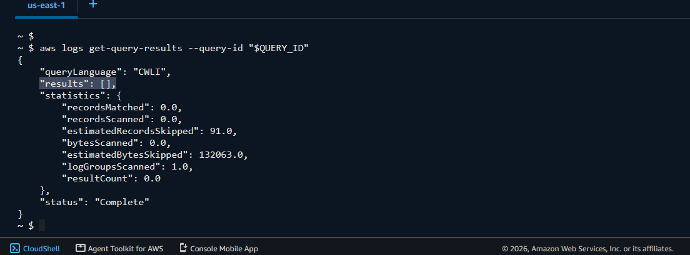

At this stage, there are no results. The bucket has activity, but there is no visibility.

## The Security Blind Spot

The problem is clear:

* S3 server access logging is disabled.
* CloudTrail S3 data events are not enabled.
* Object-level activity cannot be investigated.

The bucket itself is private, but security monitoring is incomplete. An attacker with valid credentials could download sensitive files while appearing invisible. The fix is to enable object-level logging.


## Enabling CloudTrail S3 Data Events

CloudTrail data events must be explicitly enabled for S3 objects.

```bash
aws cloudtrail put-event-selectors \
      --trail-name $TRAIL_NAME \
      --event-selectors "[
      {
        \"ReadWriteType\": \"All\",
        \"IncludeManagementEvents\": true,
        \"DataResources\": [
          {
            \"Type\": \"AWS::S3::Object\",
            \"Values\": [\"arn:aws:s3:::${BUCKET_NAME}/\"]
          }
        ]
      }
    ]"
```

Output:
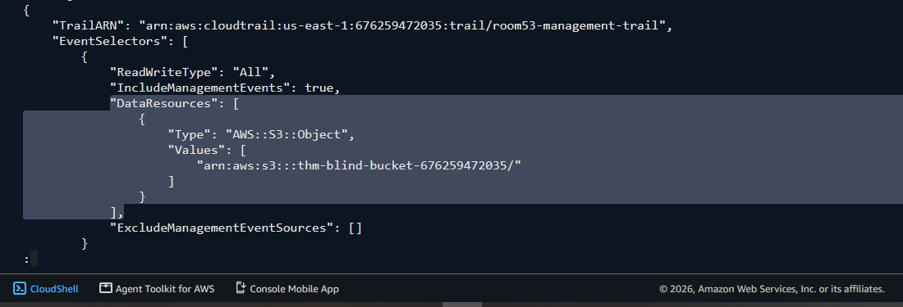


Verify the configuration:

```bash
aws cloudtrail get-event-selectors --trail-name $TRAIL_NAME
```
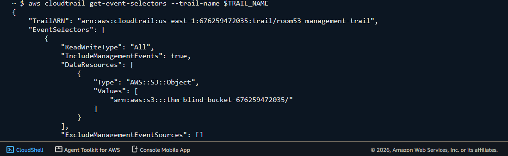


The bucket is now being monitored for object-level actions. A future download, upload, or deletion will generate a CloudTrail event.

## Detecting Object Access

After generating S3 activity, CloudWatch Logs Insights can identify the user, object, and action.

Example query:

```bash
QUERY_STRING='fields @timestamp, eventName, userIdentity.arn, requestParameters.key
| filter eventSource = "s3.amazonaws.com"
and requestParameters.bucketName = "'"$BUCKET_NAME"'"
and eventName in ["GetObject", "PutObject", "DeleteObject"]
| sort @timestamp desc
| limit 20'
```
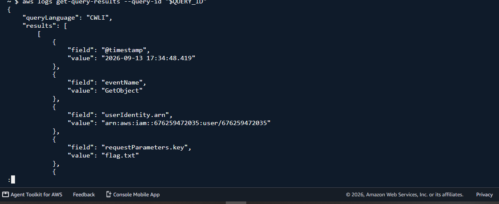


A `GetObject` event now reveals:

* Who accessed the file.
* Which object was accessed.
* When it happened.

The previous blind spot has been removed.


## Enabling S3 Server Access Logging

CloudTrail provides identity context, but S3 server access logs provide another layer of visibility.

Create the logging destination:

```bash
export LOGGING_BUCKET="thm-blind-bucket-logs-${ACCOUNT_ID}"
```

Enable access logging:

```bash
aws s3api put-bucket-logging \
    --bucket $BUCKET_NAME \
    --bucket-logging-status "{
      \"LoggingEnabled\": {
        \"TargetBucket\": \"$LOGGING_BUCKET\",
        \"TargetPrefix\": \"${BUCKET_NAME}/\"
      }
    }"
```

Verify:

```bash
aws s3api get-bucket-logging --bucket $BUCKET_NAME
```
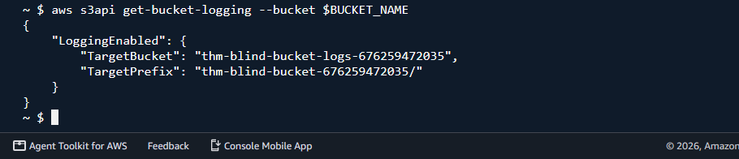

The bucket now records HTTP access requests.

# Preventing The Next Blind Bucket

S3 monitoring is often ignored because the bucket is private. That assumption creates dangerous gaps.

A secure S3 deployment should include:

* CloudTrail S3 Data Events for sensitive buckets.
* S3 Server Access Logging where additional request visibility is needed.
* Alerts for unusual object downloads.
* Least-privilege IAM permissions.
* No shared credentials or unmanaged access keys.
* Regular reviews of logging coverage.

Security is not only about stopping attackers. It is also about seeing them when they get through.

---

> QXV0aG9yOiBodHRwczovL2dpdGh1Yi5jb20vaGFzaC01NDU=

