>/AWSDefence/Security Group Controls
# Security Group Controls: Securing AWS Network Access with Least Privilege

A cloud application rarely fails because the technology is unavailable. More often, it fails because something that was meant to be temporary was left open.

A developer deploys a web application on AWS. The application requires HTTP access for users, SSH access for administration, and database connectivity for storing data. To make the application work quickly, a security group is created with all required ports opened to the internet.

The application works. The configuration is forgotten.

Months later, that same security group becomes the entry point for attackers scanning the internet for exposed services. Security Groups act as virtual firewalls around AWS resources. A single overly permissive rule can expose sensitive services such as SSH or databases directly to the public internet.

This article explores an AWS environment containing insecure Security Group configurations. The objective is to identify excessive network exposure, apply least-privilege access controls, implement Security Group-to-Security Group communication, and understand how multi-tier cloud architectures should be secured.

We'll explore:

* Identifying overly permissive Security Group rules
* Understanding public exposure risks
* Removing unnecessary inbound access
* Implementing Security Group references
* Verifying application functionality after remediation
* Designing secure multi-tier AWS architectures

---

## The Risk of Overly Permissive Security Groups

AWS Security Groups control inbound and outbound traffic for EC2 instances.

Unlike traditional firewalls, Security Groups are:

* Stateful
* Instance-level
* Allow-only

A Security Group does not contain explicit deny rules. If traffic does not match an allowed rule, it is automatically blocked.

However, a rule such as:

```text
Source: 0.0.0.0/0
Port: 3306
```

means that any system on the internet can attempt to communicate with that service.

While public exposure is sometimes required for services such as web applications, sensitive services such as databases and management protocols should never be exposed globally.

A secure cloud environment follows the principle of least privilege:

> Allow only the minimum network access required for a service to function.

---

# The MongoDB Apocalypse (2017)

A major example of poor network security was the MongoDB Apocalypse incident in early 2017. 

Security researchers discovered thousands of MongoDB databases exposed directly to the internet. Many of these databases were hosted on cloud platforms and were accessible because database ports were publicly reachable.

The attack followed a simple pattern:

During the incident, attackers began by scanning the internet for publicly exposed MongoDB instances. Automated scanning tools were used to identify systems where the default MongoDB port was accessible from the public internet. Services such as Shodan had already indexed many exposed database instances, making discovery easier.

After identifying vulnerable systems, attackers connected directly to the exposed databases. Many affected instances either lacked authentication entirely or were running with weak security configurations, allowing unauthorized access.

Once access was obtained, attackers enumerated the databases, extracted available information, and deleted database contents. The original data was replaced with ransom messages demanding payment for recovery.

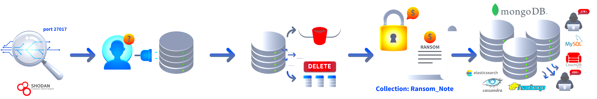

---

# Setting the Stage

The environment contains two EC2 instances:

* Web Application Server
* Database Server

The intended architecture:

```
Internet
   |
   |
Web Application Server
   |
   |
Database Server
```

The web server should be publicly accessible. The database should only accept connections from the web server.


---

## Identifying Running EC2 Instances

The first step is understanding the current infrastructure.

Let's list all running EC2 instances.


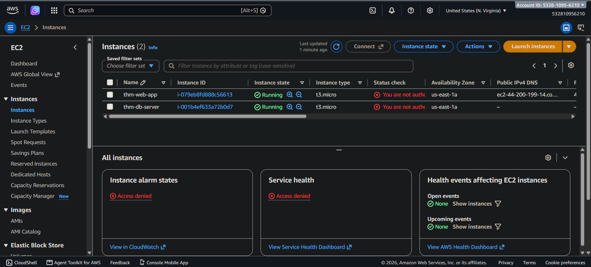

The output shows two instances:

* `thm-web-app`
* `thm-db-server`

The web application server has a public IP address, meaning it is reachable from the internet. The database server does not have a public IP address, which indicates it is located inside a private subnet.

However, private subnet placement alone does not guarantee security. The Security Group configuration must also be reviewed.

---

## Reviewing Web Application Security Group

The web application server has an attached Security Group. Let's inspect its inbound rules.

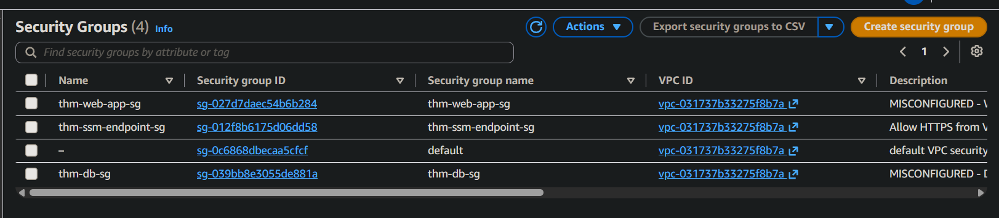

Now retrieve the Security Group rules.

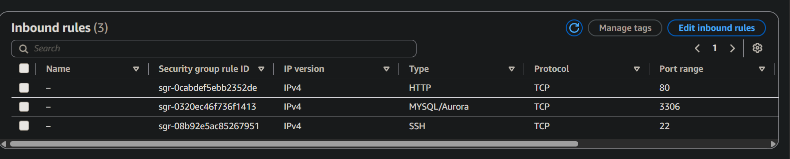

The Security Group contains:

| Port | Service | Source    |
| ---- | ------- | --------- |
| 22   | SSH     | 0.0.0.0/0 |
| 80   | HTTP    | 0.0.0.0/0 |
| 3306 | MySQL   | 0.0.0.0/0 |

The findings are straight-forward:

* HTTP exposure is expected because the application is public.
* SSH exposure increases attack surface.
* MySQL exposure is a critical security issue.

The web server does not need direct internet access to the database port.

---

## Reviewing Database Security Group

Next, let's inspect the database Security Group.

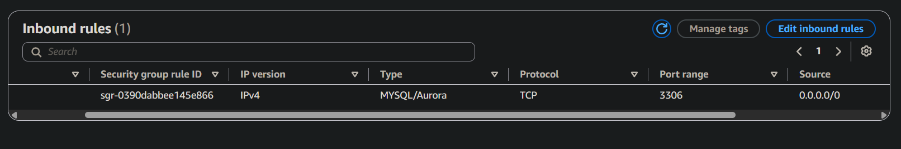

The database Security Group allows:

```text
MySQL (3306)
Source: 0.0.0.0/0
```

This means any internet-connected system can attempt to communicate with the database. This is the exact type of configuration that caused incidents such as the `MongoDB Apocalypse`.

---

# What Went Wrong?

The security review identified three major issues.


**SSH Open to the Internet**

```text
Port: 22
Source: 0.0.0.0/0
```

SSH is an administrative protocol. Allowing global SSH access increases exposure to, Brute-force attacks, Credential attacks, Vulnerability exploitation.

A better approach is using AWS Systems Manager Session Manager (SSM), VPN-based administration, Restricted source IP ranges.


**MySQL Open to the Internet**

```text
Port: 3306
Source: 0.0.0.0/0
```

Databases should not communicate directly with the public internet. The database should only accept connections from the application tier.


**Missing Network Segmentation**

The current architecture treats every system as publicly accessible. A secure architecture separates roles:

```
Public Tier
(Web Server)

        |
        |

Private Tier
(Database Server)
```

Each tier receives only the required permissions.

---

## Understanding Security Group Behavior

Before remediation, it is important to understand Security Group characteristics.

### Stateful

Security Groups automatically allow response traffic.

Example:

If inbound HTTP traffic is allowed:

```
Client → Web Server
```

The response is automatically allowed:

```
Web Server → Client
```

Unlike Network ACLs, return rules do not need to be manually created.

---

### Allow Only

Security Groups work using allow rules.

Example:

Allowed:

```
TCP 443 from anywhere
```

Everything else:

```
Implicitly denied
```

---

### Instance Level

Security Groups are attached to Elastic Network Interfaces (ENIs). Multiple Security Groups can be attached to one instance, and all rules are combined.

---

## Remediation Strategy

1. Remove public SSH access.
2. Remove unnecessary MySQL access from the web server.
3. Replace database public access with Security Group reference.
4. Verify application functionality.


Before:

```
Internet
   |
   |
Web Server
   |
   |
Database
```

After:

```
Internet
   |
   |
Web Server SG
   |
   |
Database SG
```

Only the web tier can communicate with the database tier.


**First, remove the SSH rule.**

```bash
aws ec2 revoke-security-group-ingress \
--group-id $WEB_SG_ID \
--protocol tcp \
--port 22 \
--cidr 0.0.0.0/0
```

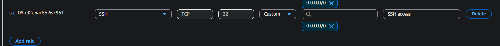

The SSH rule has been removed.


**Removing MySQL Access From Web Server**

The web server does not need MySQL access from the internet.

Remove the rule:

```bash
aws ec2 revoke-security-group-ingress \
--group-id $WEB_SG_ID \
--protocol tcp \
--port 3306 \
--cidr 0.0.0.0/0
```

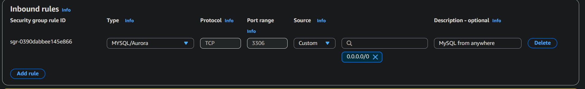

---

### Securing Database Access Using SG-to-SG Reference

Instead of allowing:

```text
0.0.0.0/0 → MySQL
```

we allow:

```text
Web Application SG → Database SG
```

Remove the existing public database rule:

```bash
aws ec2 revoke-security-group-ingress \
--group-id $DB_SG_ID \
--protocol tcp \
--port 3306 \
--cidr 0.0.0.0/0
```
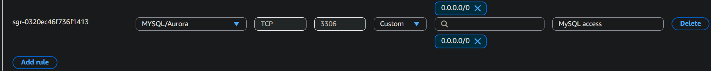


**Now add a Security Group reference:**
```bash
aws ec2 authorize-security-group-ingress \
--group-id $DB_SG_ID \
--protocol tcp \
--port 3306 \
--source-group $WEB_SG_ID
```

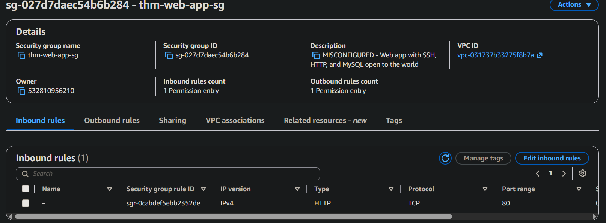


The database now accepts MySQL traffic only from the web application server.

This is more secure than IP-based rules because:

* Instances can change IP addresses.
* Security groups represent application roles.
* Permissions remain tied to architecture.

---

## Verifying Web Application Access

After changing network controls, functionality must be verified.

First, confirm the web application is still accessible.

```bash
WEB_IP=$(aws ec2 describe-instances \
--filters "Name=tag:Name,Values=thm-web-app" \
"Name=instance-state-name,Values=running" \
--query "Reservations[0].Instances[0].PublicIpAddress" \
--output text)

curl -s http://$WEB_IP
```

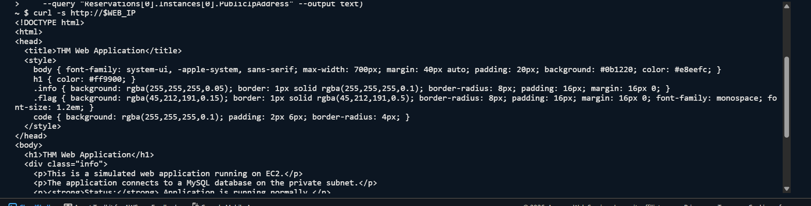

The application remains available.

---

### Testing Database Connectivity

The web server should still communicate with the database.

Connect using AWS Systems Manager.

```bash
aws ssm start-session --target $WEB_INSTANCE_ID
```

Inside the instance:

```bash
nc -v 10.0.2.10 3306 -w 3 < /dev/null
```

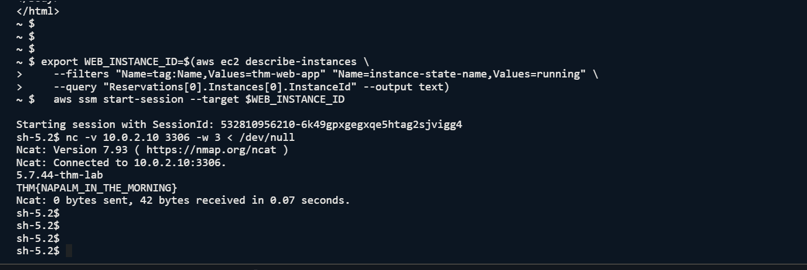

The successful connection confirms:

* Public database access was removed.
* Internal application communication still works.
* SG-to-SG referencing is functioning correctly.


So, 

* SSH is no longer public.
* MySQL is no longer public.
* Database access uses Security Group referencing.
* Remediation succeeded.

---

## Designing Secure Security Groups From Day One

A secure cloud deployment should not begin with open rules and later become restricted.

Security should be part of the architecture from the beginning.

**Recommended practices:**

**1. Default Deny:** Create Security Groups with no inbound rules.Only add required access.


**2. One Security Group Per Role:** Design Security Groups around application roles.

Example:

```
web-tier-sg

database-tier-sg

management-sg
```

**3. Prefer Security Group References**

Avoid:

```text
Database allows 10.0.1.0/24
```

Prefer:

```text
Database allows web-tier-sg
```

The rule follows the application role rather than a changing IP address.

---

**4. Restrict Management Access**

Avoid exposing:

* SSH
* RDP
* Administrative services

Use:

* AWS Systems Manager Session Manager
* VPN access
* Restricted administrator networks


**5. Control Outbound Traffic:** 

Default outbound rules allow all destinations. For sensitive workloads, restrict outbound access to required services only.

---

## Final Thoughts

Security Groups are simple controls, but small mistakes can create large security gaps.

A single rule such as:

```text
3306 from 0.0.0.0/0
```

can expose an entire database environment.

The goal of cloud security is not to block everything. It is to allow exactly what is required and nothing more. By applying least privilege networking, separating application tiers, and using Security Group references, AWS environments become easier to manage and significantly harder to compromise.

`A secure cloud architecture is built by design, not repaired after exposure.`

---

> QXV0aG9yOiBodHRwczovL2dpdGh1Yi5jb20vaGFzaC01NDU=
