> /AWSDefence/VPC Subnet Vulnerability Eradication

# VPC Subnet Vulnerability Eradication: The Not So Private Subnet

A team deploys a backend API server and places it inside a subnet named `backend-private`. Everyone assumes the service is safely isolated from the internet.

Months later, a security scan reveals something unexpected. The API server has a public IP address. The subnet has a direct route to the Internet Gateway. The name said "private." The route table disagreed.

In AWS, a subnet is not private because of its name, tags, or the intentions of whoever created it. A subnet is private because its routing configuration prevents direct internet access. The route table is the actual source of truth.

This is one of the most commonly misunderstood concepts in AWS networking. A resource can sit inside a subnet called `private-backend`, protected by carefully named security groups, and still be completely reachable from the public internet if the underlying network path allows it.

In this article, we will investigate an AWS environment where an internal API server was placed in a subnet intended to be private but was accidentally exposed. We will identify the routing mistake, remove the unintended exposure, and rebuild the network segmentation correctly.

We'll explore:

* How route tables define public and private subnets
* Identifying accidental Internet Gateway routes
* Why naming alone does not provide security
* Removing public IP assignment from private workloads
* Creating proper public and private VPC tiers

# Tesla Cloud Breach 2018

Before investigating the environment, it is worth understanding how similar mistakes have caused real-world incidents.

One example is the 2018 Tesla cloud breach.

Tesla operated AWS infrastructure supporting internal engineering workloads, including Kubernetes clusters handling sensitive operations such as vehicle telemetry, engineering data, and mapping information stored in Amazon S3.

The issue began with an exposed Kubernetes management dashboard.

The dashboard, which should have been restricted to internal access, was reachable from the public internet without proper authentication. Attackers discovered the exposed resource through internet-wide scanning.

Once inside the dashboard, attackers discovered Kubernetes pods containing AWS credentials. Those credentials provided access to Tesla's broader AWS environment, including S3 resources. The attackers then deployed cryptocurrency mining software using Tesla's own cloud infrastructure. They attempted to stay hidden by limiting resource usage and routing traffic through Cloudflare.

The same credentials also provided access to sensitive S3 data containing vehicle telemetry and engineering information.

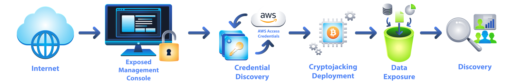

The incident highlighted several security failures:

* Internal management interfaces were exposed publicly.
* Authentication controls were missing.
* Cloud credentials were stored where attackers could access them.
* Monitoring failed to detect unusual activity.

A properly isolated private subnet would have removed one of the earliest attack paths. Network isolation is not the only security control, but it is the first wall attackers have to break.

# Setting The Scene

The AWS architecture in this investigation contains two tiers:

* A public-facing web server
* An internal API server

AWS offers both Web Interface and Cloudshell as CLI. We'll be using a combination of both for the sake of ease and efficiency.

The intended design is:

```text
Internet
   |
   |
Web Server
   |
   |
Internal API Server
```

The web server should be publicly accessible. The API server should only communicate internally.

Our task is to verify whether this separation actually exists.

First, we store the required resource IDs.

```bash
ACCOUNT_ID=$(aws sts get-caller-identity --query Account --output text)

VPC_ID=$(aws ec2 describe-vpcs \
  --filters "Name=tag:Name,Values=room32-vpc" \
  --query "Vpcs[0].VpcId" --output text)

BACKEND_SUBNET=$(aws ec2 describe-subnets \
  --filters "Name=vpc-id,Values=$VPC_ID" "Name=tag:Name,Values=room32-backend-private" \
  --query "Subnets[0].SubnetId" --output text)

echo "VPC: $VPC_ID | Backend Subnet: $BACKEND_SUBNET"
```

The environment variables will be used throughout the investigation.

**Our VPC**
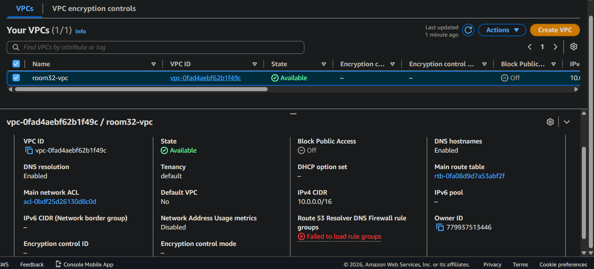

## The Subnet That Lied

The first check is reviewing the subnet configuration.

```bash
aws ec2 describe-subnets \
  --filters "Name=vpc-id,Values=$VPC_ID" \
  --query "Subnets[*].{Name:Tags[?Key=='Name']|[0].Value,CIDR:CidrBlock,PublicIP:MapPublicIpOnLaunch,SubnetId:SubnetId}" \
  --output table
```

**Subnets**
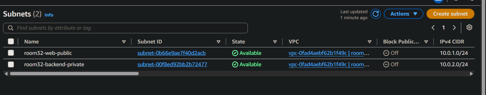

**NACL**
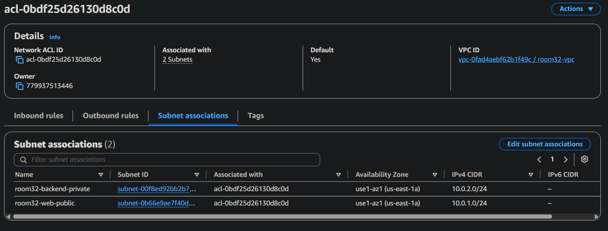

**Internal API Subnet**
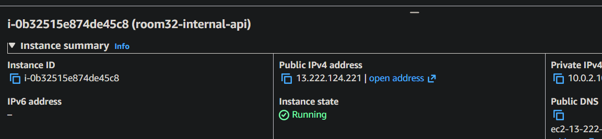

**Web Server Subnet**
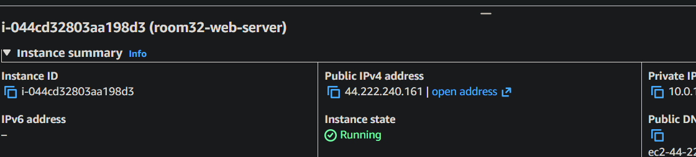


The output immediately reveals something suspicious.

Both subnets have:

```text
MapPublicIpOnLaunch = True
```

The backend subnet named `room32-backend-private` is configured to automatically assign public IP addresses to instances launched inside it. A private subnet should not behave this way. However, public IP assignment alone is not the complete picture. The real question is:

Does the subnet have a route to the internet?

## Time To Follow The Traffic Trail

AWS decides whether a subnet is public or private through route tables.

Let's inspect the route table associated with the backend subnet.

```bash
aws ec2 describe-route-tables \
  --filters "Name=association.subnet-id,Values=$BACKEND_SUBNET" \
  --query "RouteTables[].{Name:Tags[?Key=='Name']|[0].Value,Routes:Routes[].{Dest:DestinationCidrBlock,Target:GatewayId}}" \
  --output json
```

The route table contains:

```text
0.0.0.0/0 → Internet Gateway
```

This is alwasy the problem in such cases.

The backend subnet is using the same route table as the public subnet. Because the route table provides a path to the Internet Gateway, the backend subnet is effectively public.

The name was misleading. The routing configuration was the truth.

## The API That Isn't So Internal

Next, we verify the actual EC2 instances.

```bash
aws ec2 describe-instances \
  --filters "Name=vpc-id,Values=$VPC_ID" "Name=instance-state-name,Values=running" \
  --query "Reservations[].Instances[].{Name:Tags[?Key=='Name']|[0].Value,PrivateIP:PrivateIpAddress,PublicIP:PublicIpAddress,SubnetId:SubnetId}" \
  --output table
```

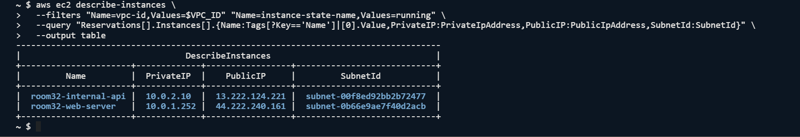

An internal API server should not have a public IP address. As we can see:

```text
room32-internal-api
Private IP: 10.0.2.10
Public IP: 44.197.132.201
```


Let's confirm whether it is reachable externally.

```bash
INTERNAL_API_IP=$(aws ec2 describe-instances \
  --filters "Name=tag:Name,Values=room32-internal-api" "Name=instance-state-name,Values=running" \
  --query "Reservations[0].Instances[0].PublicIpAddress" --output text)

curl -s --connect-timeout 5 http://$INTERNAL_API_IP:8080
```

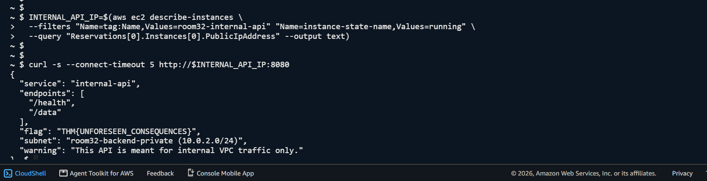

The API responds.

The service that was supposed to be internal is accessible from the internet. & showing the contents & data. The network segmentation has failed.

## The Loose Bricks In The Wall

The investigation uncovered three issues:

The backend subnet `room32-backend-private` shared a route table with the public subnet. That route table contained an Internet Gateway route, making both subnets publicly routable. The backend subnet also had `MapPublicIpOnLaunch` enabled, meaning new instances launched there would automatically receive `public IP` addresses.

Finally, the internal API server itself had a public IP and responded to external requests. The root cause was simple:

> A private route table was never created.

The subnet was named private, but AWS never received the instruction to make it private.

## Time To Lock The Doors

The remediation plan is straightforward:

1. Create a dedicated private route table.
2. Remove the Internet Gateway path.
3. Associate the private route table with the backend subnet.
4. Disable public IP auto-assignment.
5. Verify external access is removed while internal communication continues.

## Building A Proper Private Route Table

First, create a new route table containing only the local VPC route.

```bash
PRIVATE_RT=$(aws ec2 create-route-table \
  --vpc-id $VPC_ID \
  --tag-specifications "ResourceType=route-table,Tags=[{Key=Name,Value=room32-private-rt}]" \
  --query "RouteTable.RouteTableId" --output text)

echo "Private route table: $PRIVATE_RT"
```
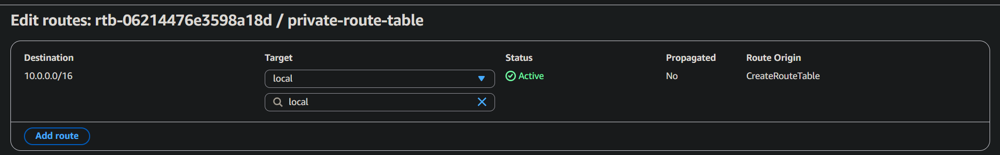

Now verify the routes.

```bash
aws ec2 describe-route-tables \
  --route-table-ids $PRIVATE_RT \
  --query "RouteTables[0].Routes[*].{Dest:DestinationCidrBlock,Target:GatewayId}" \
  --output table
```
There's no IGW attached now.
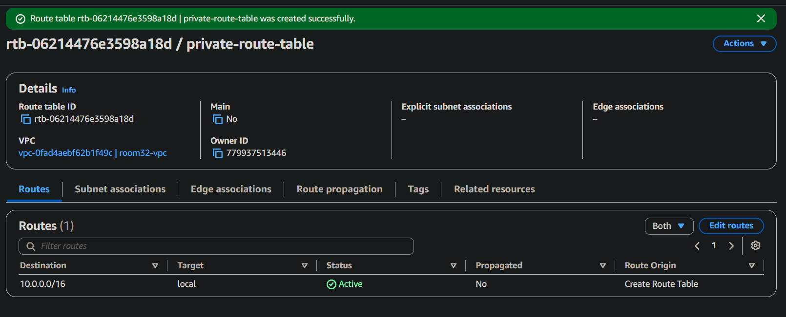


The route table only contains `10.0.0.0/16 → local`. This is what a private subnet should look like.

## Moving The Backend

Now we replace the existing route table association.

```bash
ASSOC_ID=$(aws ec2 describe-route-tables \
  --filters "Name=association.subnet-id,Values=$BACKEND_SUBNET" \
  --query "RouteTables[0].Associations[?SubnetId=='$BACKEND_SUBNET'].RouteTableAssociationId" \
  --output text)

aws ec2 replace-route-table-association \
  --association-id $ASSOC_ID \
  --route-table-id $PRIVATE_RT
```
**Route Table Association to Subnet**
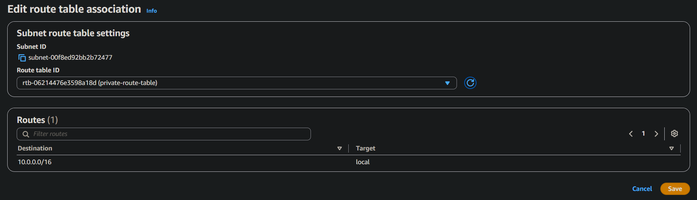

The backend subnet now uses the private route table.

## Removing Automatic Public Exposure

The next step is disabling automatic public IP assignment. (Disabled through GUI).

```bash
aws ec2 modify-subnet-attribute \
  --subnet-id $BACKEND_SUBNET \
  --no-map-public-ip-on-launch
```

**Only Private IP**
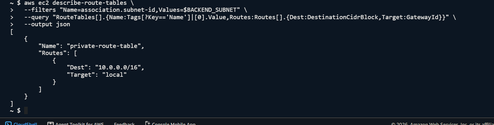

**`MapPublicIPOnLauch` is now disabled.**
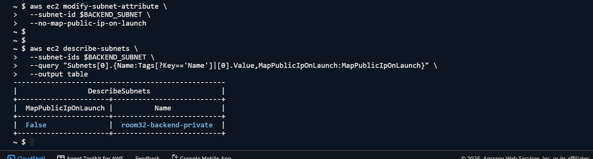

The subnet is now configured correctly.

Note that this affects future launches. Existing instances keep their assigned public IP addresses, but removing the Internet Gateway route eliminates the path required for external communication.

## Checking If The API Finally Learned To Hide

First, test from the internet again.

```bash
curl -s --connect-timeout 5 http://$INTERNAL_API_IP:8080
```

The request should fail or timeout.
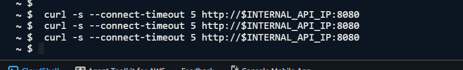
The API is no longer publicly reachable.


Now verify internal communication still works. Connect to the web server:

```bash
WEB_INSTANCE=$(aws ec2 describe-instances \
  --filters "Name=tag:Name,Values=room32-web-server" "Name=instance-state-name,Values=running" \
  --query "Reservations[0].Instances[0].InstanceId" --output text)

aws ssm start-session --target $WEB_INSTANCE
```

From inside the instance:

```bash
curl -s http://10.0.2.10:8080
```

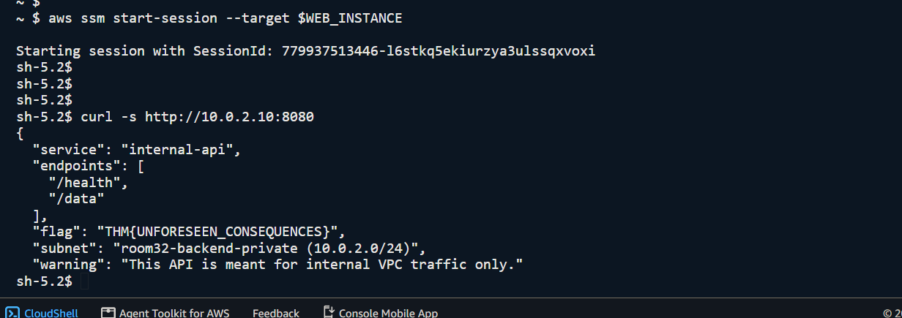

The API remains reachable internally. The private subnet is doing exactly what it should. Invisible from the internet, but available to trusted internal services.

The checks confirm:

* Public IP auto-assignment is disabled.
* The backend subnet has no Internet Gateway route.
* The private network segmentation is restored.

# Building The Fortress Before The Siege

The best fix is preventing the mistake from happening in the first place. Before creating AWS networking resources, ask: 

What actually needs internet access?

Only public-facing components such as load balancers, NAT Gateways, and bastion hosts belong in public subnets.

What should remain internal?

Application servers, databases, APIs, and management interfaces should live in private subnets.

How should private resources access external services?

Private workloads should use a NAT Gateway when outbound internet access is required, not an Internet Gateway.

How should production networks be designed?

Production environments should use multiple Availability Zones with matching public and private subnet pairs for resilience. A subnet is not private because someone named it private. A subnet is private because the network architecture makes it private.

`In AWS, the route table always gets the final vote.`

---

> QXV0aG9yOiBodHRwczovL2dpdGh1Yi5jb20vaGFzaC01NDU=
