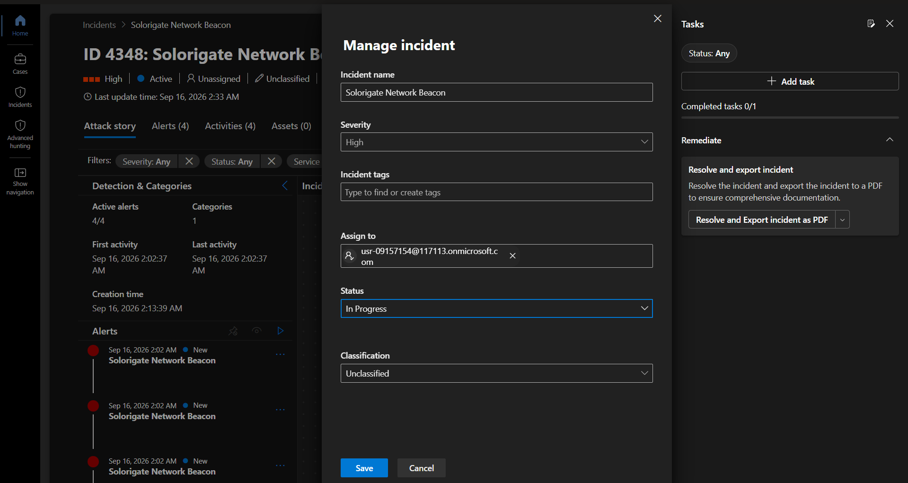
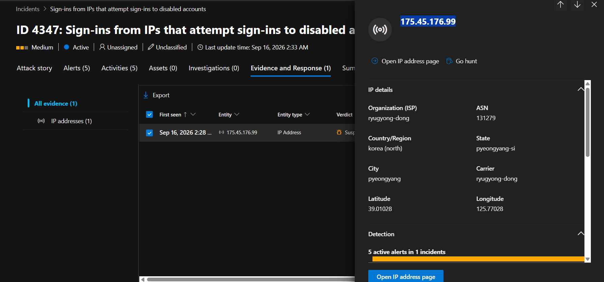
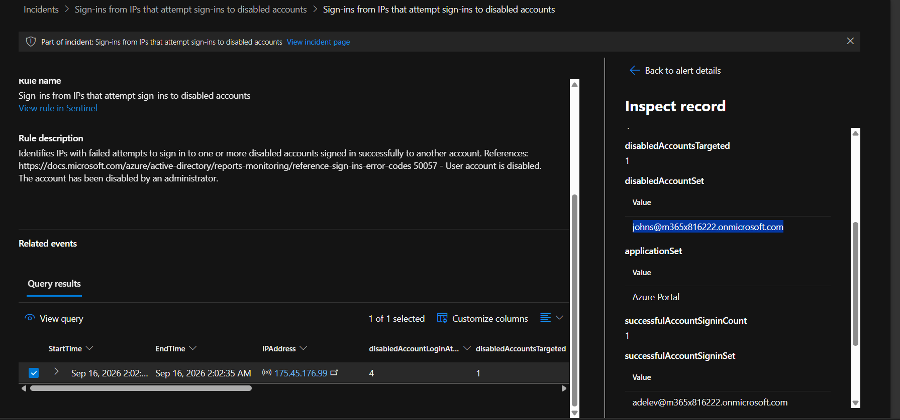
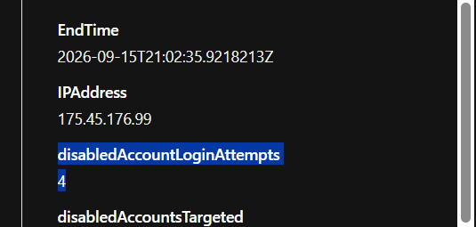

> /AzureDefence/Breach Investigation

# MS Sentinel: Compromised Account Investigation


Security monitoring is not about collecting endless logs and waiting for something suspicious to appear. Modern environments generate millions of events every day, including logins, API calls, file changes, and network activity. The role of a SOC analyst is to identify the small number of signals that indicate potential threats.

`Microsoft Sentinel` helps transform raw activity into actionable security investigations. After data sources are connected and Analytics rules are enabled, the next challenge is understanding how detections become incidents and how analysts investigate them.

Before investigating incidents, three concepts must be clear: events, alerts, and incidents.

An event is any observable activity within a system. It can be a login attempt, file modification, network connection, or configuration change. Most events are normal and simply represent the system operating as expected.

An alert is created when an event or group of events matches detection logic defined by security rules. Alerts indicate suspicious activity that requires review, but they do not automatically confirm a compromise.

An incident is a collection of related alerts that together represent a possible security issue requiring investigation. Microsoft Sentinel Analytics rules analyze events, generate alerts, and correlate related activity into incidents for SOC analysts.

The goal is not investigating every event. The goal is finding the security story hidden inside the noise.

## Sentinel Incident Investigation

Once Analytics rules are active, Microsoft Sentinel presents detected activity through the Incidents dashboard. This becomes the SOC analyst's starting point for triage.

Each incident provides information such as severity, status, ownership, MITRE ATT&CK mappings, related alerts, and investigation evidence. Severity levels range from Informational, Low, Medium, and High. However, severity does not determine whether an alert is a confirmed threat. Analysts must evaluate the surrounding context and evidence.

## The Investigation Toolbox

The incident details page provides several features to support investigation.

The Activity Log records changes made during incident handling, including ownership changes, status updates, and analyst actions. This creates an audit trail of the investigation process.

The Incident Timeline shows related alerts and their sequence, helping analysts understand how suspicious activity developed over time. Attackers usually perform multiple actions, and timelines help reveal the chain of events.

Microsoft Sentinel also extracts entities from alerts, including accounts, hosts, IP addresses, URLs, malware, and processes. These entities provide additional investigation paths, such as checking an IP's reputation, location, or related activity.

## Looking Behind The Alert

An alert only provides the starting point. The actual evidence exists inside the logs that generated it.

Microsoft Sentinel allows analysts to open the related Log Analytics query directly through Link to LA. This provides the relevant data without leaving the incident investigation page.

Using logs and KQL queries, analysts can determine details such as the targeted account, source IP address, timestamps, and activity volume. This evidence helps decide whether activity is malicious or expected.

## Building Consistent Investigations

A SOC requires a repeatable investigation process. Without standard procedures, analysts may investigate incidents differently and miss important steps.

Incident tasks help create consistency by defining actions such as validating alerts, resetting passwords, blocking malicious indicators, or performing threat hunting. These procedures allow analysts to follow established investigation practices while maintaining flexibility.

## Closing The Case

Not every detected incident represents a real attack. After investigation, incidents must be classified based on the findings.

A `True Positive` means the activity was confirmed as malicious. A Benign Positive means the activity was real but expected, such as authorized penetration testing or administrative changes.

A `False Positive` occurs when the alert was incorrect due to inaccurate data or overly broad detection logic. These can often be reduced by tuning Analytics rules or creating automation-based exceptions.

An `Undetermined` classification is used when there is not enough evidence to reach a conclusion. Ideally, investigations should end with a clear understanding of what happened and why.


# Hunting Through The Crime Scene

Now that the investigation concepts are clear, we can investigate incidents inside Microsoft Sentinel.

The scenario:

A company has already deployed Microsoft Sentinel. Data connectors are active. Analytics rules are generating incidents. As a SOC Level 1 analyst, the mission is to:

* Review new incidents.
* Take ownership.
* Investigate evidence.
* Escalate findings when deeper analysis is required.

## Taking Ownership Of The Incident

The first step of incident handling is ownership.

A SOC team cannot investigate effectively if nobody is responsible for the case.

Navigate to:

```
Microsoft Sentinel → Incidents
```

The dashboard displays currently generated incidents.
~[](./1.1_incidents.png)

Selecting the **Solorigate Network Beacon** incident.

The incident initially appears with:

* Status: New
* Owner: Unassigned
* Severity: High

Assigning the incident to myself and changing the incident status to "in-progress":



Changing ownership creates accountability. The assigned analyst becomes responsible for investigation progress and updates. The status change indicates that investigation has started.


## Following The Evidence Trail

With ownership established, let's move deeper into the investigation by reviewing the activity timeline.

The timeline displays the alerts contributing to the incident and helps reconstruct the sequence of events. Each alert represents a small piece of the larger security story.

A single alert may not reveal the complete picture. However, when multiple signals are connected together, they provide the context needed to understand what happened.

Let's select an alert from the timeline and examine the details behind it.

Remember:

> The `incident` is the complete story.  
> The `alert` is only one chapter.

## Looking Behind The Alert

An alert tells us that something suspicious occurred, but the actual evidence exists within the underlying logs. During analysis, we focus on key investigation points:

* Source IP addresses involved in the activity.
* Target accounts affected.
* Authentication attempts and patterns.
* Timeline and frequency of actions.

The logs provide the evidence required to determine whether the activity represents normal behavior, suspicious activity, or an actual compromise.

## Investigating Entities

After reviewing the logs, let's examine the entities extracted from the alert.

Microsoft Sentinel automatically identifies important objects involved in an incident, such as:

* Accounts.
* Hosts.
* IP addresses.
* URLs.
* Processes.

For this investigation, an IP address entity is available.



Selecting the IP address provides additional context, including geolocation information and related investigation details.

**Account compromised during breach**


**Failed login attempts before success**



Entity enrichment helps answer important questions:

* Where did this activity originate?
* Is this location expected for the user or system?
* Has this indicator appeared in other security events?

These additional details help analysts decide the appropriate response path.

# Escalating The Investigation

After reviewing the available evidence, this incident requires further investigation by a higher-level security team.

SOC Level 1 analysts focus on triage, evidence collection, and initial analysis. More complex investigations may require SOC Level 2 analysts who can perform deeper activities such as:

* Threat hunting.
* Malware analysis.
* Advanced timeline reconstruction.
* Additional containment actions.

Before handing over the investigation, create a task to provide clear direction for the next analyst.

Example:

```

Perform threat hunting on breached account

```

Then transfer ownership of the incident to the SOC Level 2 team. Since, working in a SOC environment and dealing with incidents, you need to be quick and proactive. Clear directions and guidelines to SOC Level 2 help pinpoint the issue and eradicate the threat in far less time. So, average response time is reduced and impact of attack is minimized.

# The Security Investigation Mindset

Microsoft Sentinel provides powerful investigation capabilities, but tools alone do not solve security incidents. A SOC analyst must connect the dots:

| Security Element | Purpose |
|---|---|
| `Events` | Raw activity generated by systems |
| `Alerts` | Suspicious activity identified by detection logic |
| `Incidents` | Correlated alerts representing a possible security issue |

The investigation process transforms scattered activity into a security narrative.

The objective is not simply closing alerts. The objective is understanding what happened, why it happened, and what actions can reduce the chance of it happening again.

---

> QXV0aG9yOiBodHRwczovL2dpdGh1Yi5jb20vaGFzaC01NDU=
