> /AzureDefence/Detecting&AnalyzingPrivilegeEscalation

# When Privileges Go Too Far: UAC Bypass Attacks

Privilege escalation is one of the most important stages in an attack chain.

An attacker rarely wants to remain limited to a standard user account. The real objective is often gaining higher privileges to access sensitive resources, modify system settings, disable security controls, or maintain persistence.

In this article, we will investigate how privilege escalation works, explore the `UAC bypass` technique in Windows environments, and analyze a multi-stage attack using Microsoft Defender XDR.

## Understanding Privilege Escalation

Privilege escalation occurs when an attacker gains permissions beyond their original access level.

There are two common forms:

| Type | Description |
|---|---|
| `Vertical Privilege Escalation` | Moving from a lower privilege account to a higher one, such as user to administrator |
| `Horizontal Privilege Escalation` | Accessing another account with similar privilege levels but different permissions |

Attackers typically achieve privilege escalation by exploiting weaknesses such as:

* Misconfigured permissions.
* Vulnerable software.
* Weak access controls.
* Unpatched vulnerabilities.
* Unsafe system configurations.

The impact can be significant. A successful privilege escalation attack can allow attackers to access sensitive data, disable security controls, install malware, or gain complete control over an endpoint.

## UAC Bypass: Escalating Without The Prompt

Windows includes `User Account Control (UAC)` to prevent unauthorized administrative actions. When an application requires elevated permissions, UAC displays a confirmation prompt before allowing the action. However, attackers can abuse weaknesses in trusted Windows components to bypass this protection.

A `UAC bypass` does not directly exploit a password or account. Instead, it abuses trusted applications or system behavior to execute malicious actions with elevated privileges without triggering the normal UAC confirmation.

Common approaches include:

* Abusing trusted applications running with elevated privileges.
* Modifying registry settings related to UAC behavior.
* Placing malicious files where trusted processes will execute them.

The goal is to gain administrator-level execution while avoiding user interaction. This technique is especially dangerous because it can turn a limited compromise into a full endpoint takeover.

# Investigating The Privilege Escalation Incident

Now let's move from theory into investigation.

In this scenario, Microsoft Defender XDR has detected a multi-stage incident involving privilege escalation on an endpoint.

Our objective is to understand the attack story by reviewing:

* The incident timeline.
* Generated alerts.
* MITRE ATT&CK mappings.
* Suspicious entities.
* Process execution evidence.

## Finding The Incident

Let's begin by opening the Incidents section inside Microsoft Defender XDR. The incident we are investigating is:

```

Multi-stage incident involving Privilege escalation on one endpoint

```

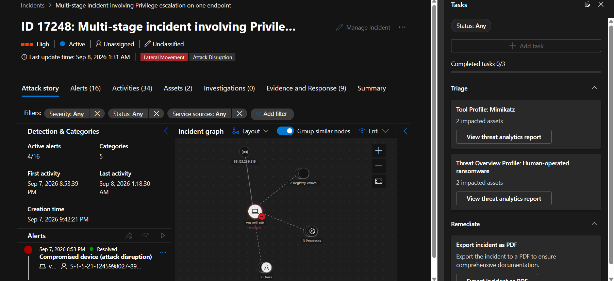

The incident contains multiple alerts connected to the same attack chain.

Rather than investigating each alert separately, Defender XDR groups related activity together, allowing analysts to understand the complete sequence.


Inside the incident, each alert represents a detection point during the attack. For this investigation, the important alert is `UAC bypass was detected`. Opening this alert provides additional context about the detected activity.

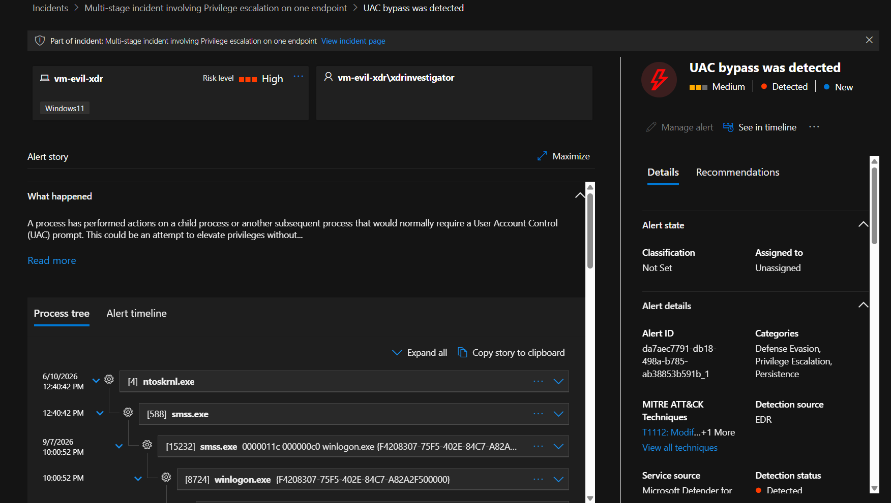

The MITRE ATT&CK framework helps analysts understand attacker behavior by mapping activity to known techniques.

The mapping helps answer important questions:

* What technique was used?
* Where does this activity fit in the attack lifecycle?
* What other behaviors should analysts investigate?

For this alert, the technique is related to `UAC Bypass`.

This indicates that the attacker attempted to elevate privileges by bypassing Windows User Account Control protections.

## Examining The Evidence

Detection alone is not enough. Let's review the case to understand which entities Defender XDR identified as suspicious.

Evidence can include:

* Suspicious processes.
* Files involved in execution.
* User accounts.
* Devices.
* Related activity.

> Let's take a look

**Malicious Executables**
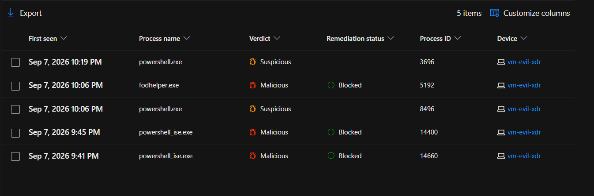

**Attacker's UAC Bypass Script**
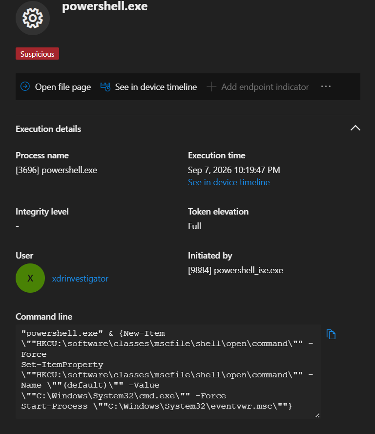
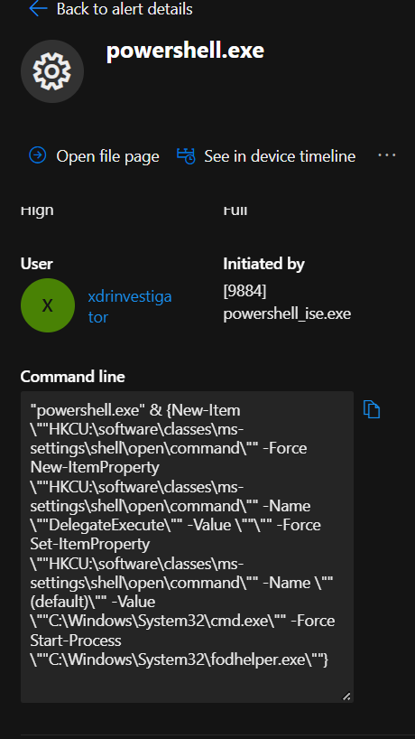

**Registry Key Edited**
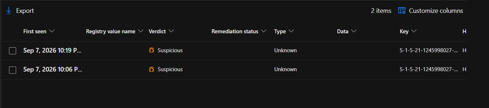

**Attacker's IP Specifications**
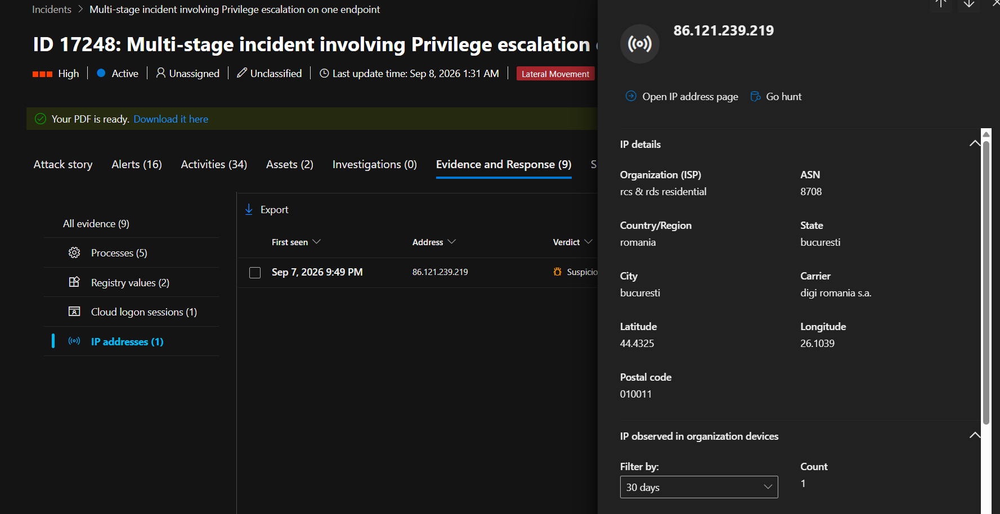

**Users & devices targeted**
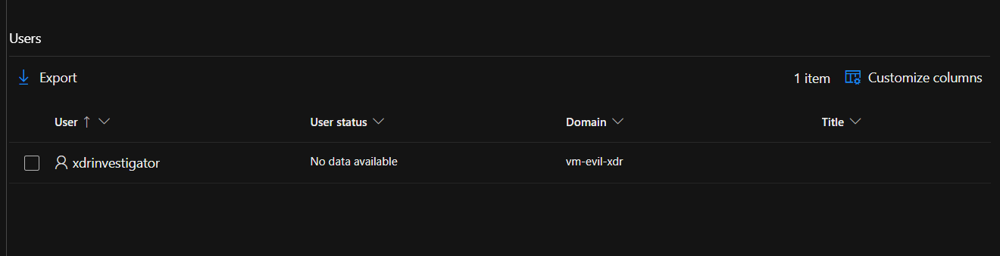
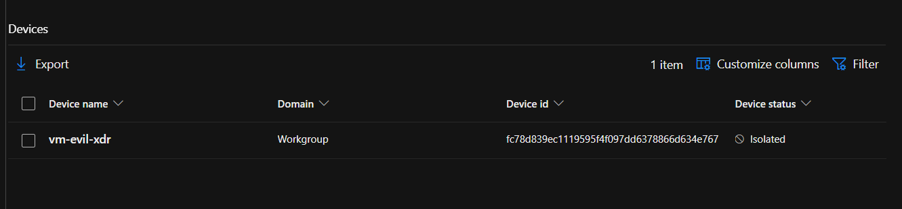

This provides the context required to validate whether the detection represents real malicious behavior.

[View detailed INCIDENT REPORT](./incident_17248.pdf)

## Confirming Through The Process Tree

The final step is validating the activity through the process tree. The process tree shows the relationship between parent and child processes and helps reconstruct what actually executed on the endpoint.


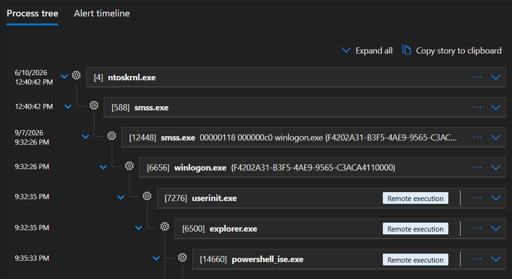
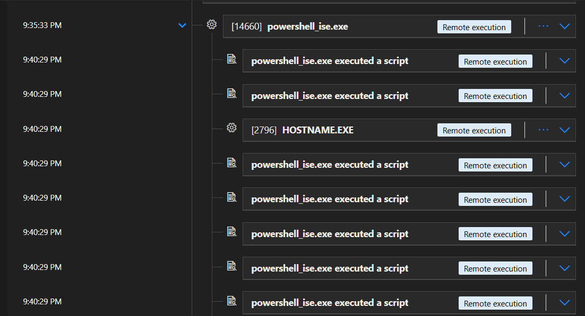


By examining the process chain, analysts can confirm whether a trusted process was abused to execute suspicious activity. This prevents relying only on alerts and allows the analyst to verify the actual behavior behind the detection.

# The Security Investigation Mindset

Privilege escalation is rarely an isolated action. Attackers usually move through multiple stages:

| Stage | Purpose |
|---|---|
| Initial Access | Gain entry into the environment |
| Privilege Escalation | Obtain higher permissions |
| Persistence | Maintain access |
| Defense Evasion | Avoid detection |

Microsoft Defender XDR helps analysts connect these individual actions into a complete attack narrative.


The objective is not just to confirm that a `UAC bypass` occurred. It is to understand how the attacker gained elevated privileges, which systems were affected, what actions followed the escalation, and what response actions are required to contain the threat and prevent further compromise.

---

> QXV0aG9yOiBodHRwczovL2dpdGh1Yi5jb20vaGFzaC01NDU=
