> /AzureDefence/Entra ID Monitoring & Detection

# Entra ID Monitoring & Detection: Hunting Identity Attacks

Modern cloud attacks rarely start with malware or an exposed server. More often, attackers begin by targeting the identity layer.

A compromised identity can provide direct access to cloud services, emails, files, and administrative resources without ever touching the traditional network perimeter. This makes identity monitoring one of the most important responsibilities for modern SOC teams.

In this article, we will investigate common **Entra ID identity attacks**, understand what traces they leave behind, and explore how security analysts can detect them using authentication and audit logs.

## Why Attackers Target Cloud Identities

In traditional environments, attackers often needed to bypass firewalls, exploit vulnerabilities, or gain access to internal networks.

Cloud environments changed this approach.

Microsoft Entra ID authentication endpoints are designed to be accessible from anywhere. This allows legitimate users to work remotely, but it also means attackers can attempt authentication directly against the organization's identity provider.

A stolen username and password can be enough to begin an attack.

Unlike malware-based attacks, identity attacks may leave no endpoint alerts, suspicious files, or network indicators. The evidence usually exists inside authentication logs, where analysts must connect failed attempts, successful sign-ins, and post-compromise activity into a complete attack story.

# Password Attacks: The First Step Toward Account Takeover

Attackers commonly obtain credentials through leaked password databases, phishing campaigns, or password reuse from previously compromised services.

Once they have a list of usernames, they usually attempt one of two approaches: **password spraying** or **brute force attacks**.

## Password Spraying

Password spraying focuses on targeting many accounts with a small number of commonly used passwords.

Instead of attacking one account repeatedly, attackers spread attempts across multiple users to avoid triggering account lockout policies.

For example:

```text
Common Password
  ↓
User A
User B
User C
User D
  ↓      
Check for successful authentication
```

In Entra ID logs, password spraying usually appears as:

* Multiple failed sign-ins from the same source IP.
* Attempts distributed across many usernames.
* Authentication failures occurring within a short timeframe.

## Brute Force Attacks

Brute force attacks take the opposite approach. The attacker focuses on one account and attempts many different passwords.

Modern attackers often slow down these attempts to avoid detection, making them harder to identify.

A `throttled` brute-force attack may look like:

```text
Single User Account
        ↓
Password Attempt 1
        ↓
      Wait
        ↓
Password Attempt 2
        ↓
      Wait
        ↓
Successful Login
```

Typical indicators include repeated failed sign-ins against one user account and activity originating from the same IP address or a small collection of addresses.

## Detecting Credential Attacks Through Logs

Entra ID Sign-in logs provide the authentication evidence needed to identify password attacks. A simple starting point is filtering failed authentication attempts:

```spl
index="task-2" sourcetype="azure:aad:signin" "status.errorCode"!=0 conditionalAccessStatus!=success
| table _time, userPrincipalName, appDisplayName, ipAddress, location.countryOrRegion, status.errorCode, status.failureReason
| sort - _time
```

However, individual failures do not always tell the complete story.

A better approach is identifying patterns. For example, checking which IP addresses generated the most failures and how many accounts they targeted:

```spl
index="task-2" sourcetype="azure:aad:signin" "status.errorCode"!=0 conditionalAccessStatus!=success
| stats dc(userPrincipalName) as targeted_accounts, count as failures by ipAddress
| sort - failures
```

During our investigation in sandbox environment,  logs are stores in the `index:<task>`. For bruteforce, following findings help detect the compromise in EntraID logs.

**IP involved in password-spray**
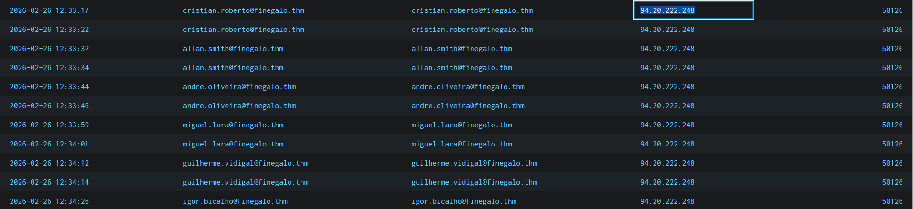

**IP involved in brute-force (throtteled)**
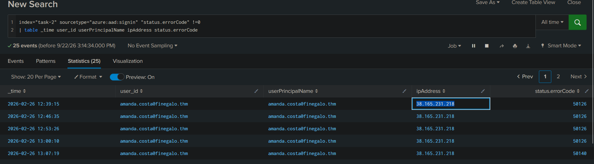

**Compromised User**
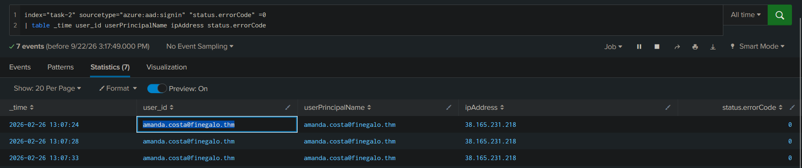

This helps analysts distinguish between normal authentication mistakes and automated credential attacks. Above pictures help detect which IP was involved in account compromise, which user was targeted and which attempt from attacker got successful. Other type of information is also exposed in the logs that are explored in the later section of the article.


## Conditional Access: The Gatekeeper Before Access

A successful password attack does not always mean account compromise. Microsoft Entra ID uses **Conditional Access Policies (CAP)** to evaluate authentication requests before granting access.

These policies act as an identity security decision engine:

```text
Authentication Request
          ↓
Conditional Access Evaluation
          ↓
Allow / Require MFA / Block
```

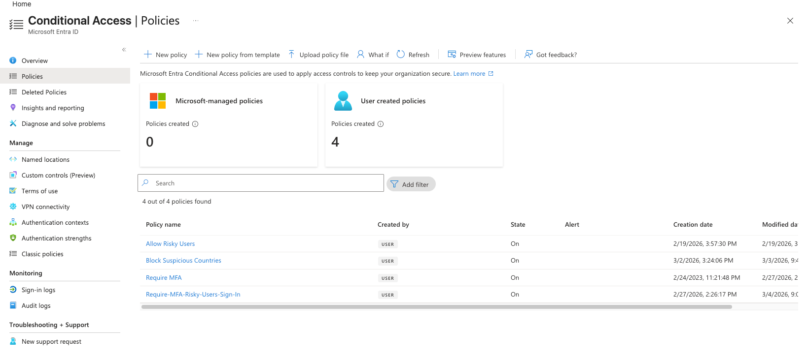

A policy may require MFA, block risky locations, enforce compliant devices, or deny legacy authentication attempts. However, Conditional Access is only effective when correctly configured. A policy that excludes important accounts or does not cover specific applications creates gaps attackers can exploit.

For example, an organization may enforce MFA for employees but exclude service accounts because of compatibility concerns. If one of those accounts is compromised, the attacker may authenticate without an additional verification step.


Sign-in logs contain the `appliedConditionalAccessPolicies` field, which shows which policies were evaluated and their outcome.

| Result         | Meaning                                                           |
| -------------- | ----------------------------------------------------------------- |
| **success**    | Policy requirements were satisfied.                               |
| **failure**    | Access was blocked or required controls were not completed.       |
| **notApplied** | Conditions were not met or the user was outside the policy scope. |
| **reportOnly** | Policy was evaluated but not enforced.                            |

These results help analysts understand why an authentication attempt succeeded or failed.

## Identity Protection: Detecting Risky Behaviour

Conditional Access enforces security rules, but **Identity Protection** helps identify when those rules should be triggered. Identity Protection uses behavioural analysis and machine learning to detect suspicious authentication patterns and assign risk levels.

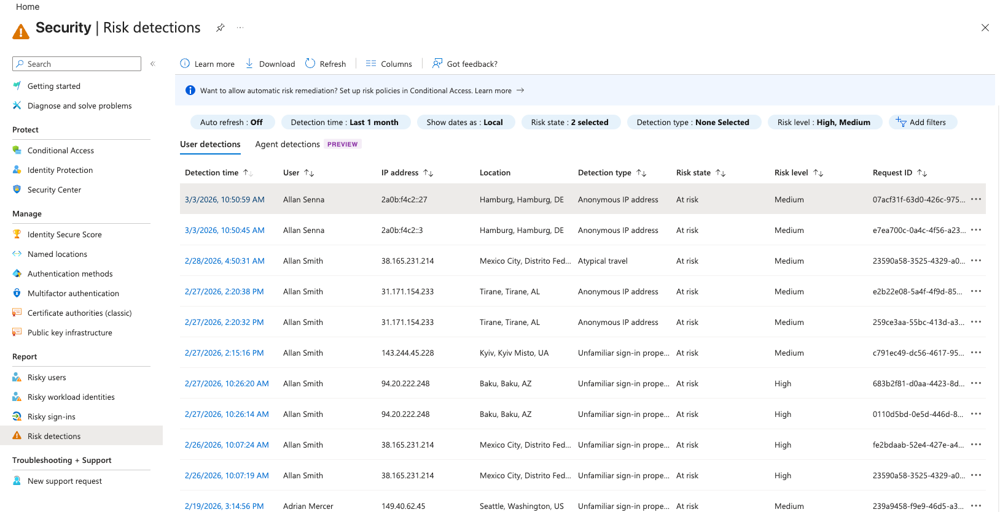

The two main risk categories are:

| Risk Type        | Purpose                                                                 |
| ---------------- | ----------------------------------------------------------------------- |
| **Sign-in Risk** | Evaluates whether a specific authentication attempt appears suspicious. |
| **User Risk**    | Evaluates whether an account is likely compromised.                     |

Examples of risky sign-ins include:

* Authentication from anonymous IP addresses.
* Impossible travel between distant locations.
* New devices or locations that do not match normal behaviour.

A user risk score can increase after events such as leaked credentials or repeated suspicious authentication attempts.

Building further in our investigation, we can dig-in the logs to find which user was flagged high-risk, and which was blocked by CAP.

**High-risk flagged user**
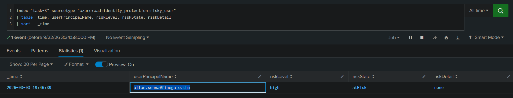
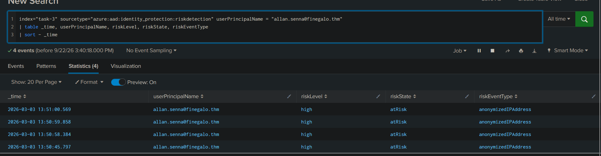

**High-risk sign-ins**
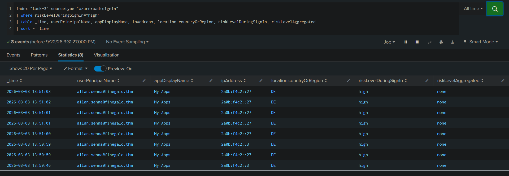

**CAP blocking**
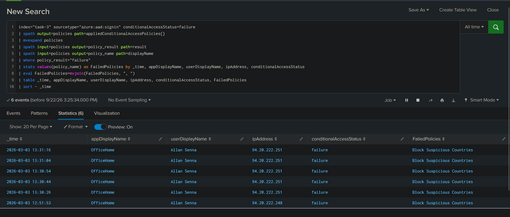

Detection reveals that user `Allen` is a high-risk employee having suspicious sign-ins from anonymized IP address and CAP is continuously blocking the access due to `Block Suspicious Countries` flag.
This way, CAP and ML detection helps flagging the suspicious activity aiding in logs enrichment and scope of investigation.

## MFA Bypass Techniques

MFA significantly reduces credential-based attacks, but attackers have developed techniques to bypass it by targeting the authentication process itself.

### MFA Fatigue

MFA fatigue, also known as prompt bombing, occurs when attackers repeatedly trigger MFA requests hoping the user approves one accidentally.

The attack flow looks like:

```text
Valid Credentials
        ↓
Repeated MFA Requests
        ↓
User Approves Prompt
        ↓
Attacker Gains Access
```

Detection indicators include:

* Large numbers of MFA failures against one account.
* Repeated MFA-related error codes.
* Successful authentication shortly after multiple denied prompts.

**MFA failure after legit password acceptance**
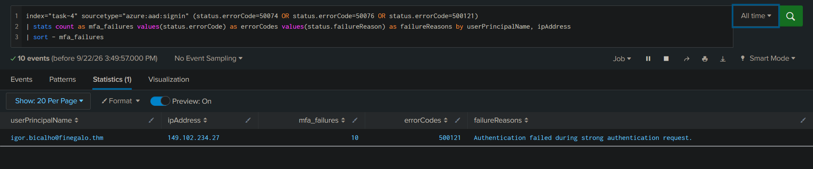


Modern protections such as number matching and additional authentication context reduce the effectiveness of this technique.

### Adversary-in-the-Middle Attacks

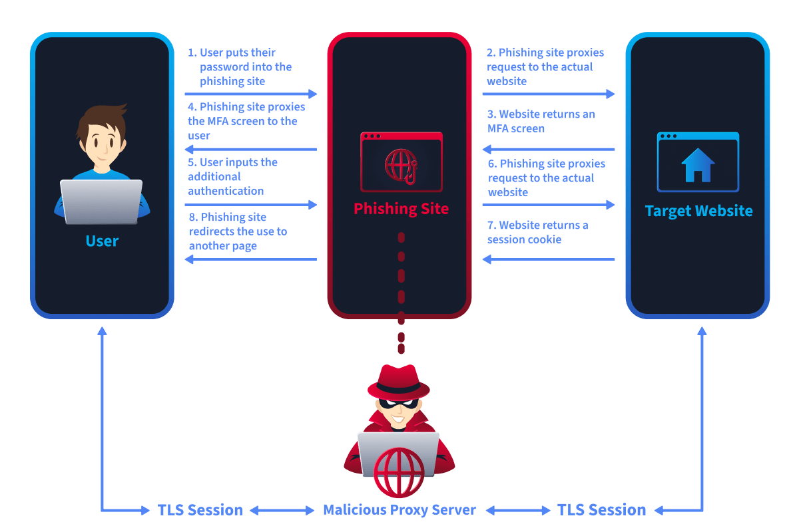

AiTM attacks do not break MFA directly. Instead, attackers use a proxy between the victim and Microsoft login pages to steal session tokens after authentication succeeds. The authentication itself appears legitimate because MFA was completed correctly.

The suspicious indicators usually appear afterward:

```text
Victim Login
      ↓
MFA Completed
      ↓
Session Token Stolen
      ↓
Attacker Reuses Token
```

Usual **locatin of the user** is Denmark (DK), whereas,  a distant geolocation change after one hour, points towards a suspicious behaviour.

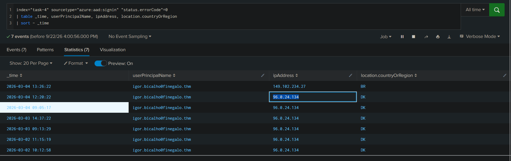


Analysts should look for unusual IP addresses, locations, and device information connected to otherwise successful authentication events.


# Following the Attacker After Initial Access

Authentication is only the beginning.

Once attackers gain access, they often modify the environment to maintain persistence or increase privileges. These actions move from **Sign-in logs** into **Audit logs**.

Important audit fields include:

| Field                   | Purpose                         |
| ----------------------- | ------------------------------- |
| **activityDisplayName** | Shows the action performed.     |
| **initiatedBy**         | Shows who performed the action. |
| **targetResources**     | Shows what object was modified. |

These fields answer three critical investigation questions:

```text
What changed?
      ↓
Who changed it?
      ↓
What was affected?
```

## Common Persistence Techniques

Attackers frequently attempt to establish long-term access by modifying identity settings.

Examples include:

```text
Compromised Account
        ↓
Create New User
        ↓
Assign Privileged Role
        ↓
Register New MFA Method
        ↓
Maintain Access
```

The case in hand includes following techniques of persistence used.


**Backdoor Account Creation:** Provides attackers with an alternative identity if the original account is recovered.
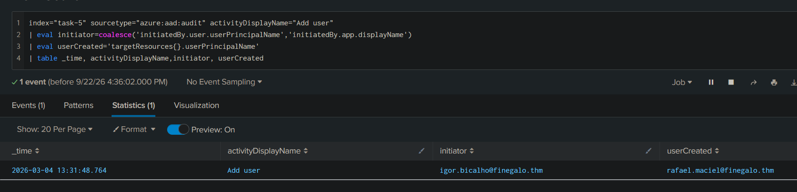


**Role Assignment Abuse:** Allows attackers to assign privileged Entra ID roles such as Global Administrator or User Administrator.
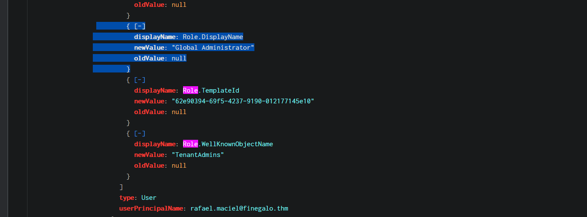


**MFA Method Registration:** Allows attackers to register their own authentication method and maintain access even after password changes.
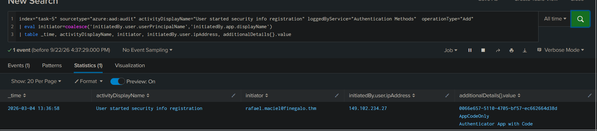


## OAuth Consent Abuse

Password resets and MFA removal are not always enough to remove an attacker. OAuth application permissions create a different persistence path because access is granted to an application rather than directly to a user account.

After consent is granted, the application may continue accessing resources until the permission is manually revoked.

The flow looks like:

```text
User Grants Consent
          ↓
Application Receives Permissions
          ↓
Access Tokens Generated
          ↓
Persistent API Access
```

### Delegated vs Application Permissions

|              | Delegated Permissions      | Application Permissions |
| ------------ | -------------------------- | ----------------------- |
| Acts as      | Signed-in user             | Application itself      |
| Access Scope | User's available resources | Potentially tenant-wide |
| Consent      | User or admin              | Admin required          |
| Example      | Mail.Read                  | Mail.Read.All           |

Application permissions require extra attention because they can provide broad access without requiring a user session.

**App-based permission grant** allows user to interact with target systems without the need of usernames, passwords or MFAs.
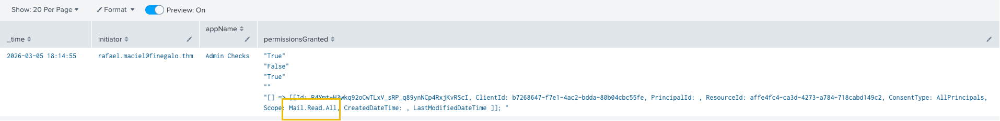

High-risk permissions include:

| Permission                             | Risk                                  |
| -------------------------------------- | ------------------------------------- |
| **Mail.Read.All**                      | Read all mailboxes in the tenant.     |
| **Files.ReadWrite.All**                | Access SharePoint and OneDrive files. |
| **RoleManagement.ReadWrite.Directory** | Modify directory roles.               |
| **Directory.ReadWrite.All**            | Modify directory objects.             |


# From Logs to Lessons

Identity security relies on reducing attack opportunities while maintaining visibility when incidents occur. Security teams should enforce **MFA**, maintain strong **Conditional Access policies**, and regularly review privileged permissions.

Monitoring identity logs helps detect unusual authentication patterns, risky sign-ins, and unexpected administrative changes. Regular reviews of application permissions, role assignments, and authentication methods prevent attackers from abusing legitimate identity features for persistence.

Identity attacks are challenging because they often resemble normal activity. A successful login, valid credentials, or an approved MFA request alone does not confirm legitimacy. The difference is found through context.

A failed login followed by access from an unusual location, a new admin account after suspicious activity, or a powerful OAuth consent grant can reveal an attacker's path.

For SOC analysts, Entra ID logs are more than event records. They provide the timeline needed to understand how an attacker gained access, what they changed, and how they attempted to maintain persistence.


---

> QXV0aG9yOiBodHRwczovL2dpdGh1Yi5jb20vaGFzaC01NDU=
