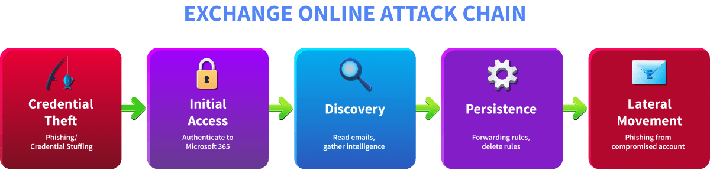
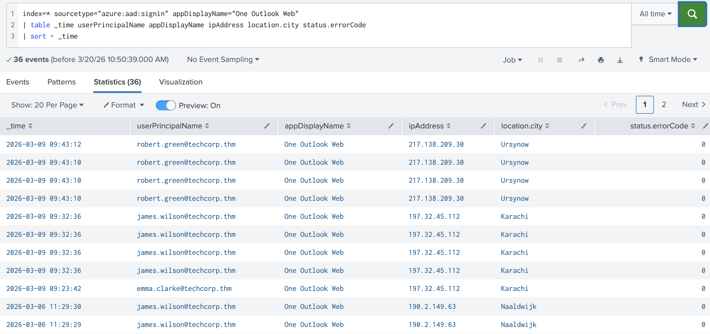
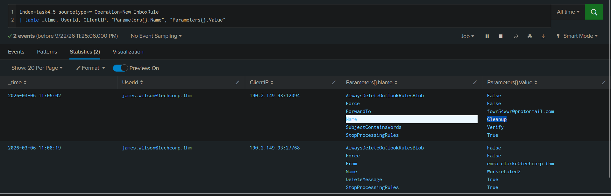
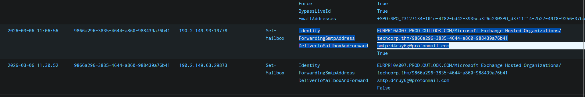
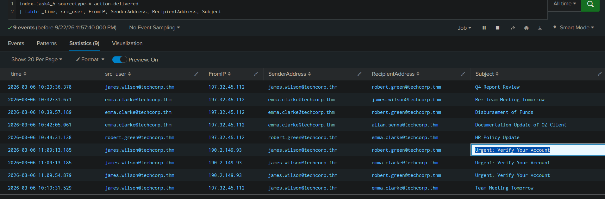
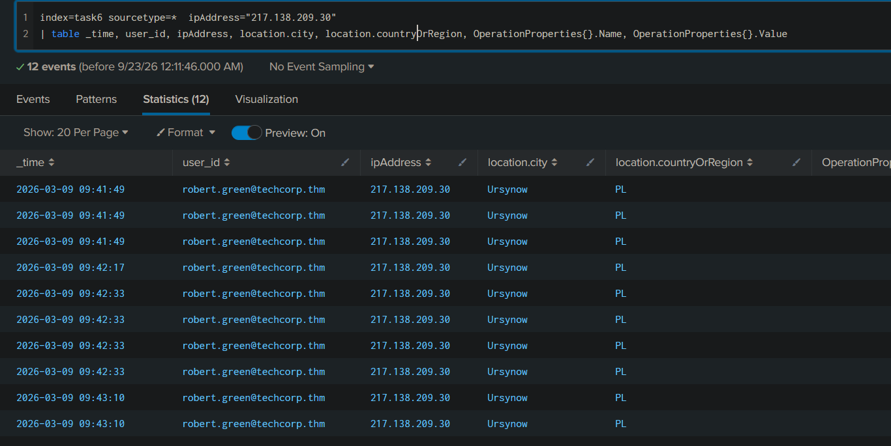
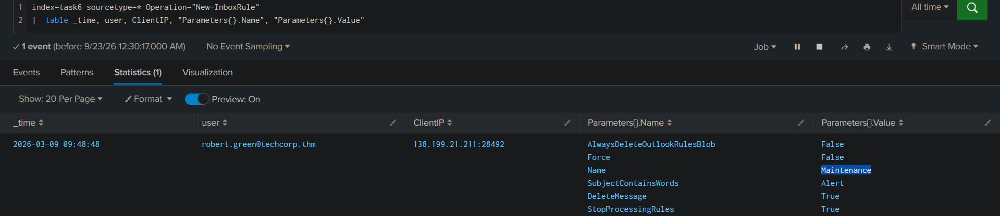
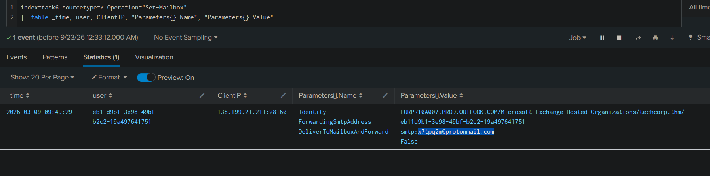
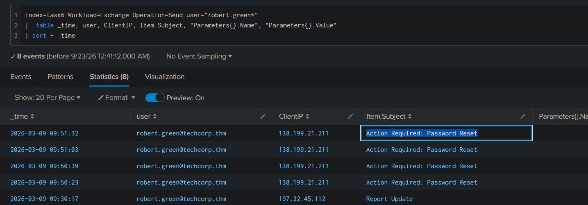
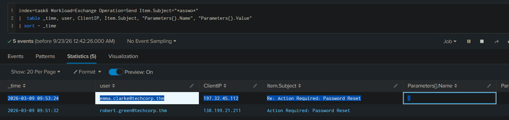

> /AzureDefence/ExchangeOnline Monitoring & Detection

# Microsoft Exchange-Online Monitoring & Detection

Email is one of the most valuable assets inside an organisation. A compromised mailbox can expose sensitive conversations, provide intelligence about internal operations, and, perhaps most dangerously, give an attacker a trusted identity from which to target other employees.

Exchange Online compromises often follow a recognisable pattern. An attacker first obtains credentials, accesses the mailbox, reads emails to understand the environment, establishes persistence through rules or forwarding, and eventually weaponises the trusted account to send phishing emails.



In this article, we'll investigate that attack chain using **Exchange Online sign-in logs, Microsoft 365 unified audit logs, and message trace logs in Splunk**. The goal is not simply to find suspicious events, but to connect them into a timeline that explains what the attacker did and how far the compromise spread.

## The Exchange Online Evidence Trail

Three log sources give us different pieces of the investigation.

| Log source                  | What it tells us                                                    |
| --------------------------- | ------------------------------------------------------------------- |
| **Entra ID Sign-in Logs**   | Who authenticated, from where, and whether authentication succeeded |
| **M365 Unified Audit Logs** | What the user did inside Exchange Online                            |
| **Message Trace**           | Who received an email, whether it was delivered, and when           |

The distinction is important. An audit event can tell us that an email was sent, but it does not necessarily tell us who received it. Message trace fills that gap.

## Finding The Initial Access

Every Exchange Online authentication passes through Entra ID, leaving a sign-in event behind. We can start by looking specifically for the Exchange Online application.

```spl
index=* sourcetype="azure:aad:signin" appDisplayName="One Outlook Web"
| table _time userPrincipalName appDisplayName ipAddress location.city status.errorCode
| sort - _time
```



This gives us the account, source IP, location, and authentication result. For an incident investigation, an unfamiliar location or IP becomes the first clue that the mailbox may have been accessed by someone other than its owner.

The `appDisplayName` value that confirms access to the Exchange Online mailbox is **`One Outlook Web`**.

Once the suspicious authentication has been identified, the next question is what happened after the attacker got inside.

## Following The Attacker Inside The Mailbox

Authentication only tells us that someone got through the door. The unified audit logs tell us what they did after entering.

```spl
index=* sourcetype="o365:management:activity" Workload=Exchange
| table _time UserId Operation Workload
```

The `Operation` field is particularly useful because Exchange records specific actions such as `MailItemsAccessed`, `Send`, `New-InboxRule`, `Set-InboxRule`, `Set-Mailbox`, and `Add-MailboxPermission`.

These operations map neatly onto different stages of a compromise:

```text
Mailbox Access
     ↓
MailItemsAccessed
     ↓
Persistence
     ├── New-InboxRule / Set-InboxRule
     ├── Set-Mailbox
     └── Add-MailboxPermission
     ↓
Phishing
     └── Send
     ↓
Message Trace
```


That gives us a practical investigation path rather than treating every Exchange event as an isolated alert.

## Finding The Attacker's Persistence

Once an attacker has explored the mailbox, the next problem is maintaining access and hiding their activity.

Exchange Online provides several legitimate features that attackers can abuse for this purpose. Inbox rules can silently manipulate messages, mailbox-level forwarding can copy everything to an external address, and delegate permissions can provide continued access to the mailbox.

The first place to look is newly created inbox rules.

```spl
index=* Workload=Exchange Operation=New-InboxRule
| table _time UserId Name DeleteMessage ForwardTo SubjectContainsWords
```

The rule parameters are particularly valuable. `SubjectContainsWords` tells us what message content triggers the rule, while `DeleteMessage` and `ForwardTo` reveal what happens when the condition is met.

A rule with `DeleteMessage=True` deserves immediate attention. An attacker can use this to automatically remove replies to phishing emails, preventing the legitimate mailbox owner from discovering that their account is being abused.

Forwarding rules can serve a different purpose. Rather than hiding replies, they can silently send selected messages to an external address controlled by the attacker.

**Rule to silently copy emails**



The practical questions here are straightforward: **what is the name of the suspicious forwarding rule, and what word does it trigger on in the subject?**

Those values come directly from the `Name` and `SubjectContainsWords` fields.

## Checking Mailbox-Level Forwarding

Inbox rules can selectively forward messages. `Set-Mailbox` forwarding is broader because it can forward incoming mail at the mailbox level.

```spl
index=* Workload=Exchange Operation=Set-Mailbox
| table _time UserId ForwardingSmtpAddress DeliverToMailboxAndForward
```

The most important field here is `ForwardingSmtpAddress`. An unexpected external address is a strong indicator that mailbox data may be leaving the organisation.

`DeliverToMailboxAndForward=False` is particularly interesting because the forwarded message does not remain in the victim's mailbox. That gives the attacker a much quieter channel for collecting incoming information.

The investigation question is therefore: **to which external address was the mailbox forwarding email?**

Attacker attached a **forwarding email** where the emails will be copied without detection.


## Checking Delegate Access

Another persistence mechanism is delegate access.

An attacker can grant another account access to the compromised mailbox using the `Add-MailboxPermission` operation. Unlike forwarding, this can provide interactive access to the mailbox itself.

The `Trustee` field identifies the account that received the permission. An unexpected delegate, particularly one added around the same time as a suspicious sign-in, should be treated as part of the same investigation rather than as an unrelated administrative change.

## From Reading Emails To Sending Phishing

A sophisticated attacker rarely starts blasting phishing emails immediately after gaining access. First, they may read existing conversations to understand projects, employees, terminology, and ongoing business activity.

That behaviour appears as `MailItemsAccessed`.

```spl
index=* Workload=Exchange Operation=MailItemsAccessed
| table _time UserId ClientIPAddress OperationCount
```

The `ClientIPAddress` field helps connect mailbox access to the suspicious authentication source, while `OperationCount` provides an indication of how much mailbox activity occurred.

A high volume of access from an unusual IP can therefore help establish that the attacker was actively exploring the mailbox before weaponising it.

The next step is where the compromised mailbox becomes an attack platform.

Emails sent from Exchange Online generate a `Send` audit event.

```spl
index=* Workload=Exchange Operation=Send
| table _time UserId Item.Subject ClientIP SaveToSentItems
```



Several fields immediately become useful.

`Item.Subject` tells us what the attacker was sending, `ClientIP` connects the message to its originating network, and `SaveToSentItems` can reveal attempts to hide the activity.

`SaveToSentItems=False` is particularly suspicious because the attacker may be deliberately preventing the phishing messages from appearing in the victim's Sent Items.

At this point, we can answer three important questions about the phishing activity: **what was the subject, which IP sent the messages, and whether the sending behaviour matches the suspicious login identified earlier?**

A high volume of messages in a short period, especially from the same unusual IP, can turn what initially looked like a mailbox compromise into an active phishing campaign.

# Message Trace: How Far Did The Phishing Go?

The `Send` operation confirms that the mailbox sent an email, but it does not tell us the complete recipient list.

That is where message trace becomes essential.

```spl
index=* sourcetype="o365:reporting:messagetrace"
| table Received SenderAddress RecipientAddress Subject Status FromIP
```

By filtering on the compromised sender and suspicious subject, we can identify every recipient and determine whether the messages were successfully delivered.

This gives us the scope of the campaign.

```text
Compromised Mailbox
       ↓
Suspicious Send Event
       ↓
Message Trace
       ↓
Recipients Identified
       ↓
Delivery Status Confirmed
       ↓
Potentially Compromised Users Contacted
```

The practical question is not simply "Did the attacker send phishing emails?" It is **how many employees actually received them?**

If multiple employees received the same message, especially across different departments, the incident has moved beyond the original mailbox and requires recipient-level investigation.

# Tracing The TechCorp Attack

Now we can apply everything above to the final investigation.

The scenario begins with an unusual Exchange Online sign-in involving **Robert Green, Finance Manager at TechCorp**. Since all TechCorp employees normally operate from the same office network, an authentication from an unfamiliar city becomes a useful starting point.

The investigation should follow the events chronologically:

```text
Suspicious Sign-in
      ↓
Unfamiliar Location
      ↓
Mailbox Access
      ↓
Inbox Rule Created
      ↓
External Forwarding Configured
      ↓
Emails Read
      ↓
Phishing Email Sent
      ↓
Message Trace Identifies Recipients
      ↓
Recipient Replies
```

First, the Exchange Online sign-in logs establish the malicious login and its city **`Ursynow`**.



Next, the Exchange audit logs reveal the suspicious inbox rule. Its name **`Maintenance`** and trigger condition **`Alert`** help explain how the attacker attempted to hide or redirect messages.



The same audit logs expose the mailbox-level forwarding configuration through **`ForwardingSmtpAddress`**, giving us the external destination used by the attacker.


We then pivot to `Send` events to identify the phishing email's subject and the IP address from which it was sent. Because the organisation uses a common office network, that IP can be compared against the legitimate network activity already observed during the investigation.




Finally, message trace tells us which employees received the phishing message. If one of those employees **replied**, that response becomes another useful event in the timeline and may indicate an interaction with the attacker's campaign.



The result is no longer a collection of suspicious log entries. It becomes a coherent incident:

**an external attacker authenticated to Robert's mailbox, established persistence, collected mailbox information, weaponised the trusted account to send phishing emails, and targeted other employees.**

## Cleaning Up The Compromised Mailbox

Once the malicious activity is confirmed, containment should focus on both the compromised identity and the persistence mechanisms.

Suspicious inbox rules and forwarding addresses should be removed, unexpected mailbox delegates should be revoked, and the compromised account should have its password reset. Active sessions and authentication tokens should also be revoked so that previously established access cannot simply continue after the password change.

The investigation should then determine how long the forwarding or mailbox access was active and what sensitive information may have been exposed. Recipients of the phishing campaign should be identified through message trace so they can be warned and investigated for possible follow-on compromise.

Most importantly, the investigation should not end when Robert's account is secured. Any employee who received or interacted with the phishing email may represent the next stage of the attack.

# From Logs To Lessons

Exchange Online compromises rarely announce themselves with one dramatic event. Instead, the evidence is scattered across authentication, mailbox activity, configuration changes, and message delivery records.

A suspicious sign-in establishes the initial access. `MailItemsAccessed` shows the attacker exploring the mailbox. Inbox rules, forwarding, and delegate permissions reveal persistence. `Send` exposes the phishing activity, while message trace shows who was actually targeted.


**The mailbox is not just an email account. Once compromised, it can become an intelligence source, a persistence mechanism, and a trusted phishing platform all at once.**

---

> QXV0aG9yOiBodHRwczovL2dpdGh1Yi5jb20vaGFzaC01NDU=

