> /AzureDefence/M365UserCompromiseAnalysis

# M365 User Compromise Analysis

Modern attackers do not always need malware, exploits, or persistence mechanisms to compromise an organization. In cloud-first environments, stealing valid credentials can be enough to walk through the front door.

A successful login using compromised credentials can blend perfectly with normal user activity. The real evidence often appears later: unusual sign-ins, account modifications, suspicious mailbox activity, or access to sensitive files.

In this article, we will investigate a compromised Microsoft 365 identity using Microsoft Entra ID and M365 logs. We will follow the attack timeline from failed authentication attempts to successful access and analyze what actions the attacker performed after gaining control.

## Why Identity Became the New Attack Surface

Traditional environments often stored identities separately across different applications. Email systems, internal tools, and file-sharing platforms each maintained their own authentication methods, making security controls inconsistent and difficult to manage.

Cloud identity providers changed this model by centralizing authentication and authorization.

Microsoft Entra ID acts as the **identity control plane** for organizations using Microsoft services. It manages **user authentication**, **access permissions**, **Conditional Access policies**, **MFA enforcement**, and **identity activity logging**, providing a centralized platform for controlling and monitoring access across cloud resources.

This centralization improves security visibility, but it also creates a valuable target. If an attacker compromises an identity, they may gain access to multiple connected services without ever touching an internal network.

# The Digital Identities

An identity represents an entity inside a digital environment. This can be a person, device, or software component.

| Identity Type | Description |
|---|---|
| **Human identities** | Represent users such as employees, contractors, and partners. |
| **Workload identities** | Represent applications, scripts, services, or automated processes that require access to other systems. |
| **Device identities** | Represent machines such as laptops, servers, and IoT devices. |

An Identity Provider (IdP) manages these identities by handling authentication, authorization, and activity tracking. **Microsoft Entra ID** is one example of an identity provider. It allows organizations to manage access centrally while providing detailed logs for security monitoring.

## Why Attackers Target Cloud Credentials

Cloud identities are attractive because they provide legitimate access. An attacker with valid credentials can:

* Access cloud services remotely.
* Use Single Sign-On (SSO) to reach connected applications.
* Read emails and documents.
* Modify account settings.
* Maintain access through application permissions or mailbox rules.

Traditional security tools may not detect these actions because there is no malicious file or suspicious process. From the system's perspective, a valid user account is simply logging in.

The challenge for defenders is identifying when legitimate authentication becomes malicious behaviour.

## The Hidden Risks Behind Cloud Identity Security

Identity providers provide strong security controls, but their effectiveness depends on proper configuration.

Common weaknesses in cloud identity environments usually come from misconfigurations rather than platform limitations. **Missing MFA enforcement** allows attackers with stolen credentials to authenticate directly. **Weak Conditional Access policies** may permit risky sign-ins from unusual locations or devices. **Excessive administrative permissions** increase the impact of a compromised account, while **poor password protection** makes credential attacks easier. Without **sufficient identity monitoring**, suspicious activities can remain unnoticed for longer periods.

> Attackers often exploit configuration gaps rather than technical vulnerabilities.

# Entra ID Logs: Following the Authentication Trail

When investigating identity-based attacks, logs become the primary source of evidence.

Entra ID records authentication events including:

| Log Data | Description |
|---|---|
| **Sign-in Status** | Records successful and failed authentication attempts. |
| **Source IP Address** | Shows the originating IP address of the authentication request. |
| **Geographic Location** | Provides location information associated with the sign-in activity. |
| **Authentication Method** | Shows how the user authenticated, such as password or MFA. |
| **Device Information** | Provides details about the device used during authentication. |
| **Conditional Access Results** | Shows whether access policies allowed, blocked, or required additional verification. |

In this scenario, the investigation begins with multiple `failed authentication` attempts followed by a successful login. This pattern is commonly associated with credential attacks such as password spraying or brute force attempts.


In our sandbox, using Splunk, Entra ID sign-in logs can be filtered with:

```json
index=scenario sourcetype="azure:aad:signin"
```

Failed authentication attempts can reveal useful indicators such as:

```json
index="scenario" sourcetype="azure:aad:signin" "status.errorCode"!=0
| stats count as event_count values(ipAddress) as ip_addresses values(appDisplayName) as applications values(status.errorCode) as errorCodes by userPrincipalName
| sort - event_count
```

**Attacker's IP** involved in brute-force.
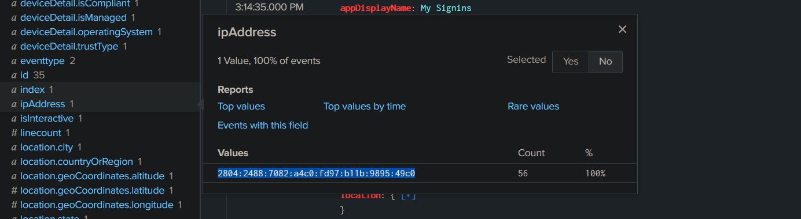

Common authentication failure codes include:

* `50126` - Invalid username or password.
* `50053` - Account locked due to excessive failed attempts.
* `50074` - MFA required but not provided.

After identifying the attacker IP, successful sign-ins from that address can reveal the compromised account.

```json
index=scenario sourcetype="azure:aad:signin" "status.errorCode"=0 ipAddress="<ATTACKER-IP>"
```

This provides the first major piece of the investigation: which identity was compromised and how the attacker accessed it.

**Compromised User**
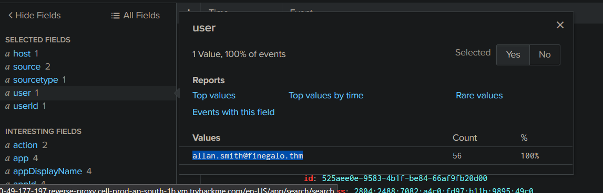


**IP Location**
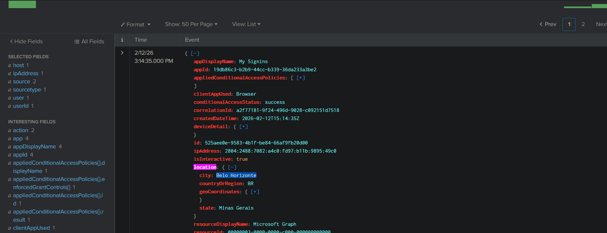

**First Successful Signin**
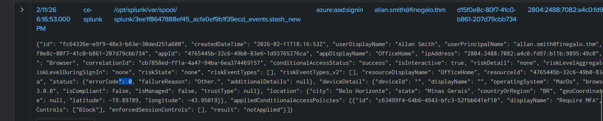

**App touched by attacker after sign-in**
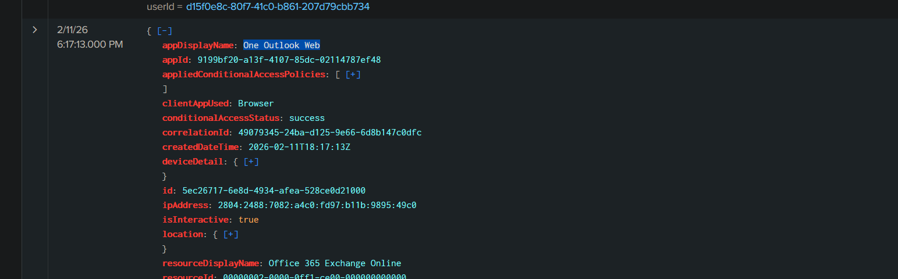


## Tracking Post-Compromise Actions

Authentication only tells us that an account was accessed. The next question is what happened afterward.

Entra ID Audit Logs record changes made within the environment, including:

* Password changes.
* MFA modifications.
* Role assignments.
* Application registrations.
* User attribute changes.

A compromised account may be modified to maintain attacker access.

Audit logs can be reviewed using:

```json
index="scenario" sourcetype="azure:aad:audit"
```

Important fields include:

* `activityDisplayName` - The action performed.
* `initiatedBy` - The account or application responsible.
* `targetResources` - The affected object.

By correlating sign-in activity with audit events, analysts can determine whether the attacker simply accessed an account or attempted to expand control. On the basis of our investigation, following highlights are traced.

**First two post-compromise changes** made in account. Attacker manipulating security credentials to maintain persistence.
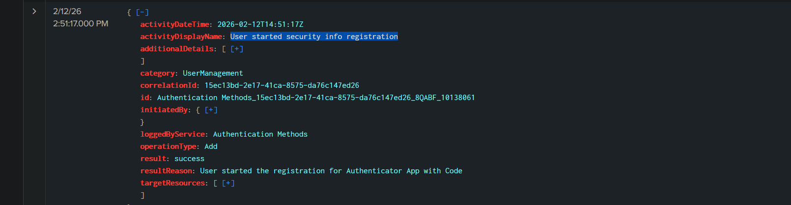
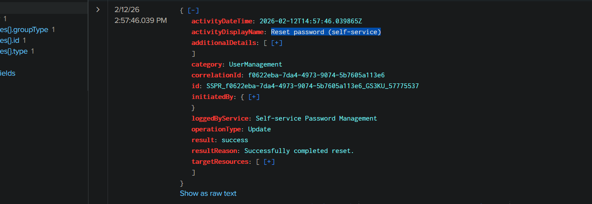


## Microsoft 365 Compromise Trail

Microsoft 365 contains the services users interact with daily:

* Exchange Online for email.
* SharePoint for collaboration.
* OneDrive for file storage.
* Teams for communication.

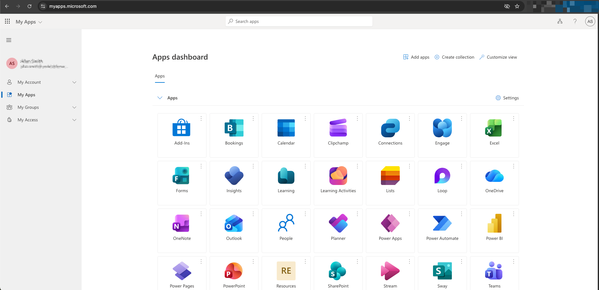

For attackers, these services are valuable because they contain sensitive business information and provide additional persistence opportunities.

Common attacker actions include:

```text

Compromised Account
        ↓
Read sensitive emails
        ↓
Create mailbox forwarding rules
        ↓
Download confidential files
        ↓
Send phishing messages
        ↓
Modify application permissions

```

M365 activity is recorded in the Unified Audit Log. In Splunk, these events can be searched using:

```json
index="scenario" sourcetype="o365:management:activity"
```

Important fields include:

* `Operation` - The action performed.
* `UserId` - The account performing the action.
* `Workload` - The affected M365 service.
* `ClientIP` - Source address.
* `ObjectId` - Target resource.

To investigate actions performed by the compromised account:

```json
index="scenario" sourcetype="o365:management:activity" UserId="<USER-EMAIL>"
| sort - _time
| table _time, Operation, UserId, ClientIP, Workload, ObjectId
```

**Exchange** app used and manipulated by attacker.
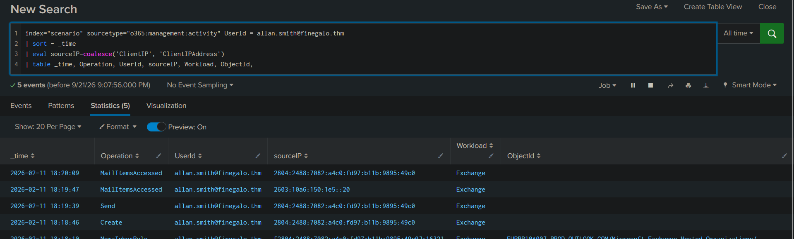


**New-InboxRule** created by the attacker to spy on emails
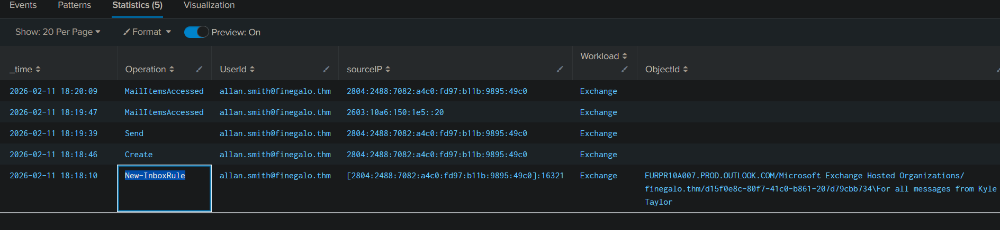

**Email sent** by the attacker, requesting network-level access as a legitimate user.
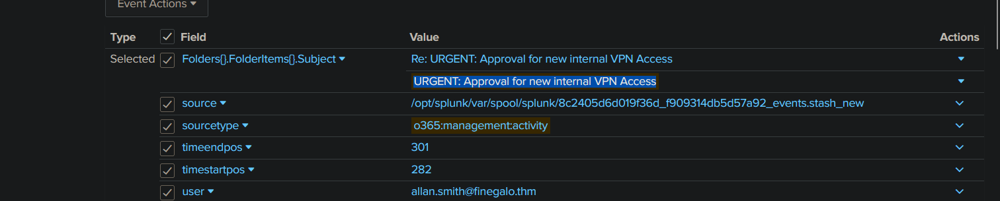

**The reply of the email is stored in the junk folder to avoid detection by the actual user.**
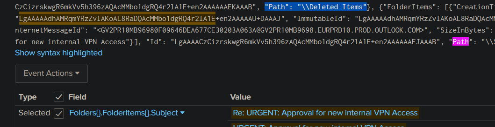

These findings illustrate how attackers, from one single compromised identity, can manipulate other apps and services and distort normal day operations. This is a usual case in data-exfiltration aiding in `industrial espionage` when spreading to enterprise level.
One single identity compromise can bring an organization down to its knees.


# Detection and Defense

The investigation follows a timeline:

> The attacker first attempts authentication using stolen credentials.

> After multiple failed attempts, one login succeeds.

> The compromised identity is identified through Entra ID sign-in logs.

> Audit logs reveal changes made to the account after compromise.

> Microsoft 365 logs show what the attacker accessed or modified after gaining entry.

Each log source provides a different piece of the puzzle. Alone, events may appear harmless. Together, they reveal the attack story. Security teams should focus on reducing the impact of compromised identities by enforcing strong authentication and monitoring behaviour.

Multi-factor authentication prevents attackers from accessing accounts using only stolen passwords. Conditional Access policies can restrict risky sign-ins based on location, device, or authentication conditions.

Regular monitoring of Entra ID sign-in logs and M365 audit logs helps identify suspicious activity such as impossible travel, unusual locations, mailbox manipulation, or unexpected application access.

Identity security is not only about protecting passwords. It is about monitoring the entire lifecycle of authentication, authorization, and user activity.

# From Logs to Lessons

Cloud attacks often leave fewer traditional indicators than endpoint attacks. There may be no malware sample, suspicious process, or network beacon.

The identity itself becomes the attack surface.

Entra ID logs reveal how attackers enter. M365 logs reveal what they do after entry. Together, they provide the visibility required for modern cloud investigations.

A compromised account is not just a login event. It is a sequence of actions, and the timeline is where the evidence lives.

---

> QXV0aG9yOiBodHRwczovL2dpdGh1Yi5jb20vaGFzaC01NDU=
