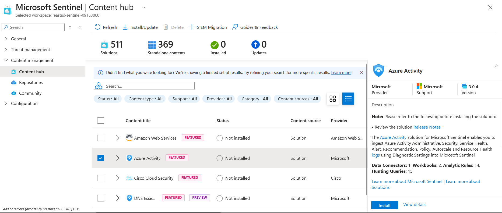
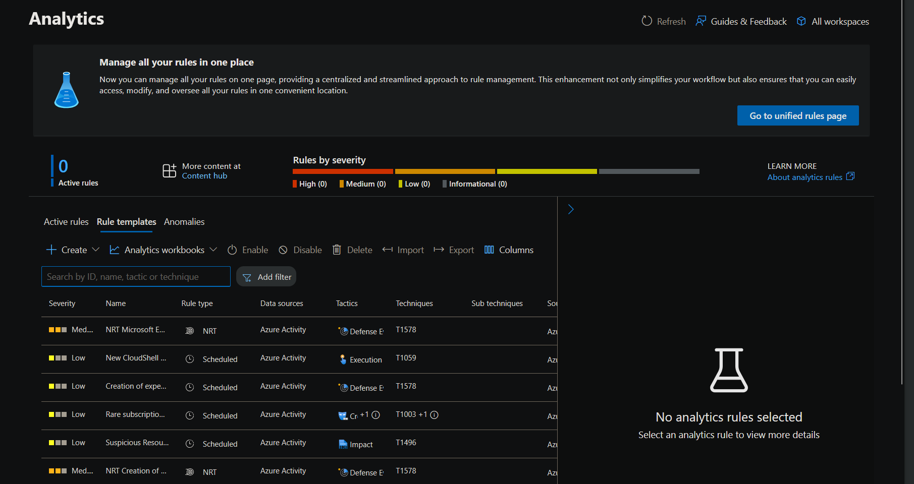
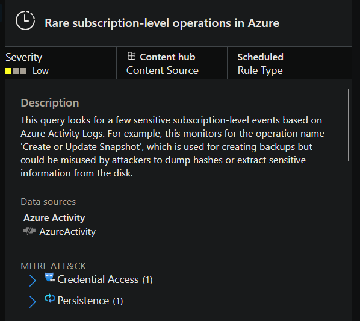
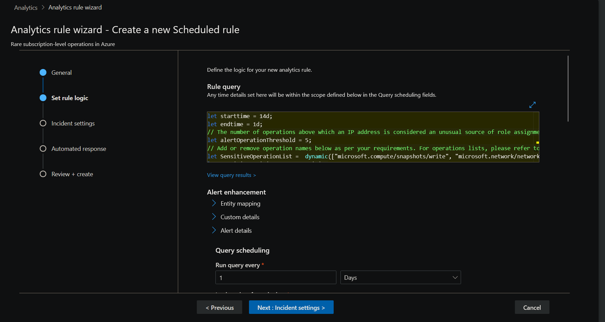
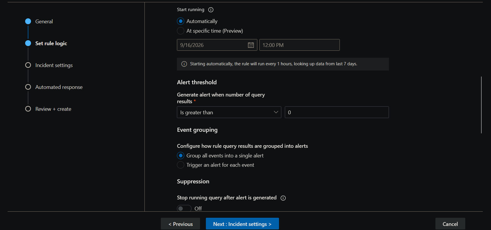
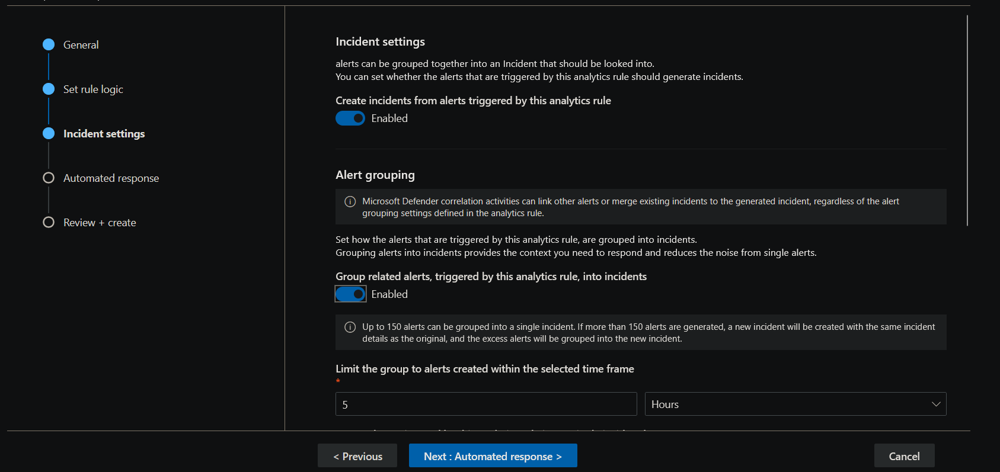
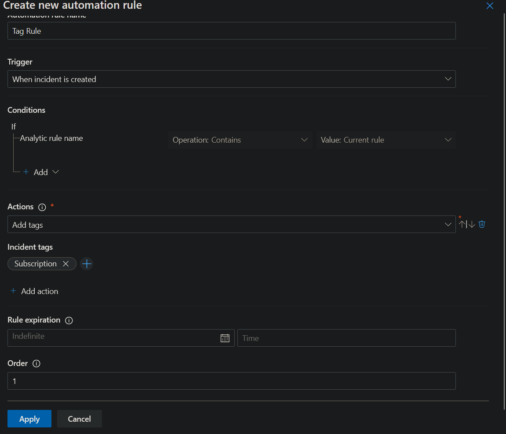
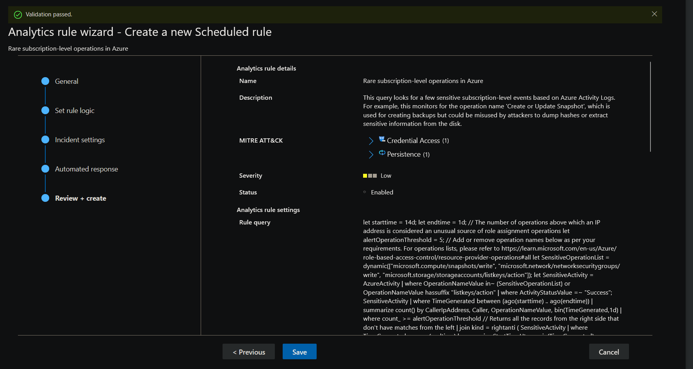
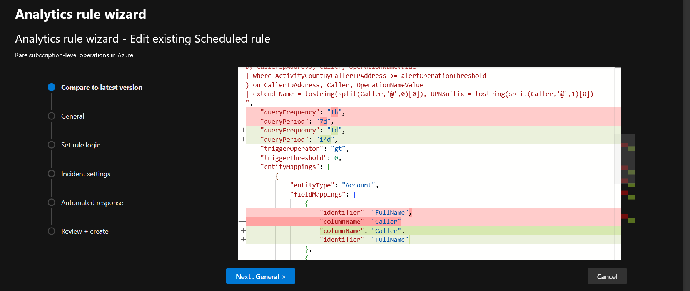

> /AzureDefence/Rules&ThreatDetection

# Sentinel Rules Configuration & Threat Detection

Getting Microsoft Sentinel deployed and feeding it logs is only half the job. A SIEM can happily collect thousands of events while a real attack walks through the environment unnoticed.

The real value begins when Sentinel starts asking questions of that data.

This is where Analytics rules come in. They continuously evaluate ingested security data, look for conditions associated with suspicious activity, and turn matching events into alerts that can become incidents for SOC analysts to investigate.

In this article, we move from simply collecting telemetry to actually using it for threat detection.

# From Raw Logs To Security Incidents

Manually reviewing raw logs at scale is not a realistic detection strategy. Even a relatively quiet environment can generate an enormous amount of activity, and buried somewhere inside that noise could be the one event that matters.

Microsoft Sentinel Analytics provides the detection layer between that raw telemetry and the SOC analyst.

Analytics rules contain detection logic that evaluates incoming or historical data. When the conditions defined by a rule are satisfied, Sentinel generates an alert. These alerts can then be grouped into incidents, giving analysts a structured investigation rather than a pile of disconnected log entries.

The basic flow is:

Data is ingested into Sentinel → Analytics rule evaluates the data → Detection condition is satisfied → Alert is generated → Related alerts can be grouped into an incident → SOC analysts triage and investigate.

This distinction is important: **Analytics rules generate alerts, while incidents are containers that can group related alerts.**

That incident then becomes something a SOC analyst can assign, investigate, correlate, escalate, or close.

# The Shortcut To Better Detection

SOC analysts are not expected to reinvent every detection from scratch.

Microsoft provides Analytics rule templates based on known threats, common attack techniques, and suspicious activity patterns. These templates contain the detection logic and supporting metadata needed to build a rule for an environment. The analyst's job is usually to take an appropriate template, review its logic, adapt the configuration to the environment, and enable it.

The Analytics interface provides three important areas:

**Active rules** contain the detections currently enabled in the environment.

**Rule templates** contain available detection logic that can be configured and enabled.

**Anomalies** focus on unusual behaviour involving entities over a period of time.

Rules can also be filtered by attributes such as severity, rule type, data source, MITRE ATT&CK tactics, and techniques. This makes it easier to find detections relevant to a particular environment or attack scenario.

Severity gives analysts an immediate idea of potential priority. High, medium, and low severity rules are visually distinguished in the interface, helping analysts quickly understand the intended importance of a detection.

## Choosing The Right Detection Engine

Not every Analytics rule watches the environment in exactly the same way.

**Scheduled rules** are the most common type. They execute according to a defined schedule, such as every hour, and evaluate a specified lookback period.

**Near-Real-Time rules**, or NRT rules, are designed for scenarios where waiting for a normal scheduled execution is undesirable. They can execute approximately every minute.

**Fusion** is Sentinel's correlation engine for detecting advanced multistage attacks. It uses machine learning and correlation to combine multiple lower-fidelity signals into higher-confidence incidents.

**ML Behavioral Analytics** uses Microsoft's machine-learning-based behavioural detections. The internal detection logic is not exposed for modification in the same way as a normal KQL-based scheduled rule.

**Threat Intelligence** detections can match telemetry against threat intelligence indicators such as malicious domains, IP addresses, and URLs.

For this article, the focus is on **Scheduled Analytics rules** because their `KQL` detection logic is visible and can be examined or customized.

## What An Analytics Rule Actually Contains

Before creating a detection, it helps to understand what sits underneath the wizard.

The **General** section defines the basic identity and metadata of the rule, including its name, severity, description, and other detection information. MITRE ATT&CK mappings can also show which tactics and techniques the detection relates to.

The **Set rule logic** section contains the actual detection query. Scheduled rules commonly use Kusto Query Language, or KQL, to search the relevant telemetry.

For someone new to Sentinel, modifying the existing query is not always necessary. More often, the important first step is understanding what the query is looking for and making sure its scheduling and scope fit the environment.

The query schedule determines how frequently the detection runs and how far back it looks when evaluating data. These two settings need to make sense together. A rule running every hour with a seven-day lookback is examining a much larger window than one running every hour with a one-hour lookback.

The wizard can also provide a results simulation, allowing the analyst to see how the rule behaves against available data before committing the configuration.

## Alerts Become Incidents

The **Incident settings** section controls what happens when a rule produces alerts. The important distinction remains:

```text
Rule → Alert → Incident
```

The rule detects the activity. The resulting alert describes the detection. Sentinel can then create an incident from that alert and, where appropriate, group related alerts together.

Alert grouping is particularly useful for reducing SOC noise. A single attack may produce multiple related alerts, and treating every alert as a completely separate investigation can create unnecessary analyst workload.

The goal is not simply to generate more alerts. It is to generate useful alerts and organize them into actionable incidents.

## Then Comes The Response

Detection is only one side of the SOC equation. Once something suspicious has been identified, Sentinel can also automate parts of the response.

The **Automated response** section provides automation options that can react to alerts or incidents.

Automation can be triggered when an incident is created or updated, or when an alert is created. Available actions include running a playbook, changing status or severity, assigning an owner, adding tags, and adding investigation tasks.

This is where Sentinel starts crossing from SIEM into SOAR territory.

For example, a detection could automatically assign an incident to a particular analyst, add a classification tag, or launch a playbook that performs additional response actions.

Automation should still be designed carefully. Automating a bad detection simply turns a false positive into a faster false positive.

## What Analytics Can Actually Tell Us

`A well-designed detection is more than a red warning box.`

By correlating and matching relevant signals, security analytics can help establish where suspicious activity originated, which resources may have been affected, what information could potentially have been exposed, and how activity unfolded over time.

That makes Analytics useful across several SOC activities, including compromised-account detection, user behaviour analysis, network traffic analysis, data-exfiltration detection, insider-threat detection, incident investigation, and threat hunting.

The important part is the analytical mindset. The rule should answer a security question, not merely search for interesting log entries.

## Let's Put The Rule To Work

The theoretical machinery is in place. Now we have a Sentinel workspace receiving data, and the task is to turn one of Microsoft's detection templates into an active detection.

The scenario is straightforward: the organization has recently deployed Microsoft Sentinel, a data connector is already connected and populated, and we have been asked to enable an Analytics rule for threat detection.

Our account has the **Microsoft Sentinel Contributor** role with read/write access to the associated Log Analytics workspace.

## Installing The Detection Content

The detection we need comes from the Azure Activity content package.



Navigate to **Content management → Content hub** and search for **Azure Activity**.



Install the package so that its associated Analytics templates become available to the Sentinel workspace. The template library contains a large collection of possible detections. Instead of scrolling through the entire catalogue, search for **rare subscription-level**.

The relevant detection is **Rare subscription-level operations in Azure**. This is a Scheduled Analytics rule designed to `identify unusual or sensitive subscription-level operations` within Azure Activity Logs.


## Reading The Detection Before Enabling It

The Analytics rule wizard opens with the rule configuration divided into several sections.

The first stop is **General**.



Rather than immediately clicking through the wizard, read the description. A detection should be understood before it is deployed, especially when it is going to create incidents that eventually land in a SOC queue.

The `MITRE ATT&CK` section is also worth inspecting. Expanding it shows the tactics and techniques associated with the detection.

This mapping provides useful context because it tells us where the detection fits within the broader attack lifecycle. In this template, the mapped techniques include areas such as `Persistence and Credential Access`.

The mapping does not make the detection malicious by itself. It simply provides a common language for understanding the activity the rule is intended to detect.

## Looking Under The Hood

Move to **Set rule logic**.



Here we get to see the actual KQL query powering the detection.

The query needs a schedule. Lets set **Run query every** to **1 hour**. Set the lookup period to **the last 7 days**.

One particularly useful part of the query is the **SensitiveOperationList** array. This contains the subscription-level operations that the detection considers sensitive.

This is also where the difference between using a template and blindly trusting a template becomes obvious. The detection logic can be customized. If an organization considers additional subscription operations sensitive, the relevant values can be added to the detection logic.

The schedule controls when Sentinel evaluates the detection, while the lookup period determines how much historical data each evaluation considers.

This distinction matters. A rule's execution frequency and its data lookback are two separate pieces of the detection strategy.

## Deciding What Becomes An Incident

Move to **Incident settings**.


Alert grouping can also be configured here. Grouping related alerts can reduce unnecessary SOC noise when several alerts are really different pieces of the same activity. For this lab, the defaults are sufficient.

## Adding A Small Piece Of Automation

With the rule enabled, edit it again and return to **Automated response**.


Create a new automation rule with the following configuration:

**Rule Name:** Tag Rule

**Trigger:** When incident is created

**Action:** Add tags

**Tag:** subscription

Leave the rule expiration at its default value. Apply the automation rule.

The purpose here is simple but useful. When an incident generated by this detection is created, Sentinel automatically attaches the `subscription` tag.

Tags can help analysts categorize incidents and make later filtering and investigation easier. In a production environment, this same mechanism could be used for more sophisticated workflows.

Select **Review + create** and save the Analytics rule.



## Comparing The Blueprint With The Build

Return to **Active rules** and select **Rare subscription-level operations in Azure**. The rule details provide a useful final verification point.

Sentinel also provides **Compare with template**, which allows the current rule configuration to be compared against the latest version of its original template in YAML form.



This is particularly useful because templates evolve. The active rule may have been customized for the environment while the upstream template may later receive changes to its query, frequency, entity mappings, or other configuration.

The comparison makes those differences visible rather than leaving the analyst to wonder why the active rule does not perfectly match its original blueprint.

# The Detection Is Now Live

The lab started with a Sentinel workspace that could ingest data. It ended with that data being actively evaluated by a configured detection.

The important workflow is not simply:

**Find template → Click Create → Done.**


It is:

**Understand the threat → Choose an appropriate detection → Inspect its logic → Tune it for the environment → Configure scheduling → Decide how alerts become incidents → Add automation where useful → Verify the active rule → Compare against the original template.**


That is much closer to the actual SOC mindset.

A SIEM without detection logic is essentially an enormous security diary. Analytics rules give that diary a set of eyes, and incident management gives the SOC somewhere to act on what those eyes find.

---

> QXV0aG9yOiBodHRwczovL2dpdGh1Yi5jb20vaGFzaC01NDU=
