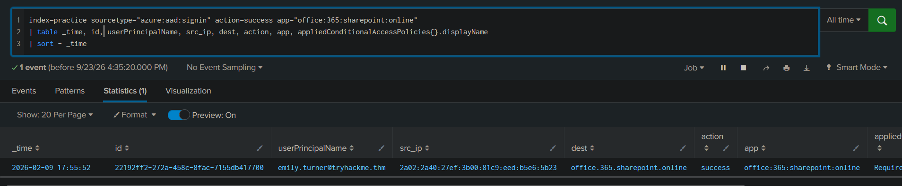
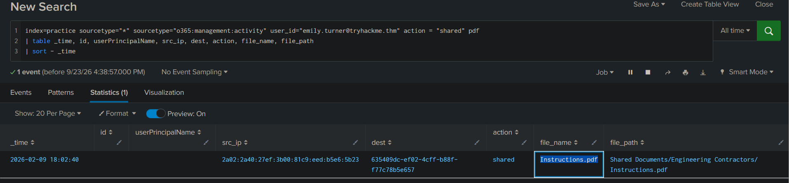
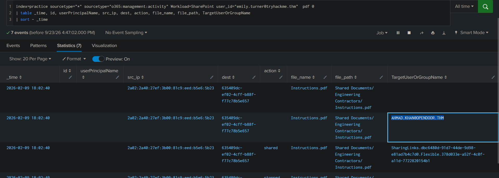
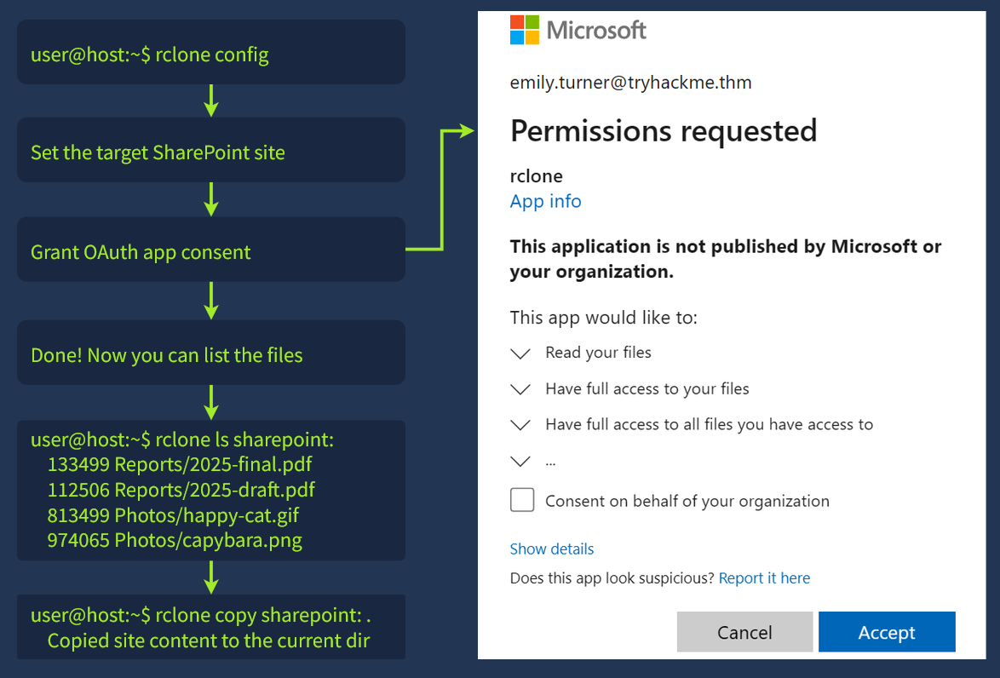
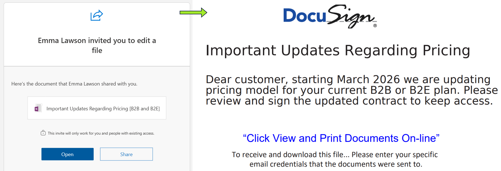
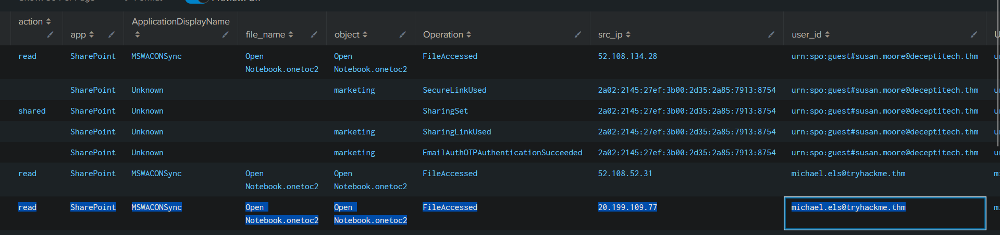
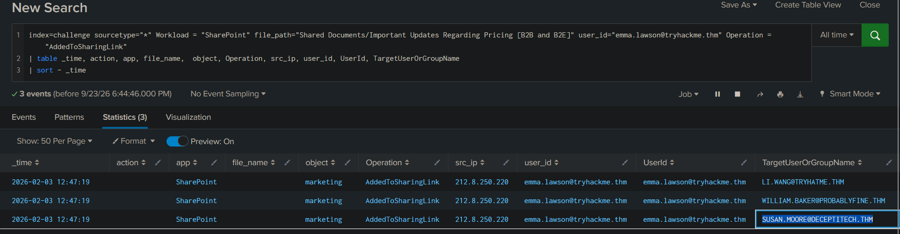
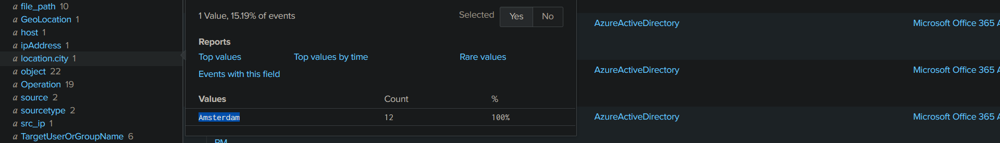
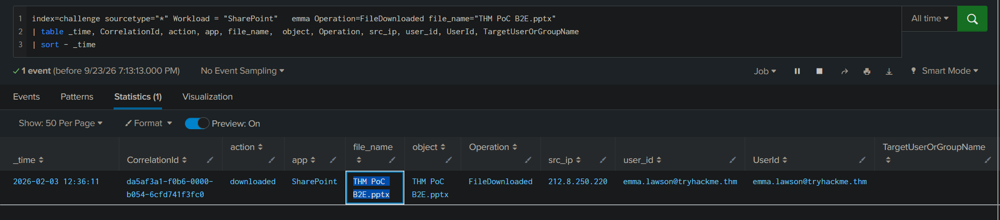

> /AzureDefence/SharePoint Monitoring & Detection

# SharePoint Online Monitoring & Detection

SharePoint Online is one of the most important collaboration services in Microsoft 365. Organizations use it to store documents, reports, internal documentation, and sensitive business data.

This also makes it a valuable target for attackers. A compromised account with SharePoint access can allow attackers to **steal data, distribute malicious files, or launch phishing campaigns** using trusted Microsoft services.

In this article, we will explore how SharePoint activity is recorded, how attackers abuse its features, and how SOC analysts can investigate suspicious activity using Entra ID and Microsoft 365 audit logs.

## Understanding SharePoint Online

SharePoint Online is Microsoft's enterprise collaboration platform for storing and sharing organizational data. While OneDrive is designed for personal file storage, SharePoint is built around team collaboration.

| Service           | Purpose                                               |
| ----------------- | ----------------------------------------------------- |
| OneDrive          | Personal Microsoft cloud storage                      |
| SharePoint Online | Enterprise file collaboration and document management |

SharePoint organizes content into **Sites**, which act as top-level containers holding documents, folders, and other resources.

```text
SharePoint Site
       |
       ├── Document Libraries
       |
       ├── Folders
       |
       └── Files
```

Authentication is handled through **Microsoft Entra ID**, meaning a compromised Microsoft account can provide access to all SharePoint resources available to that user.

```text
Compromised Account
        ↓
 Entra ID Authentication
        ↓
 SharePoint Access
        ↓
 Read / Download / Share Files
```

## Why Attackers Target SharePoint

SharePoint often contains valuable information such as financial reports, customer data, internal documentation, and source code.

After gaining access, attackers may follow a pattern like:

```text
Account Compromise
        ↓
Access SharePoint Files
        ↓
Download Sensitive Data
        ↓
Share Malicious Content
        ↓
Target Other Users
```

Because these actions use legitimate SharePoint features, detection relies heavily on monitoring user activity and understanding logs.

# Monitoring SharePoint Activity

A complete SharePoint investigation requires two main log sources:

| Log Source               | Purpose                                   |
| ------------------------ | ----------------------------------------- |
| Entra ID Sign-in Logs    | Detect SharePoint authentication activity |
| Microsoft 365 Audit Logs | Track file actions and sharing events     |

## Entra ID Sign-in Logs

Sign-in logs show who accessed SharePoint, from where, and whether authentication succeeded.

```spl
index=* sourcetype="azure:aad:signin" appDisplayName="SharePoint Online"
| table _time userPrincipalName appDisplayName ipAddress location.city status.errorCode
| sort - _time
```

The important indicator confirming SharePoint access is:

```text
appDisplayName = SharePoint Online
```

In our sandbox, we can confirm the login into `Emily Turner's` account using following query



## SharePoint File Operations

After login, user activity appears in Microsoft 365 audit logs.

For SharePoint events:

```text
Workload = SharePoint
```

The `Operation` field tells us what action occurred.

| Operation                | Meaning         |
| ------------------------ | --------------- |
| FileCreated/FileUploaded | New file added  |
| FileAccessed             | File opened     |
| FileDownloaded           | File downloaded |
| FileDeleted/FileRecycled | File removed    |


A basic investigation query:

```spl
index=* Workload=SharePoint
| table _time UserId Operation ObjectId
```

Continuing wiht `Emily Turner's` account, we can view which file she uploaded after login



It can also be viewed that Emily forwarded the `Instructions.pdf` file to an external email address which points to data leak/compromise.



Attackers can abuse SharePoint sharing features to expose sensitive files or distribute phishing content.

External sharing events can be identified using:

```spl
index=* Workload=SharePoint Operation IN(AddedToSecureLink, AnonymousLinkCreated)
```


Important fields:

| Field                 | Purpose              |
| --------------------- | -------------------- |
| ObjectId              | Shared file location |
| TargetUserOrGroupName | Sharing recipient    |

To confirm whether the shared file was accessed:

```spl
index=* Workload=SharePoint Operation IN(SecureLinkUsed, AnonymousLinkUsed)
```

A common investigation flow:

```text
File Uploaded
      ↓
External Share Created
      ↓
Sharing Link Used
      ↓
File Accessed
```

This allows analysts to determine whether a file was only shared or actually accessed by an external user.


# Detecting SharePoint Data Exfiltration

After compromising an account, attackers often search SharePoint for sensitive documents such as reports, contracts, or internal files. Depending on their goal, they may access files manually, download selected documents, or use external tools to export large amounts of data.


## Data Access Through Browser

Attackers can use the normal Microsoft 365 portal, making their activity difficult to distinguish from legitimate users.

Important events:

| Operation      | Meaning               |
| -------------- | --------------------- |
| FileAccessed   | File opened or viewed |
| FileDownloaded | File downloaded       |

A sudden increase in downloads from an unusual user or location can indicate possible data exfiltration.

```spl
index=* Workload=SharePoint Operation=FileDownloaded
| stats count by UserId,ObjectId
| sort - count
```

## Data Exfiltration Through External Applications

For large-scale theft, attackers may use tools like **Rclone** to synchronize SharePoint content to external systems.



Useful fields:

| Field                  | Purpose                             |
| ---------------------- | ----------------------------------- |
| ApplicationDisplayName | Identifies the application used     |
| ApplicationId          | Identifies the application instance |
| UserAgent              | Shows client details                |

Example:

```spl
index=* rclone Operation=FileDownloaded
| table _time UserId Operation ApplicationDisplayName ApplicationId UserAgent
```


Unexpected tools such as `rclone`, especially when used by users who normally do not perform bulk file operations, should be investigated.


## Detecting Malicious SharePoint Sharing

The investigation usually follows this sequence:

| Step | Action                  | Evidence                          |
| ---- | ----------------------- | --------------------------------- |
| 1    | Identify malicious file | ObjectId / filename               |
| 2    | Find uploader           | FileCreated / FileUploaded events |
| 3    | Identify recipients     | AddedToSecureLink / SharingSet    |
| 4    | Check who opened it     | SecureLinkUsed / FileAccessed     |

Example searches:

Find who uploaded the file:

```spl
index=m365 Operation IN(FileUploaded,FileCreated) ObjectId=*BADFILE*
| table _time UserId Operation ObjectId
```

Find users who received access:

```spl
index=m365 Operation IN(AddedToSecureLink,SharingSet) ObjectId=*BADFILE*
| table _time UserId TargetUserOrGroupName ObjectId
```

Find users who opened the file:

```spl
index=m365 Operation IN(*LinkUsed,FileAccessed) ObjectId=*BADFILE*
| stats values(UserId)
```

The goal is not only removing the malicious file. A complete investigation must identify everyone who interacted with it.

---

# Investigating The TechCorp SharePoint Incident

A realistic SharePoint investigation requires connecting multiple events together instead of looking at isolated logs.

So the game is,

**The phone rings, it's the SOC manager:**

**"Hey, quick one: our CEO, Michael, wants us to look into a `OneNote` file that was just shared by `Emma Lawson`, our Head of Customer Relationships. The file seems suspicious, and he can't recall approving any pricing updates. Before your shift ends, could you take a look and make sure everything is clean? I'll forward you the screenshots Michael sent me; check your inbox:"**





During the investigation, we'll answer key questions:

| Investigation Question             | Relevant Evidence             |
| ---------------------------------- | ----------------------------- |
| Who accessed SharePoint?           | Entra ID sign-in logs         |
| What files were accessed?          | SharePoint audit logs         |
| What was uploaded?                 | FileUploaded events           |
| Who received the sharing link?     | AddedToSecureLink             |
| Who opened the file?               | SecureLinkUsed / FileAccessed |
| Where did the attacker login from? | Entra ID location fields      |


Correlation IDs are especially useful when tracking a specific sharing event. If a recipient opens a malicious sharing link, the related `CorrelationId` can connect the sharing action with the access event.

A complete investigation focuses on building the timeline:

```
Attack Timeline
│
├── Initial Access
│
├── Reconnaissance
│
├── Data Collection
│
├── Exfiltration
│
└── Attack Propagation
```

**File opened by CEO `Michael`**


The account compromised by the attackers was **`emma.lawson@tryhackme.thm`** and after gaining initial access, attackers liked outside accounts to maintain persistence.


The attack apparently came from IP `212.8.250.220` in **`Amsterdam`**


During the investigation, a file drew attention that was specifically downloaded and exfiltrated by the attackers.


These images demonstrate how powerful SharePoint monitoring and detection logs can be and useful information and actionable insights can be gained to understand the adversaries' act.

# From Logs To Lessons

SharePoint security depends on controlling access and maintaining visibility into user activity. Organizations should enforce **MFA**, regularly review permissions, restrict unnecessary external sharing, monitor file access patterns, and detect unauthorized third-party applications.

| Area | Security Practice |
| ---------------- | ------------------------------------------------ |
| Permissions | Apply least privilege access |
| External Sharing | Restrict unnecessary sharing links |
| Monitoring | Review file downloads and sharing events |
| Applications | Detect unauthorized third-party tools |
| Users | Train employees to identify malicious sharing attempts |

SharePoint attacks are challenging because attackers often abuse legitimate features rather than exploiting technical vulnerabilities. A normal login, file download, or sharing event may not appear suspicious by itself. The real story appears when events are connected together. A suspicious login followed by mass downloads tells a different story. A newly uploaded OneNote file shared with external users tells another.

For SOC analysts, SharePoint logs are not just individual events. They provide the timeline needed to understand how an attacker accessed data, maintained persistence, and attempted to expand their reach.

---

> QXV0aG9yOiBodHRwczovL2dpdGh1Yi5jb20vaGFzaC01NDU=
