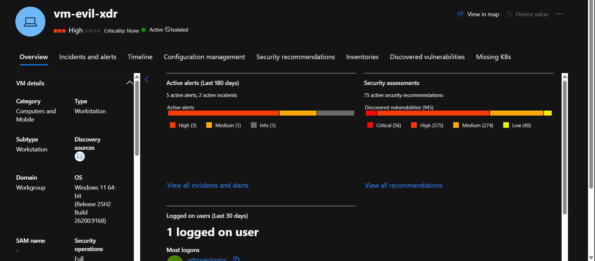
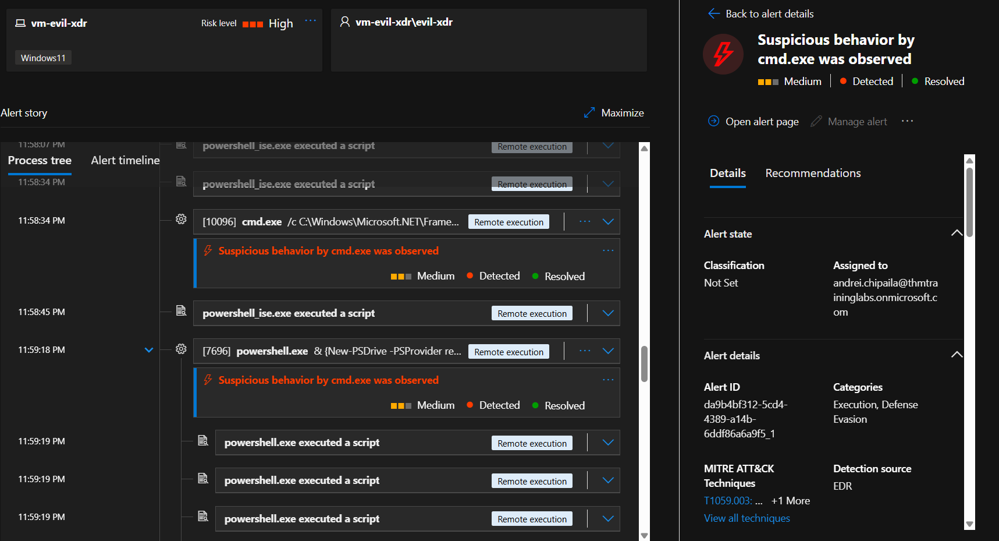
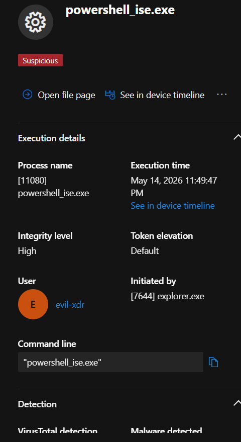
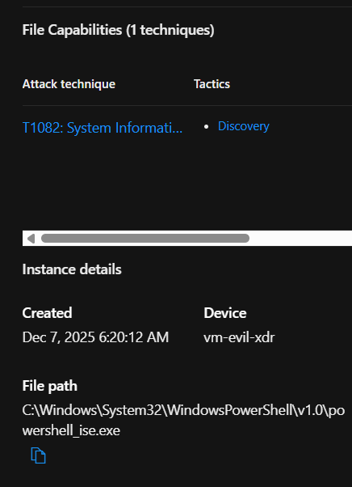
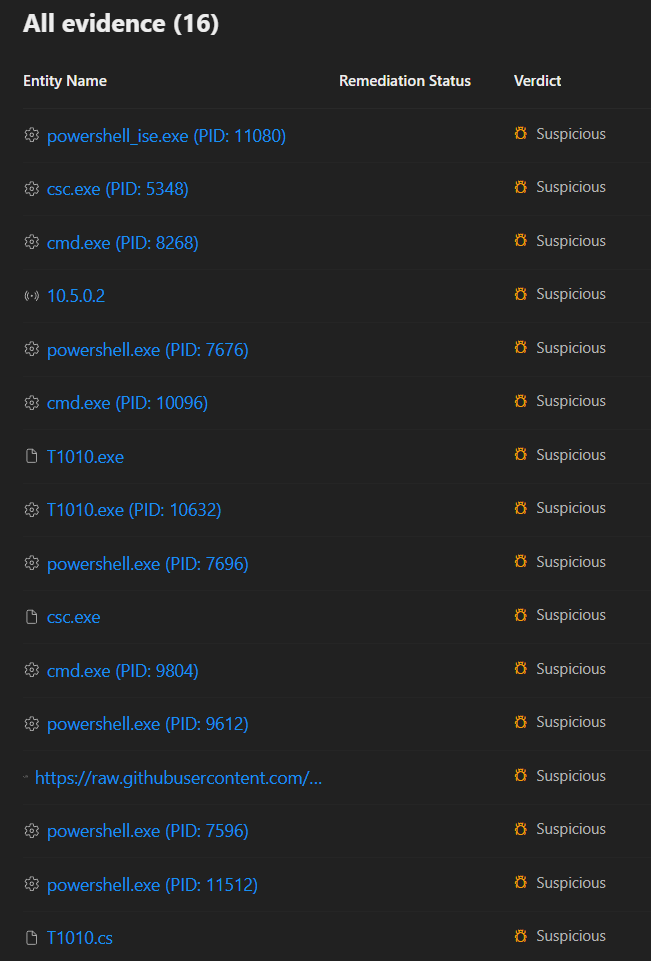
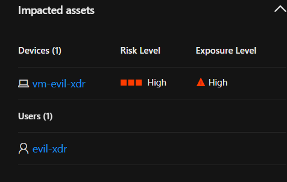
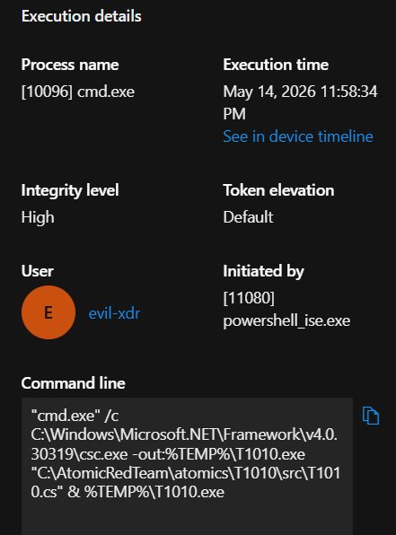
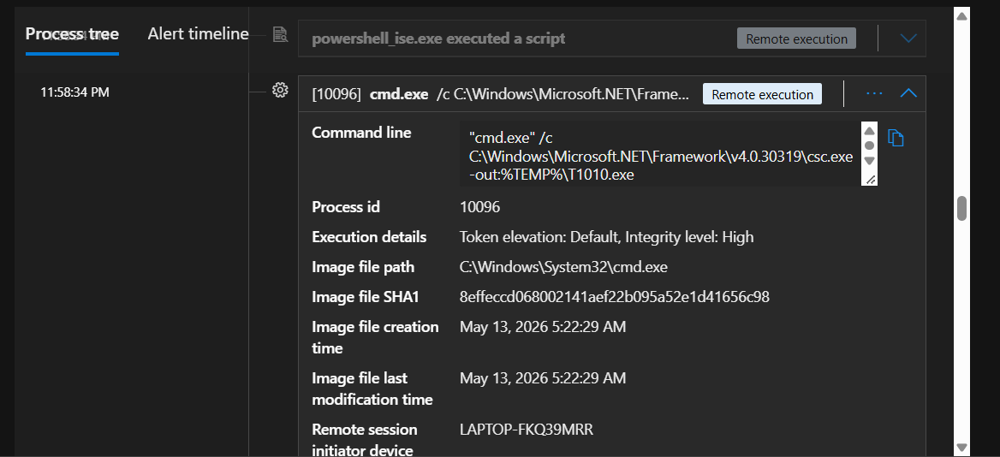
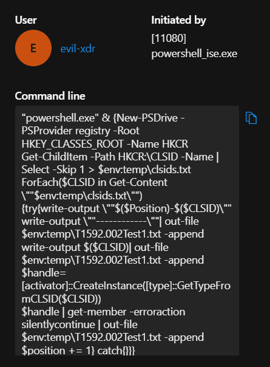
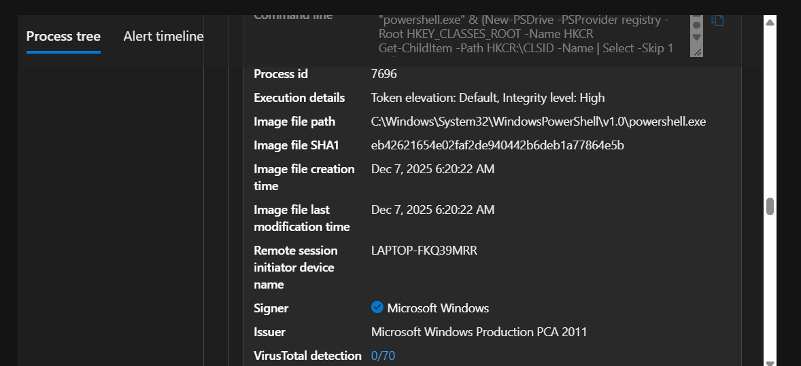

> /AzureDefence/TrackingMaliciousCodeExecution

# Tracking Malicious Code Execution

Modern attackers rarely rely on obvious malware files. Instead, they often abuse legitimate system tools already present in the environment, turning normal features into execution points.

Execution techniques allow attackers to run malicious code after gaining access. This can involve scripts, `PowerShell`, scheduled tasks, or other system utilities. In this article, we will investigate how Microsoft Defender XDR detects execution-based attacks, focusing on malicious `PowerShell` activity and scheduled task abuse.

## Remote Execution Attacks

Execution is the stage where attackers move from having access to actively running their tools or payloads.

Common execution techniques include:

* Command and scripting interpreters such as `PowerShell`, `CMD`, and Bash.
* Malicious files such as `.exe`, `.bat`, and scripts.
* Scheduled tasks used to automatically execute code.
* Exploiting vulnerabilities to run unauthorized commands.

Attackers often abuse trusted utilities because they blend into normal administrative activity. A legitimate PowerShell command and a malicious one may look similar at first, making behavioural detection and investigation essential.

## PowerShell: The Admin's Tool Turned Attack Vector

`PowerShell` is a core Windows administration and automation tool, but its flexibility also makes it attractive to attackers. Threat actors can abuse it to execute malicious commands while blending into normal system activity.

Common abuse includes running malicious scripts, hiding commands through encoding techniques, performing system discovery, and attempting to disable security controls.

The executed command is only one piece of the investigation. Analysts must also examine the surrounding context: the user account involved, the affected device, the parent process that launched PowerShell, and the events before and after execution.

A PowerShell command alone does not tell the whole story. The context reveals whether it is routine administration or malicious activity.

## Scheduled Tasks: Persistence Through Automation

Scheduled tasks automate legitimate Windows activities, but attackers can abuse them to execute malicious code at specific times or events. For example, a malicious task may launch a payload during user login or at a scheduled interval.

Suspicious indicators include:

* Unexpected task creation.
* Unknown executables.
* Unusual execution accounts.
* Hidden or randomly named tasks.

Since scheduled tasks are common in Windows environments, analysts must investigate their context rather than treating every task as malicious.

# Investigating The Execution Incident

In this investigation, Microsoft Defender XDR has detected a suspicious script execution event on a user device. Let's start by reviewing the incident details. 

The alert trail provides several useful investigation points:

* Affected device.
* User account involved.
* Execution time.
* Alert description.
* Related alerts from the attack chain.

Since this is a multi-stage incident, the suspicious script is only one part of the bigger story. Other alerts may reveal how the attacker gained access, what actions followed, and whether additional systems were affected.

## Examining The Alert Timeline

Let's open the specific alert and review the timeline. The alert timeline shows the sequence of events associated with the detection.

Here we can identify:

* The process responsible for execution.
* The command that was executed.
* The time of activity.
* The severity of the alert.

The timeline helps answer a critical investigation question:

"Was this an isolated event, or part of a larger attack chain?"

## Reviewing The Suspicious Script

The alert details provide the actual script content that triggered the detection.

This information allows analysts to perform further investigation by checking `Commands being executed`.

**Parent process triggering alert**

### Files and artefacts associated in the attack

**Assets compromised**

A script containing encoded commands, unusual downloads, or attempts to modify security settings can indicate malicious intent.

The script content becomes an important piece of evidence when deciding whether the activity is malicious.

**cmd command executed**

The above command indicated the execution of a malicious software involved in the attack. It is purely conducted remotely by laveraging `cmd` capabilites. The properties of the command further help in digging and backtracking the impact.

**Powershell command of infection**

The above command furhter laverages powershell to modify registry keys and bypass drive level protectin. The point here, all the script is being executed remotely using a windows' legitimate program `powershell.exe`. [As we can see here,](#files-and-artefacts-associated-in-the-attack) cmd and powershell are being used to compromise the device and fulfill the attacker's objectives.

🔗 [View full incident report](./execution_alert_17144.pdf)

# Response Actions In Microsoft Defender XDR

Once the activity is confirmed as malicious, Microsoft Defender XDR provides several response options.

Depending on the situation, analysts can:

> Run an antivirus scan.

> Collect an investigation package.

> Restrict application execution.

> Start an automated investigation.

> Initiate live response.

> Isolate the affected device.

Device isolation is particularly useful when there is concern that the attacker may continue moving through the environment. Containment turns the investigation from "What happened?" into "How do we stop it from spreading?"

# Preventing Execution-Based Attacks

Detection is only one part of the defence strategy. Preventing execution-based attacks requires reducing the opportunities attackers have to run malicious code in the first place.

Organizations can strengthen their defences by enabling **Attack Surface Reduction (ASR) rules**, monitoring `PowerShell` activity, blocking suspicious scripts, limiting unnecessary administrative privileges, and deploying endpoint detection and response solutions.

Microsoft Defender XDR extends this protection through features such as **Advanced Hunting**, **behaviour-based detection**, **identity monitoring**, and **automated investigation and response**. Together, these capabilities help security teams identify suspicious execution patterns and stop malicious activity before it grows into a larger incident.

# Closing The Investigation

Execution attacks often hide behind legitimate tools. A PowerShell window or scheduled task does not automatically mean compromise.

The investigation process is about understanding the context around the activity: who executed it, what it did, where it came from, and what happened afterward.

Microsoft Defender XDR connects these small pieces of evidence into a bigger picture, helping analysts move from a suspicious command to a complete attack narrative.

---

> QXV0aG9yOiBodHRwczovL2dpdGh1Yi5jb20vaGFzaC01NDU=
