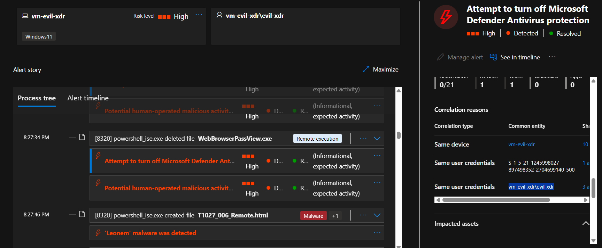
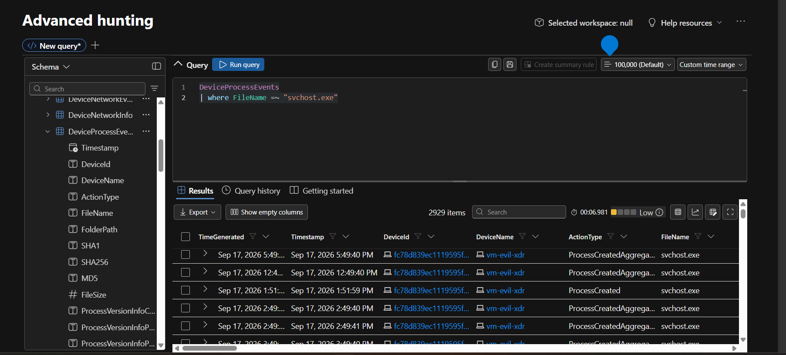
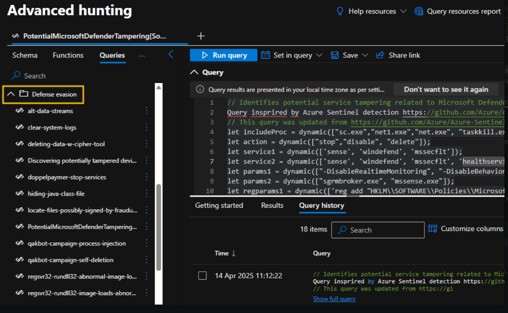
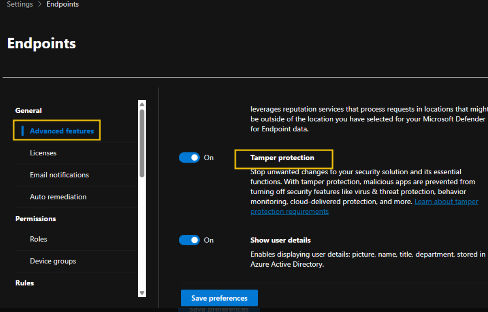

> /AzureDefence/DefenceEvasionDetection&Mitigation

# Defence Evasion Detection & Mitigation

Threat actors cannot orchestrate high-impact data breaches without first neutralizing the security controls standing in their way. Facing robust Endpoint Detection and Response (EDR) solutions, real-time logging, and administrative policy locks makes silent movement almost impossible. As a result, defense evasion becomes an essential prerequisite for maintaining persistent access and carrying out attack objectives without triggering security alarms.

Understanding defense evasion requires looking past basic malware deployment and examining how adversaries actively subvert system integrity. This involves systematically breaking down the mechanics of defense evasion—specifically how security tools are impaired and how malicious activity is disguised—before diving into practical threat hunting and mitigation using Microsoft Defender XDR.

---

# The Anatomy of Evasion

Defense evasion consists of techniques intentionally designed to obscure malicious activity, disable monitoring, and masquerade as trusted operations. Rather than attempting to bypass controls through stealth alone, adversaries often take direct measures against the security infrastructure itself.

```text
Adversary Objectives

1. Neutralize Security Controls (Impair Defense)
2. Blend into System Noise (Masquerading)
3. Maintain Unchecked Persistence

```

## Impairing System Defenses

The `Impair Defense` technique within the MITRE ATT&CK framework involves direct interference with security software, logging services, and administrative security policies. By degrading these protections, adversaries clear a path for unrestricted lateral movement.

| Method | Mechanics | Impact |
| --- | --- | --- |
| `Disabling Security Tools` | Stopping services or uninstalling agents (e.g., stopping antivirus services via command line). | Blindspots on host activities and unmonitored execution. |
| `Evading Logging` | Altering configurations or clearing logs (e.g., terminating Windows Event Log service). | Loss of historical forensic evidence and real-time telemetry. |
| `Manipulating Policies` | Overriding settings via registry edits or Group Policy Objects (GPO). | Suppression of security alerts and forced execution enablement. |

Without active EDR agents or telemetry streams, compromised endpoints turn into operational blind spots where security operations teams lose visibility.

## The Art of Masquerading

When disabling security tools triggers critical alerts, threat actors pivot to blending in. `Masquerading` relies on human confirmation bias and naive detection rules by tricking analysts and systems into treating malicious artifacts as benign.

* **Faking Extensions:** Exploiting default operating system settings that hide known extensions (e.g., naming a payload `invoice.pdf.exe`).
* **Name Squatting:** Naming malicious executables after legitimate system binaries like `svchost.exe`, `notepad.exe`, or `system.dll`.
* **Signature Spoofing:** Signing malicious code with stolen or illegally generated digital certificates to pass trusted publisher checks.


# Hunting The Evasion In Microsoft Defender XDR

Let's shift into the investigation phase. Operating as a SOC Level 1 analyst using Microsoft Defender XDR, our task is to investigate an incident involving an attempt to neutralize host-based antivirus controls.

Let's begin by navigating to the central incident queue to establish responsibility and scope the alert.

Navigate to:

```
Microsoft Defender → Investigation & response → Incidents & alerts → Incidents

```

To capture historical telemetry, adjust the time range filter to display events over the past six months and search for `Attempt to turn off Microsoft Defender Antivirus protection`.




Upon opening the incident details, we review the initial scope:

* **Impacted Device:** `vm-evil-xdr`
* **Target Account:** `evil-xdr`
* **Severity:** `High`
* **Status:** `New` / `Unassigned`

Assigning ownership ensures operational accountability and alerts the wider SOC team that an active investigation is underway. Let's assign this incident to our analyst account and update the status to **In Progress**.

## Following The Evidence Trail

With ownership confirmed, let's open the **Alert Timeline** to reconstruct the exact sequence of events.

The alert timeline displays a chronological breakdown of processes, child processes, and execution arguments. To determine how the evasion was attempted, we analyze the execution properties:

* **Initiating Process:** `cmd.exe`
* **Executed Tool:** `reg.exe`
* **Target Operation:** Registry key modification attempting to set Defender enforcement values to disabled.


**The chain of commands executed**


Let's inspect the initiating process details to examine the exact command line executed by the threat actor:

```cmd
reg.exe add "HKLM\SOFTWARE\Policies\Microsoft\Windows Defender" /v DisableAntiSpyware /t REG_DWORD /d 1 /f

```

The command explicitly manipulates registry policies to set `DisableAntiSpyware` to `1`. This confirms a deliberate effort to disable real-time host protection.

## Analyzing Extracted Entities

Let's extract and review the entities tied to the incident to identify compromised accounts and malicious infrastructure.

The Defender XDR entity mapping isolates several critical artifacts:

* **Host Entity:** `vm-evil-xdr`
* **Account Entity:** `evil-xdr`
* **Network Entity:** External IP Address details logged during initial access.

Correlating authentication records for user `evil-xdr` reveals multiple failed authentication attempts immediately preceding a successful interactive logon.

This pattern suggests a brute-force or credential-stuffing attack that successfully compromised the account, followed by an immediate attempt to disable local defenses.


# Proactive Detection & Hunting

Relying solely on built-in detection rules can leave gaps when attackers use subtle masquerading tactics. Let's use **Advanced Hunting** with Kusto Query Language (KQL) to hunt for suspicious processes masquerading as core system components.

A common masquerading technique involves running system binaries like `svchost.exe` outside their designated system directories.

Navigate to:

```
Microsoft Defender → Hunting → Advanced hunting

```

Let's run the following KQL query to detect instances of `svchost.exe`:

```kql
DeviceProcessEvents
| where FileName =~ "svchost.exe" 

```

**A simple KQL command showing svchost execution**



Running such queries check execution paths across all onboarded endpoints. Any instance of `svchost.exe` running from user profile paths, temporary folders, or non-standard directories highlights potential masquerading that warrants immediate containment.


**A sophisticated command with pinpoint precision detecting tampering in defender portal**




# The Evidence Board

The investigation into `vm-evil-xdr` reveals a clear sequence of compromise and defense evasion:

| Finding | Details | Security Impact |
| --- | --- | --- |
| `Initial Access` | Successful logon following multiple failed attempts on user `evil-xdr`. | Account compromise via credential attack. |
| `Evasion Technique` | Registry modification via `reg.exe` targeting `DisableAntiSpyware`. | Direct `Impair Defense` execution attempt. |
| `Process Lineage` | `cmd.exe` spawning `reg.exe` with elevated parameters. | Arbitrary local administrative command execution. |
| `Threat Status` | Evasion attempt flagged and isolated prior to system-wide compromise. | EDR telemetry captured the modification attempt despite the registry edit. |

# Hardening & Remediation

To contain the current threat and protect the environment against future defense evasion attempts, we apply a multi-layered defense strategy.

### Device Containment & Live Response

First, let's isolate the impacted endpoint directly within the Microsoft Defender portal to block lateral movement while maintaining telemetry connectivity.

1. Select **Isolate Device** to disconnect `vm-evil-xdr` from the broader network.
2. Initiate a **Live Response Session** to inspect local registry keys, extract memory artifacts, and verify that `DisableAntiSpyware` has been restored to its secure state.
3. Run an **Automated Investigation & Response (AIR)** playbook to remediate lingering artifacts across associated user sessions.

### Enforcing Anti-Tampering Protections

To prevent adversaries from altering antivirus keys or disabling security services, ensure **Tamper Protection** is enabled globally across all onboarded devices.

Navigate to:

```
Settings → Endpoints → Advanced features → Tamper Protection

```

Enabling Tamper Protection locks core Microsoft Defender parameters, ensuring that even local system administrators or malicious processes cannot modify security settings through registry keys or PowerShell scripts.



### Deploying Attack Surface Reduction (ASR) Rules

Attack Surface Reduction (ASR) rules minimize vulnerable entry points commonly exploited for defense evasion. Ensure the following policies are configured in **Block Mode**:

* **Block execution of potentially obfuscated scripts:** Prevents encoded PowerShell or VBScript execution.
* **Block Office applications from injecting code into other processes:** Stops macro-based process injection into trusted executables.
* **Block untrusted and unsigned processes that run from USB:** Restricts unauthorized executable execution from external drives.

---

> QXV0aG9yOiBodHRwczovL2dpdGh1Yi5jb20vaGFzaC01NDU=

