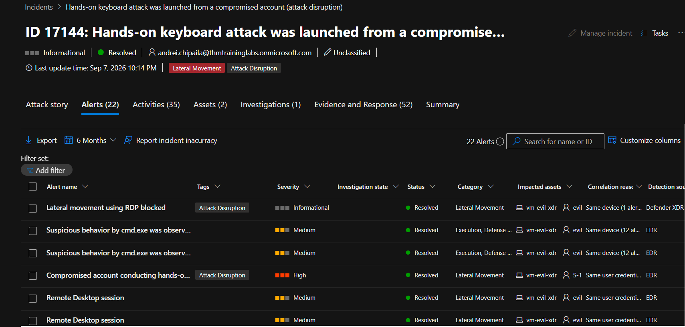
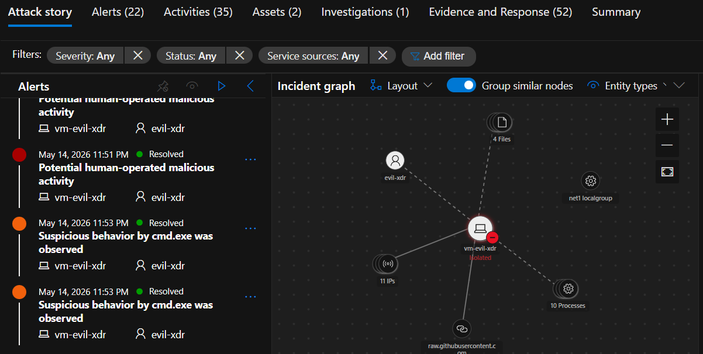
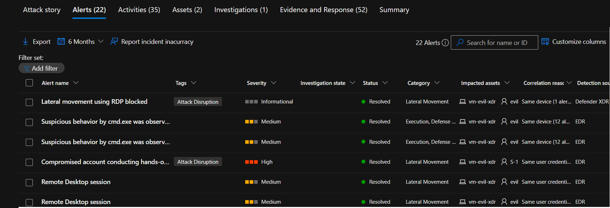
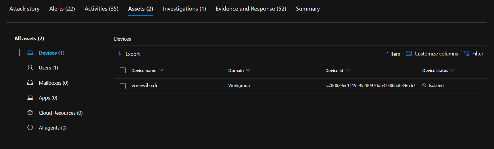
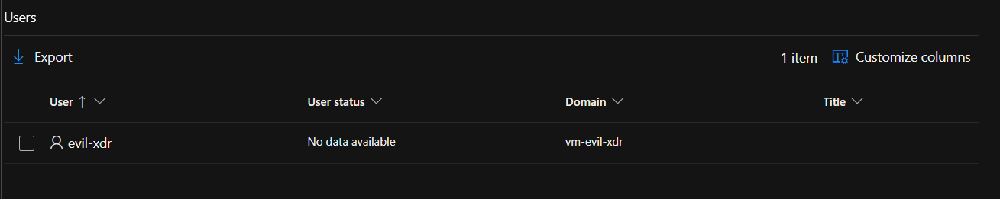
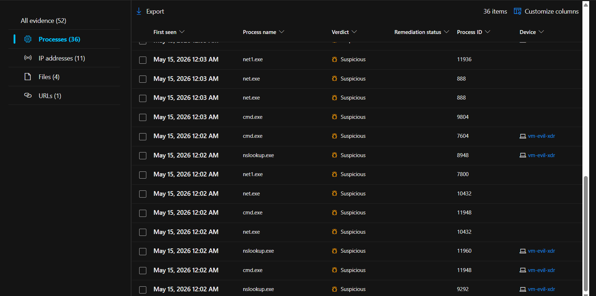
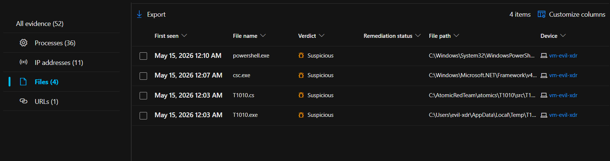
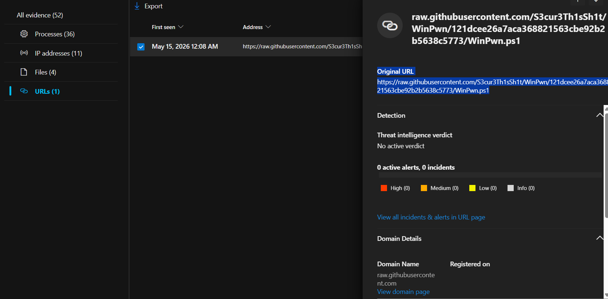
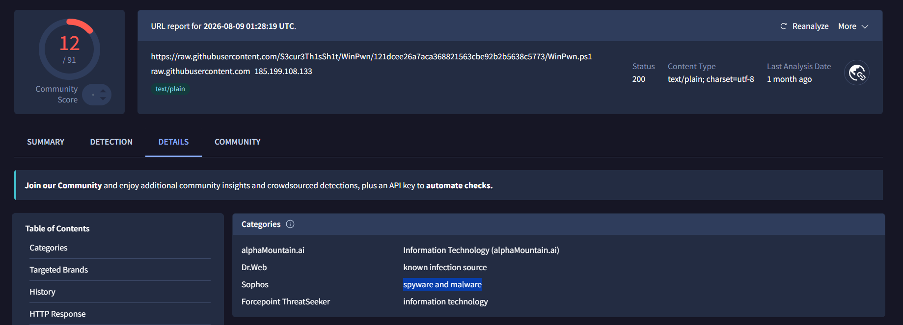
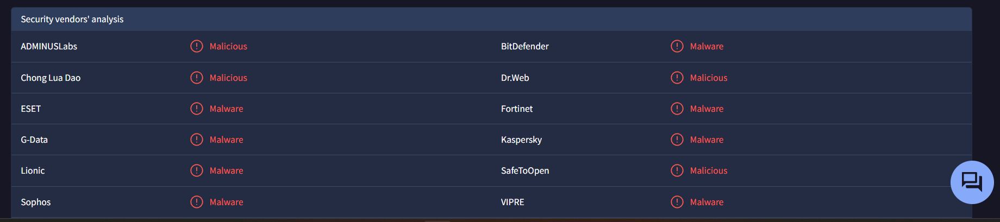

> /AzureDefence/XDRLateralMovementInvestigation

# Following The Attacker: Lateral Movement Investigation

Modern attacks rarely stop after the first compromised machine.

Once attackers gain access, the next goal is usually expansion. They search for credentials, discover valuable systems, and move through the environment while trying to blend in with normal activity.

This movement inside a network is known as `lateral movement`.

In this article, we will explore how attackers use techniques like `WinLNK` and `Mimikatz` to move between systems, and how Microsoft Defender XDR helps analysts reconstruct the attack story through alerts, evidence, and affected assets.

# The Long Walk Inside The Network

A compromised endpoint is rarely the final destination for an attacker.

`Lateral movement` is the process of navigating through a network after initial access to reach more valuable targets, such as servers, privileged accounts, or sensitive data. Instead of immediately causing damage, attackers often spend time exploring the environment and collecting the access needed for a larger attack.

Common lateral movement techniques include credential theft, remote execution, abusing administrative tools, and exploiting weak permissions. Tools such as Remote Desktop Protocol (RDP), PsExec, and credential dumping utilities can help attackers move between systems while appearing like legitimate users.

This is why lateral movement is dangerous. The initial compromise might be small, but each successful move gives the attacker more visibility and control.

Defending against it requires reducing unnecessary privileges, monitoring unusual authentication activity, enforcing MFA, segmenting networks, and using endpoint detection tools to identify suspicious behaviour.

## WinLNK: The Shortcut That Wasn't So Short

Windows shortcut files (`.LNK`) are designed to provide quick access to applications and files. Unfortunately, attackers can turn this convenience feature into an attack path.

A malicious `WinLNK` file can contain hidden commands that execute scripts, launch malware, or download additional payloads when opened by a user. Attackers may place these files in email attachments, removable drives, or shared folders, hoping someone opens what appears to be a harmless shortcut.

During lateral movement, malicious shortcuts can help attackers spread through shared locations and compromise additional systems.

The defence is not simply blocking shortcuts. Analysts need to look for suspicious file creation, unusual command execution, and abnormal activity originating from shared resources.

## Mimikatz: When Credentials Become The Keys

Passwords are valuable, but attackers often do not need to crack them.

`Mimikatz` is a credential extraction tool that can retrieve authentication data from Windows systems, including password hashes and Kerberos tickets. Originally created for security research, it has become widely used by attackers after gaining privileged access.

With stolen credentials, attackers can impersonate legitimate users and move across the network using techniques such as `Pass-the-Hash` and `Pass-the-Ticket`.

This makes credential protection a critical part of lateral movement defence. Limiting administrative privileges, enabling protections like `LSA Protection`, enforcing MFA, and monitoring unusual authentication patterns can reduce the damage caused by credential theft.

# Investigating The Hands-On Keyboard Attack

In this investigation, Microsoft Defender XDR has detected a multi-stage attack involving lateral movement activity.

The objective is not just to confirm that suspicious commands were executed. The real investigation is understanding how the attacker moved, which assets were involved, and what evidence reveals the attack path.

Let's begin by opening the incident:

`Hands-on keyboard attack was launched from a compromised account (attack disruption)`

Incident ID: `17144`

## Finding The Attack Story

Microsoft Defender XDR's attack story provides a visual timeline of how the incident unfolded.

Instead of investigating alerts individually, the attack story connects related entities and activities into a larger picture.

The incident graph shows relationships between:

* Devices.
* User accounts.
* Processes.
* Files.
* Registry changes.
* Network activity.

Each connection represents another piece of the investigation puzzle. The goal is to understand the attack chain, not just collect isolated alerts.

## Following The Alert Trail

The `Alerts` tab contains the individual detections that contributed to the incident.

Each alert provides important context:

* Alert severity.
* Detection source.
* Related entities.
* Reason the alert was linked to the incident.

Let's locate the alert:

`Compromised account conducting hands-on-keyboard attack`

Opening the alert reveals the timeline and activity behind the detection. The command execution details help answer an important question:

Was this normal administrative behaviour, or was someone using a compromised account to operate inside the environment?

The alert is the breadcrumb. The timeline is where we start seeing the path.

## Examining The Compromised Assets

Returning to the incident page, the `Assets` tab shows the devices and users connected to the attack.

**Device compromised**

**Users Compromised**

**Malicious Processes**

**Files/Utilities involved**

**Malicious URLs**

Upon backtracking and correlating URL on VirusTotal (Threat Intelligence Platform), we can see it's linked to malicious resources and are flagged by different security vendors.

Assets provide another investigation angle:

* Which machines were affected?
* Which accounts were involved?
* What response actions are available?

From here, analysts can perform actions such as isolating devices or reviewing additional activity, depending on the investigation requirements.

The affected assets help determine the scope of the incident and whether the compromise is limited or spreading.

[Download incident summary](./Incident_17144.pdf)

# The Investigation Protocol

Lateral movement investigations are about connecting the dots.

A single command, file, or login event may look harmless by itself. The danger appears when these pieces form a pattern: compromised credentials, suspicious execution, and movement across multiple systems.

Microsoft Defender XDR helps analysts turn scattered signals into an attack narrative.

It's not just finding that lateral movement occurred.

It is understanding how the attacker travelled through the environment, what access they gained, and what actions are needed to stop the journey before it reaches its destination.

---

> QXV0aG9yOiBodHRwczovL2dpdGh1Yi5jb20vaGFzaC01NDU=
