> /DevSecOps/DAST

# DAST: Dynamic Application Security Testing

Unlike SAST, which examines source code without executing it, **Dynamic Application Security Testing (DAST)** tests a running application from an attacker's perspective. It treats the application as a black box and looks for vulnerabilities by interacting with and attempting to exploit the exposed functionality.

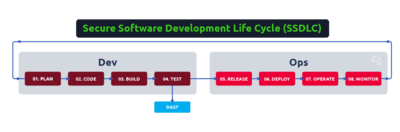

DAST can be performed manually or automatically. **Manual DAST** gives a security engineer the flexibility to understand application behaviour and investigate business logic flaws that automated scanners may miss. **Automated DAST**, meanwhile, can quickly repeat large numbers of tests and fits naturally into development pipelines.

A typical DAST workflow consists of two stages:

```text
Target Application
       │
       ├── Crawl / Spider
       │      └── Discover Pages & Parameters
       │
       └── Vulnerability Scan
              └── Test Discovered Attack Surface
```

Automated DAST is commonly used during testing to catch easily detectable vulnerabilities quickly, while deeper manual testing can be performed periodically. Before production, a full web application penetration test can provide another layer of validation.

DAST has an important advantage over source-based techniques: it can identify runtime and deployment-specific weaknesses, including issues such as **HTTP request smuggling, cache poisoning, and parameter pollution**, without needing access to the application's source code. It is also language-agnostic and can sometimes identify business logic flaws.

The trade-off is coverage. DAST depends on what it can discover and exercise, making complex JavaScript applications and functionality hidden behind specific workflows harder to assess. It also requires a running application and generally provides less detail about how a vulnerability should be fixed because it cannot see the underlying code.

In this room, we'll use **OWASP ZAP** to explore these principles in practice. Rather than treating the scanner as a magic vulnerability button, we'll first understand the crawling and scanning processes that make automated DAST possible.


# Mapping The Attack Surface With ZAP

Before scanning for vulnerabilities, we first need to understand what the application exposes. ZAP's **Spider** helps build this initial map by starting from a URL and following links it can discover.

From **Tools → Spider**, we provide the application's starting URL and enable recursive crawling. Once the scan finishes, the discovered resources appear under the **Sites** tab, giving us an initial view of the application's attack surface.

**Crawling web app under study**

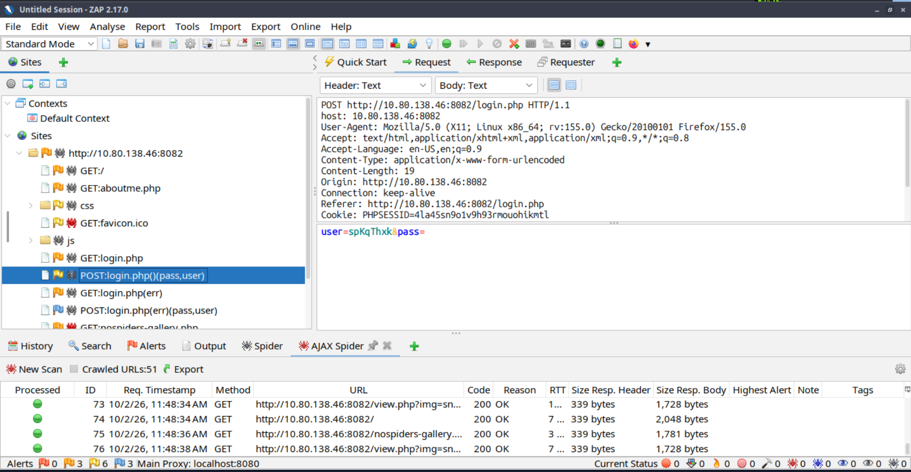

The regular spider has an important limitation: it primarily works with the HTML returned by the server. If a link is generated dynamically through JavaScript, ZAP's regular spider may never see it.

This is where the **AJAX Spider** becomes useful. Instead of parsing the application's responses directly, it uses a real browser to execute JavaScript and discover resources that only appear after client-side processing.

```text
ZAP Spider
│
├── Parse HTTP Responses
│   └── Discover Static Links
│
└── AJAX Spider
    ├── Launch Browser
    ├── Execute JavaScript
    └── Discover Dynamic Resources
```

The AJAX Spider can also use **headless browsers**, which run without a graphical interface. This makes browser-based crawling practical for automated environments while still allowing ZAP to process JavaScript-heavy applications.

After running both spiders, comparing their results shows exactly why multiple discovery techniques matter: the AJAX Spider can uncover resources that the regular Spider misses, expanding the attack surface before vulnerability scanning even begins.

Here’s the revised version with the screenshot URLs removed and the section kept tighter.

# Tuning The Scanner Before The Attack

A DAST scanner becomes more effective when its scanning policy matches the application being tested. ZAP lets us control **what gets tested** and **how aggressively each category is tested**, helping reduce unnecessary requests and scan time.

For this application, the stack is Linux, Apache 2.4, PHP without a framework, and no database. Database and XML-related tests therefore have little value and can be disabled instead of testing functionality the application does not use.


From **Analyse → Scan Policy Manager**, we can create a custom policy and configure each category using two settings:

| Setting       | Purpose                                                            |
| ------------- | ------------------------------------------------------------------ |
| **Threshold** | Controls how much evidence ZAP requires before reporting a finding |
| **Strength**  | Controls how many tests ZAP performs for that category             |

A lower threshold produces more potential findings but increases the chance of false positives. A higher threshold requires stronger evidence, reducing false positives but potentially increasing false negatives. Increasing the strength expands the number of tests and can significantly increase scan time.

For this application, database and XML injection categories can be disabled because those technologies are not part of the attack surface. We can also disable **DOM-based XSS** checks, as browser-based analysis is resource-intensive and unnecessary for this scan.

**Creating a Scan Policy**

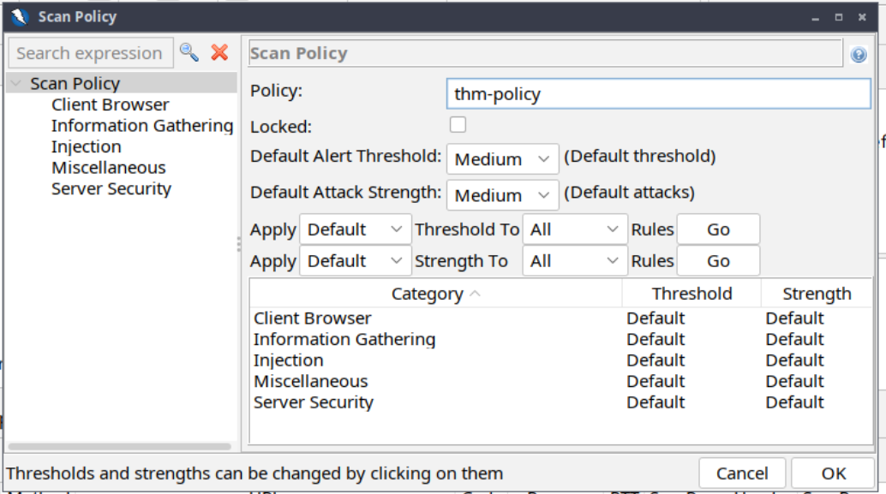

**Define injection policy**

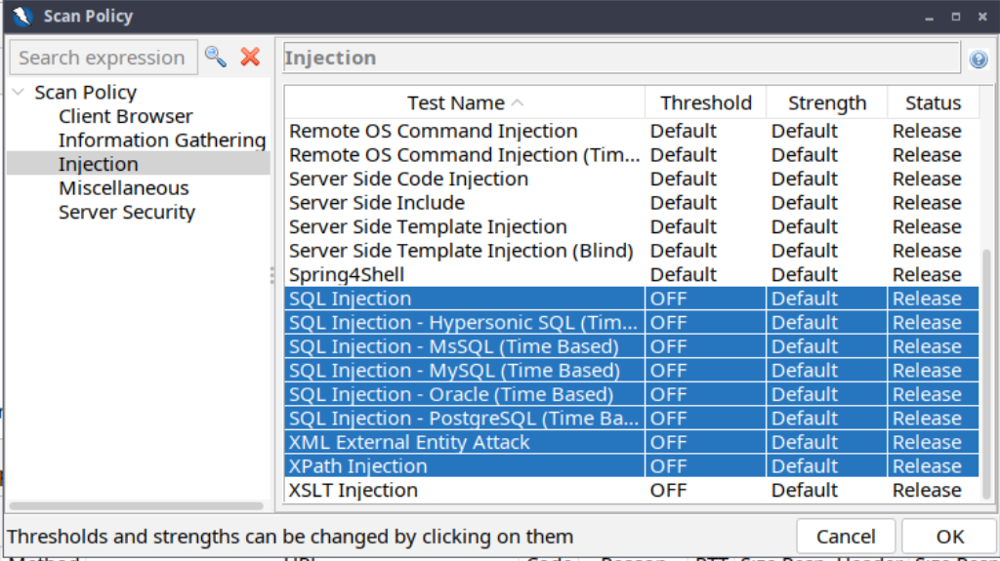

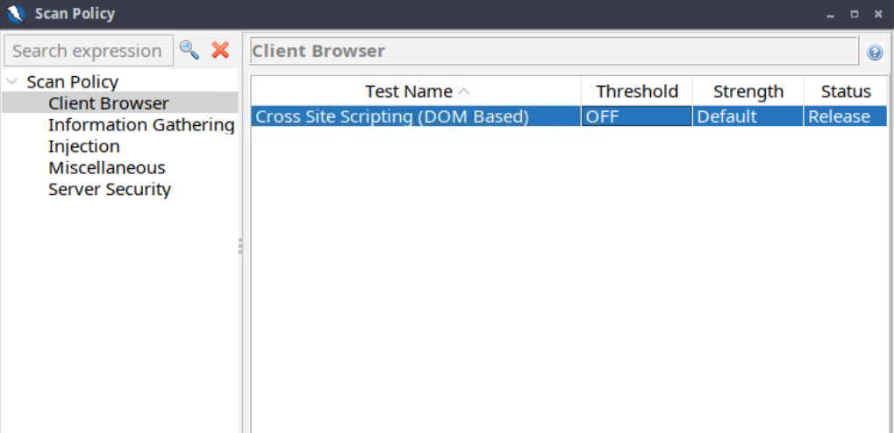


With the policy configured, we can move to **Tools → Active Scan** and select the previously spidered application as the starting point. Enabling **Recurse** ensures ZAP continues scanning the discovered resources instead of limiting the scan to a single URL.

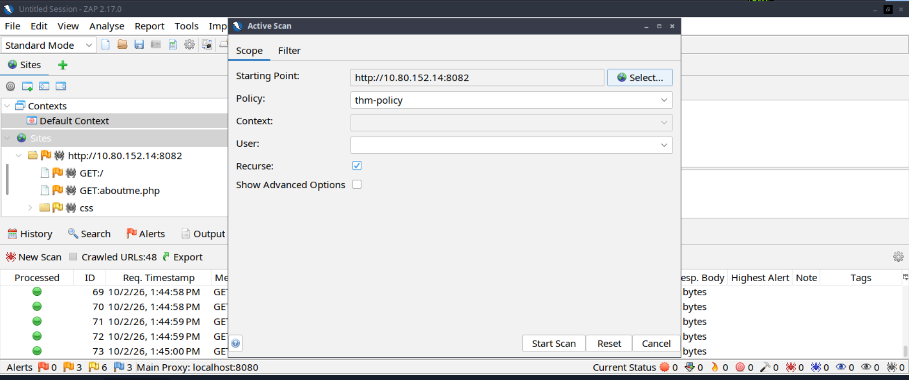

Once the scan completes, ZAP presents the findings in the **Alerts** section. Each alert includes a description of the suspected vulnerability along with the HTTP request and response that triggered the detection. This gives us enough context to verify the finding and identify potential false positives.

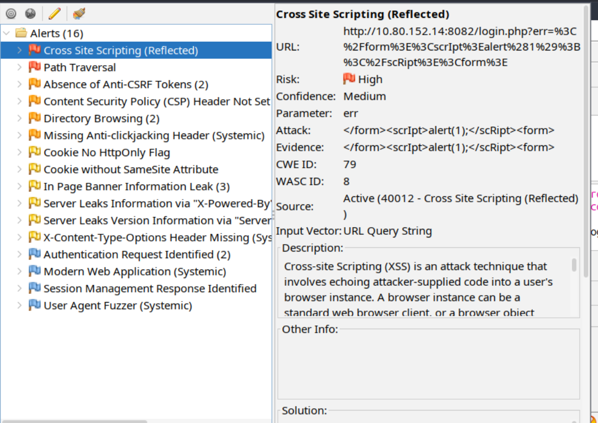

The scan demonstrates the value of policy tuning: irrelevant tests can be removed before scanning, while the remaining alerts can be investigated directly through the traffic ZAP captured.


# Getting ZAP Behind The Login

A normal DAST scan can only test what the scanner can reach without authentication. If an application hides functionality behind a login, ZAP needs to know how to authenticate and maintain that session before it can test those areas.

We can teach ZAP the authentication flow by recording it as a **ZEST script**, which allows ZAP to reproduce the required sequence of requests during scanning.

Before recording, we disable the **ZAP HUD** from the toolbar. We then select **Record a New ZEST Script**, give it a name, choose **Authentication** as the script type, and set the application's base URL as the prefix so unrelated requests are excluded.

After starting the recording, we open ZAP's browser and perform the login manually. ZAP captures the HTTP requests involved in the process, allowing the same authentication sequence to be replayed later.

**Website under study**

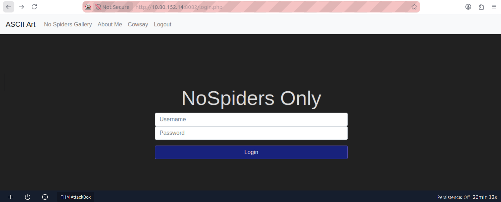


We'll use the creds:

```json
username: nospiders
pass: nospiders
```

Once authentication succeeds, we stop the recording and review the captured requests. Any unnecessary requests can be removed, leaving only those required to authenticate successfully. We can then run the script from the **Script Console** to verify the recorded flow. A successful login should result in the application redirecting the login request to the authenticated page.

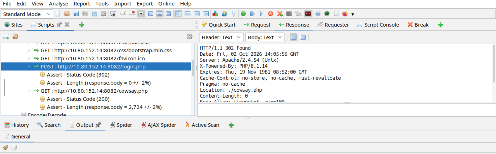

Recording the login flow alone is not enough. ZAP also needs to know where that authentication should be applied, which is handled through a **Context**. From the **Sites** tab, we can add the application's base URL to a new context and configure its authentication to use **Script-based Authentication**.

**Authentication Configuration**

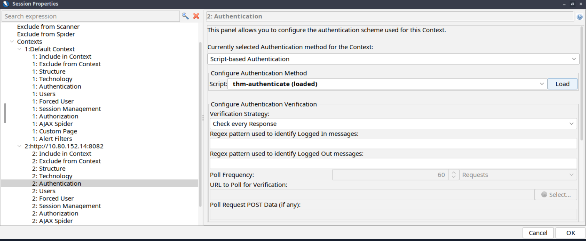

ZAP also requires at least one user to be defined under **Users** before authenticated scanning can take place. The credentials are already contained within the recorded ZEST script, but the user still needs to be associated with the context.

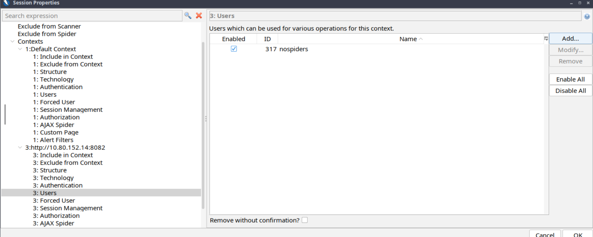

With the context configured, we can run the Spider again using the authenticated user. This allows ZAP to discover resources that were inaccessible during the initial unauthenticated crawl.

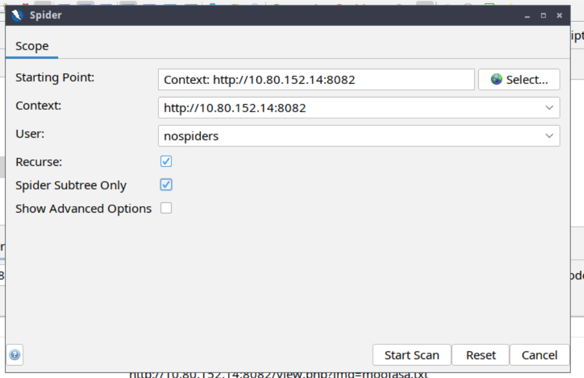

The new crawl may also discover functionality such as a logout endpoint. If ZAP accesses it during scanning, it could terminate its own session. We can therefore exclude the logout script from the context so ZAP avoids interacting with it.

**Authenticated Spider Results** discovered two more endpoints.

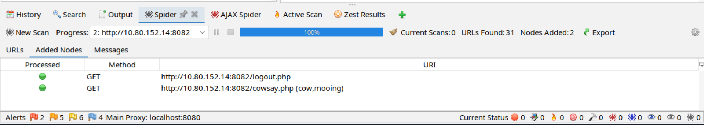


To make the authentication more reliable, ZAP can also monitor indicators showing whether the current session is still valid. For example, the presence of a logout link on an authenticated page can be configured as a **logged-in indicator**, while the login link can serve as a **logged-out indicator**.

**Polling logout checks**

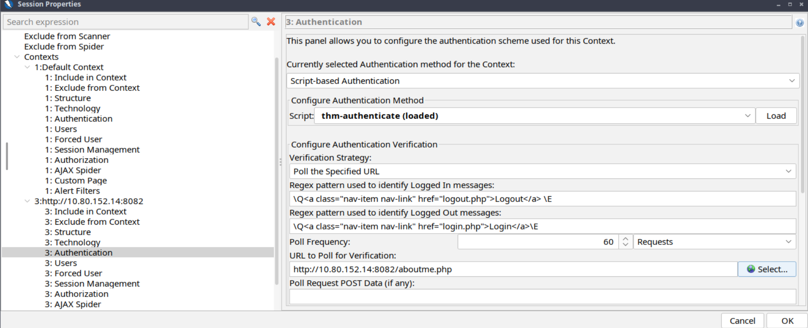

Finally, we configure a **Verification Strategy** to tell ZAP when to check these indicators. Using **Poll the Specified URL**, ZAP can periodically check `/aboutme.php` and determine whether the session is still authenticated. If the expected indicator disappears, ZAP can rerun the authentication script and restore the session. With everything configured, we can perform another **Active Scan** using the Context and User. ZAP can now crawl and test the authenticated portions of the application, expanding the attack surface beyond what was visible during the initial unauthenticated scan.

A new vulnerability discovered after authenticated scan.

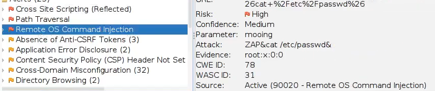


# Testing APIs

Traditional web applications expose links that ZAP can follow during spidering. APIs are different. An endpoint usually does not reveal the existence of other endpoints, and even knowing an endpoint exists does not tell us which parameters it accepts.

Instead of discovering an API blindly, we can use its **API definition** as the attack surface map. These specifications describe available endpoints, supported methods, parameters, and expected responses, giving ZAP enough information to start testing directly.

### Importing The API Definition

ZAP supports API definitions based on **OpenAPI**, **SOAP**, and **GraphQL**. In this case, the application provides an OpenAPI 2.0 specification.

The `paths` section contains the available API endpoints and their parameters. For example, `/asciiart/{art_id}` accepts a GET request with `art_id` supplied as a required path parameter.

API specifications are designed for machines, so they can be difficult to read manually. OpenAPI implementations may also provide a **Swagger UI**, which presents the same endpoints in a more interactive format and allows quick requests to be made against the API.

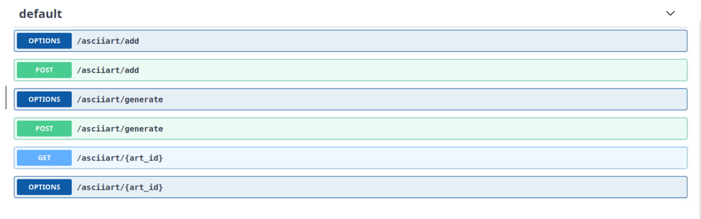

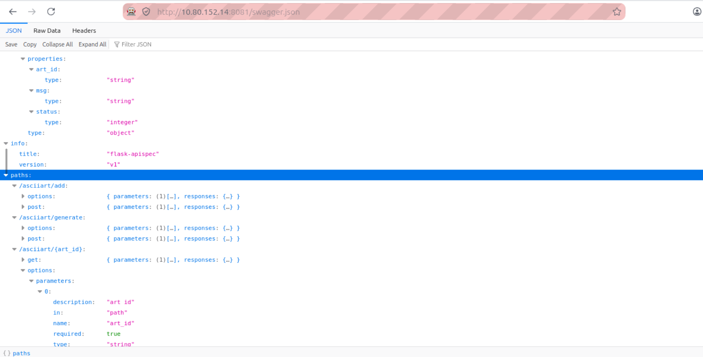

We can import the specification directly into ZAP using **Import → Import an OpenAPI definition from a URL**. Once imported, ZAP populates the **Sites** tab with the documented endpoints and parameters.

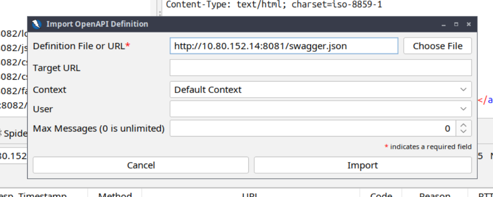

ZAP also performs passive scanning against the imported endpoints. From this point onward, the API can be treated much like a normal web application within ZAP.


With the API definition loaded, we can right-click its URL and select **Attack → Active Scan**. ZAP then uses the imported endpoints and parameters as the basis for its active testing.

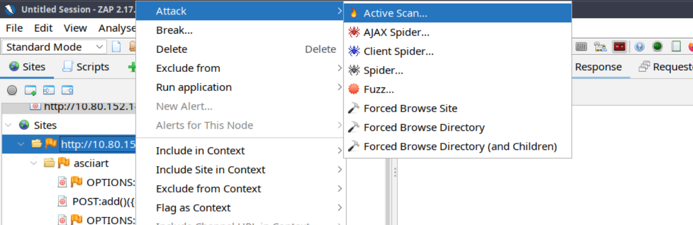


**API Vulnerabilities found**

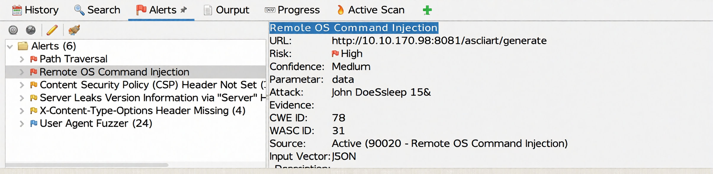


This approach removes much of the endpoint-discovery work and lets the scanner focus directly on testing the API's documented attack surface. It also highlights an important limitation: the quality and completeness of the API definition directly affects what ZAP can test.


# Putting DAST Into The Pipeline

DAST becomes especially useful when vulnerability scanning is automated as part of the development pipeline. Instead of waiting for a manual assessment, scans can run automatically as code changes are introduced, providing earlier visibility into security issues.

The challenge is finding the right balance. We need to decide **when scans run, what triggers them, and how intensive they should be**. A full active scan on every commit could significantly slow development, so the scanning profile should be agreed upon with the development team.

In this environment, **Gitea** stores the application source code while **Jenkins** handles the CI/CD pipeline. Each commit triggers Jenkins to build the application into a Docker container and deploy it for testing. The same containers can then become the targets for automated ZAP scans.

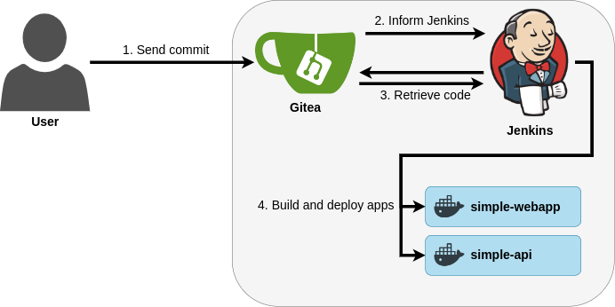

The pipeline uses separate repositories for the web application and API, with their build and deployment stages defined in a `Jenkinsfile`. The existing pipeline therefore gives us a convenient place to add a security testing stage after deployment.

### Automating ZAP With zap2docker

For pipeline-based scanning, we can use **zap2docker**, a Dockerized version of ZAP designed for automation. It provides several scan profiles depending on how much testing we want to perform.

```text
ZAP Automation
│
├── Baseline Scan
│   └── Spider + Passive Scanning
│
├── Full Scan
│   └── Spider + Active Scanning
│
└── API Scan
    └── Active Scan Against API Definition
```

The **Baseline Scan** is particularly useful for frequent pipeline execution because it focuses on passive findings without performing a lengthy active attack. A **Full Scan** performs considerably more testing, while the **API Scan** is designed around OpenAPI, GraphQL, or SOAP definitions.

For a scan that runs after every commit, the baseline profile provides a practical first security checkpoint. More intensive scans can be scheduled separately when longer execution times are acceptable.

### Adding ZAP To Jenkins

Our jenkins repo is

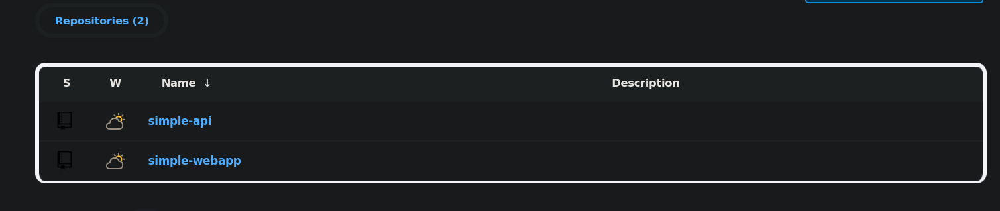

The ZAP stage can be added to the existing `Jenkinsfile` after the application has been built and deployed. Once enabled, Jenkins automatically runs the ZAP baseline scan whenever a new commit triggers the pipeline.

**Configuring ZAP in the build**

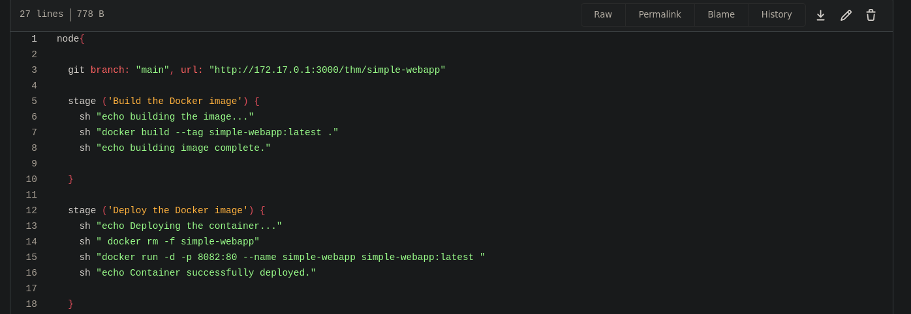


Because the scan runs on every commit, using the **Baseline Scan** avoids introducing the long delays associated with a full active scan. It is intended to catch lower-effort findings early rather than replace comprehensive security testing.

**Staging ZAP in the build pipeline**

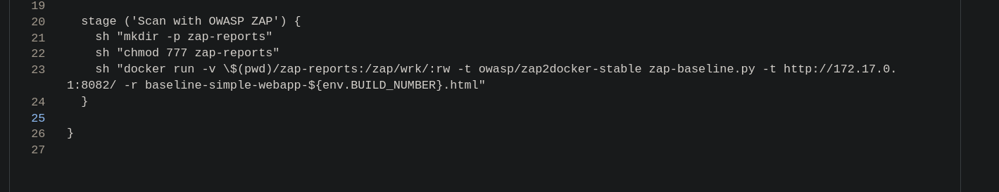

**Building**

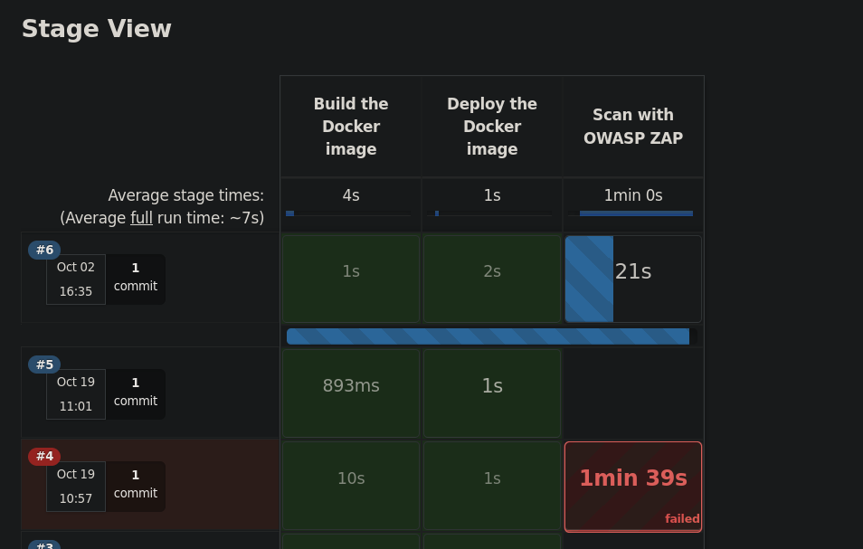


Build failed due to discovered vulnerabilities by ZAP

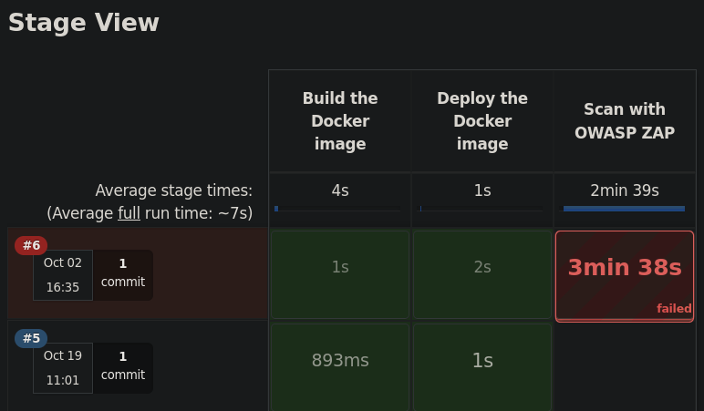

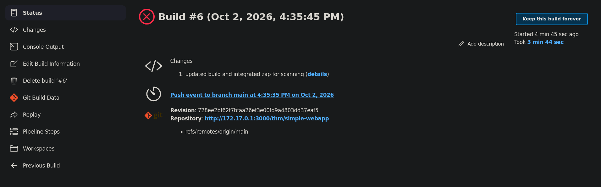


When ZAP discovers vulnerabilities that cause the security stage to fail, the build is marked accordingly. Jenkins keeps the generated reports inside the workspace, where they can be reviewed to understand what the scanner detected. [Download full ZAP report (html)](./5_zap_report.html)

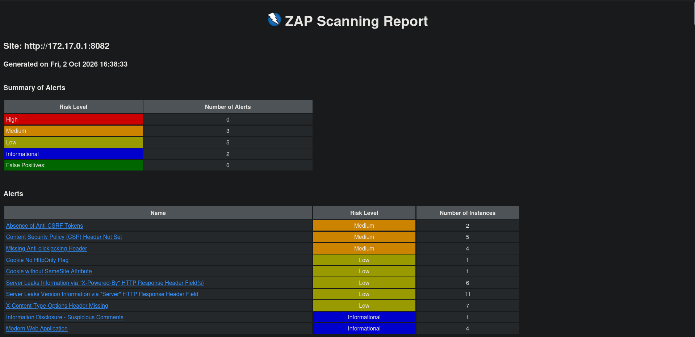

The same process can be applied to the API repository, allowing both applications to receive automated security checks as part of their respective pipelines. This creates an early feedback loop where security findings become visible during development rather than after deployment.

# From Scans To The Pipeline

DAST becomes far more useful when it moves beyond occasional manual testing and becomes part of the development workflow. ZAP can map traditional applications, test authenticated areas, consume API definitions, and run automated scans through `zap2docker`.

The key is choosing the right scan for the right stage. Lightweight baseline scans can provide quick feedback on every commit, while deeper active scans can be reserved for situations where longer testing is practical. With ZAP integrated into Jenkins, security testing becomes another checkpoint in the delivery process rather than something performed only after the application is already deployed.

---

> QXV0aG9yOiBodHRwczovL2dpdGh1Yi5jb20vaGFzaC01NDU=
