> /DevSecOps/SAST

# SAST: Static Application Security Testing

### Scanning The Source

Secure software starts before deployment. Vulnerabilities introduced early in development can propagate through the project and become increasingly expensive to fix later. **Code review** helps catch these issues early by examining source code directly, giving reviewers broad visibility into the application's logic and potential weaknesses.

Code reviews can be manual or automated. Manual reviews provide deeper human analysis and can uncover complex logic flaws, but reviewing thousands of lines of code is time-consuming and prone to fatigue. Automated tools, meanwhile, can scan large codebases quickly and consistently, making them effective at detecting known vulnerability patterns. Their limitation is equally important: they can only detect what their rules are designed to identify.

This is where **Static Application Security Testing (SAST)** fits in. SAST automates source-code analysis and can be integrated early into the development lifecycle, catching common security issues before they reach later stages.

```text
Secure Development Lifecycle
│
├── Write Code
├── SAST Scan
│   └── Detect Known Vulnerabilities
├── Manual Review
│   └── Investigate Complex Issues
└── Secure Release
```

The goal isn't to replace manual review with automation. SAST handles the repetitive, high-volume checks while manual analysis focuses on issues that require human reasoning.


# Manual Code Review: Tracing SQL Injection

Before relying on SAST tools, it's useful to understand what manual code review actually looks like. In this exercise, we're hunting for **SQL injection** by identifying database query functions, tracing how they are used, and following user-controlled input into them.

We start by searching the project recursively for functions capable of executing raw MySQL queries:

```bash
cd /home/ubuntu/Desktop/simple-webapp/html/
grep -r -n 'mysqli_query('
```

.png)

The `-r` searches recursively, while `-n` includes the matching line number. This gives us a potential sink:


Finding a potentially dangerous function isn't enough. We need to understand what reaches it. Opening `db.php` shows that `mysqli_query()` is wrapped inside `db_query()`, with the query passed directly to it:

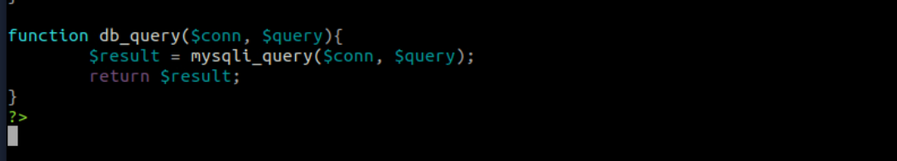

We therefore trace every call to `db_query()`:

```bash
grep -rn 'db_query('
```

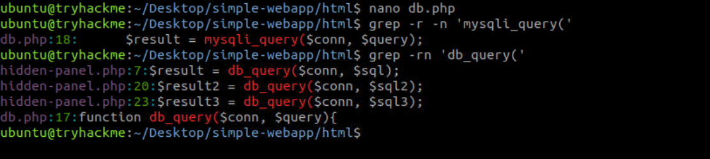


Inside the hidden-panel.php, we observe and SQLi Vulnerability.

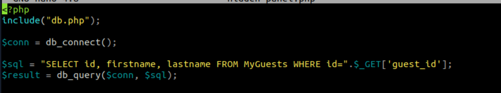


Here, the `guest_id` parameter is taken directly from the HTTP request and concatenated into a SQL query without sanitisation. We have our first **SQL injection**.

The other two instances require a little more analysis that we have here:

```php
$sql2 = "SELECT id, logtext FROM logs WHERE id='".preg_replace('/[^a-z0-9A-Z"]/', "", $_GET['log_id']). "'";
$result2 = db_query($conn, $sql2);

$sql3 = "SELECT id, name FROM asciiart WHERE id=".preg_replace("/[^0-9]/", "", $_GET['art_id'], 1);
$result3 = db_query($conn, $sql3);
```

At first glance, both look suspicious because user-controlled GET parameters reach SQL queries. However, the filters change the situation.

For `$sql2`, only alphanumeric characters and double quotes survive the filter, while the value is enclosed in single quotes. An attacker cannot escape the string using the remaining characters, so this instance isn't considered vulnerable.

`$sql3` is more subtle. The filter appears to allow only numbers, but `preg_replace()` receives `1` as its replacement limit. That means only the **first** invalid character is removed. Additional malicious characters can pass through, making this query vulnerable to SQL injection.

This is exactly where manual review becomes difficult at scale. Finding dangerous functions is straightforward, but determining whether user-controlled data can actually reach them requires tracing data through multiple functions and understanding the surrounding logic.

### LFI Vulnerability

The same manual-review approach can be used to hunt for other vulnerability classes. For **Local File Inclusion (LFI)**, we focus on PHP functions that load files based on input we may be able to influence: `require()`, `include()`, `require_once()`, and `include_once()`.

Rather than searching the entire project, we can narrow the investigation to PHP files inside `html/`:

```bash
grep -rnE 'require\(|include\(|require_once\(|include_once\(' /home/ubuntu/Desktop/simple-webapp/html/ --include='*.php'
```

.png)

The search identifies which of these functions are actually used in the project and shows every occurrence with its file and line number. From there, we inspect each instance and trace where its argument comes from.

Finding an `include()` or `require()` call alone does not prove an LFI vulnerability. The important question is whether an attacker can manipulate the value passed to the function. For example, a file path derived from a `GET` or `POST` parameter would require closer investigation, while a hardcoded path would not normally provide an LFI primitive.

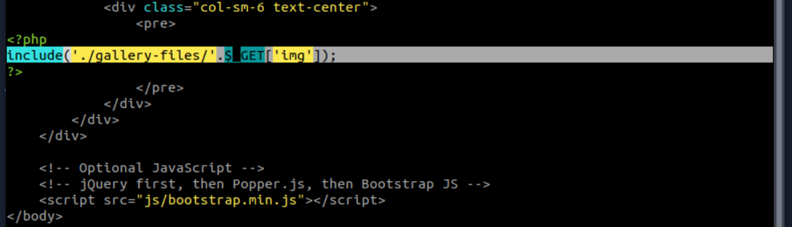

The vulnerable instance can therefore be identified by following the input from the HTTP request into the file-inclusion function. This is the same core principle used during the SQL injection review: **find the dangerous sink, then trace the data flowing into it**.

# Inside Static Analysis

**Static Application Security Testing (SAST)** automates source-code analysis to identify security issues early in development. It complements manual review and other approaches such as DAST and SCA, without requiring the application to be running.

SAST generally works by first converting source code into an abstract representation, such as an **Abstract Syntax Tree (AST)**, and then analysing that model for potential security issues.

The main analysis techniques include:

| Analysis          | What it looks for                                                |
| ----------------- | ---------------------------------------------------------------- |
| **Semantic**      | Insecure functions and local code patterns                       |
| **Dataflow**      | How user-controlled data moves from sources to vulnerable sinks  |
| **Control flow**  | Execution-order issues, race conditions, uninitialised variables |
| **Structural**    | Language-specific coding and cryptographic issues                |
| **Configuration** | Insecure application configuration                               |

The key distinction is that SAST can move beyond simple pattern matching. **Dataflow analysis**, for example, can trace user input through multiple functions until it reaches a vulnerable sink, much like the manual tracing we performed earlier.


# Putting SAST To Work

With the theory covered, let's put SAST into practice against the `simple-webapp` PHP application using **Psalm**. The project already includes Psalm, with `psalm.xml` configured to scan `html/` while excluding the third-party `vendor/` directory.

We first run Psalm's default structural analysis:

```bash
cd /home/ubuntu/Desktop/simple-webapp/
./vendor/bin/psalm --no-cache
```

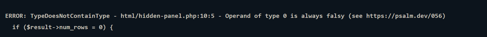

This identifies programming and structural issues such as incorrect variable handling or conditions that will always evaluate the same way. These findings may not be directly exploitable vulnerabilities, but fixing them helps prevent runtime errors and unpredictable behaviour.

For security-focused analysis, Psalm provides **taint analysis**:

```bash
./vendor/bin/psalm --no-cache --taint-analysis
```

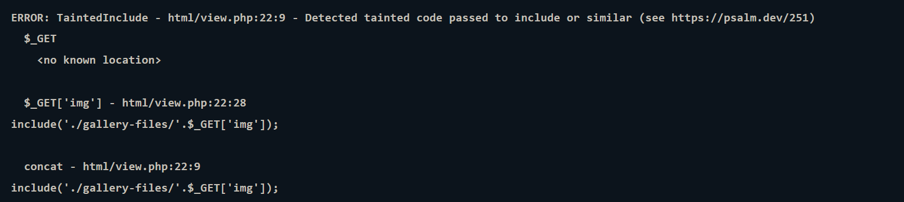

Instead of only examining individual functions, taint analysis traces potentially attacker-controlled data from a **source**, such as `$_GET`, toward a dangerous **sink**, such as `include()` or `mysqli_query()`. In this case, Psalm identifies an LFI where the `img` GET parameter reaches an `include()` call.

This is particularly useful for vulnerabilities that aren't obvious from local code alone. However, the results still need to be validated manually.

### When SAST Gets Confused

Our earlier manual review identified two confirmed SQL injection vulnerabilities. Initially, Psalm reports only one:

```bash
./vendor/bin/psalm --no-cache --taint-analysis
```

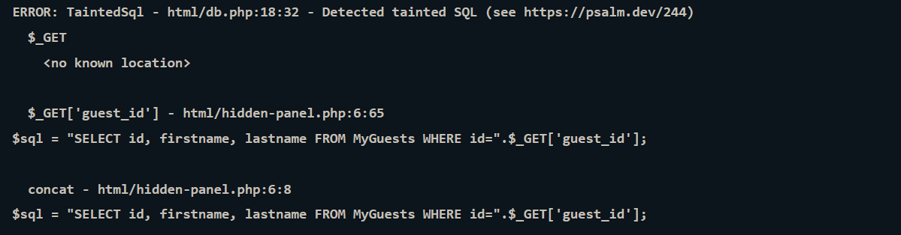

The reason becomes clearer when looking at the code structure. Both vulnerable queries eventually reach `mysqli_query()` through the `db_query()` wrapper. Psalm treats the underlying database call as the relevant sink and does not automatically understand that the wrapper should be analysed as a separate taint sink.

To demonstrate this, we temporarily comment out the first vulnerable query in `hidden-panel.php`:

```php
// $sql = "SELECT id, firstname, lastname FROM MyGuests WHERE id=".$_GET['guest_id'];
// $result = db_query($conn, $sql);
```

Running the analysis again exposes the other SQL injection:

```bash
./vendor/bin/psalm --no-cache --taint-analysis
```

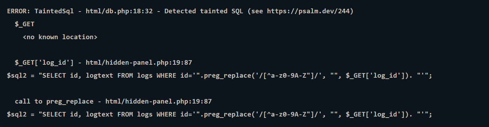

The second finding involves `$sql2`. Although manual review determined that its filtering prevents SQL injection, Psalm still considers the input tainted. This gives us a **false positive**. Lets uncomment & restore the original code before continuing.


We can then provide Psalm with additional context by annotating `db_query()` as an SQL sink:

```php
/**
 * @psalm-taint-sink sql $query
 * @psalm-taint-specialize
 */
function db_query($conn, $query){
    $result = mysqli_query($conn, $query);
    return $result;
}
```

The `@psalm-taint-sink` annotation tells Psalm to treat `$query` as an SQL sink, while `@psalm-taint-specialize` allows separate invocations of the function to be analysed according to their individual inputs.

We run the analysis once more:

```bash
./vendor/bin/psalm --no-cache --taint-analysis
```

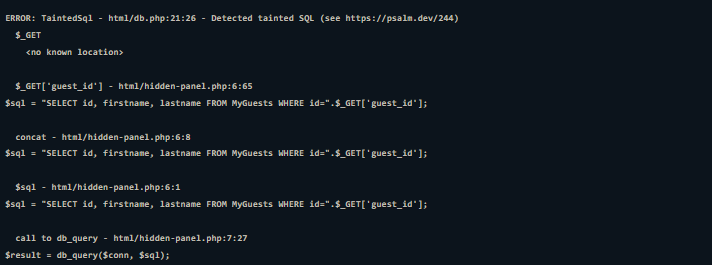

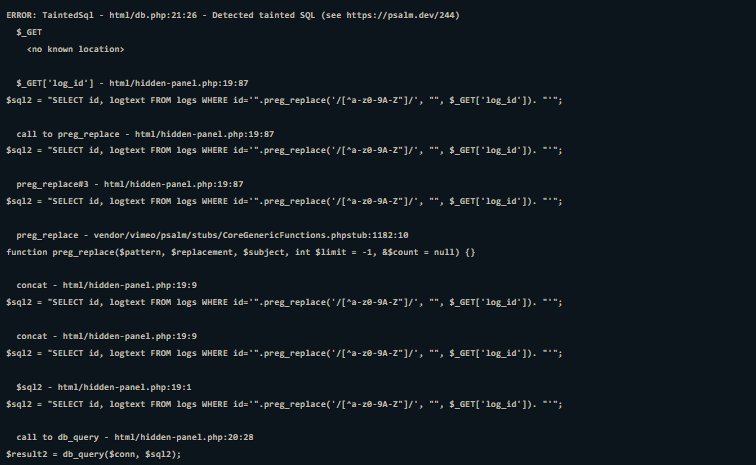


This time, Psalm reports the separate tainted flows. A third alert may also appear because `mysqli_query()` remains one of Psalm's built-in sinks, causing one finding to overlap with the annotated results.

Comparing the automated scan with our manual review shows why human validation remains important:

| Query | Manual Review | Psalm Review | Verdict |
|---|---|---|---|
| `$sql` | Vulnerable | Vulnerable | Correct |
| `$sql2` | Not Vulnerable | Vulnerable | False Positive |
| `$sql3` | Vulnerable | Not Vulnerable | False Negative |

A **false positive** means the tool reports a vulnerability that isn't actually present, while a **false negative** means a real vulnerability is missed. SAST significantly reduces the amount of code that needs manual inspection, but its findings still require human verification.


# Bringing SAST Into The Development Cycle

SAST fits naturally into the early stages of development because it can analyse source code without requiring a running application. This makes it useful both while developers are writing code and when changes move through the CI/CD pipeline.

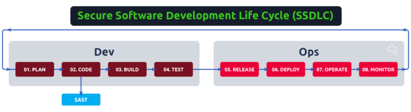

There are two common integration points:

| Integration | Purpose                                                            |
| ----------- | ------------------------------------------------------------------ |
| **IDE**     | Provides immediate feedback while developers write and modify code |
| **CI/CD**   | Scans pull requests or merges before code progresses further       |

Using both can provide layered coverage. IDE integrations can handle fast structural checks and secure-coding guidance, while CI/CD scans can perform heavier analysis such as **dataflow and taint analysis**.

## SAST In The IDE

For this exercise, the `ReciPHP` project is loaded through its VS Code workspace. Two SAST tools are integrated into the editor: **Psalm** and **Semgrep**.

Psalm provides inline structural findings for the file currently being edited. Semgrep goes a step further by scanning the project when VS Code starts and displaying detected issues directly in the editor. Semgrep also supports custom rules, allowing teams to define checks specific to their applications.


The practical advantage is, instead of discovering a security issue after the code reaches testing or production, developers can see the problem while the vulnerable code is still being written.

For this exercise, we use the VS Code **Problems** panel and inline findings to review the `ReciPHP` project, including the issues reported in `showrecipe.inc.php`. Semgrep identifies both SQL injection through its `tainted-sql-string` rule and another vulnerability category in the same file.

The SAST tools effectively highlight the issues in the entire project files where developers can debug for the issues.

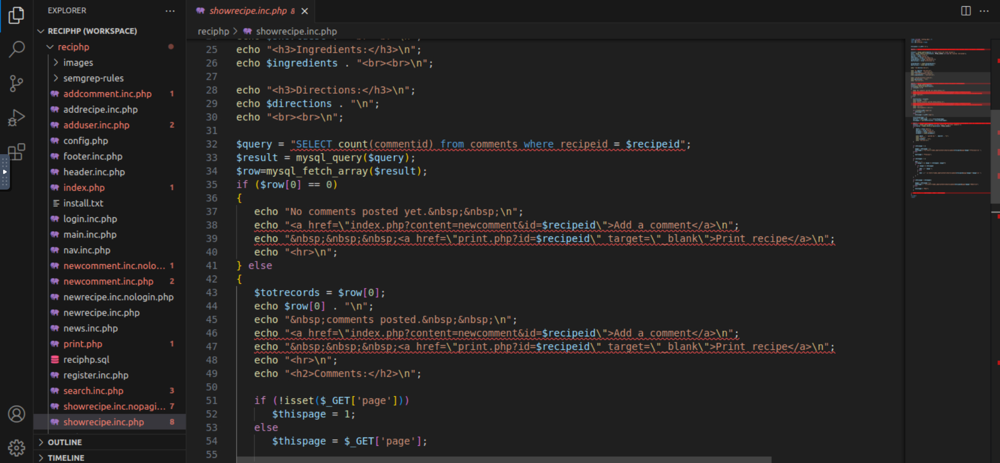

**Semgroup highlighted SQLi vulnerability in the code.**

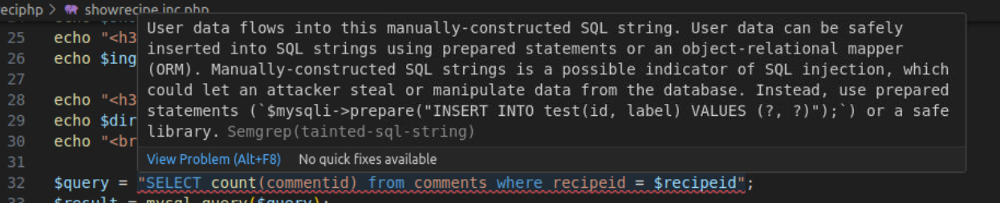

**XSS vulnerability due to use of echo in the code.**

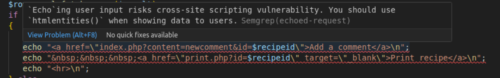


This demonstrates the real value of IDE-based SAST. Security feedback becomes part of the development workflow rather than a separate activity performed much later.


# From Findings To Fixes

SAST becomes most useful when it is placed directly into the development workflow. IDE integrations provide immediate feedback while code is being written, while CI/CD scans add another security checkpoint before changes are merged or released. Tools such as Psalm and Semgrep can catch structural issues, trace potentially dangerous data flows, and highlight insecure patterns early.

The results still require human review, as false positives and false negatives are unavoidable. SAST should therefore complement manual code review rather than replace it, combining automated coverage with the reasoning needed to determine whether a reported issue is actually exploitable.

---

> QXV0aG9yOiBodHRwczovL2dpdGh1Yi5jb20vaGFzaC01NDU=