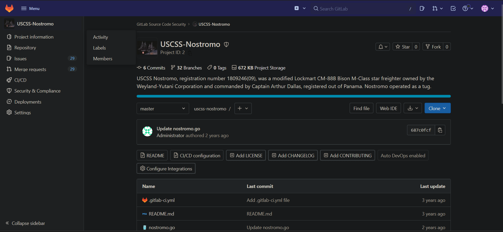
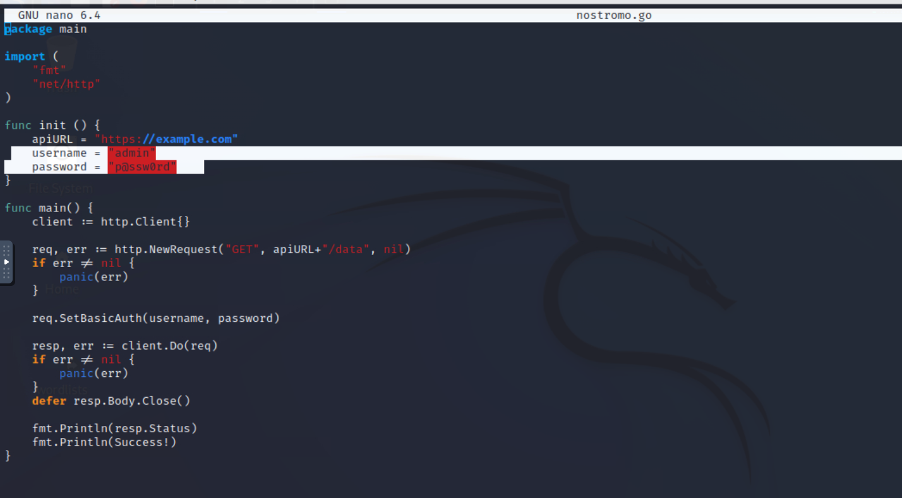
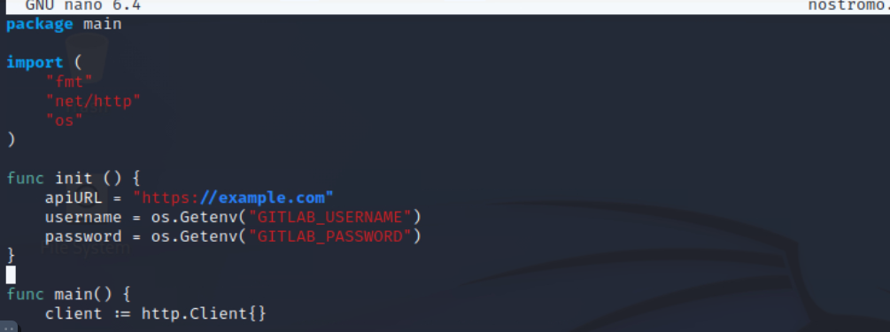
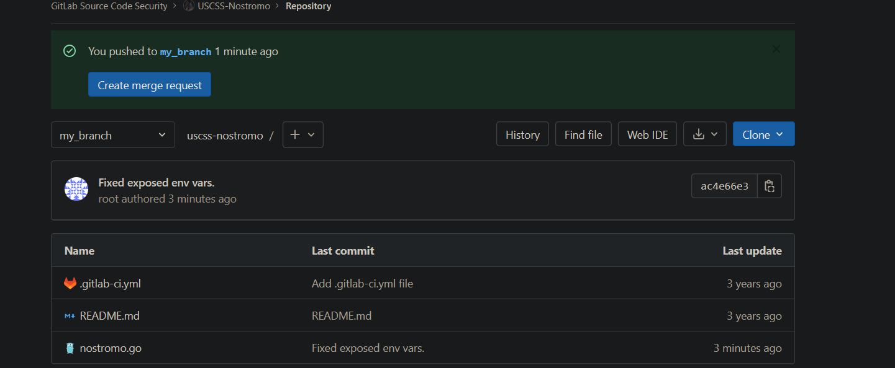
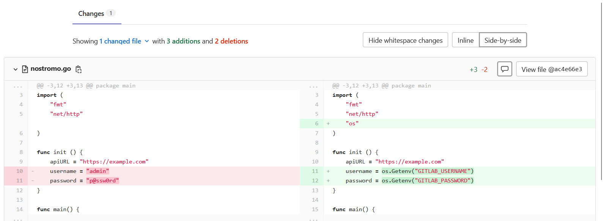
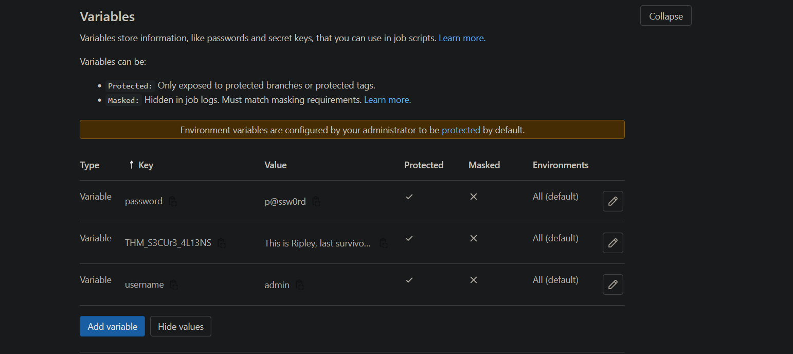

> /DevSecOps/SourceCodeSecurity

# Source Code Security

### When Source Code Leaks More Than Code

Source code repositories contain more than application logic. They also contain **commit history, configuration, deployment workflows**, and sometimes the **credentials** used to access the systems behind the application.

That makes **source code security** an important part of DevSecOps. In this article, we'll use GitLab to investigate a simple but dangerous mistake: credentials hard-coded directly into an application, then replace them with environment variables and GitLab-managed secrets.

# Git, GitLab, and Source Code Security

Git is a distributed version control system that tracks changes to a project through commits and branches. Platforms such as GitHub and GitLab build collaboration and CI/CD capabilities around Git repositories.

For this investigation, the important distinction is simple: **Git tracks the code, while GitLab can also manage the environment and automation around that code.**

A basic Git workflow looks like:

```
Git Workflow
│
├── Working Directory
│   │
│   └── git add
│       │
│       └── Staging Area
│           │
│           └── git commit
│               │
│               └── Local Repository
│                   │
│                   └── git push
│                       │
│                       └── GitLab Repository
```

The security problem appears when sensitive credentials enter that workflow.

## Finding The Credential Leak

The exercise provides a GitLab project called **USCSS-Nostromo**. After accessing the project, we clone it locally and create a separate branch so our changes do not immediately affect the main branch.



```bash
git clone <repository-url>
cd uscss-nostromo
git checkout -b <branch-name>
```

The first investigation is deliberately simple: inspect `nostromo.go`.

The problem is that the application contains **authentication credentials** directly inside the source code. Anyone who can read the repository can potentially obtain them.



This is exactly the type of exposure that credential hygiene is intended to prevent. The safer design is to keep the application code free of secrets and retrieve them from the runtime environment instead.

## Moving Credentials Into Environment Variables

Go provides `os.Getenv()` for retrieving environment variables. We first import the `os` package and then replace the hard-coded values.

```go
import (
    "fmt"
    "net/http"
    "os"
)

func init() {
    apiURL = "https://example.com"
    username = os.Getenv("GITLAB_USERNAME")
    password = os.Getenv("GITLAB_PASSWORD")
}
```



The important change is not the function itself. It is the separation between **application code** and **authentication material**.

The source code now references variable names rather than containing the actual credentials.

```text
Source Code
    ↓
os.Getenv()
    ↓
Environment Variable
    ↓
Credential
```

This also makes credential rotation easier. Updating a password no longer requires modifying the application source code.

## Committing The Fix

Once the credentials have been removed from the source, the change can be committed to the working branch.

```bash
git commit -a -m "Fixed credential hygiene by using environment variables"
git push -u origin <branch-name>
```



The important point is that moving a secret out of the current file does not automatically erase it from Git history. If credentials were previously committed, the repository history may still contain them.

That is why secret detection and proper credential rotation remain important even after fixing the source code.

You can observe the changes made in a branch from commit view in GitLab



## Storing The Secrets In GitLab

Environment variables are only useful if the values themselves are protected.

GitLab provides CI/CD variables that can be used to store sensitive configuration outside the repository. These variables can then be exposed to jobs or applications when required, with controls such as **Protected** variables helping restrict where they are available.



The application continues using:

```text
os.Getenv("GITLAB_USERNAME")
os.Getenv("GITLAB_PASSWORD")
```


while GitLab manages the actual values separately. This gives us a cleaner separation:

| Component           | Contains              |
| ------------------- | --------------------- |
| Source code         | Variable names        |
| GitLab variables    | Secret values         |
| Application runtime | Retrieved credentials |

The key principle is simple: **credentials should not become part of the source code or its normal version-control history.**

The repository also contains a `.gitlab-ci.yml` file. This file defines how GitLab CI/CD pipelines are configured, including the jobs and stages that GitLab should execute.

That matters for security because CI/CD systems frequently handle credentials, deployment permissions, cloud access, and production infrastructure.

A poorly configured pipeline can therefore reintroduce the same secret-management problem we just fixed.


The key takeaway is that **environment variables alone are not enough**. Source code still needs secret scanning, access controls, credential rotation, secure CI/CD configuration, and careful handling of build output and artifacts.

# From Code To Lessons

Source code security is ultimately about controlling what enters the development and deployment pipeline.

Hard-coded credentials can turn an ordinary repository into an access point for attackers. Moving secrets into environment variables removes them from the application code, while GitLab's secret-management capabilities provide a safer place to maintain the actual values.

But the security boundary does not end at the source file. **Git history, CI/CD configuration, build logs, artifacts, and deployment environments all need to be treated as potential secret-exposure points.**

Keep the code shareable, keep the credentials controlled, and make sure the pipeline does not accidentally put them back together.

---

> QXV0aG9yOiBodHRwczovL2dpdGh1Yi5jb20vaGFzaC01NDU=
