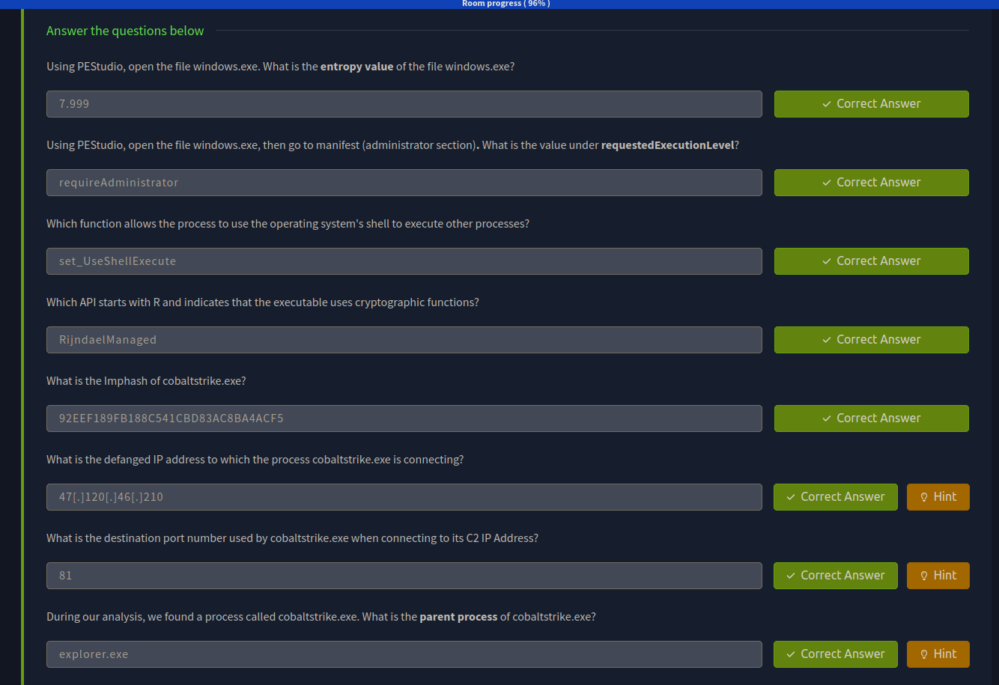
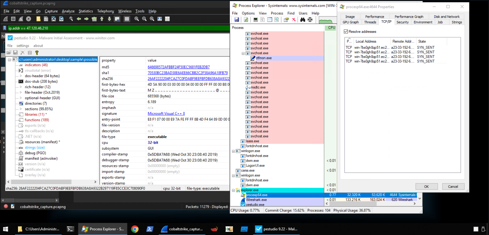

> /BlueTeaming/Sysinternals - FlareVM
# Sysinternals Suite & Flare VM Lab

## Objective
Investigate a suspicious Windows executable using **FlareVM** and Sysinternals tools, focusing on both static and dynamic analysis techniques.

## Tools Used
- **FlareVM** – malware analysis virtual machine  
- **Procmon** – monitors file, registry, and process/thread activity  
- **Process Explorer** – shows running processes, DLLs, and parent-child relationships  
- **PEStudio** – static analysis of PE files without execution  

## Steps Performed
1. **Environment Setup**  
   - Used **FlareVM**, a Windows VM preloaded with malware analysis tools.  
   - Ensured analysis took place in an isolated environment.  

2. **Static Analysis**  
   - Applied **PEStudio** to check file metadata, hashes, imports, and suspicious indicators.  
   - Identified unusual API calls and hidden details suggesting malicious behavior.  

3. **Dynamic Analysis**  
   - Observed running processes in **Process Explorer**, confirming parent-child relationships.  
   - Used the TCP/IP tab to track network connections from the suspicious binary.  
   - Cross-validated activity with **Procmon**, filtering for the executable to trace file and registry changes.  

## Key Learnings
- **PEStudio** helps spot red flags in executables without running them.  
- **Process Explorer** provides a clear view of process hierarchy and live network activity.  
- **Procmon** is valuable for deep inspection of file/registry modifications in real time.  
- Working inside **FlareVM** keeps the host safe while providing a ready toolkit for analysis.  

## Screenshots
Please refer to the attached screenshots in this directory

