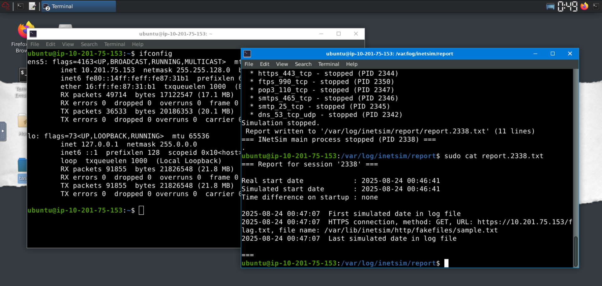
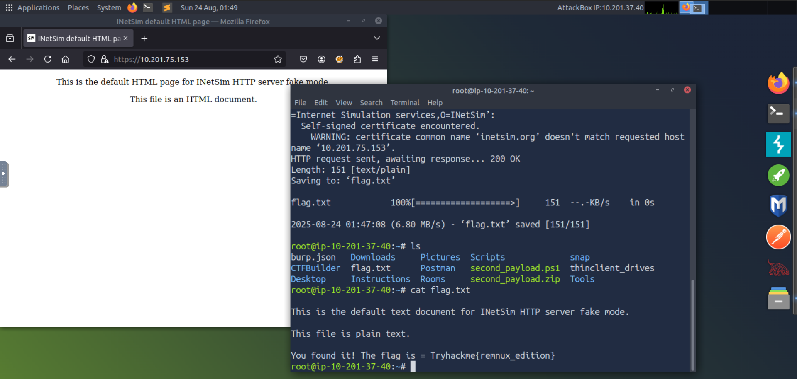

> /BlueTeaming/inetsim/
# INetSim with REMnux

## Objectives
- Simulate a real network environment using **INetSim** in REMnux.  
- Observe malware-like network behaviour such as contacting a server and downloading secondary payloads.  
- Practice configuring INetSim to respond with fake services (DNS, HTTPS, FTP, SMTP, etc.).  
- Capture logs of simulated malicious connections for analysis.  

## Tools Used
- **INetSim** – Internet Services Simulation Suite.  
- **wget** – For simulating malware-style downloads.  
- **REMnux VM** – For running INetSim and generating reports.  
- **AttackBox VM** – For interacting with the simulated network environment.  

## Steps Performed
1. Checked the IP address of the REMnux machine (`ifconfig`).  
2. Configured INetSim:  
   - Edited `/etc/inetsim/inetsim.conf`.  
   - Set `dns_default_ip` to the REMnux IP.  
   - Saved and verified the configuration.  
3. Started INetSim with `sudo inetsim` and confirmed "Simulation running".  
4. From the AttackBox, accessed `https://MACHINE_IP` in a browser to confirm INetSim’s fake services.  
5. Simulated malware behaviour:  
   - Used `wget` to download fake payloads (`second_payload.zip`, `second_payload.ps1`).  
   - Verified files were downloaded successfully.  
6. Stopped INetSim and reviewed the **connection report** in `/var/log/inetsim/report/`.  

## Key Learnings
- **INetSim** is effective for simulating internet services in a contained lab environment.  
- Malware behaviour such as **C2 communication** and **payload downloads** can be safely emulated.  
- Configuration of `dns_default_ip` ensures simulated DNS resolves to the REMnux machine.  
- INetSim logs provide detailed information about connections, protocols, and fake file interactions.  
- This approach avoids the need for complex infrastructure while still providing realistic analysis data.  

## Screenshots
Please refer to the attached screenshots in this directory

