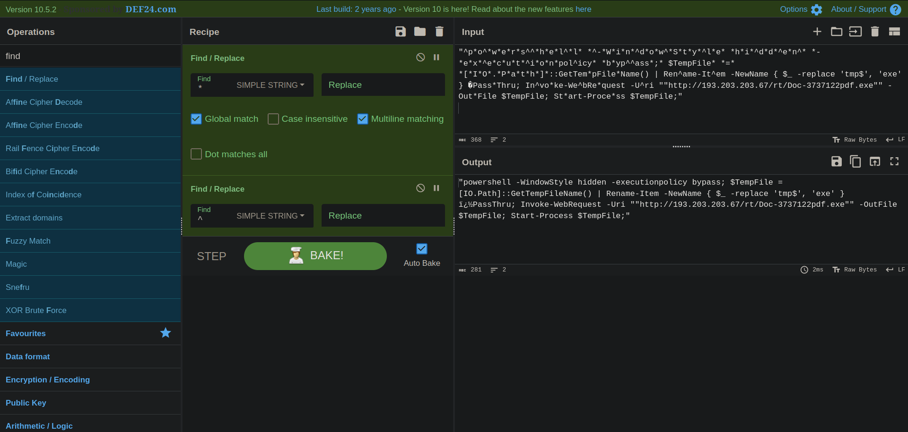
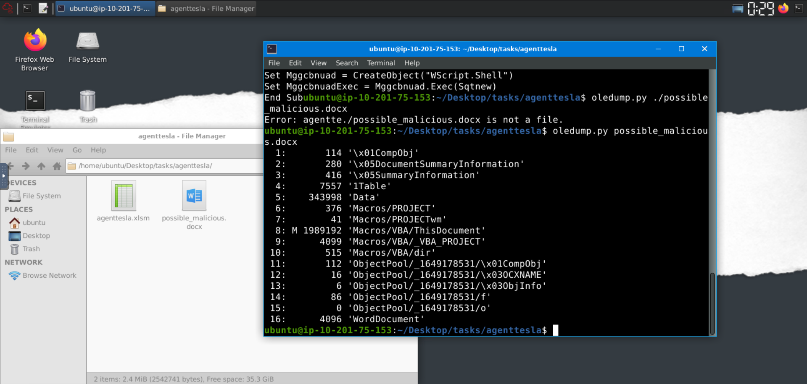
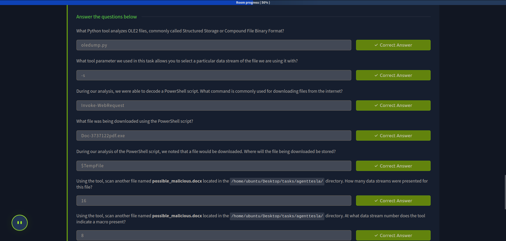

> /BlueTeaming/oledump & cyberchef
# Oledump, CyberChef & REMnux

## Objective
Analyze a malicious Excel document using **oledump.py** and **CyberChef** to detect and deobfuscate VBA macros that download and execute a payload.

## Tools Used
- **REMnux** – Linux distro for malware analysis  
- **oledump.py** – inspects OLE files and extracts VBA macros  
- **CyberChef** – web tool for deobfuscating/decoding scripts  

## Steps Performed
1. **OLE Analysis**
   - Ran `oledump.py agenttesla.xlsm` and found a macro stream `VBA/ThisWorkbook`.

2. **Macro Extraction**
   - Used `oledump.py -s 4 --vbadecompress` to extract readable VBA code.

3. **Suspicious Findings**
   - Found variable `Sqtnew` holding obfuscated PowerShell.  
   - Contained a public IP and `.exe` download link.

4. **Deobfuscation**
   - Cleaned the script in CyberChef by removing `*` and `^`.  

5. **Final Script Behavior**
   - Hides execution, bypasses policy, downloads payload, executes it.

## Key Learnings
- **oledump.py** helps locate and extract VBA macros.  
- Attackers often **obfuscate** PowerShell to avoid detection.  
- **CyberChef** simplifies cleanup of malicious code.  
- Macros are still a common malware delivery method (e.g., AgentTesla).

## Screenshots
See attached screenshots in this directory

