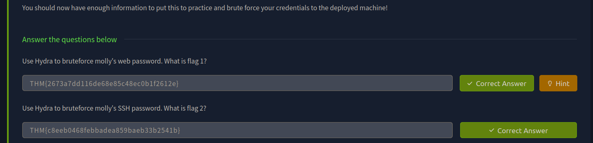

> /RedTeaming/Hydra
# Hydra

## Objectives
- Understand online brute-force fundamentals and risks.
- Use Hydra against SSH and a POST-based web login.
- Reinforce strong-password and hardening practices.

## Tools Used
- **Hydra** — fast online password brute-forcer supporting many protocols (SSH/HTTP/etc.).
- **AttackBox/Kali** — lab environment with Hydra pre-installed.
- **Browser DevTools** — to inspect request method and form field names.

## Steps Performed
1. **Environment**
  - Start the lab VM and point the browser at `http://MACHINE_IP`.
  
2. **SSH Brute Force**
  - Select a username and a wordlist.
  - Run Hydra with `-l`, `-P`, and `-t` against the `ssh` service on `MACHINE_IP`.
  - Note any discovered valid credential.

3. **Web Form Brute Force (POST)**
  - Inspect the login page to confirm `POST`, identify the username/password field names, and the failure string.
  - Use Hydra’s `http-post-form` module with a credentials template (`^USER^`, `^PASS^`) and failure pattern (e.g., `F=incorrect`).
  - Capture the first valid login returned.

## Key Learnings
- Hydra is versatile and effective across many services but relies on precise inputs (fields, paths, failure markers).
- Strong, unique passwords (length + complexity) resist brute force; default creds are high risk.
- Rate limiting, account lockout, and CAPTCHA significantly reduce attack feasibility.
- Thread count (`-t`) affects speed, noise, and detectability—tune for the environment.

## Screenshots
Please refer to the attached screenshots in this directory

