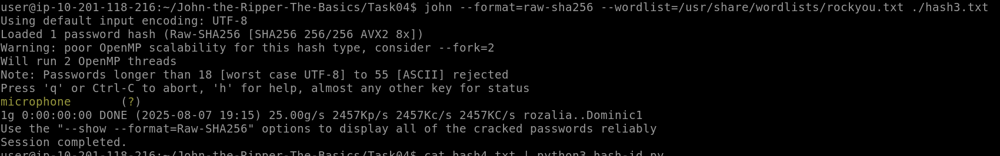

> /RedTeaming/JohnTheRipper
# John the Ripper

## Objectives
- Understand hash functions and their role in password security.  
- Use John the Ripper for dictionary attacks and custom cracking techniques.  
- Work with different hash sources (NTLM, `/etc/shadow`, ZIP, RAR, SSH keys).  
- Highlight the importance of strong password policies and complexity.  

## Tools Used
- **John the Ripper (Jumbo John)** — versatile password hash cracker.  
- **Wordlists (rockyou.txt)** — common weak passwords for dictionary attacks.  
- **Auxiliary Tools**:  
  - `unshadow` — combine `/etc/passwd` and `/etc/shadow` files.  
  - `zip2john` — convert ZIP files into crackable hashes.  
  - `rar2john` — convert RAR files into crackable hashes.  
  - `ssh2john` — extract hashes from SSH private keys.  

## Steps Performed
1. **Hash Cracking Basics**  
   - Used John with `rockyou.txt` to crack simple hashes (e.g., MD5).  
   - Practiced automatic detection and format-specific cracking (`--format`).  

2. **NTLM Hashes (Windows)**  
   - Acquired NT hashes and attempted cracking with John.  
   - Learned about alternative attacks like “pass-the-hash.”  

3. **Linux Shadow File Cracking**  
   - Combined `/etc/passwd` and `/etc/shadow` using `unshadow`.  
   - Cracked resulting file with John in wordlist mode.  

4. **Single Crack Mode & Word Mangling**  
   - Leveraged usernames and GECOS fields to generate mangled guesses.  
   - Observed how predictable user behavior (e.g., `User1!`) makes cracking easier.  

5. **Custom Rules**  
   - Explored predefined and custom password mangling rules in `john.conf`.  
   - Used predictable complexity patterns (capital + number + symbol).  

6. **Archive Cracking**  
   - Used `zip2john` and `rar2john` to convert and crack password-protected ZIP and RAR archives.  

7. **SSH Key Cracking**  
   - Converted private key with `ssh2john` and cracked with John + `rockyou.txt`.  

## Key Learnings
- John the Ripper supports a wide range of hash formats and cracking modes.  
- Dictionary attacks are powerful but rely heavily on good wordlists.  
- Default or weak password choices make hashes vulnerable.  
- Custom rules and single crack mode exploit predictable password patterns.  
- Conversion utilities (`unshadow`, `zip2john`, etc.) extend John’s capabilities beyond simple hashes.  
- Strong password hygiene and defense-in-depth are critical to resist such attacks.  

## Screenshots
Please refer to the attached screenshots in this directory

