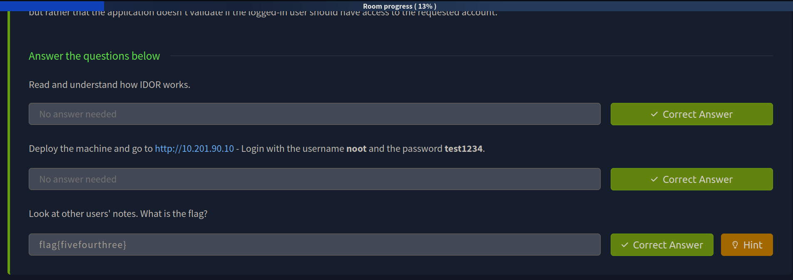
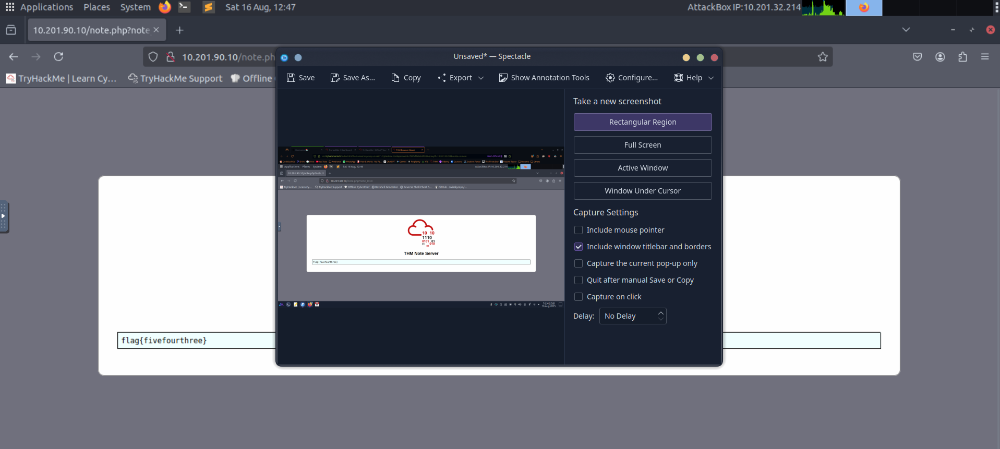
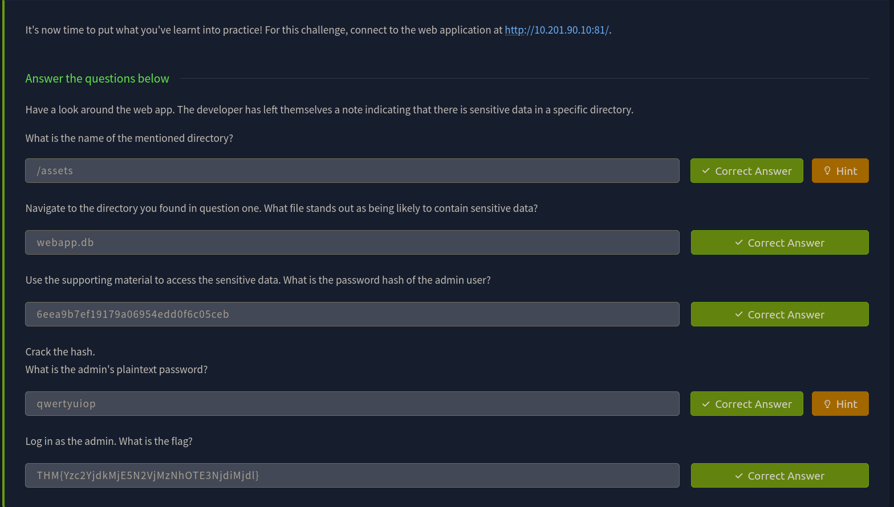
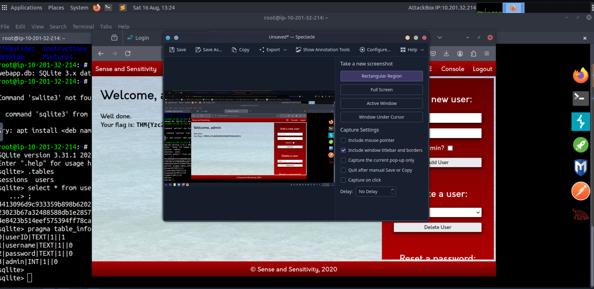
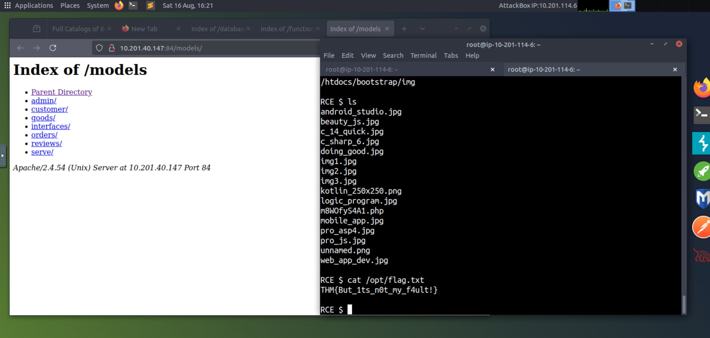
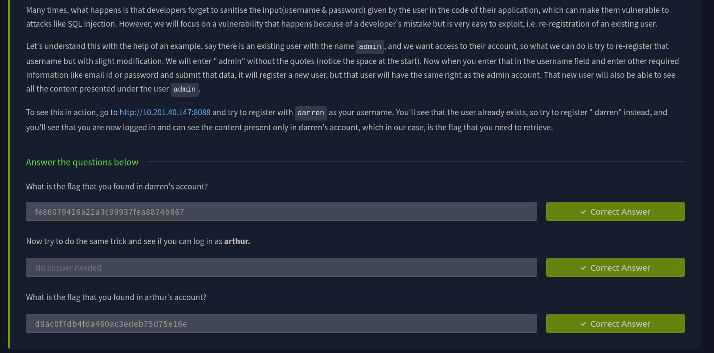
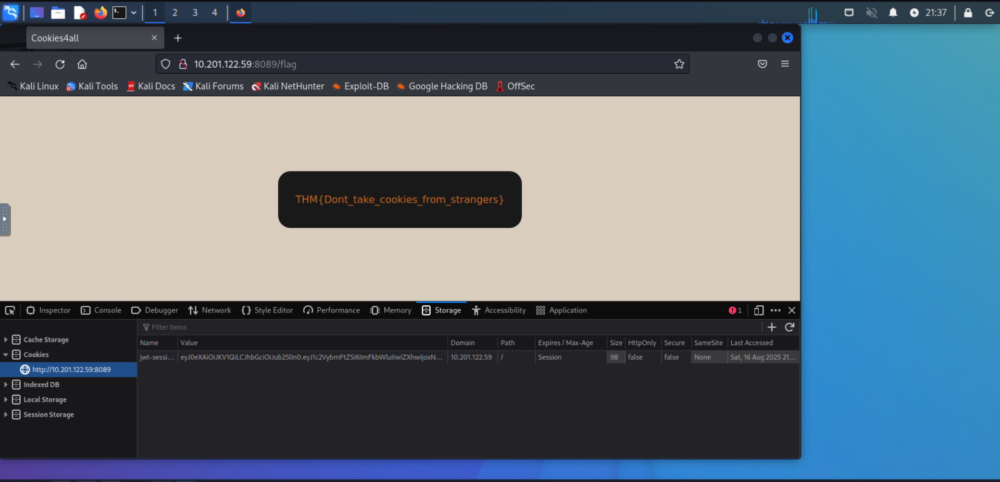
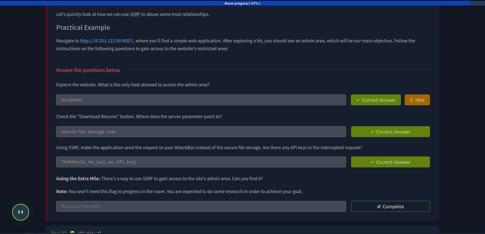
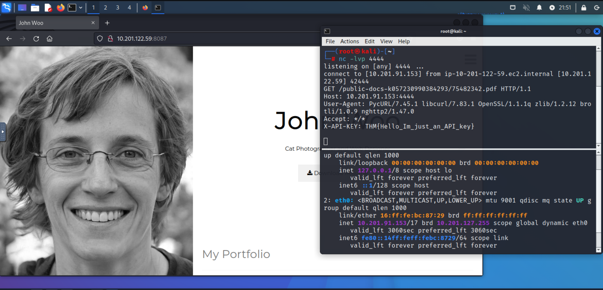

> /RedTeaming/OWASP
# OWASP Top 10 2021

## Section 1: Vulnerable and Outdated Components

- **Objectives**
  - Identify outdated software and known vulnerabilities.
  - Exploit known vulnerabilities using publicly available exploits.
  - Understand the impact of not updating software.

- **Tools used**
  - WPScan
  - Exploit-DB
  - Python 2
  - Linux terminal

- **Steps performed**
  1. Scan the target web application for software versions.
  2. Identify the version of Nostromo web server: `1.9.6`.
  3. Search Exploit-DB for exploits related to Nostromo 1.9.6.
  4. Download the exploit script (`47837.py`).
  5. Fix a small issue in the script by commenting out the line `cve2019_16278.py`.
  6. Execute the script
  7. Verify Remote Code Execution (RCE) success.

- **Key learnings**
  - Known vulnerabilities are easy to exploit if software is outdated.
  - Exploit scripts may require minor fixes before running.
  - Regular updates are critical for maintaining security.

---

## Section 2: Authentication and Session Management Flaws

- **Objectives**
  - Understand authentication flaws and session management issues.
  - Exploit weak authentication to gain unauthorized access.

- **Tools used**
  - Web browser

- **Steps performed**
  1. Explore the registration/login page.
  2. Attempt to register an existing user: `admin`.
  3. Register with `" admin"` (space at start) to bypass logic checks.
  4. Verify access to the admin account or sensitive data.

- **Key learnings**
  - Input sanitization is critical for authentication.
  - Minor username handling mistakes can compromise accounts.
  - Multi-factor authentication and strong passwords mitigate risks.

---

## Section 3: Software and Data Integrity Failures

- **Objectives**
  - Understand software and data integrity issues.
  - Learn methods to prevent tampering.

- **Tools used**
  - Browser
  - Online SRI hash generator
  - JWT.io for decoding JWTs

- **Steps performed**
  **Software Integrity**
  1. Inspect HTML for third-party libraries (e.g., jQuery).
  2. Add Subresource Integrity (SRI) hash

  **Data Integrity (JWT)**
  1. Decode JWT using https://jwt.io/.
  2. Modify payload: `{"username":"admin"}`.
  3. Remove the signature and set `"alg": "none"`.
  4. Test if the server accepts the tampered token.

- **Key learnings**
  - Verify software and data integrity to prevent tampering.
  - Use SRI for external libraries and signed tokens for data.
  - Unsigned or improperly verified JWTs can allow privilege escalation.

---

## Section 4: Logging and Monitoring

- **Objectives**
  - Understand the importance of logging and monitoring.
  - Detect suspicious activity through logs.

- **Tools used**
  - Web server logs
  - Terminal tools (`cat`, `grep`)

- **Steps performed**
  1. Analyze log files.
  2. Identify HTTP status codes, IP addresses, timestamps, and endpoints.
  3. Detect suspicious activity:
     - Multiple failed logins
     - Requests from unusual IPs
     - Automated tools via User-Agent or request speed

- **Key learnings**
  - Logs are crucial for post-incident analysis.
  - Monitoring can detect and reduce impact of attacks.
  - Secure storage and redundancy of logs is important.

---

## Section 5: Server-Side Request Forgery (SSRF)

- **Objectives**
  - Understand SSRF and exploitation of server trust.
  - Capture requests sent by a vulnerable server.

- **Tools used**
  - Web browser
  - Netcat (`nc -lvp 80`)
  - Target web application

- **Steps performed**
  1. Identify SSRF vulnerability in parameter (e.g., `server` for SMS API).
  2. Change parameter to `attacker.thm`.
  3. Capture forwarded request on Netcat:
  4. Observe API key or request details sent by the server.

- **Key learnings**
  - SSRF can expose internal networks and sensitive data.
  - Validate and restrict URLs accepted by your server.
  - Whitelisting trusted endpoints mitigates SSRF attacks.

---

## Key Learnings (OWASP)

- Keep software and libraries updated to prevent exploitation of known vulnerabilities.
- Always verify software and data integrity using hashes, SRI, or signed tokens (e.g., JWTs).
- Implement strong authentication, session management, and multi-factor authentication to prevent account compromise.
- Sanitize inputs to prevent logic flaws and injection attacks.
- Enable logging and monitoring to detect and respond to suspicious activity promptly.
- Validate user-controllable parameters to prevent SSRF and other server-side attacks.
- Minor misconfigurations or developer oversights can lead to serious security risks.

## Screenshots
Please refer to the attached screenshots in this directory

