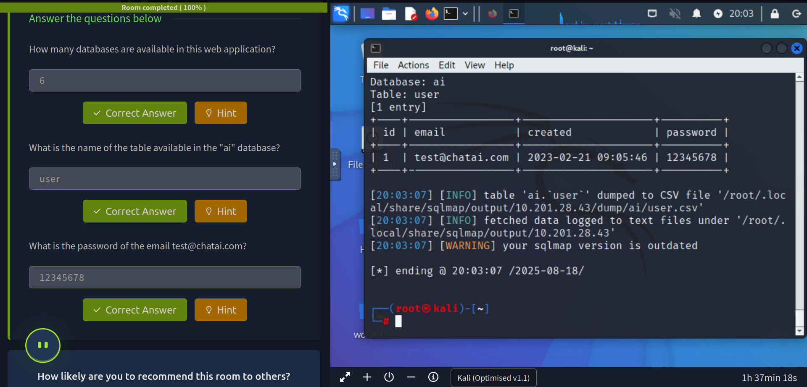

> /RedTeaming/SQLMap  
# SQL Injection Fundamentals with SQLMap

## Objective
Understand SQL injection vulnerabilities in web applications and use **SQLMap** to detect and exploit them through automated scanning.

## Tools Used
- **SQLMap** – automated SQL injection tool for scanning and exploiting vulnerabilities  
- **Linux Terminal** – to execute SQLMap commands and interact with the target  
- **Web Browser DevTools** – to inspect GET/POST requests and extract URLs  

## Key Concepts
- **Database Basics**  
  - Databases store and manage structured data for applications.  
  - Websites interact with databases via SQL queries to retrieve, modify, or insert data.  

- **SQL Injection (SQLi)**  
  - Occurs when user input is improperly sanitized, allowing attackers to manipulate queries.  
  - Common techniques:  
    - Boolean-based blind  
    - Error-based  
    - Time-based blind  
    - UNION-based queries  

- **SQLMap Usage**  
  - Flags like `-u`, `--dbs`, `-D <db> --tables`, `-D <db> -T <table> --dump`, and `--wizard` allow automated detection and exploitation.  

## Steps Performed
1. **Understanding the Target**  
   - Reviewed login page behavior and inspected network requests in browser DevTools.  
   - Identified GET parameters in URL for testing SQL injection.  

2. **Testing URL for Vulnerability**  
   - Used SQLMap to scan the target URL and identify injection points.  
   - Observed multiple SQL injection techniques applicable.  

3. **Extracting Database Information**  
   - Enumerated database names.  
   - Retrieved tables within the target database.  

4. **Dumping Table Records**  
   - Extracted records from specific tables to analyze stored data.  

5. **Working with POST Requests**  
   - Captured POST request for login form using browser DevTools.  
   - Supplied request to SQLMap for testing SQL injection.  

6. **Practical Exploitation**  
   - Accessed vulnerable VM and used AttackBox for hands-on practice.  
   - Identified the complete URL with GET parameters to test and exploit SQL injection.  
   - Used deeper scan options and responded to prompts for smooth execution.  

## Key Learnings
- SQL injection occurs due to improper input sanitization, allowing attackers to manipulate database queries.  
- SQLMap automates discovery and exploitation of SQL injection vulnerabilities.  
- GET and POST parameters can both be vulnerable; inspection of requests is crucial.  
- Enumerating databases, tables, and records requires systematic use of SQLMap flags.  
- Understanding SQL injection types (boolean-based, error-based, time-based, UNION) is key for proper exploitation.  

## Screenshots
Please refer to the attached screenshots in this directory

