> /SOCTraining/CyberThreatIntel/FileHash

# File & Hash Intelligence

## Objectives

- Interpret suspicious file paths and filenames using heuristic indicators to identify attacker tradecraft.

- Generate and validate file hashes as immutable identifiers for malicious binaries regardless of filename changes.

- Leverage VirusTotal and MalwareBazaar to enrich observed samples with detection scores, threat labels, and campaign attribution.

- Extract behavioral IOCs from sandbox analysis and map observed techniques to MITRE ATT&CK.

- Investigate a real triage package of flagged binaries within a simulated SOC scenario.

## Tools & Resources

- **VirusTotal:** For hash-based lookups, vendor detection scores, threat labels, file properties, and network infrastructure associated with malicious samples.

- **MalwareBazaar:** For malware family tagging, YARA rule identification, campaign attribution, and cross-referencing samples against a community-maintained database.

- **Hybrid Analysis:** For sandbox-based behavioral analysis, ATT&CK technique mapping, process trees, and runtime IOC extraction.

- **TryDetectThis:** Offline threat intel platform used throughout this investigation to query vendor data and sandbox reports.

## Steps Performed

- Examined files in the CTI package for heuristic indicators including double extensions, system binary impersonation, high-entropy names, and masquerading patterns.

- Generated SHA256 hashes for samples under investigation and validated them against threat intelligence platforms.

- Submitted hashes to VirusTotal and reviewed detection scores, threat classification labels, first submission timestamps, signing status, and associated network infrastructure.

- Identified the vendor that classified `Morse-Code-Analyzer` as non-malicious and noted the MITRE technique flagged for persistence and privilege escalation.

- Analyzed `bl0gger.exe` on Hybrid Analysis to retrieve associated tags, the stealth command line executed, and the spawned child process from the process tree.

- Investigated `payroll.pdf.exe` to determine the legitimate Windows binary it was masquerading as, the associated URL, and the number of extracted strings from sandbox analysis.

- Analyzed `Challenge.bin.sample` to retrieve its SHA256 hash, VirusTotal family labels, first seen timestamp, the text file dropped during execution, the PowerShell command observed, and its mapped MITRE ATT&CK technique ID.

## Key Learnings

File and hash intelligence transforms a raw alert into actionable context. Heuristic filepath and filename analysis provides the first signal, while hash lookups across VirusTotal and MalwareBazaar confirm identity and attribution. Sandbox analysis fills the gap that static analysis leaves open, revealing runtime behavior, dropped payloads, and ATT&CK-mapped techniques. Together these three layers form the core enrichment workflow every SOC analyst applies during triage.

## Screenshots

Please refer to the attached screenshots in this directory.

#### Double-Extension file
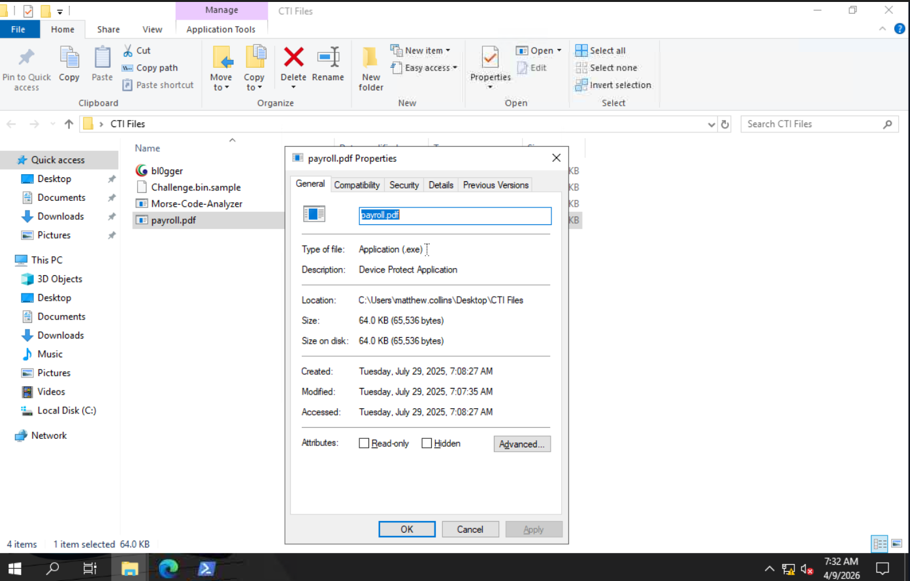

#### Malware hash
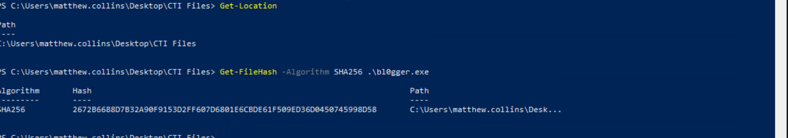

#### VirusTotal scores
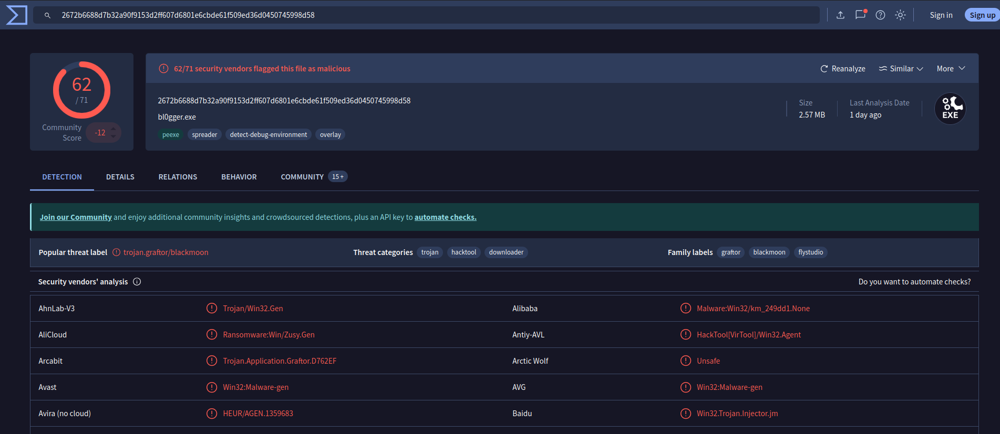

#### Vendor's false-negative
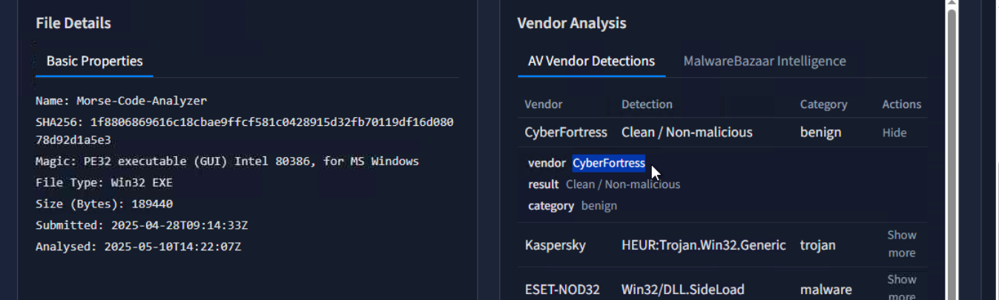

#### Technique applied
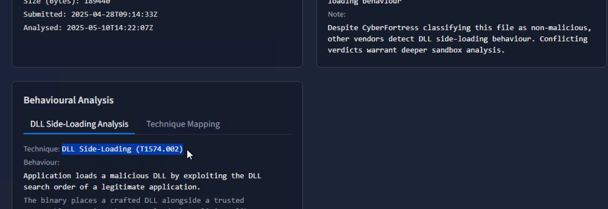

#### Hybrid-Analysis report
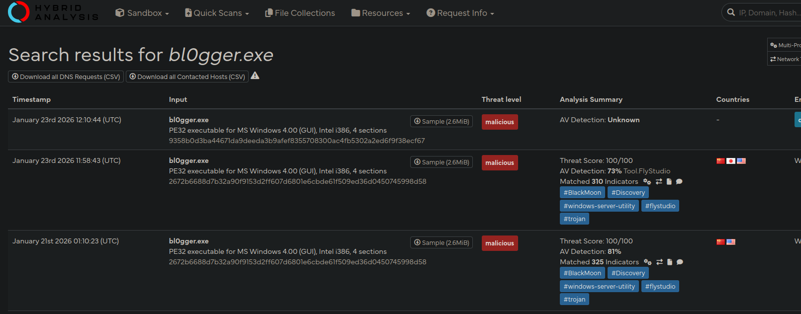

#### Child-processes executed
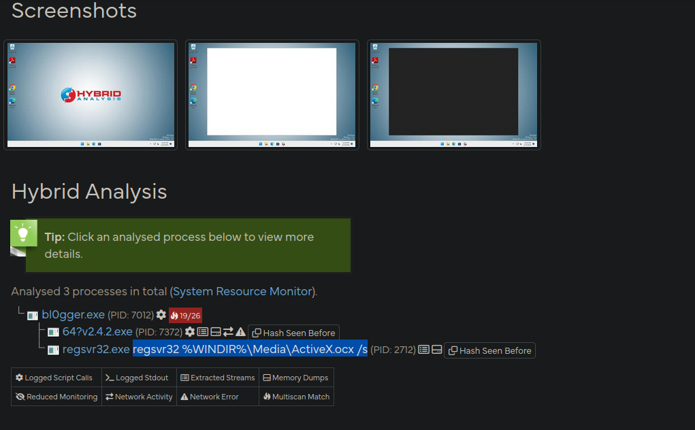

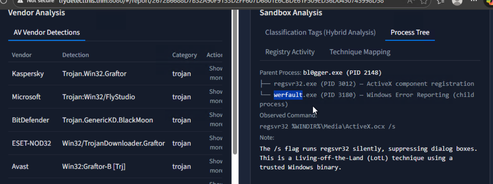

#### Legitimate file impersonation
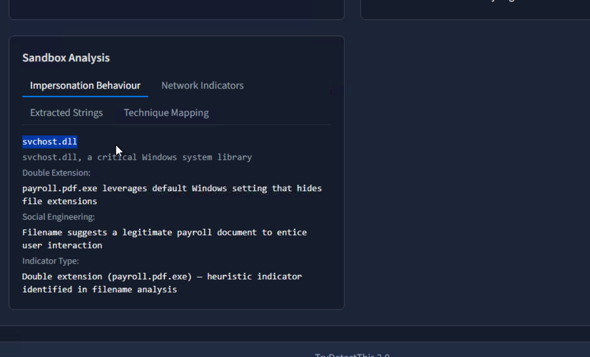

#### URL linked to file
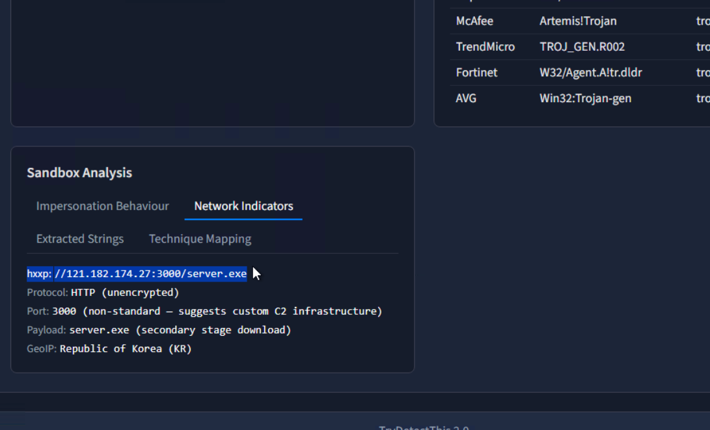

#### Malicious files hashes
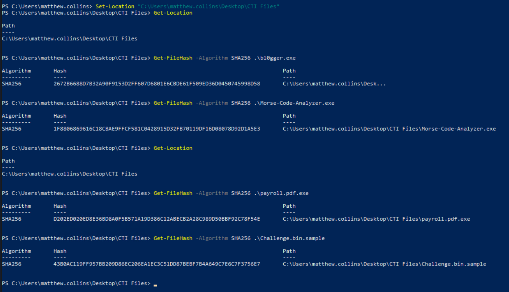

#### VirusTotal analysis
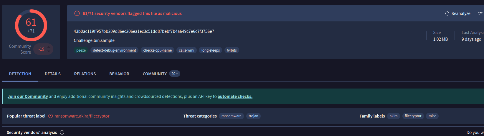

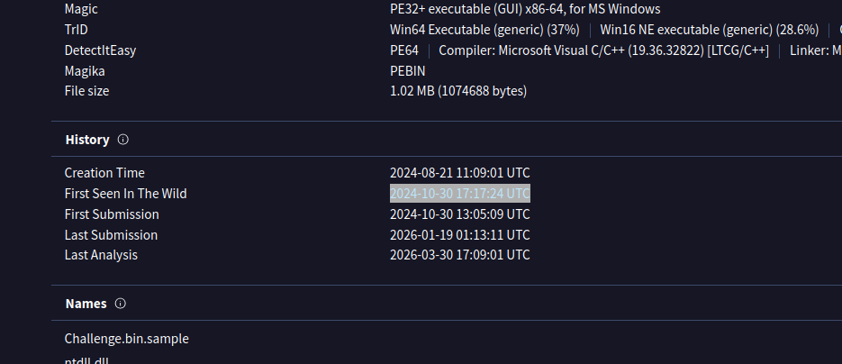

#### Dropped file
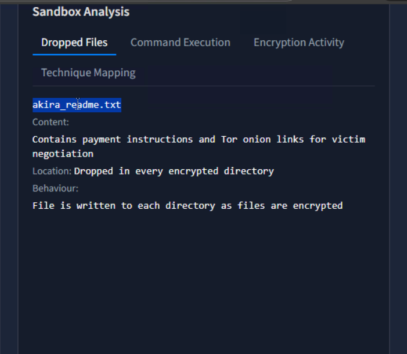

#### Executed command by malware
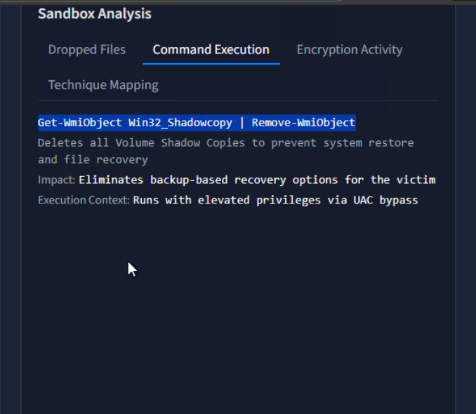

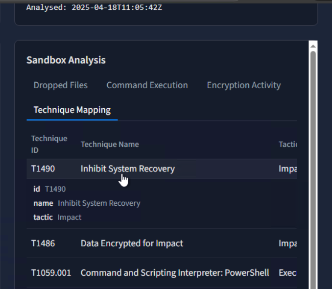

#### Results
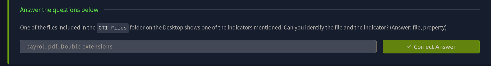

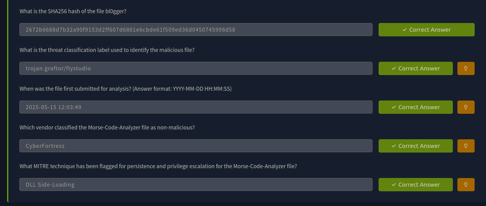

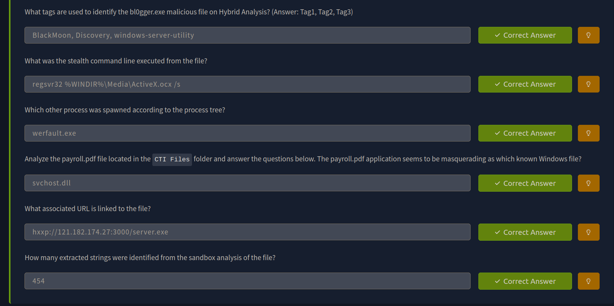

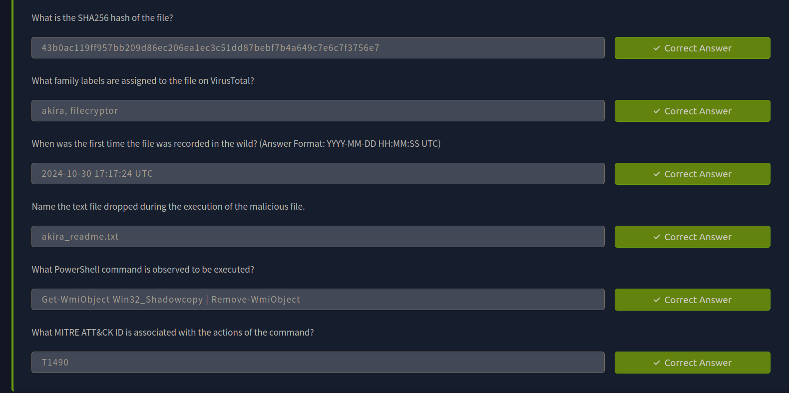

---
> QXV0aG9yOiBodHRwczovL2dpdGh1Yi5jb20vaGFzaC01NDU=