> /SOCTraining/CyberThreatIntel/IP&Domain

# IP & Domain Threat Intelligence

## Objectives

- Enrich suspicious IP addresses and domains using geolocation, ASN context, and RDAP ownership data.

- Analyze DNS records to identify attacker infrastructure patterns including fast flux, typosquatting, and CDN abuse.

- Investigate exposed services and TLS certificates.

- Assess reputation and historical activity.

- Apply structured triage workflows to produce evidence-based block, monitor, or close decisions.

## Tools & Resources

- **nslookup.io / dnschecker.org:** For DNS record enumeration.

- **RDAP / client.rdap.org:** Authoritative source for IP ownership, netrange, ASN, and abuse contact data maintained by Regional Internet Registries.

- **Shodan / Censys:** For exposed service discovery, port enumeration, service banners, and TLS certificate fingerprinting.

- **crt.sh:** Certificate transparency log search for TLS certificate issuer, validity period, and Subject Alternative Names.

- **VirusTotal:** For detection ratio, first and last seen timestamps, community notes, and related infrastructure pivoting.

- **Cisco Talos:** For web and email reputation scores, category labels, and vulnerability disclosures.

- **IP2Proxy:** For identifying VPN, proxy, and Tor exit node usage to adjust attribution confidence.

## Steps Performed

- Queried DNS records for the flagged domain to retrieve A records and associated nameserver addresses.

- Looked up a suspicious IP on RDAP to identify registration date, assigned entity roles, country, and linked Autonomous System.

- Investigated a flagged IP on Shodan to identify exposed services and open port count, then retrieved the TLS certificate fingerprint via Censys.

- Searched the identified TLS fingerprint on `crt.sh` to confirm the certificate Subject commonName.

- Enriched a suspicious IP on VirusTotal to identify linked files and queried historical WHOIS to confirm the registered organisation.

- Investigated a phishing domain's DNS records to count NS entries, identify the Start of Authority nameserver, and retrieve the domain registration date.

- Queried a beaconing IP to identify the Regional Internet Registry and associated ASN.

- Applied the full verify, enrich, score, decide workflow across all flagged indicators to form block, monitor, or close recommendations.

## Key Learnings

IP and domain enrichment requires layering multiple sources since no single tool provides a complete picture. RDAP and ASN context establish ownership, Shodan and Censys reveal exposed attack surface, certificate transparency uncovers related infrastructure, and reputation services add time context to tie it together. Precise, expiry-bound controls based on enriched evidence prevent both missed threats and collateral damage from overbroad blocks.

## Screenshots
Please refer to the attached screenshots in this directory.

#### IP registration and ownership
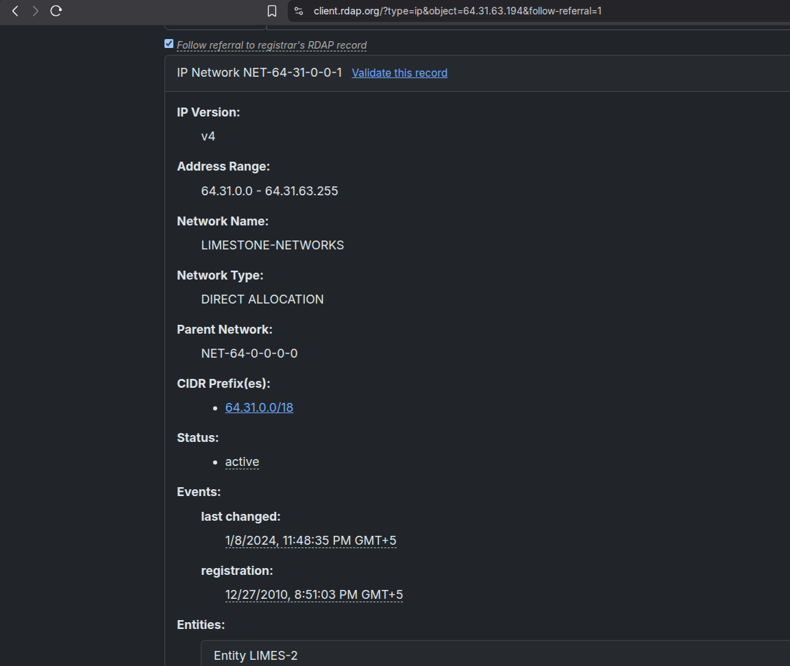

#### ARIN entities
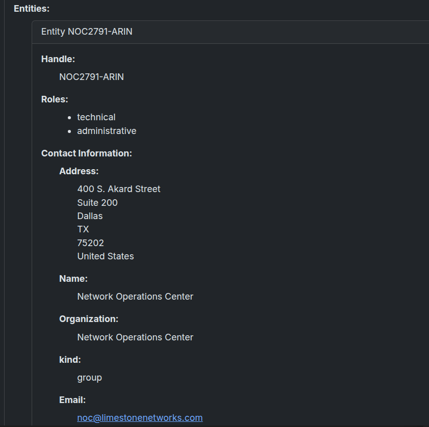

#### IP location
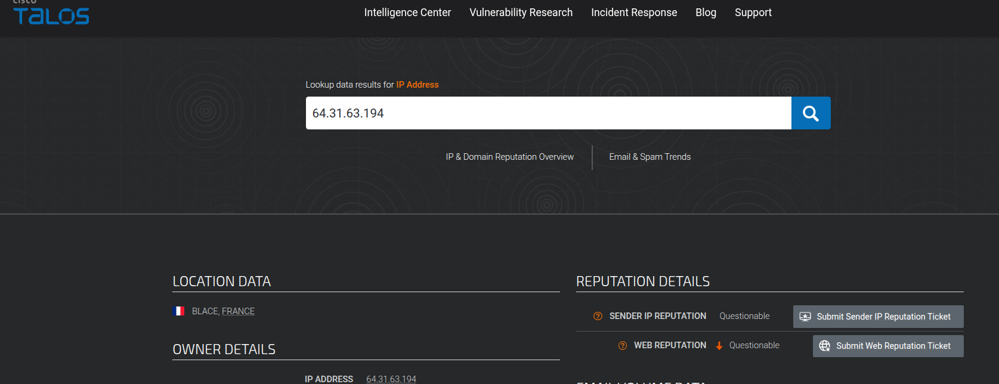

#### Open ports
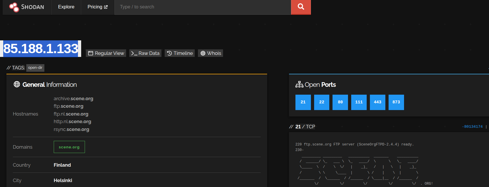

#### Certificate fingerprint
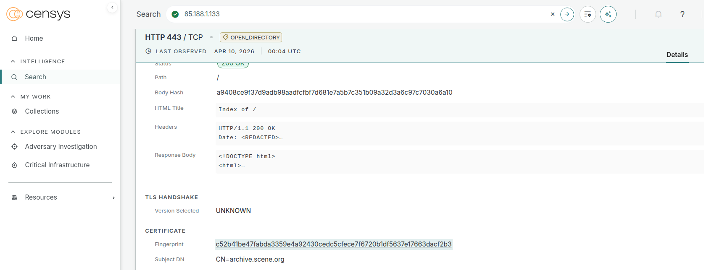

#### 
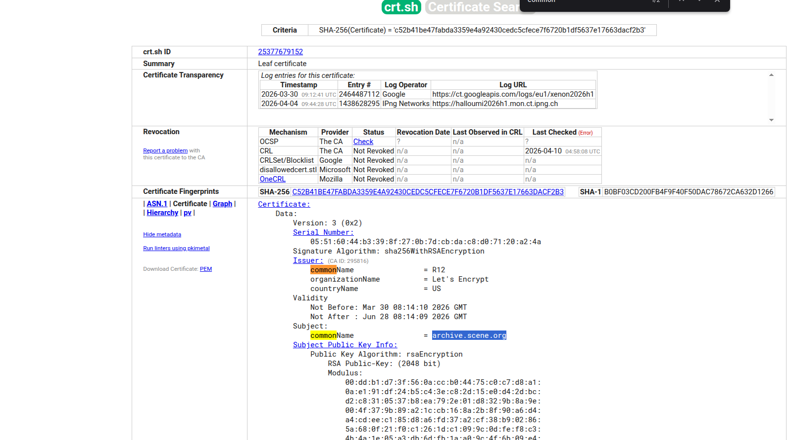

#### Associated files with malicious IP
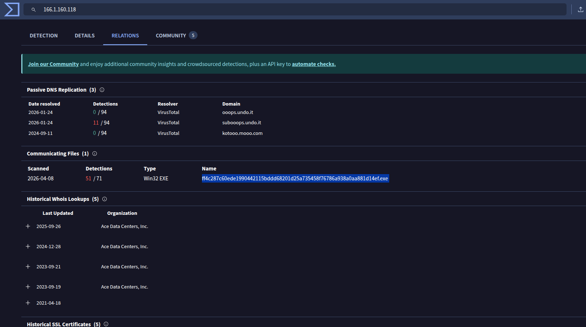

#### ARIN record
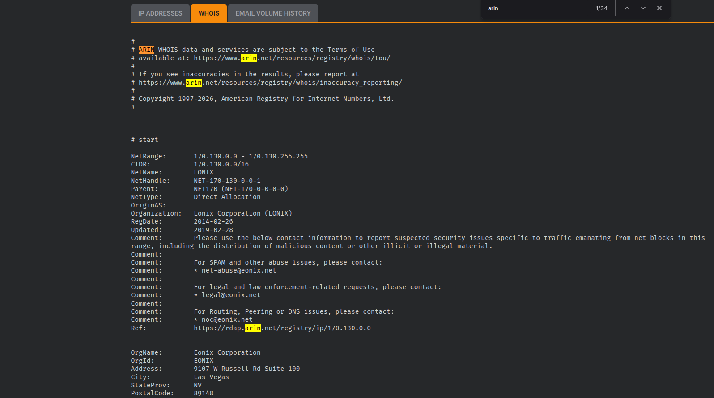

#### ASN & Proxy Analysis
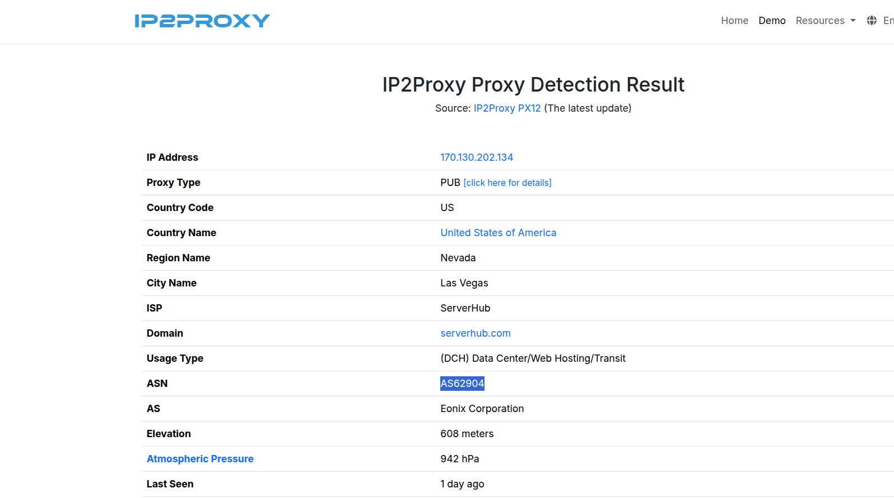

#### Results
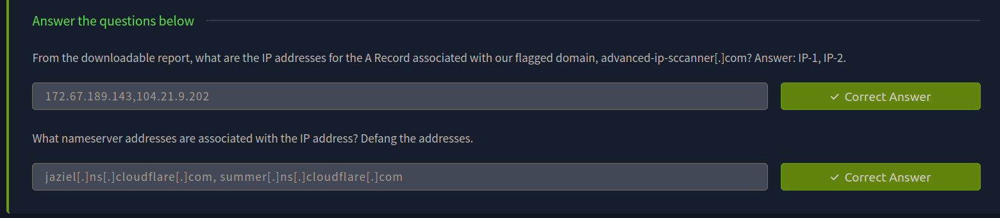

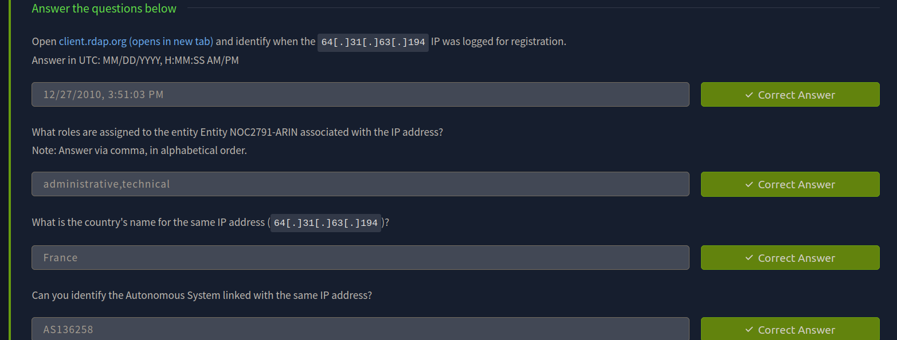

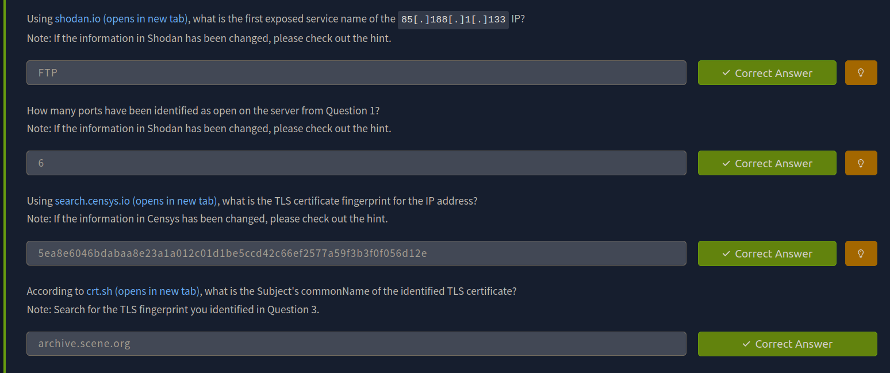

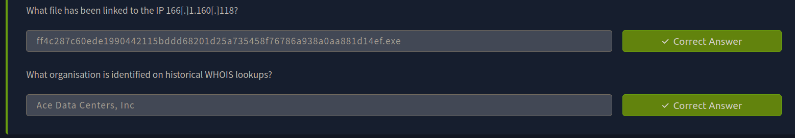

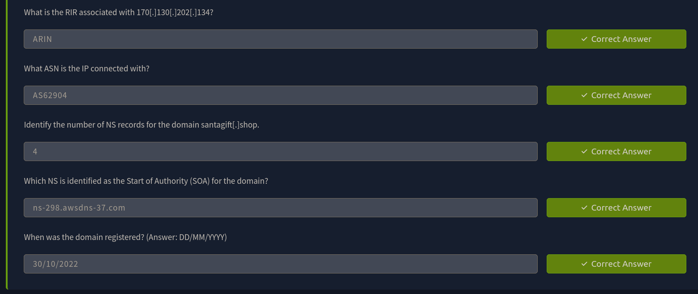

---
> QXV0aG9yOiBodHRwczovL2dpdGh1Yi5jb20vaGFzaC01NDU=