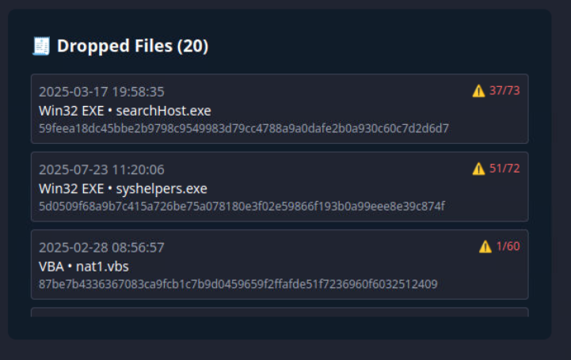
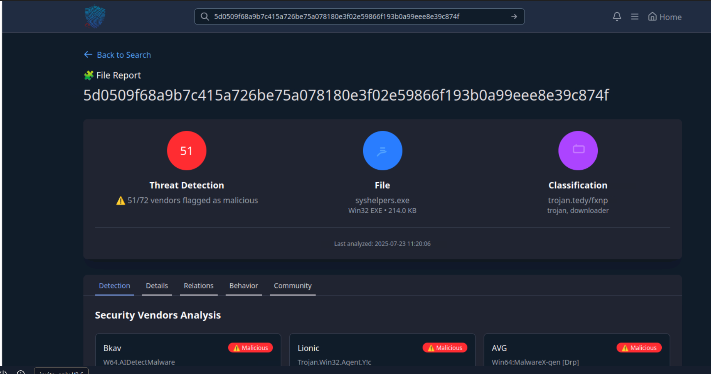
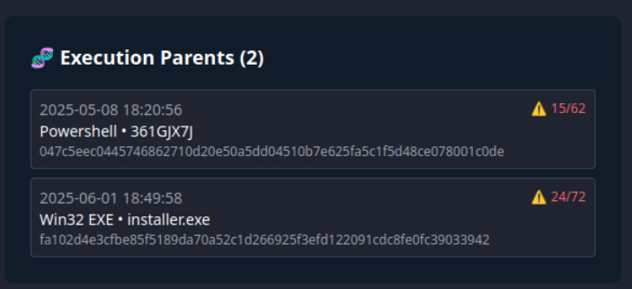
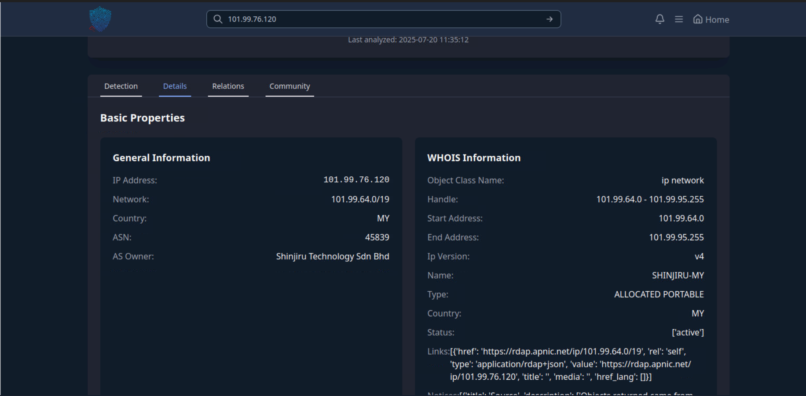
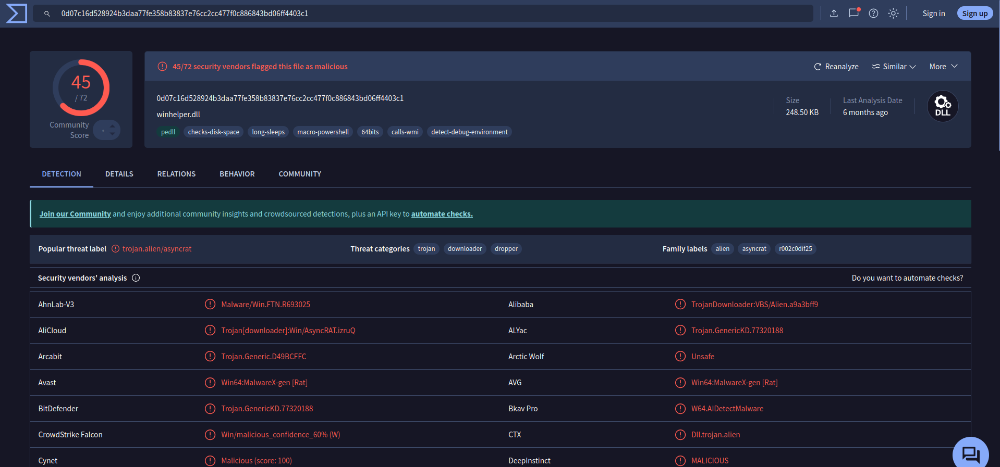
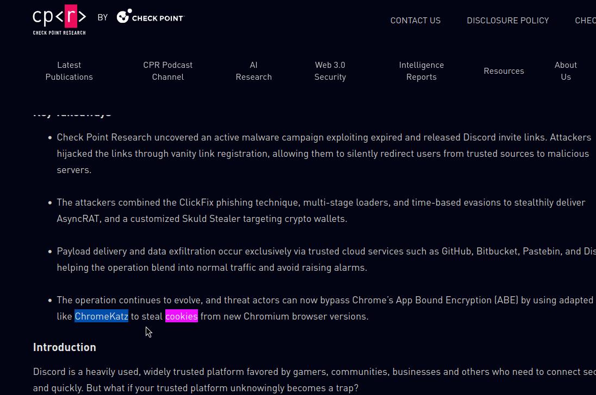
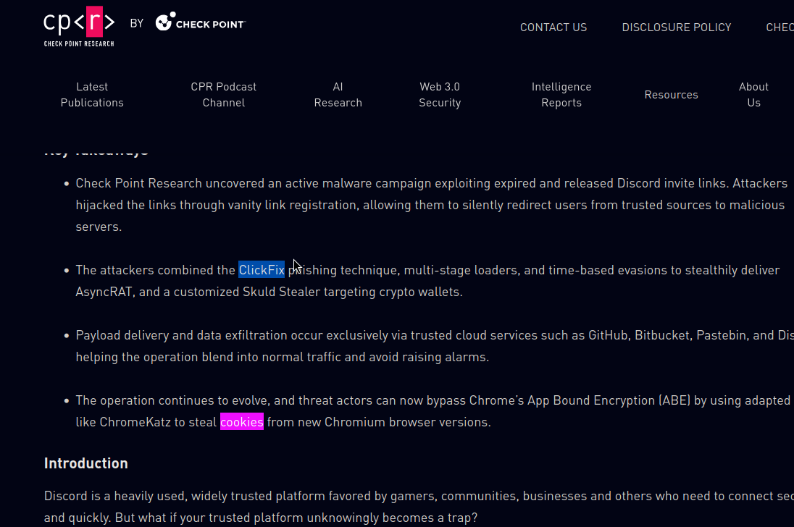
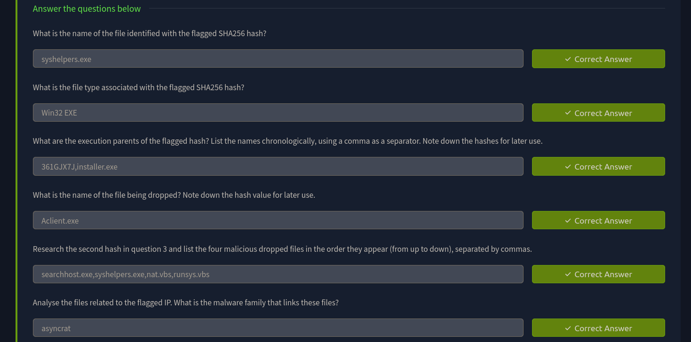
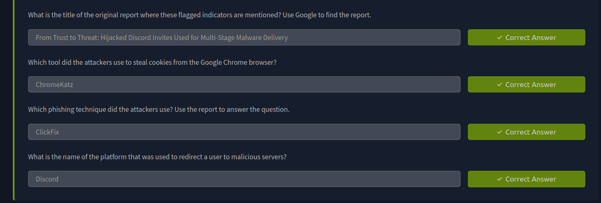

> /SOCTraining/ThreatIntelligence/InviteOnly

# Invite Only — Threat Intelligence Challenge

## Objectives

- Analyze a flagged SHA256 hash to identify the file, its type, and execution lineage.

- Trace dropped files across multiple hash pivots to map the full malware delivery chain.

- Enrich a flagged IP to identify linked files and determine the connecting malware family.

- Correlate all indicators against an original threat intelligence report to confirm attribution.

- Identify the phishing technique, cookie-stealing tool, and redirection platform used in the attack.

## Tools & Resources

- **TryDetectThis 2.0:** Primary platform for hash and IP enrichment, execution parent tracing, and dropped file identification.

- **VirusTotal:** For cross-referencing hash detections, malware family labels, and indicator relationships.

- **Google / Open-Source Reports:** For locating the original threat intelligence report linked to the flagged indicators.

## Steps Performed

- Submitted the flagged SHA256 hash to TryDetectThis 2.0 to identify the filename and associated file type.

- Traced the execution parent chain of the flagged hash, recording each parent file name and hash value chronologically.

- Identified the file dropped by the flagged hash and noted its hash for further pivoting.

- Researched the second execution parent hash to enumerate its four malicious dropped files in order of appearance.

- Enriched the flagged IP to identify files associated with it and determined the malware family linking them.

- Used open-source search to locate the original threat intelligence report referencing all flagged indicators.

- Extracted from the report the cookie-stealing tool targeting Google Chrome, the phishing technique employed, and the platform used to redirect victims to malicious infrastructure.

## Key Learnings

Threat intelligence investigations rarely stop at a single indicator. Each hash pivot reveals new dropped files, each dropped file links back to a malware family, and each malware family connects to a documented campaign. Following the full chain, from initial hash through execution parents, dropped payloads, and IP attribution, is what separates a closed alert from actionable intelligence. Cross-referencing findings against original threat reports provides the campaign context that enrichment tools alone cannot surface.

## Screenshots
Please refer to the attached screenshots in this directory.

#### Dropped files

#### Indicator of Compromise

#### Malicious parent files

#### VirusTotal  reports

#### Tool used to steal cookies

#### Phishing technique executed

#### Results

---
> QXV0aG9yOiBodHRwczovL2dpdGh1Yi5jb20vaGFzaC01NDU=