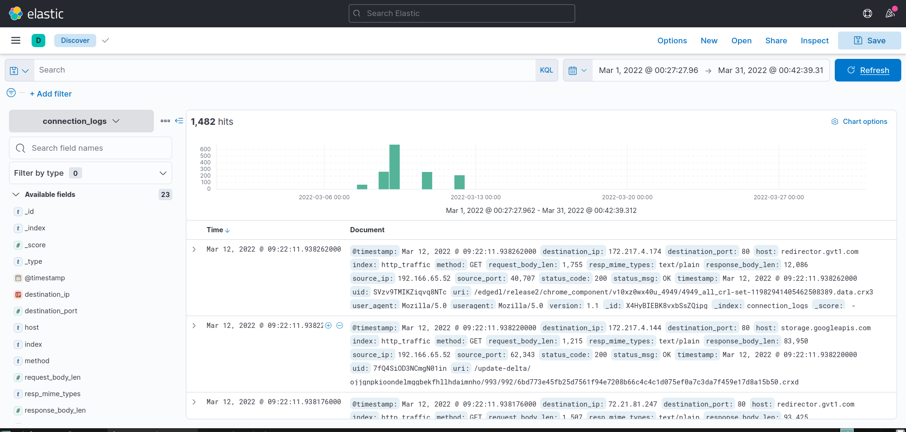
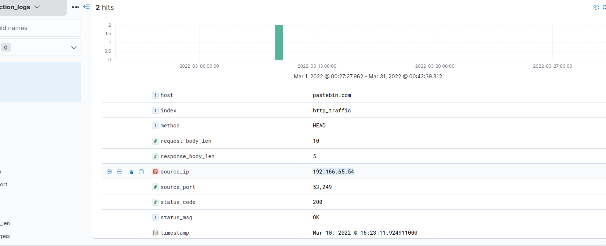
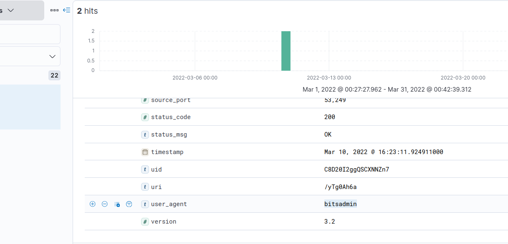
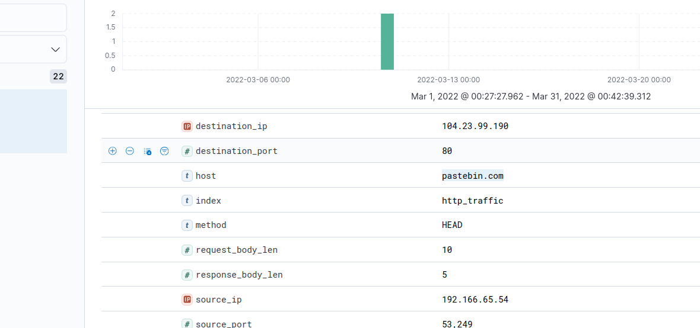
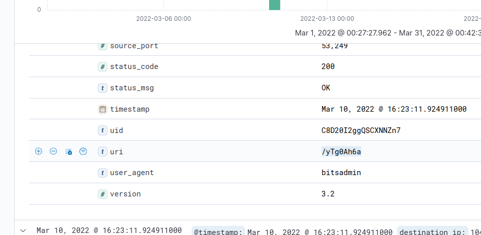
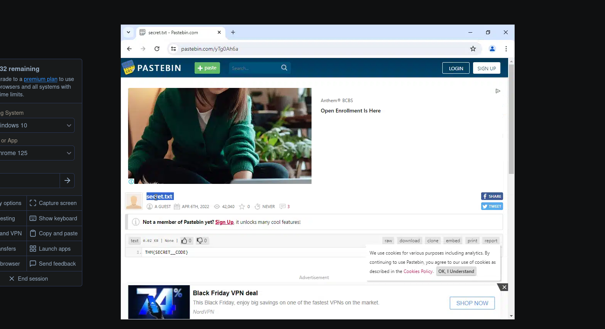
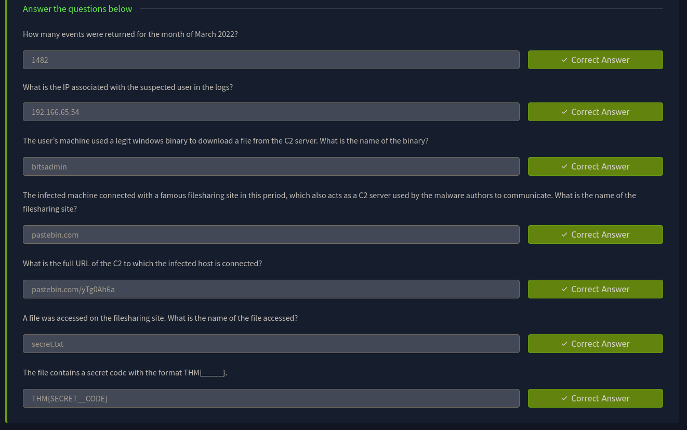

> /SOCTraining/ELK/C2 Comm

# C2 Communication Detection
> Itsy Bitsy Challenge

## Objectives
- Investigate IDS logs indicating potential Command-and-Control (C2) communication from an internal HR user.
- Analyze dataset of HTTP connection logs ingested into Kibana.
- Identify suspicious outbound connections, accessed URLs, and malicious file content.
- Extract and confirm the malicious pattern contained within the accessed file.
- Build experience in log querying, pattern extraction, and network behavior analysis using Kibana/Elastic.

## Tools Used
- **ELK Stack:** Main investigation tool for log ingest, indexing and data vizualization.
- **VirusTotal:** Threat intelligence platform to investigate malicious behavior.
- **Browserling:** Browser sandbox to access potentially malicious URLs

## Steps Performed
- Reviewed the IDS alert pointing to potential C2 communication originating from HR user.
- Queried logs to isolate traffic generated specifically by the victim.
- Identified suspicious external HTTP connections inconsistent with HR department activity.
- Traced the outbound connections to a specific remote endpoint suspected to be hosting malicious content.
- Located the exact URL of the accessed file responsible for triggering the IDS alert.
- Extracted the contents of the file from the log data and confirmed the embedded malicious pattern.
- Verified timeline and frequency of access to ensure the activity was not accidental or benign.
- Correlated the suspicious file access with unusual HTTP communication patterns matching typical C2 beaconing behavior.

## Key Learnings
- Strengthened skills in analyzing HTTP network logs using Kibana.
- Gained understanding of C2 traffic indicators and behavioral anomalies.
- Practiced filtering traffic by user identity to isolate suspicious activity.
- Learned how malicious artifacts can be embedded within accessed files and identified through IDS alerts.
- Improved capability in correlating IDS alerts with underlying log data to confirm malicious behavior.

## Screenshots
Please refer to the attached screenshots in this directory.

**Total indexed logs**

**Victim's private IP (HR Dept.)**

**Malicious binary**

**Malicious site**

**Malicious file URI**

**Malware**

**Challenge Results**
