> /SOCTraining/LinuxThreatDetection/post-access

# Linux Post-Access Attack Analysis

## Objectives

- Detect Discovery commands in auditd logs and trace their origin using process tree analysis.

- Identify Ingress Tool Transfer activity via process creation and authentication logs.

- Investigate cryptominer infection chains from Initial Access through persistence and malware deployment.

- Analyze Dota3 malware case covering SSH brute-force, Discovery, and cryptominer setup.

## Tools & Resources

- **auth.log:** For detecting successful SSH logins from untrusted IPs and tracing brute-force activity.

- **Auditd:** Runtime process creation monitoring, for tracing Discovery commands, file transfers, and malware execution to their origin.

- **Bash History:** For recovering attacker-run commands during interactive SSH sessions.

## Steps Performed

- Ran Discovery commands on the VM to identify the virtualization environment and detect any running antimalware processes.

- Investigated an alert on the `hostname` command, traced it back to a malicious script via process tree, identified the last Discovery command the script executed, and retrieved the script author's email from its contents.

- Queried auditd logs for file download activity to identify the domain used to retrieve the Elastic agent and the full path of a downloaded `helper.sh` script.

- Assessed downloaded files to determine which was more likely malicious based on download method and context.

- Analyzed scenario logs to identify the IP that successfully brute-forced SSH, the command used to list recently logged-in users, and the EDR processes the attacker searched for.

- Traced the malicious archive transferred to the victim via SCP and identified the hidden staging directory used to unpack malware.

- Retrieved the full command line used to launch the Dota3 cryptominer and identified the internal network ranges scanned by the bundled network scanner.

## Key Learnings

Post-access attacker behavior on Linux is methodical, Discovery first, then tooling, then impact. The same native commands used by administrators double as attacker tools, making context the deciding factor in detection. **Process tree analysis** remains the most reliable method for distinguishing malicious activity from legitimate system behavior, and auditd combined with authentication logs covers the full attack chain from first login to cryptominer deployment.

## Screenshots

Please refer to the attached screenshots in this directory.

#### Malicious script
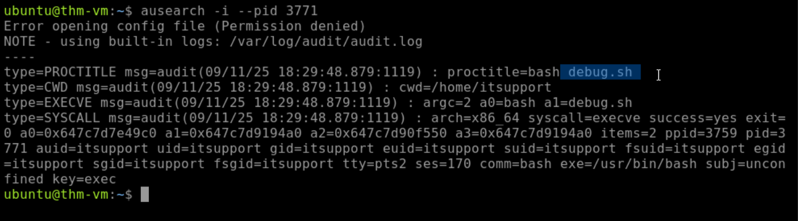

#### Discovery commands
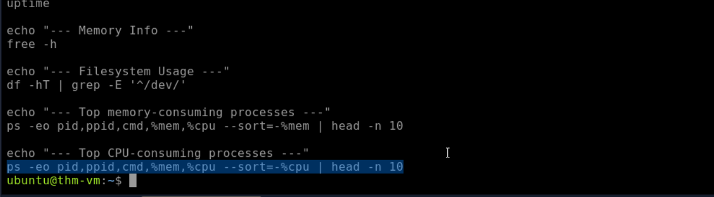

#### Script-author

#### Domain used
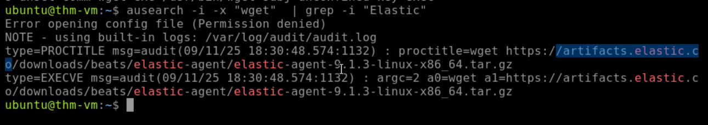

#### Hidden malware script
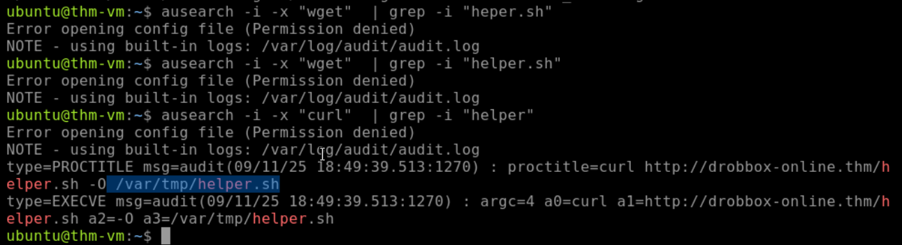

#### IP successfully breached SSH
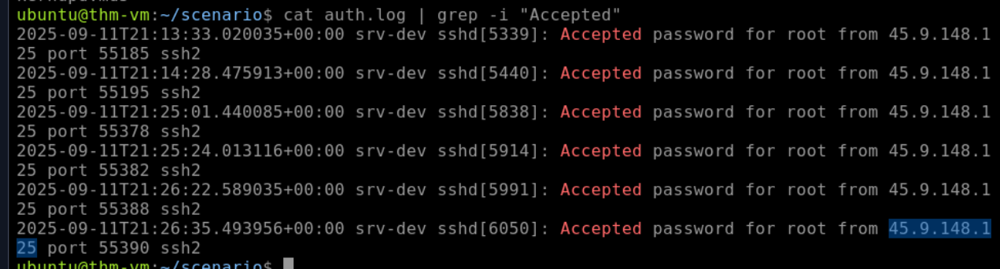

#### Last user discovery
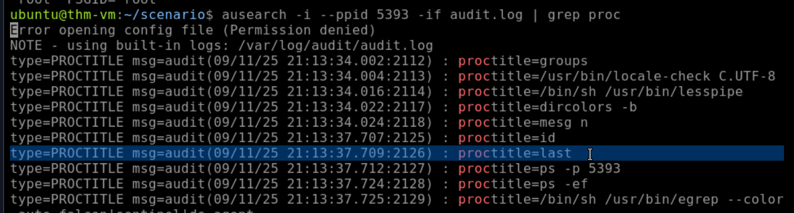

#### EDR detection
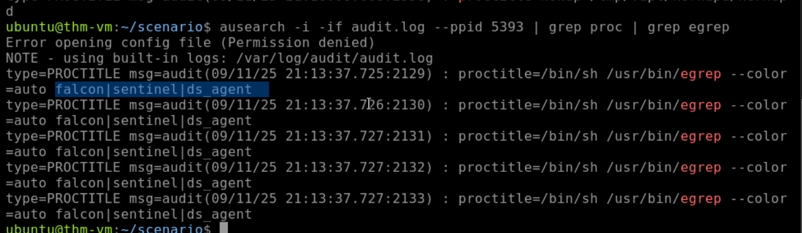

#### Malware archive
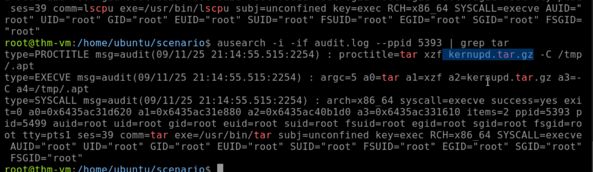

#### Cryptominer execution
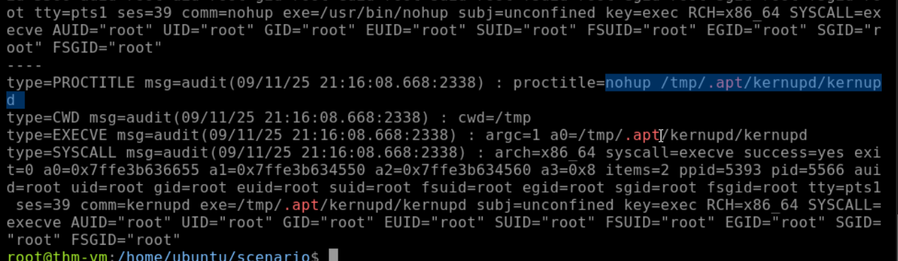

#### Scanned IP range
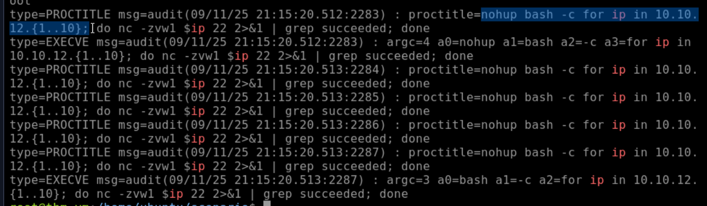

#### Results & Findings
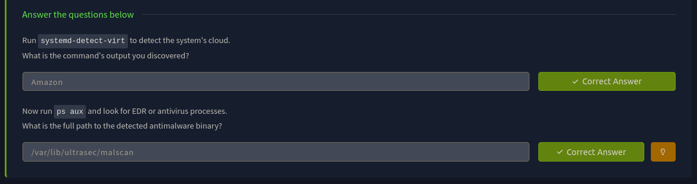

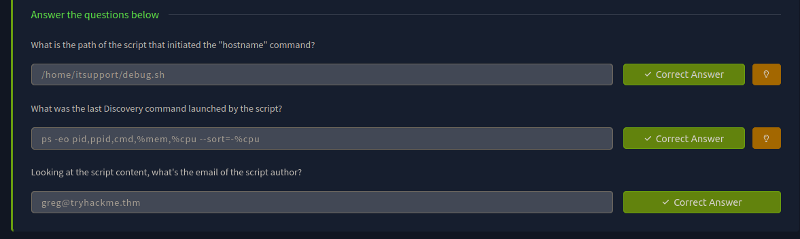

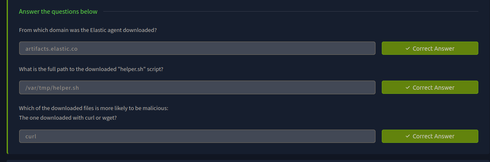

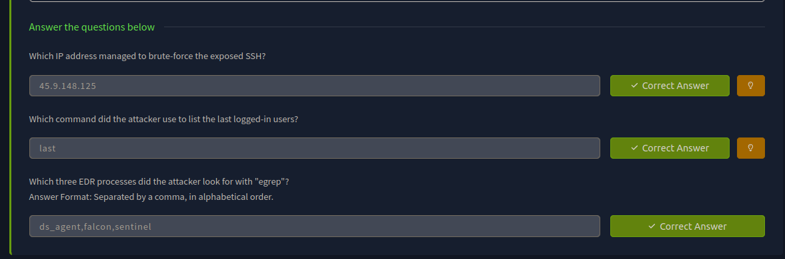

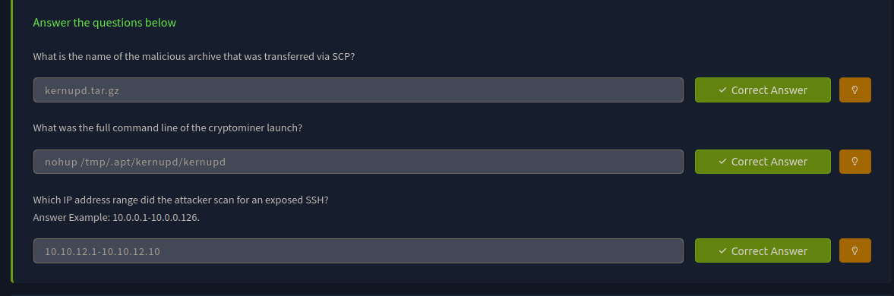

---
> QXV0aG9yOiBodHRwczovL2dpdGh1Yi5jb20vaGFzaC01NDU=