> /SOCTraining/LinuxThreatDetection/ssh&revshell

# SSH Compromise & Reverse Shell Analysis

## Objectives

- Detect SSH brute-force attempts and successful breaches via authentication logs.

- Analyze web server logs to identify command injection exploitation against a vulnerable web application.

- Build process trees using auditd to trace the origin of suspicious commands back to the breaching service.

- Investigate advanced Initial Access scenarios including supply chain compromise and human-driven attacks.

- Apply process tree analysis as a universal detection method across all Initial Access techniques.

## Tools & Resources

- **auth.log:** For detecting SSH brute-force attempts, successful logins, and identifying attacker source IPs.

- **Nginx Access Log:** For analyzing web requests and spotting command injection patterns in application parameters.

- **Auditd:** Runtime monitoring for process creation events, used to build process trees and trace attack origin via PID and PPID correlation.

## Steps Performed

- Reviewed `auth.log` to determine the first SSH login of the ubuntu user and confirm the authentication method used.

- Filtered authentication logs for failed SSH attempts to identify the brute-force start time, targeted usernames, and the IP that successfully breached the root account.

- Analyzed Nginx access logs to identify attacker IP, the vulnerable endpoint, and OS commands injected through web request parameters.

- Located the Python file the attacker attempted to open via command injection and retrieved the flag stored within it.

- Used auditd process creation logs to trace the suspicious `whoami` command back through its parent processes to the TryPingMe web application.

- Enumerated all child processes of the breached application to reveal the full scope of attacker activity, including the reverse shell program used.

- **Process tree**

```
1 (systemd)
└── 577 (Python script)
    └── 1018 (Reverse shell established)
        └── 1020 (First command by attacker)
```


## Key Learnings

Linux Initial Access rarely looks the same twice, but the detection approach stays consistent. Whether the entry point is a weak SSH password, a vulnerable web application, or a compromised dependency, **process tree analysis** connects the suspicious activity back to its origin. Application logs narrow the scope, but auditd provides the runtime visibility needed to confirm a breach and reconstruct the attacker's actions with precision.

## Screenshots

Please refer to the attached screenshots in this directory.

#### First login by user
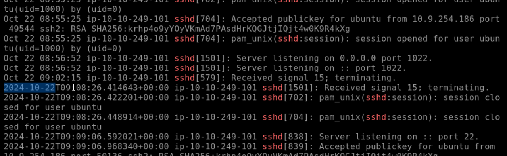

#### Login by ssh key
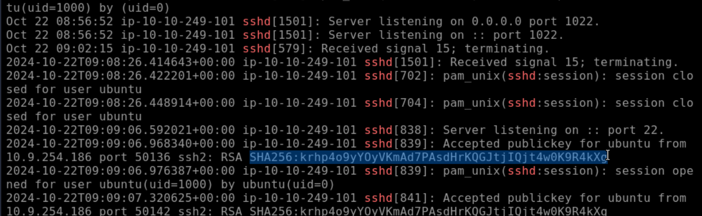

#### First brute-force attempt
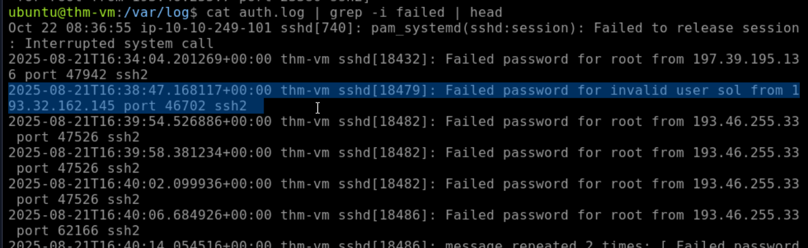

#### Targeted users
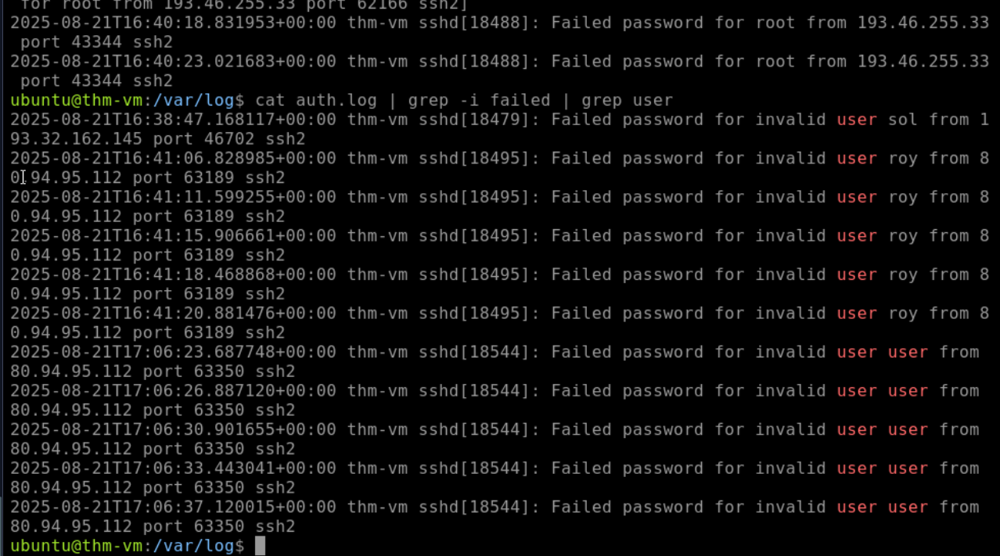

#### IP establishing initial-access
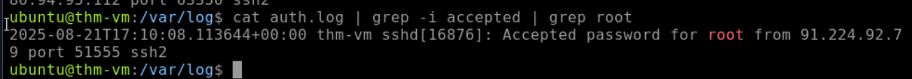

#### File accessed by attacker
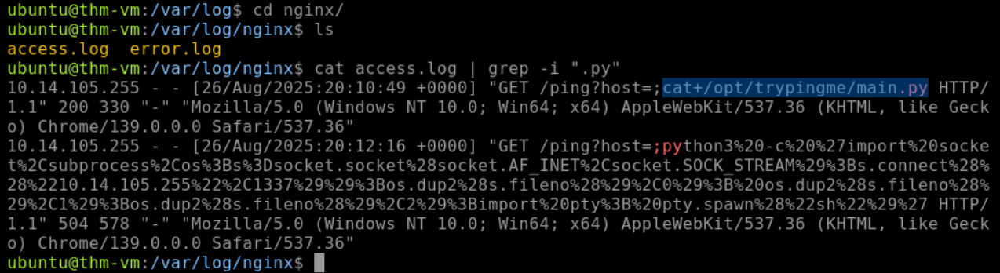

#### First command by attacker
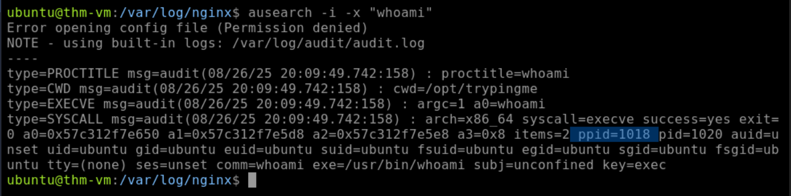


#### Flag in the file
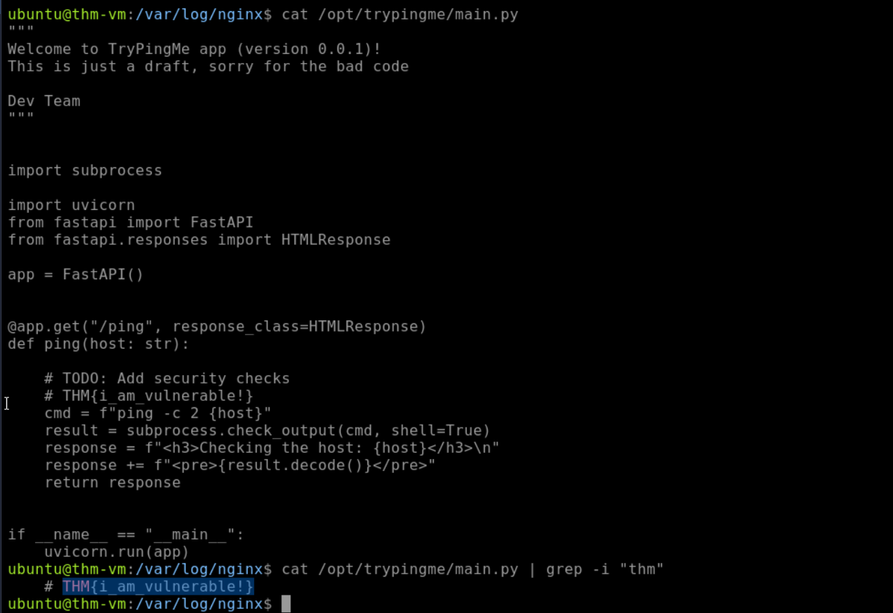


#### Results & Findings
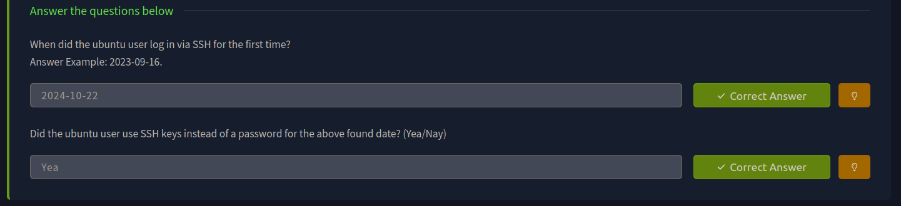

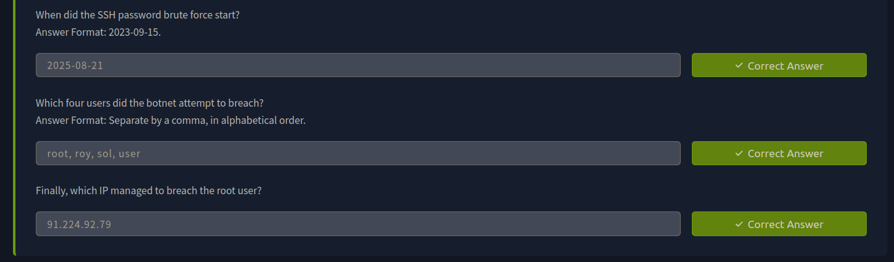

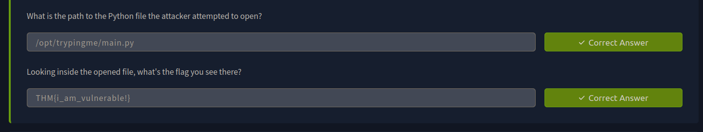

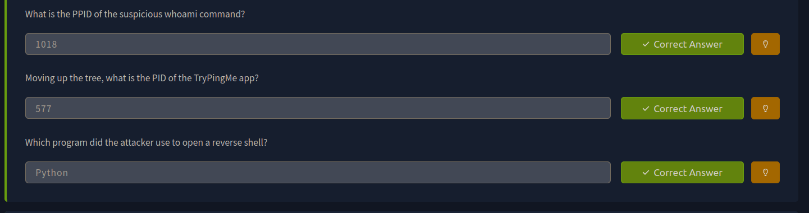


---
> QXV0aG9yOiBodHRwczovL2dpdGh1Yi5jb20vaGFzaC01NDU=
