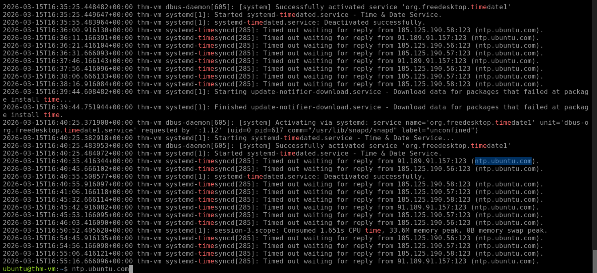
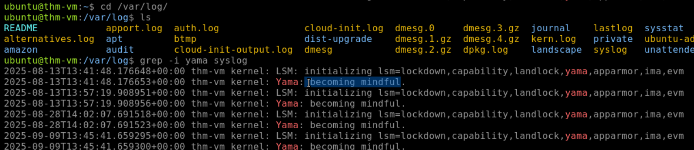
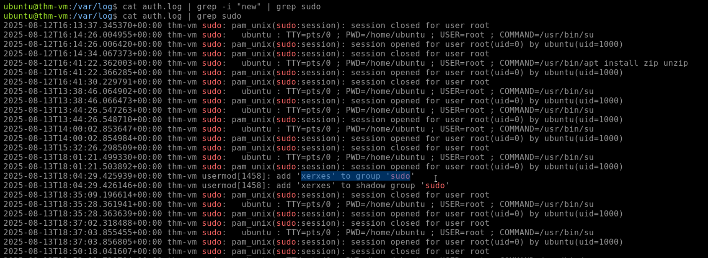
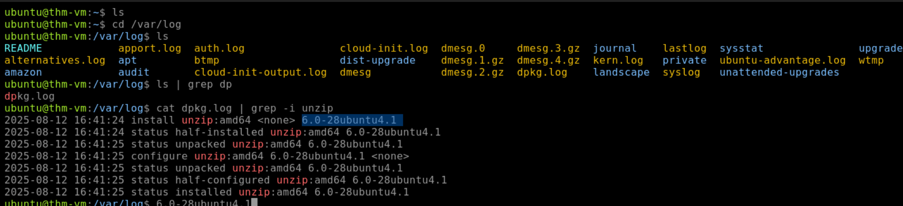
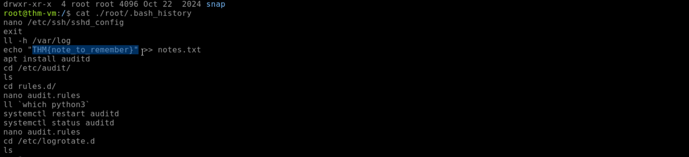
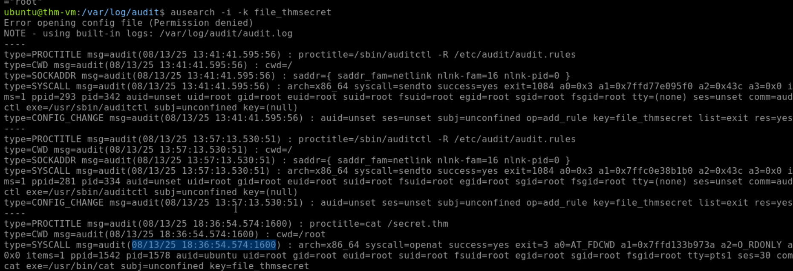
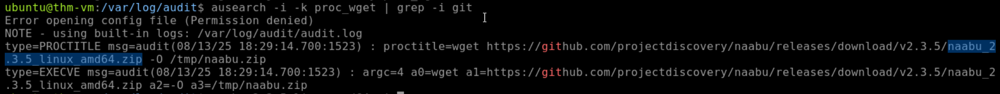
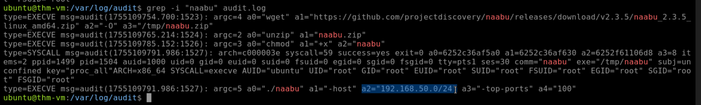
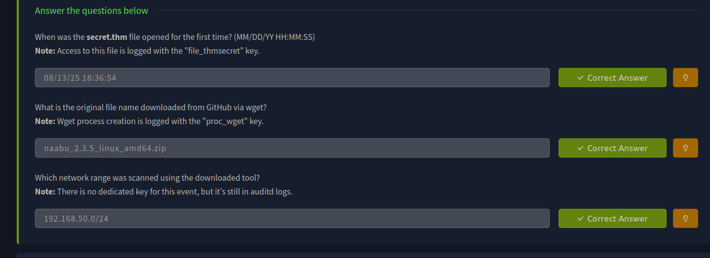

> /SOCTraining/LinuxThreatDetection/SysLog

# System Logs Analysis

## Objectives

- Explore and analyze authentication, runtime, and system logs on a Linux host.
- Investigate SSH brute-force attempts and backdoor user creation via `auth.log`.
- Examine system and package manager logs to identify installed software and suspicious activity.
- Recover attacker commands from Bash history files across user accounts.
- Use `auditd` to detect process execution, file access, and network scanning activity via runtime monitoring.

## Tools & Resources

- **Linux Logs:** `syslog`, `auth.log`, `kern.log`, and package manager logs for authentication, kernel, and system event analysis.

- **Bash History:** Per-user command history file for recovering previously executed interactive commands.

- **Auditd:** Runtime monitoring daemon for tracking process creation, file access, and network events via configured audit keys.

## Steps Performed

- Reviewed `syslog` to identify the time server domain contacted for clock synchronization and a kernel message from Yama.

- Analyzed `auth.log` and filtered for failed SSH login events to identify the attacking IP address targeting multiple user accounts.

- Identified a backdoor user account created on the host and confirmed its addition to the `sudo` group via user management log entries.

- Examined package manager logs to determine the version of `unzip` installed on the system.

- Reviewed `.bash_history` files across user home directories and recovered a flag from a user's command history.

- Queried auditd logs using the `audit_key` to determine the first access timestamp of a monitored sensitive file.

- Used the `proc_wget` audit key to identify a file downloaded from GitHub and trace the originating process details.

- Investigated auditd logs without a dedicated key to uncover a network range scanned using the downloaded tool.

## Key Learnings

Linux logging requires a layered approach, as no single log file tells the full story. Authentication logs cover login and user management events, Bash history provides a window into interactive attacker commands, and auditd fills the critical gap of runtime monitoring that default Linux logging leaves open. 

In real-world SOC environments, these logs are ingested into SIEM platforms such as Splunk or Elastic, where correlation rules, dashboards, and alerting make large-scale investigation practical, replacing manual grep-based analysis with structured, queryable data. Building familiarity with audit keys and log sources is essential groundwork before working with any SIEM.

## Screenshots

Please refer to the attached screenshots in this directory.

#### Time server used for timesync

#### Yama message

#### Backdoor user

#### Package version downloaded

#### Flag in backdoor user's account

#### secret.thm files execution time

#### Port scanner downlaoded from github

#### IP ports scanned

#### Results & Findings

---

> QXV0aG9yOiBodHRwczovL2dpdGh1Yi5jb20vaGFzaC01NDU=
