> /SOCTraining/MalwareAnalysis/LOLAttack
# LOL Attack Analysis
> Shadow Trace

## Objectives
- Extract **IOCs** from a suspicious binary file.
- Correlate **EDR alerts** with potential malicious activity.
- Perform **SOC triage** to determine threat scope and impact.

## Tools Used
- PEStudio
- VirusTotal
- Robtex
- CyberChef
- Windows VM environment
- EDR console

## Steps Performed

**Malicious Binary Analysis**
  - Identified **binary architecture** and calculated SHA-256 hash.
  - Extracted embedded URLs and domains as **IOCs**.
  - Examined libraries loaded by the binary, focusing on **socket/network communication**.
  - Used CyberChef to decode or extract encoded strings and flags.
  - Queried VirusTotal and Robtex to validate URL/domain reputation.

**Malicious Alerts Triage**
  - Correlated **EDR alerts** triggered by `powershell.exe` and `chrome.exe`.
  - Identified the **malicious URLs** and scripts involved in the triggered alerts.
  - Decoded and analyzed the impact of scripts.
  - Mapped alerts to the IOCs extracted from the binary.
  
## Key Learnings
- Practiced **multi-stage SOC triage** combining file analysis and alert triage.
- Gained experience extracting and verifying **IOCs** from suspicious binaries.
- Reinforced techniques for **linking EDR alerts to malware activity**.
- Improved understanding of **binary behavior, network indicators, and threat documentation**.

## Screenshots
Please refer to the attached screenshots in this directory.

**File metadata**
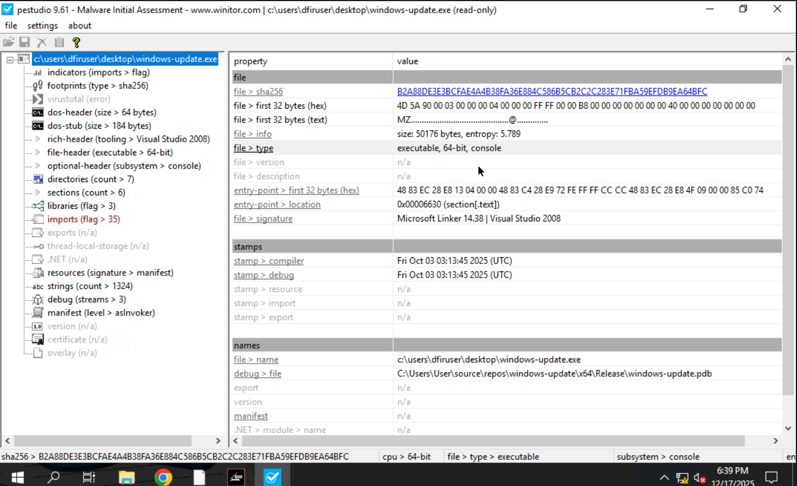

**Strings & indicators**
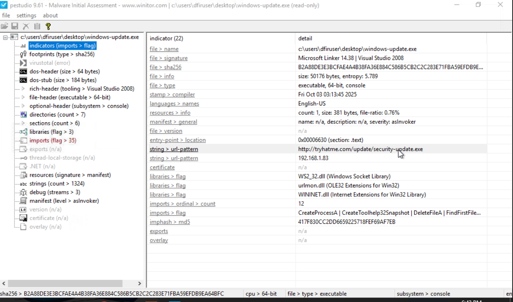

**Libraries used in attack**
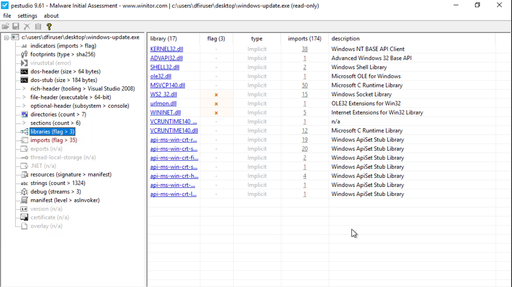

**Domain extracted from strings**
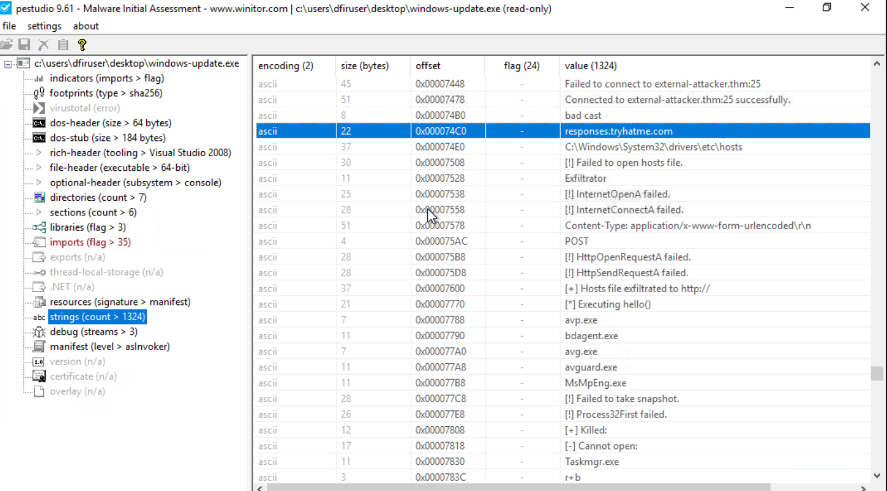

**CTF captured**
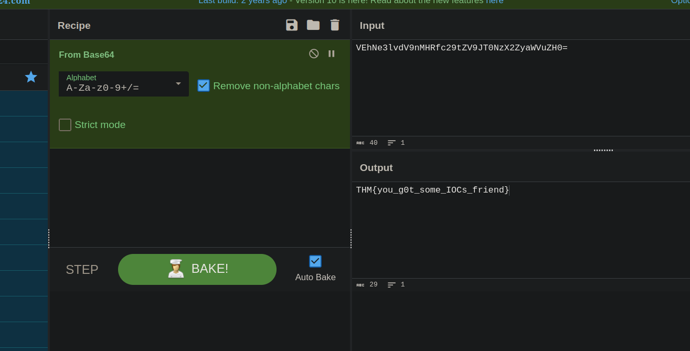

**Powershell alert**
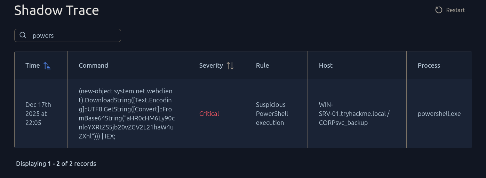

**URL from PS script**
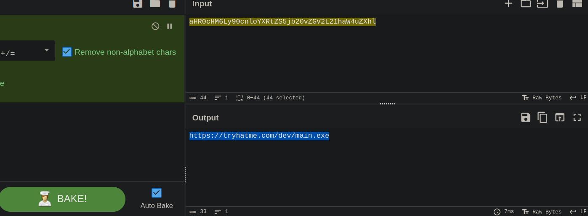

**Chrome alert**
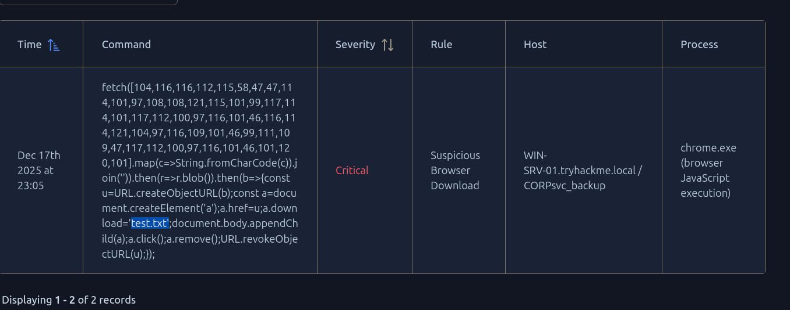

**ASCII mapping and script decoding by ChatGPT**
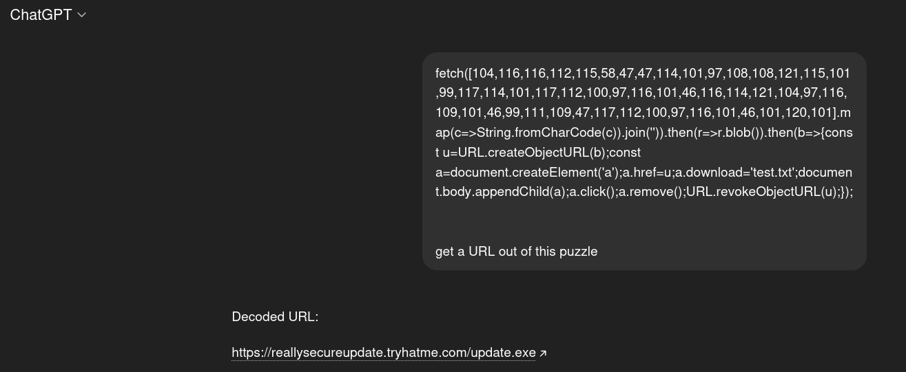

**Results**
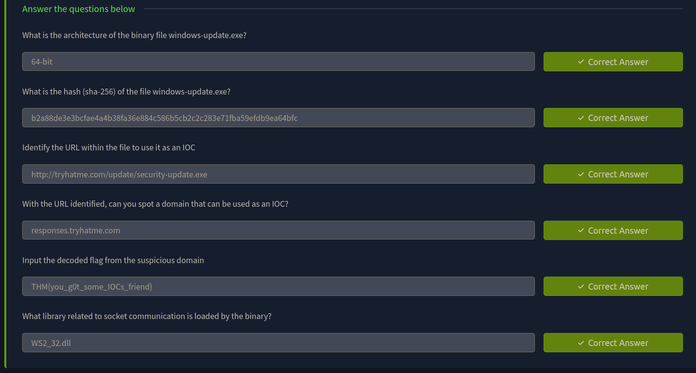

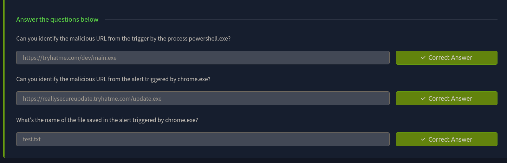

