> /SOCTraining/MalwareAnalysis/Redline
# Malware Analysis – Redline

## Objectives
- Determine whether a suspicious file exhibits **malicious characteristics**.
- Perform *basic static analysis* to identify file properties without execution.
- Conduct *controlled dynamic analysis* to observe **runtime behavior** safely.
- Apply safe malware handling practices in an isolated environment.

## Tools Used
- REMnux VM
- Linux command-line utilities (`file`, `strings`, `md5sum`, `sha1sum`, `sha256sum`)
- pecheck
- pe-tree
- VirusTotal
- Hybrid Analysis

## Steps Performed
- Identified the **actual file type** of suspicious samples using file inspection utilities.
- Extracted readable strings from executables to identify *APIs, libraries, and indicators*.
- Calculated **cryptographic hashes** to uniquely identify malware samples.
- Queried hash values on VirusTotal to assess **detection results and reputation**.
- Inspected PE headers to review *section layout, entropy values, and imports*.
- Analyzed PE structure and imported functions using a GUI-based analysis tool.
- Reviewed sandbox-based dynamic analysis reports without executing samples locally.
- Examined **process trees**, behavioral indicators, and network activity from sandbox results.
- Observed signs of **packing, obfuscation,** and **sandbox evasion** techniques.

## Key Learnings
- Developed a **structured SOC-style workflow** for initial malware triage.
- Gained practical experience with **static analysis techniques** for Windows PE files.
- Learned how **hash-based OSINT platforms** support malware identification.
- Identified common indicators of packed executables and analysis evasion.
- Reinforced the importance of **isolation and environment control** during malware analysis.

## Screenshots
Please refer to the attached screenshots in this directory.

**Redline Metadata**

**PECheck Analysis**
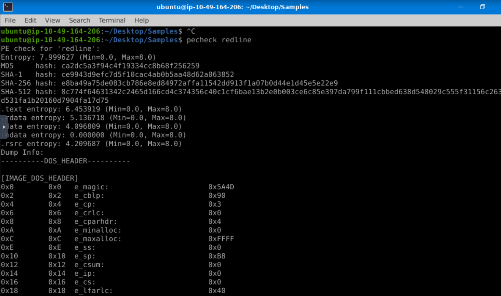

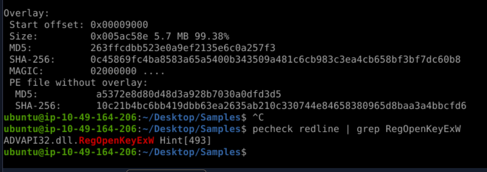

**PETree Analysis**
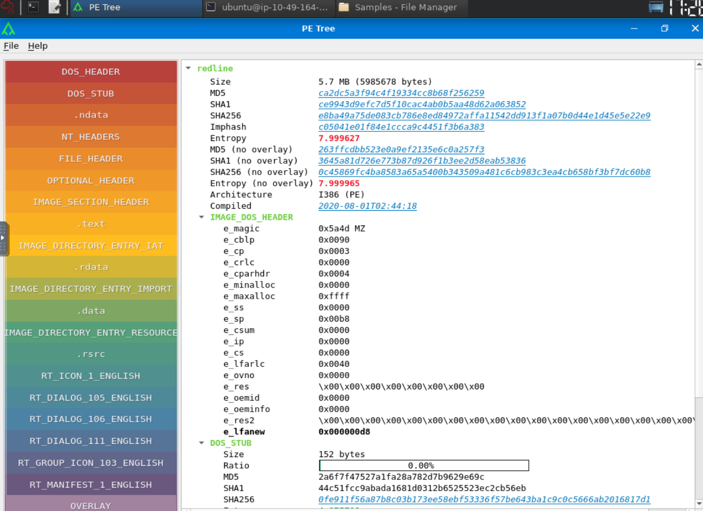

**VirusTotal**
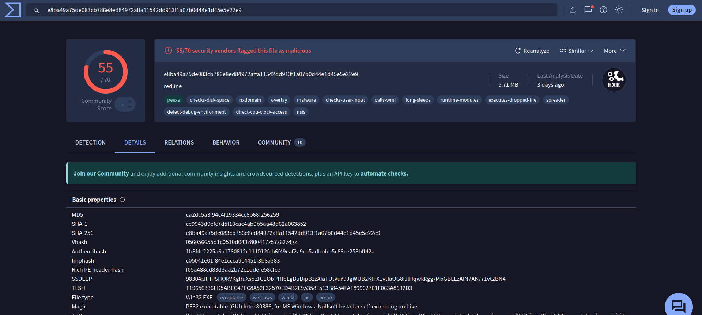

**Hybrid Analysis Reports**
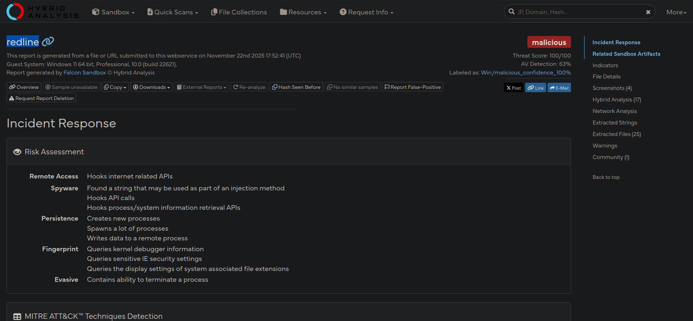

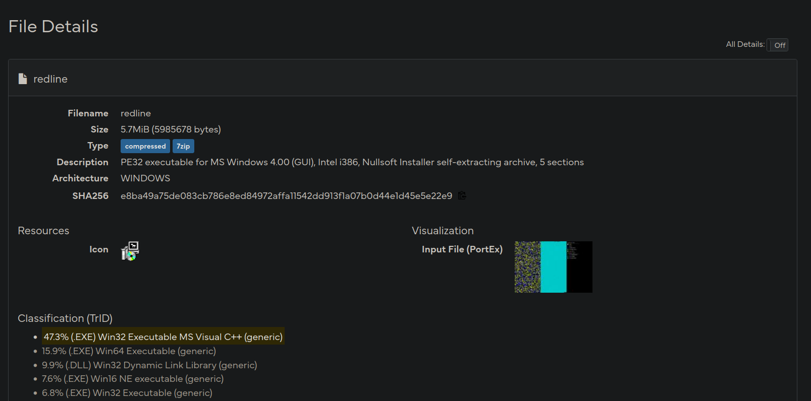

**Process Tree**
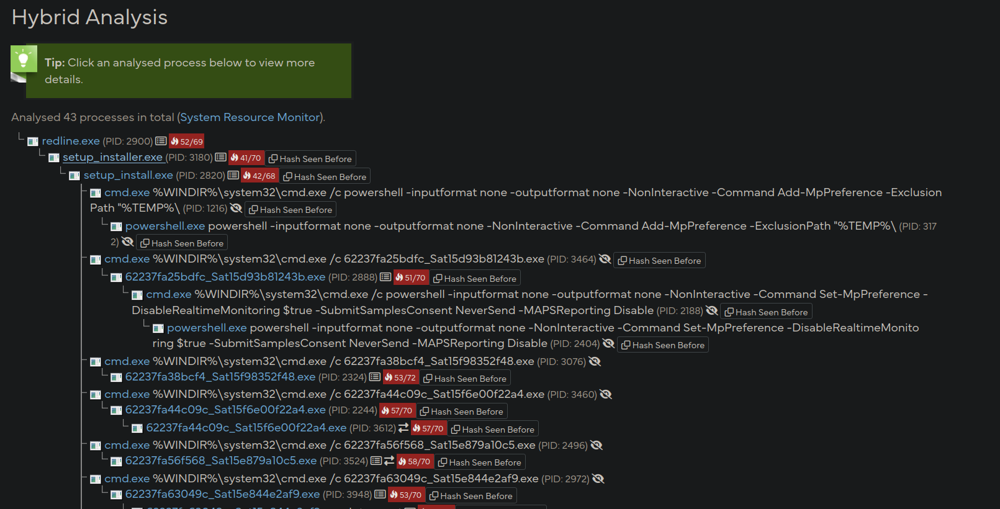

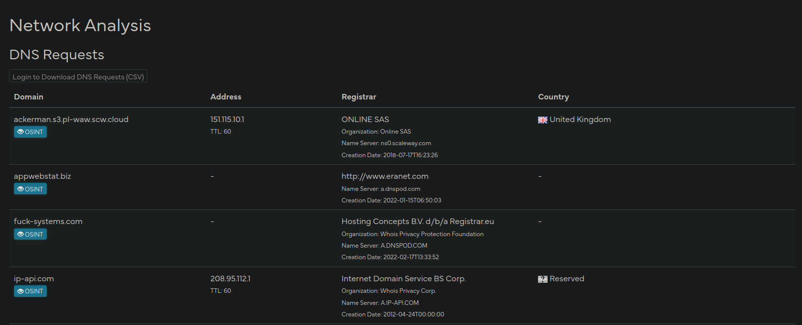

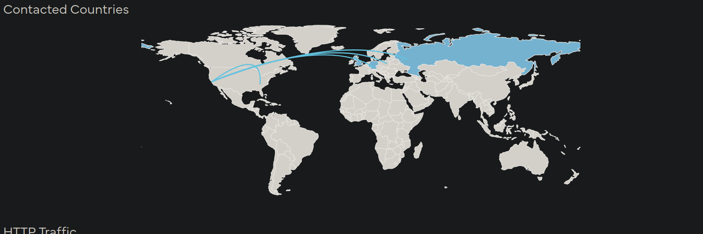

**Results**
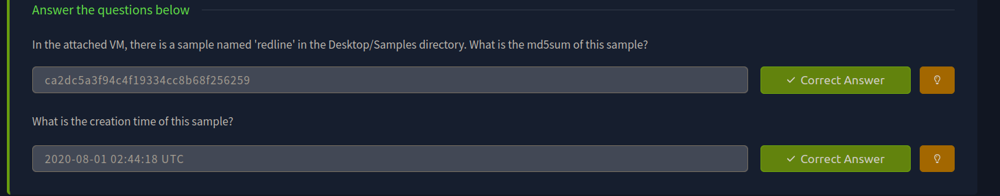

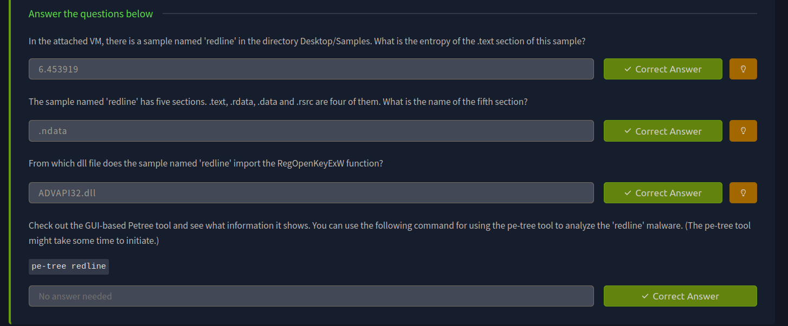

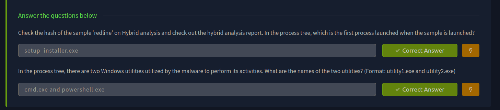