> /SOCTraining/MultiEndpoint

# Multiple Endpoints Compromise

## Objectives

- Investigate the initial compromise of the CEO's workstation via a malicious ISO attachment.

- Trace the stage 1 payload execution chain through file implantation, persistence, and C2 establishment.

- Identify the UAC bypass technique and credential dumping tool used to escalate privileges.

- Analyse lateral movement activity across multiple machines using harvested credentials and remote file shares.

- Uncover the final stage of the attack including domain controller compromise, DCSync, and ransomware deployment.

## Tools & Resources

- **Elastic Stack (SIEM):** Primary investigation platform for querying and correlating endpoint logs across all stages of the attack.

## Steps Performed

Investigated the attack campaign targeting the CEO of Quick Logistics LLC (simulated) via a phishing email with an ISO payload, covering:

- Stage 1 payload execution, identifying the initiating PID, the full command line used to implant a file to a secondary location, and the subsequent execution of the implanted file.

- Scheduled task created by the malicious script for persistence, and the C2 IP and port established by the implanted file.

- UAC bypass process identified following confirmation of local administrator access, and the GitHub link used to download a credential dumping tool.

- Username and hash of the credentials dumped from the first machine, and the remote file accessed by the attacker during share enumeration.

- New credentials discovered from the remote file contents, the target hostname for lateral movement, and the parent process of the malicious command executed on the second compromised machine.

- Credentials dumped from the second machine, the additional account targeted in the DCSync attack against the domain controller, and the ransomware binary download link.

## Key Learnings

The attack shows a fully matured threat actor operating with precision across multiple machines and privilege levels. Each phase builds on the last, credential dumping enables lateral movement, lateral movement enables domain controller access, and domain controller access enables ransomware deployment at scale. Elastic Stack correlation across endpoints is what makes this chain visible, connecting process executions on the first machine to attacker commands on the second and ultimately to the domain-level impact.

## Screenshots

Please refer to the attached screenshots in this directory.

#### Stage 1 payload
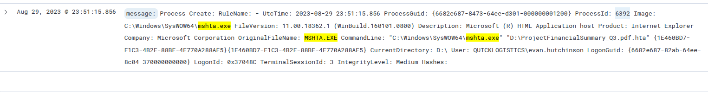

#### Copying payload to new location
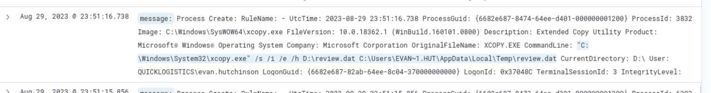
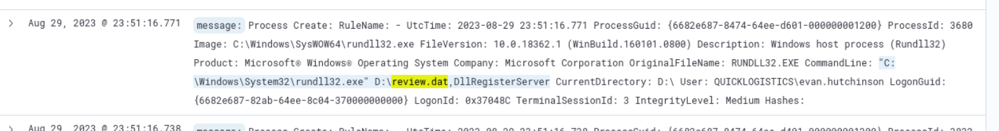

#### Task scheduled for persistence
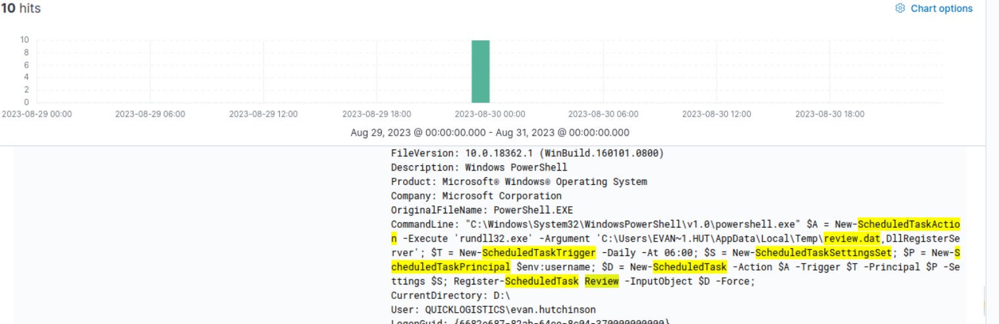

#### Process executing malware
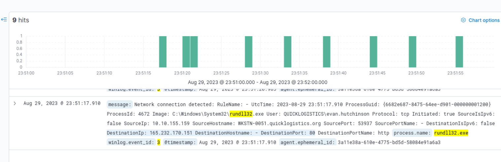

#### Tool used for credential dumping
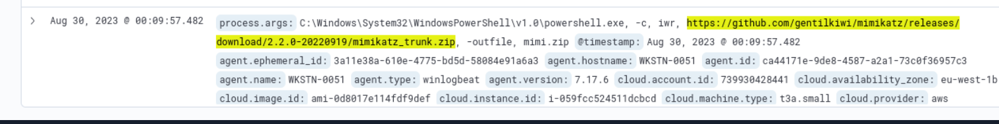

#### User Access Control bypassing

#### Remote share file accessed
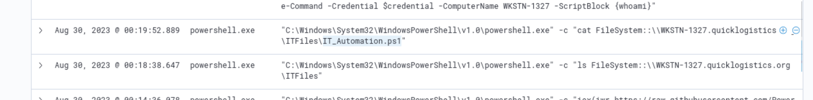

#### 2nd compromised target
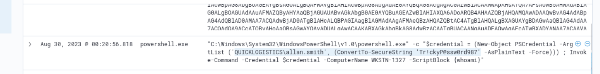
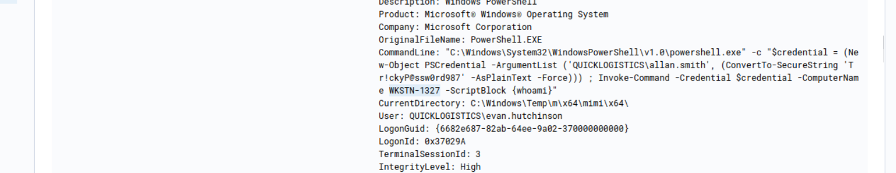

#### Malicious process executed on the 2nd machine
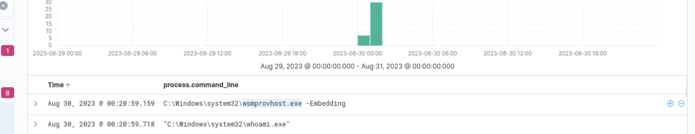

#### Credentials dump in target
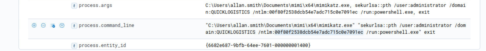

#### 3rd compromised target
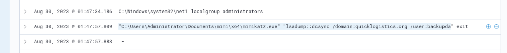

#### Ransomware link hit
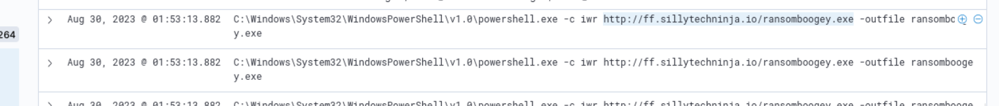

#### Results & Findings

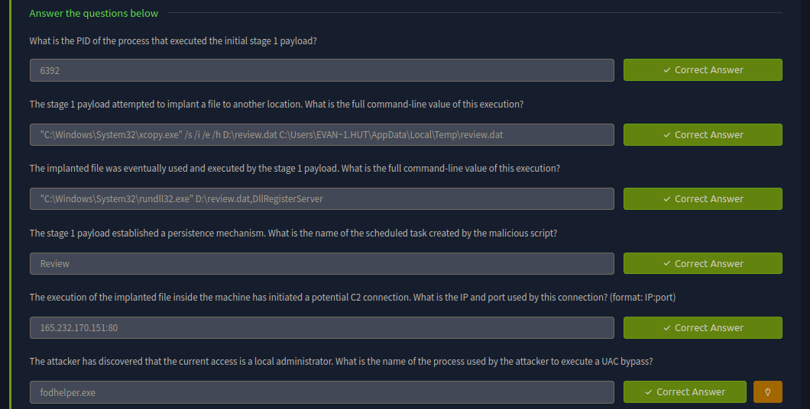
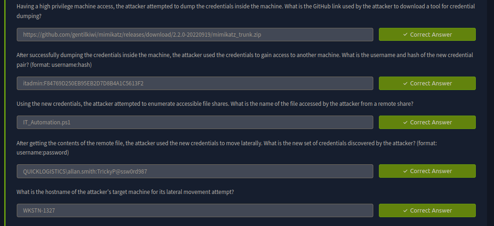
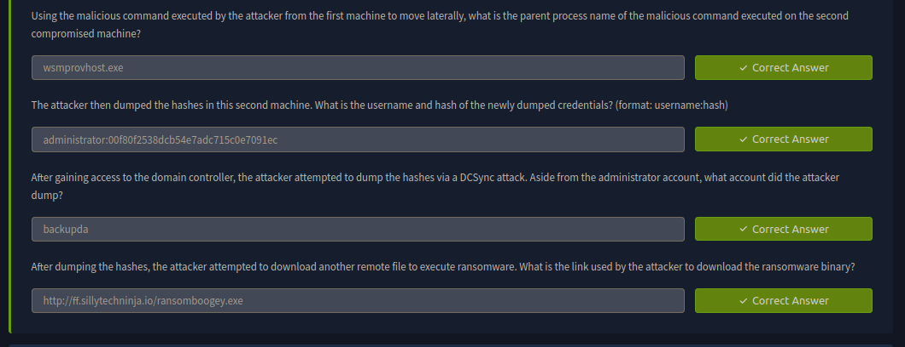

---
> QXV0aG9yOiBodHRwczovL2dpdGh1Yi5jb20vaGFzaC01NDU=